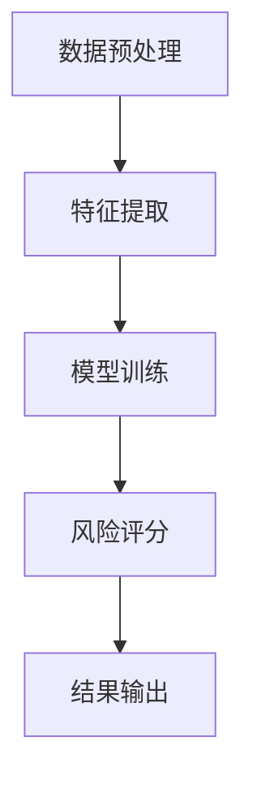
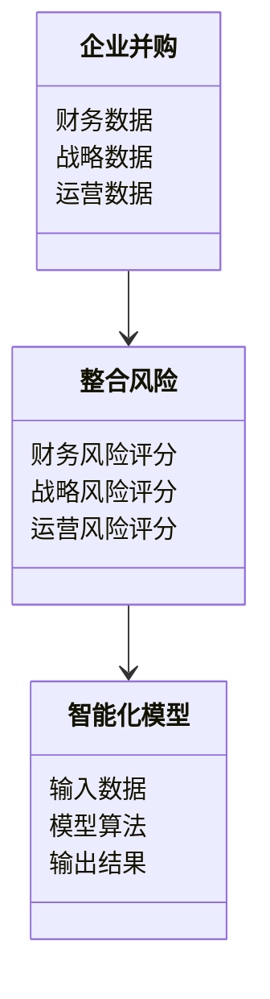

                 


# 设计智能化的企业并购整合风险评估模型

> 关键词：企业并购，整合风险，智能化模型，机器学习，风险评估，系统架构

> 摘要：本文将详细介绍设计智能化的企业并购整合风险评估模型的过程，从背景分析到系统实现，结合实际案例，深入探讨模型的核心算法和系统架构，为读者提供一个全面的技术解决方案。

---

## 第1章: 企业并购整合风险评估模型的背景介绍

### 1.1 问题背景与描述

#### 1.1.1 企业并购整合的核心挑战
企业并购是企业扩展的重要手段，但整合过程中的风险评估至关重要。传统方法依赖人工经验，存在主观性强、效率低、覆盖面窄等问题。智能化模型能够提供客观、高效的解决方案。

#### 1.1.2 现有风险评估方法的局限性
现有方法多依赖专家经验，难以量化分析，且难以处理大规模数据。智能化模型通过数据驱动的方式，能够更全面地评估风险。

#### 1.1.3 智能化模型的必要性与目标
智能化模型能够整合多维度数据，利用机器学习算法进行预测和优化，目标是提高风险评估的准确性和效率，为企业决策提供支持。

### 1.2 问题解决与边界定义

#### 1.2.1 智能化模型的核心目标
通过数据驱动的方法，识别和量化企业并购中的整合风险，提供科学的评估结果。

#### 1.2.2 模型的边界与适用范围
适用于企业并购中的财务、战略和运营风险评估，不涉及法律和文化风险的具体分析。

#### 1.2.3 模型的外延与限制
模型主要关注定量分析，无法完全取代专家的主观判断，适用于中大型企业。

### 1.3 模型的核心要素与组成

#### 1.3.1 企业并购的关键因素分析
包括战略契合度、财务状况、市场地位等。

#### 1.3.2 整合风险的主要维度
财务风险、战略风险、运营风险。

#### 1.3.3 智能化模型的构建逻辑
数据收集 → 特征提取 → 模型训练 → 风险评估。

### 1.4 本章小结
本章介绍了企业并购整合风险评估模型的背景、目标和核心要素，为后续章节奠定了基础。

---

## 第2章: 核心概念与联系

### 2.1 核心概念原理

#### 2.1.1 企业并购的定义与特征
企业并购是指企业之间的合并或收购，特征包括规模扩大、资源重组等。

#### 2.1.2 整合风险的多维度分析
整合风险涉及财务、战略和运营等多个方面。

#### 2.1.3 智能化模型的数学基础
基于机器学习的特征提取和风险评分模型。

### 2.2 概念属性特征对比

#### 表2-1: 企业并购与整合风险的属性对比
| 属性 | 企业并购 | 整合风险 |
|------|---------|----------|
| 目标 | 扩张、协同 | 减少损失、提高成功率 |
| 主要因素 | 战略、财务 | 财务、战略、运营 |

### 2.3 ER实体关系图

```mermaid
er
  entity 企业并购 {
    <属性> 企业A, 企业B
    <关系> 并购关系
  }
  entity 整合风险 {
    <属性> 财务风险, 战略风险, 运营风险
    <关系> 影响关系
  }
  entity 智能化模型 {
    <属性> 输入数据, 模型算法, 输出结果
    <关系> 评估关系
  }
```

### 2.4 本章小结
本章详细分析了企业并购和整合风险的核心概念，并通过对比和ER图展示了它们之间的关系。

---

## 第3章: 算法原理与数学模型

### 3.1 算法原理

#### 3.1.1 基于机器学习的特征提取
利用PCA进行降维，提取关键特征。

#### 3.1.2 风险评分模型的构建
采用逻辑回归模型进行风险评分。

#### 3.1.3 算法流程图



### 3.2 数学模型与公式

#### 3.2.1 风险评分公式

$$风险评分 = \alpha \cdot 财务风险 + \beta \cdot 战略风险 + \gamma \cdot 运营风险$$

#### 3.2.2 模型优化公式

$$\theta = \arg \min \sum_{i=1}^{n} (y_i - f(x_i))^2$$

### 3.3 代码实现

#### 3.3.1 数据预处理

```python
import pandas as pd
df = pd.read_csv('并购数据.csv')
```

#### 3.3.2 特征提取

```python
from sklearn.decomposition import PCA
pca = PCA(n_components=5)
features = pca.fit_transform(df[['财务指标', '战略指标', '运营指标']])
```

#### 3.3.3 模型训练

```python
from sklearn.linear_model import LogisticRegression
model = LogisticRegression()
model.fit(features, df['标签'])
```

### 3.4 本章小结
本章详细讲解了算法原理和数学模型，并通过代码实现展示了模型的构建过程。

---

## 第4章: 系统分析与架构设计

### 4.1 问题场景介绍

#### 4.1.1 项目背景
企业并购整合风险评估系统的开发背景和目标。

#### 4.1.2 项目介绍
系统旨在帮助企业评估并购整合风险，优化决策。

### 4.2 系统功能设计

#### 4.2.1 领域模型



### 4.3 系统架构设计

#### 4.3.1 系统架构图


### 4.4 本章小结
本章详细描述了系统的架构设计和功能模块。

---

## 第5章: 项目实战

### 5.1 环境安装

#### 5.1.1 安装Python环境
使用Anaconda安装Python 3.8及以上版本。

#### 5.1.2 安装依赖库
安装scikit-learn、pandas、numpy等库。

### 5.2 核心代码实现

#### 5.2.1 数据预处理

```python
import pandas as pd
df = pd.read_csv('并购数据.csv')
df.dropna(inplace=True)
```

#### 5.2.2 特征提取

```python
from sklearn.decomposition import PCA
pca = PCA(n_components=5)
features = pca.fit_transform(df[['财务指标', '战略指标', '运营指标']])
```

#### 5.2.3 模型训练

```python
from sklearn.linear_model import LogisticRegression
model = LogisticRegression()
model.fit(features, df['标签'])
```

### 5.3 案例分析

#### 5.3.1 实际案例分析
以某企业并购案例为例，展示模型的应用。

#### 5.3.2 结果解读与分析
解读模型输出结果，分析风险评分的意义。

### 5.4 本章小结
本章通过实际案例展示了系统的实现过程和应用效果。

---

## 第6章: 案例分析与最佳实践

### 6.1 案例分析

#### 6.1.1 案例背景
介绍一个典型的企业并购案例。

#### 6.1.2 模型应用
展示模型在案例中的应用过程。

### 6.2 最佳实践

#### 6.2.1 数据收集与处理
强调数据质量和多样性的 importance。

#### 6.2.2 模型优化
建议进行超参数调优和模型验证。

### 6.3 本章小结
本章通过案例分析和最佳实践，总结了模型的应用经验和优化建议。

---

## 第7章: 结论与展望

### 7.1 研究总结
总结本文的主要研究成果和贡献。

### 7.2 未来展望
提出未来可能的研究方向和改进空间。

### 7.3 本章小结
总结全文，展望未来。

---

## 作者

作者：AI天才研究院/AI Genius Institute & 禅与计算机程序设计艺术 /Zen And The Art of Computer Programming

