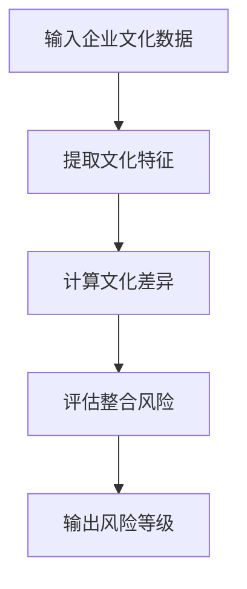
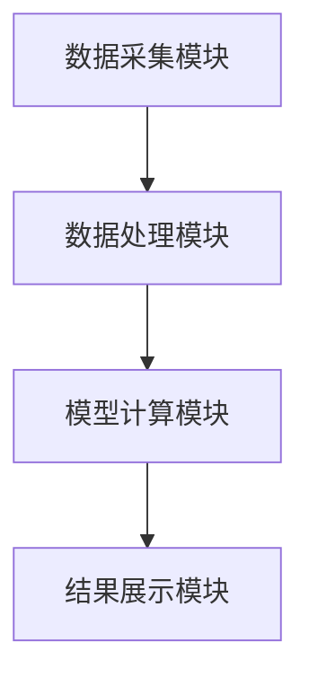

                 


# 设计智能化的企业并购文化整合风险评估模型

> 关键词：企业并购、文化整合、风险评估、人工智能、风险管理

> 摘要：  
在企业并购过程中，文化整合是决定并购成功与否的关键因素之一。然而，传统的文化整合方法往往依赖于主观判断，缺乏系统性和智能化。本文提出一种基于人工智能的企业并购文化整合风险评估模型，通过数据分析和机器学习算法，量化文化整合的风险，为企业决策提供科学依据。文章从背景、核心概念、算法原理、系统架构、项目实战等方面详细阐述了模型的设计与实现，并通过实际案例验证了模型的有效性。

---

# 第1章: 企业并购与文化整合背景

## 1.1 企业并购的基本概念
### 1.1.1 企业并购的定义
企业并购（Mergers and Acquisitions, M&A）是指一家企业与其他企业合并或收购其资产或股权的行为。并购不仅是企业扩张的手段，也是资源整合、竞争优势提升的重要方式。

### 1.1.2 并购的类型与特点
企业并购可以分为横向并购、纵向并购和混合并购三种类型：
- **横向并购**：同一行业内的企业并购，旨在扩大市场份额。
- **纵向并购**：上下游产业的企业并购，以优化供应链。
- **混合并购**：跨行业并购，寻求新的业务增长点。

### 1.1.3 并购的动机与目标
企业进行并购的动机包括：
1. **市场扩展**：通过并购进入新市场或扩大现有市场。
2. **资源获取**：获取技术、品牌、渠道等资源。
3. **成本节约**：通过规模效应降低成本。
4. **战略防御**：防止竞争对手并购。

## 1.2 文化整合的核心概念
### 1.2.1 企业文化的定义
企业文化是企业在长期经营中形成的价值观、行为规范和管理方式的总和。它是企业凝聚力和竞争力的重要来源。

### 1.2.2 文化整合的必要性
文化整合是并购后实现战略协同的关键。如果并购双方的文化差异较大，可能导致员工冲突、管理混乱，最终影响并购效果。

### 1.2.3 文化整合的挑战与机遇
- **挑战**：文化差异可能导致沟通不畅、管理混乱，增加整合难度。
- **机遇**：通过文化整合，可以形成新的竞争优势，提升企业整体实力。

## 1.3 企业并购中的文化整合问题
### 1.3.1 文化冲突的常见表现
- **管理风格差异**：例如，一家企业强调扁平化管理，另一家企业则倾向于垂直化管理。
- **价值观冲突**：例如，一家企业注重创新，另一家企业则注重稳定。
- **沟通障碍**：语言、习惯等差异导致沟通不畅。

### 1.3.2 文化整合对并购成功的影响
文化整合直接影响并购后的组织融合、员工士气和业务协同。成功的文化整合可以显著提升并购后的绩效。

### 1.3.3 文化整合的边界与外延
文化整合的范围不仅限于企业内部，还涉及客户、供应商等外部利益相关者。因此，文化整合需要从全局视角出发，综合考虑内外部因素。

---

# 第2章: 文化整合风险评估模型的背景与意义

## 2.1 传统企业并购中的文化整合问题
### 2.1.1 传统并购模式的局限性
传统的企业并购往往忽视文化因素，导致并购后整合失败。

### 2.1.2 文化整合在传统并购中的忽视
企业通常将文化整合视为软性问题，缺乏系统化的分析和评估。

### 2.1.3 文化整合失败的典型案例
例如，某跨国公司并购一家本土企业后，由于文化差异导致管理混乱，最终不得不分拆业务。

## 2.2 智能化文化整合风险评估的必要性
### 2.2.1 数据驱动的决策优势
通过数据分析，可以量化文化整合的风险，为决策提供科学依据。

### 2.2.2 智能化模型在文化整合中的作用
人工智能技术可以帮助企业识别潜在的文化冲突，优化整合策略。

### 2.2.3 提高并购成功率的潜在价值
智能化的文化整合风险评估可以显著提高并购的成功率，降低整合成本。

## 2.3 模型设计的目标与意义
### 2.3.1 模型设计的核心目标
通过分析并购双方的文化差异，量化文化整合的风险，为决策提供支持。

### 2.3.2 模型对企业并购的指导意义
帮助企业更好地理解文化整合的风险，制定科学的整合策略。

### 2.3.3 模型的创新点与突破点
结合人工智能技术，将文化整合从定性分析转向定量分析，提高评估的科学性和准确性。

---

# 第3章: 文化整合风险评估模型的核心要素

## 3.1 模型的输入变量
### 3.1.1 企业文化的评估维度
文化整合风险评估模型需要考虑以下维度：
1. **管理风格**：企业的管理方式和决策风格。
2. **价值观**：企业的核心价值观和文化理念。
3. **组织结构**：企业的组织架构和权力分配。
4. **员工文化**：员工的工作习惯和文化背景。

### 3.1.2 并购双方的文化匹配度
通过对比并购双方的文化差异，评估整合的可能性。

### 3.1.3 环境因素的影响
包括行业环境、法律法规、市场条件等外部因素。

## 3.2 模型的输出结果
### 3.2.1 风险评估的等级划分
将文化整合风险分为高、中、低三个等级。

### 3.2.2 风险的类型与影响
包括文化冲突风险、管理混乱风险、员工流失风险等。

### 3.2.3 风险的可调控性分析
分析不同风险的可控性，制定相应的应对策略。

## 3.3 模型的核心算法与实现
### 3.3.1 文化整合风险的数学模型
$$ R = f(C_1, C_2, ..., C_n) $$
其中，$R$ 表示文化整合风险，$C_i$ 表示各个文化维度的特征值。

### 3.3.2 算法的流程图


---

# 第4章: 文化整合风险评估模型的算法原理

## 4.1 算法的基本原理
### 4.1.1 数据预处理
对输入的文化数据进行清洗和标准化处理。

### 4.1.2 特征提取
从企业文化的各个维度中提取关键特征。

### 4.1.3 模型训练
使用机器学习算法（如支持向量机、随机森林等）训练模型。

## 4.2 算法的具体实现
### 4.2.1 数据预处理的代码示例
```python
import pandas as pd
from sklearn.preprocessing import StandardScaler

# 读取数据
data = pd.read_csv('cultural_data.csv')

# 标准化处理
scaler = StandardScaler()
data_scaled = scaler.fit_transform(data)
```

### 4.2.2 特征提取的代码示例
```python
from sklearn.decomposition import PCA

# PCA降维
pca = PCA(n_components=2)
principal_components = pca.fit_transform(data_scaled)
```

### 4.2.3 模型训练的代码示例
```python
from sklearn.svm import SVC

# 训练SVM模型
model = SVC()
model.fit(principal_components, labels)
```

## 4.3 算法的优化与调优
### 4.3.1 参数调优
通过网格搜索等方法优化模型参数。

### 4.3.2 模型评估
使用交叉验证评估模型的准确率和召回率。

### 4.3.3 模型部署
将模型部署到企业管理系统中，实时评估文化整合风险。

---

# 第5章: 文化整合风险评估模型的系统架构设计

## 5.1 系统功能设计
### 5.1.1 数据采集模块
负责采集并购双方的企业文化数据。

### 5.1.2 数据处理模块
对数据进行清洗、标准化和特征提取。

### 5.1.3 模型计算模块
使用机器学习算法计算文化整合风险。

### 5.1.4 结果展示模块
将评估结果以可视化形式展示给用户。

## 5.2 系统架构设计
### 5.2.1 模块划分
系统分为数据采集、数据处理、模型计算和结果展示四大模块。

### 5.2.2 模块之间的关系


### 5.2.3 接口设计
- 数据采集模块提供API接口，接收外部数据。
- 模型计算模块提供API接口，供其他系统调用。

## 5.3 系统交互设计
### 5.3.1 用户与系统的交互流程
1. 用户输入并购双方的企业文化数据。
2. 系统对数据进行处理和分析。
3. 系统输出文化整合风险评估结果。

### 5.3.2 系统的响应时间
优化系统性能，确保响应时间在可接受范围内。

### 5.3.3 系统的可扩展性
设计模块化的系统架构，便于未来功能扩展。

---

# 第6章: 文化整合风险评估模型的项目实战

## 6.1 项目环境安装
### 6.1.1 系统环境要求
- 操作系统：Windows/Mac/Linux
- Python版本：3.6+

### 6.1.2 安装依赖包
```bash
pip install pandas scikit-learn mermaid4jupyter
```

## 6.2 核心代码实现
### 6.2.1 数据预处理代码
```python
import pandas as pd
from sklearn.preprocessing import StandardScaler

# 读取数据
data = pd.read_csv('cultural_data.csv')

# 标准化处理
scaler = StandardScaler()
data_scaled = scaler.fit_transform(data)
```

### 6.2.2 模型训练代码
```python
from sklearn.svm import SVC
from sklearn.decomposition import PCA

# PCA降维
pca = PCA(n_components=2)
principal_components = pca.fit_transform(data_scaled)

# 训练SVM模型
model = SVC()
model.fit(principal_components, labels)
```

### 6.2.3 结果展示代码
```python
import matplotlib.pyplot as plt

# 可视化结果
plt.scatter(principal_components[:, 0], principal_components[:, 1], c=labels)
plt.show()
```

## 6.3 实际案例分析
### 6.3.1 案例背景
某跨国公司并购一家本土企业，评估文化整合风险。

### 6.3.2 数据分析
分析双方的管理风格、价值观和组织结构差异。

### 6.3.3 模型评估
通过模型计算，评估整合风险等级。

## 6.4 代码解读与分析
### 6.4.1 数据预处理的解读
标准化处理确保不同维度的数据具有可比性。

### 6.4.2 模型训练的解读
使用SVM算法分类文化整合风险，提高模型的准确率。

### 6.4.3 模型评估的解读
可视化结果帮助用户直观理解文化差异。

---

# 第7章: 总结与展望

## 7.1 总结
本文设计了一种智能化的企业并购文化整合风险评估模型，通过数据分析和机器学习算法，量化文化整合的风险，为企业决策提供科学依据。

## 7.2 最佳实践 tips
- 在实际应用中，建议结合企业实际情况调整模型参数。
- 定期更新模型，确保评估结果的准确性。

## 7.3 小结
文化整合是企业并购成功的关键因素，智能化的评估模型可以显著提高整合效率和效果。

## 7.4 注意事项
- 模型的结果仅供参考，实际决策需要结合企业实际情况。
- 数据隐私和安全问题需要特别注意。

## 7.5 拓展阅读
建议阅读《企业并购与文化整合》《人工智能在企业并购中的应用》等书籍，深入了解相关领域的最新研究进展。

---

# 作者：AI天才研究院/AI Genius Institute & 禅与计算机程序设计艺术 /Zen And The Art of Computer Programming

---

**文章总结：**  
本文从企业并购与文化整合的背景出发，详细阐述了文化整合风险评估模型的设计与实现，结合实际案例验证了模型的有效性。通过本文的分析，读者可以深入了解文化整合在企业并购中的重要性，并掌握如何利用人工智能技术量化文化整合风险，为决策提供科学依据。

