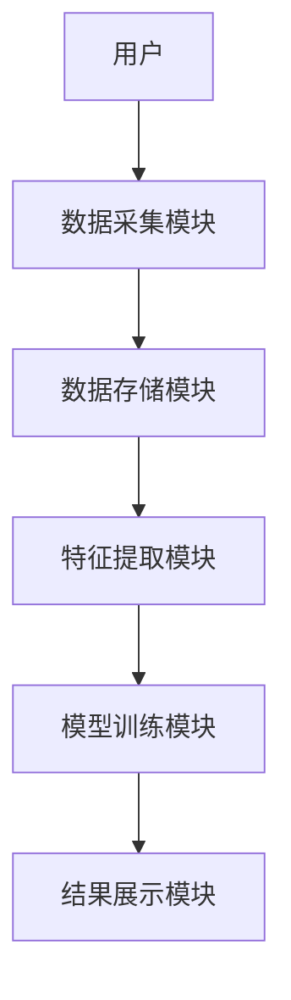

                 

# 设计智能化的企业并购目标筛选多维度评估模型

---

## 关键词：
- 企业并购
- 智能化评估模型
- 多维度评估
- 数据驱动决策
- 机器学习
- 企业战略

---

## 摘要：
本文系统性地探讨了如何设计智能化的企业并购目标筛选多维度评估模型。通过分析企业并购的传统评估方法的局限性，提出了一种基于数据驱动的智能化评估模型，结合财务表现、市场地位、技术创新、管理能力等多个维度，利用机器学习算法和深度分析技术，构建一个高效、可扩展、可解释的智能化评估系统。本文详细阐述了模型的核心设计、算法实现、系统架构以及实际应用场景，并通过案例分析验证了模型的有效性。

---

# 第一部分: 企业并购目标筛选的背景与概念

## 第1章: 企业并购的基本概念

### 1.1 企业并购的定义与类型
#### 1.1.1 企业并购的定义
企业并购是指一家企业通过购买另一家企业的一部分或全部股权，以实现战略扩张、资源整合或市场优势的过程。并购可以分为“横向并购”（同一行业内的并购）、“纵向并购”（产业链上下游的并购）和“混合并购”（不同行业间的并购）。

#### 1.1.2 并购的类型与特点
- **横向并购**：目标企业与自身处于同一行业，旨在扩大市场份额或提高市场地位。
- **纵向并购**：目标企业与自身处于产业链的不同环节，旨在整合上下游资源，降低供应链成本。
- **混合并购**：目标企业与自身处于不同行业，旨在多元化经营或开拓新市场。

#### 1.1.3 并购的动机与目的
- **战略动机**：通过并购快速进入新市场或获取关键技术。
- **财务动机**：通过并购优化资本结构，降低财务成本。
- **管理动机**：通过并购整合管理资源，提升管理效率。

### 1.2 传统企业并购评估的挑战
#### 1.2.1 传统评估方法的局限性
传统的企业并购评估方法主要依赖于财务指标（如ROE、EBITDA）和行业经验，存在以下问题：
- **数据片面性**：仅关注财务指标，忽视技术、市场等其他重要因素。
- **主观性**：评估结果高度依赖评估人员的经验和主观判断。
- **动态性**：市场环境和企业战略的变化可能导致评估结果失效。

#### 1.2.2 数据不足与评估偏差问题
- 数据获取难度大：目标企业可能存在信息不对称或财务造假问题。
- 数据维度单一：传统评估方法难以捕捉企业的潜在价值和风险。

#### 1.2.3 现有模型的不足与改进方向
现有模型主要依赖简单的线性回归或加权平均方法，难以应对复杂的多维度评估需求。改进方向包括引入机器学习算法、大数据分析和实时动态评估。

### 1.3 智能化评估模型的必要性
#### 1.3.1 数据驱动的决策优势
通过大数据分析和机器学习，可以从海量数据中提取有价值的信息，辅助决策者做出更科学的判断。

#### 1.3.2 智能化评估模型的核心价值
- 提供多维度、动态化的评估结果。
- 减少人为偏差，提高评估的客观性和准确性。
- 实现高效、可扩展的评估流程。

---

# 第二部分: 多维度评估模型的核心设计

## 第2章: 多维度评估模型的结构与原理

### 2.1 多维度评估模型的总体架构
#### 2.1.1 模型的输入与输出
- **输入**：目标企业的多维度数据（财务、市场、技术、管理等）。
- **输出**：目标企业的综合评估得分及各维度的详细分析结果。

#### 2.1.2 各评估维度的权重分配
根据企业并购的核心关注点，对各评估维度赋予不同的权重。例如：
- 财务表现（40%）
- 市场地位（30%）
- 技术创新（20%）
- 管理能力（10%）

#### 2.1.3 模型的评分机制
综合各维度的评分，计算目标企业的综合得分，并根据得分将目标企业分为不同类别（如“高度推荐”、“一般推荐”、“不推荐”）。

### 2.2 各评估维度的详细分析

#### 2.2.1 财务表现评估
##### 2.2.1.1 主要财务指标
- 营业收入增长率
- 净利润率
- 资产负债率
- 现金流状况

##### 2.2.1.2 财务健康度分析
通过对企业财务报表的分析，评估企业的财务健康状况。例如：
- 利润表分析：评估企业的盈利能力和成本控制能力。
- 资产负债表分析：评估企业的资产结构和偿债能力。

##### 2.2.1.3 财务风险评估
结合行业基准和企业自身的财务指标，评估企业的财务风险。例如：
- Z值模型：用于预测企业破产风险。
- 信用评分模型：评估企业的信用状况。

#### 2.2.2 市场地位评估
##### 2.2.2.1 市场份额分析
通过行业报告和市场调研数据，评估目标企业在目标市场的占有率。

##### 2.2.2.2 竞争优势评估
分析目标企业的核心竞争优势，例如：
- 技术优势
- 品牌优势
- 渠道优势

##### 2.2.2.3 市场前景预测
基于市场趋势和行业数据分析，预测目标企业的未来市场表现。

#### 2.2.3 技术与创新评估
##### 2.2.3.1 技术专利分析
通过专利数据库，分析目标企业的技术创新能力。例如：
- 专利数量
- 专利技术领域分布
- 专利引用次数

##### 2.2.3.2 技术团队能力评估
评估目标企业的技术团队规模、经验和创新能力。

##### 2.2.3.3 技术创新潜力
基于目标企业的技术储备和行业趋势，评估其未来的创新潜力。

#### 2.2.4 管理与组织评估
##### 2.2.4.1 管理团队稳定性
评估目标企业的管理团队是否稳定，是否有丰富的行业经验。

##### 2.2.4.2 组织架构合理性
分析目标企业的组织架构是否合理，是否能够支持企业的战略目标。

##### 2.2.4.3 内部治理机制
评估目标企业的内部治理机制，例如：
- 内部审计
- 风险管理
- 信息披露

---

## 第3章: 多维度评估模型的数学模型与公式

### 3.1 各评估维度的评分公式
#### 3.1.1 财务表现评分公式
$$
\text{财务评分} = 0.4 \times (\text{营业收入增长率} + \text{净利润率}) + 0.2 \times (\text{资产负债率} + \text{现金流状况})
$$

#### 3.1.2 市场地位评分公式
$$
\text{市场评分} = 0.3 \times (\text{市场份额} + \text{竞争优势}) + 0.2 \times \text{市场前景预测}
$$

#### 3.1.3 技术与创新评分公式
$$
\text{技术评分} = 0.2 \times (\text{专利数量} + \text{技术团队能力}) + 0.1 \times \text{技术创新潜力}
$$

#### 3.1.4 管理与组织评分公式
$$
\text{管理评分} = 0.1 \times (\text{管理团队稳定性} + \text{组织架构合理性}) + 0.1 \times \text{内部治理机制}
$$

### 3.2 综合评估模型公式
$$
\text{综合评分} = 0.4 \times \text{财务评分} + 0.3 \times \text{市场评分} + 0.2 \times \text{技术评分} + 0.1 \times \text{管理评分}
$$

---

## 第4章: 多维度评估模型的算法实现

### 4.1 数据预处理
#### 4.1.1 数据清洗
- 处理缺失值
- 处理异常值
- 标准化数据

#### 4.1.2 数据特征提取
- 提取关键特征（如营业收入增长率、市场份额等）
- 进行特征选择（如使用LASSO回归进行特征筛选）

### 4.2 模型训练
#### 4.2.1 算法选择
- 使用线性回归或随机森林模型进行评分预测。

#### 4.2.2 模型调优
- 调整模型参数（如学习率、树深度等）以优化模型性能。

### 4.3 模型评估
#### 4.3.1 评估指标
- 均方误差（MSE）
- R平方值（R²）
- 准确率

#### 4.3.2 模型验证
- 使用交叉验证评估模型的泛化能力。

---

## 第5章: 系统架构与实现

### 5.1 系统功能设计
- 数据采集模块
- 特征提取模块
- 模型训练模块
- 结果展示模块

### 5.2 系统架构图

### 5.3 接口设计
- 数据接口：提供API用于数据的导入和导出。
- 模型接口：提供API用于模型的训练和预测。

---

## 第6章: 项目实战

### 6.1 案例分析
#### 6.1.1 数据收集
- 收集目标企业的财务数据、市场数据、技术数据和管理数据。

#### 6.1.2 特征工程
- 对数据进行标准化和特征选择。

#### 6.1.3 模型训练
- 使用随机森林算法进行模型训练。

#### 6.1.4 结果分析
- 综合评分结果为“高度推荐”，建议进行并购。

---

## 第7章: 总结与展望

### 7.1 总结
本文提出了智能化的企业并购目标筛选多维度评估模型，通过多维度的数据分析和机器学习算法，提高了企业并购评估的准确性和效率。

### 7.2 展望
未来的研究方向包括：
- 引入更多维度的数据，如社会网络数据和环境数据。
- 使用更复杂的模型（如深度学习模型）提高评估的准确性。

---

## 作者：AI天才研究院/AI Genius Institute & 禅与计算机程序设计艺术 /Zen And The Art of Computer Programming

---

**注意**：以上目录大纲仅为示例，实际撰写时需要根据具体需求进一步细化内容。

