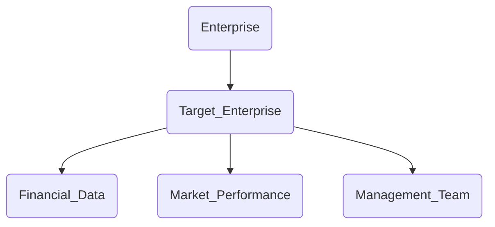
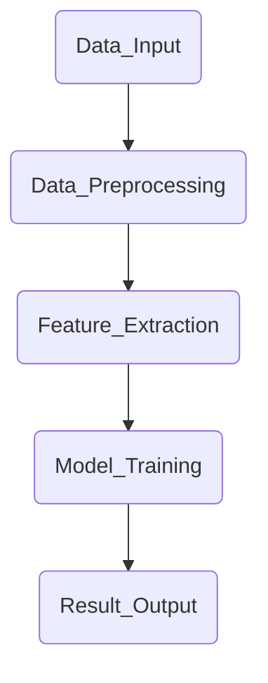
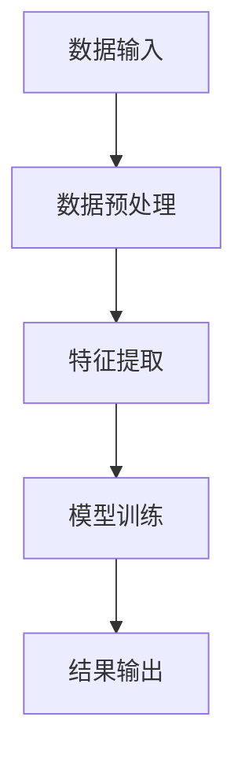
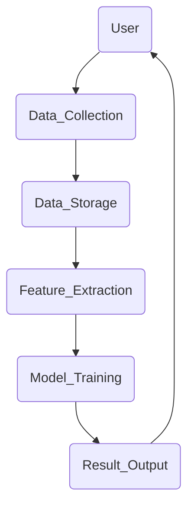
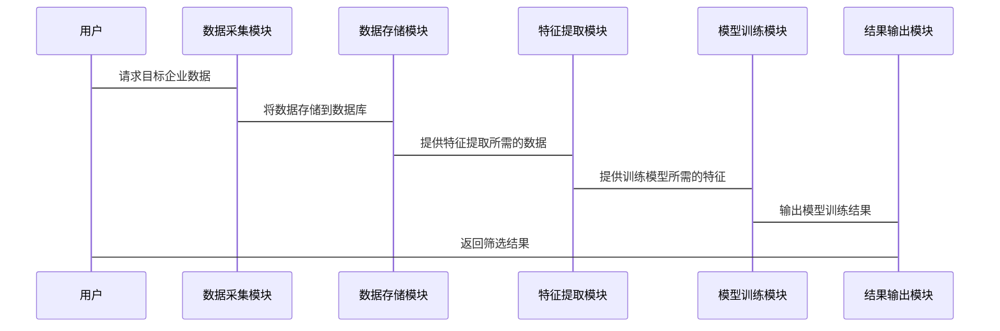

                 


# 设计智能化的企业并购目标筛选模型

---

## 关键词：企业并购、目标筛选、人工智能、机器学习、大数据分析、算法模型

---

## 摘要：  
企业并购是企业战略发展的重要手段之一，然而传统的并购目标筛选方法往往依赖于人工经验，存在效率低、主观性强、覆盖面窄等问题。本文提出了一种基于人工智能和大数据分析的企业并购目标筛选模型，通过机器学习算法对海量企业数据进行特征提取和模型训练，实现对潜在并购目标的智能化筛选。文章详细阐述了模型的设计思路、算法原理、系统架构以及实际应用案例，为企业在并购决策中提供科学、高效的工具支持。

---

## 第一部分: 企业并购目标筛选模型的背景与核心概念

### 第1章: 企业并购目标筛选模型概述

#### 1.1 企业并购的基本概念
企业并购（Mergers and Acquisitions, M&A）是指两个或多个企业之间通过合并、收购等方式，将企业的一部分或全部权益转移给另一方的交易行为。企业并购的主要目标包括扩大市场份额、获取新技术、优化资源分配、降低运营成本等。  

企业并购的过程通常包括以下几个阶段：  
1. **目标企业识别**：从市场上筛选出符合条件的潜在并购目标。  
2. **尽职调查**：对目标企业的财务、法律、管理等方面进行详细调查。  
3. **估值与谈判**：对目标企业进行价值评估，并与卖方进行价格谈判。  
4. **整合与实施**：完成并购后对组织、文化、业务等进行整合。  

#### 1.2 智能化企业并购筛选模型的提出
传统的企业并购目标筛选方法主要依赖于并购方的经验和主观判断，存在以下问题：  
1. **信息不对称**：目标企业可能存在隐藏的财务风险或法律问题，难以通过简单的财务指标评估。  
2. **效率低下**：人工筛选目标企业需要大量时间和资源，难以覆盖海量数据。  
3. **主观性强**：不同并购方的判断标准可能不同，缺乏统一的评估体系。  

基于上述问题，我们提出了一种智能化的企业并购目标筛选模型，利用大数据分析和机器学习技术，从海量企业数据中提取关键特征，并通过模型对潜在并购目标进行智能筛选和推荐。  

#### 1.3 本章小结
本章主要介绍了企业并购的基本概念及其目标筛选过程中的挑战，提出了智能化筛选模型的核心目标和创新点。通过本章的阐述，读者可以理解为什么需要智能化筛选模型以及其在企业并购中的重要性。

---

### 第2章: 企业并购目标筛选模型的核心概念与联系

#### 2.1 模型的核心要素分析
企业并购目标筛选模型的核心要素包括以下几方面：  
1. **数据来源**：包括目标企业的财务数据、市场表现、管理团队、技术创新能力等。  
2. **特征提取**：从原始数据中提取有助于模型判断的关键特征，例如收入增长率、净利润率、研发投入占比等。  
3. **模型输入与输出**：模型输入为企业的各项特征数据，输出为目标企业的评分或推荐结果。  
4. **模型评估指标**：包括准确率、召回率、F1值等，用于衡量模型的筛选效果。  

#### 2.2 实体关系图与流程图
为了更好地理解模型的核心概念，我们通过实体关系图（ER图）和流程图来展示模型的结构和工作流程。  

##### 2.2.1 实体关系图（ER图）


##### 2.2.2 模型流程图


#### 2.3 核心概念对比分析
为了更好地理解模型的核心要素，我们通过对比分析表格展示各特征的描述和重要性。  

##### 2.3.1 核心特征对比表
| 特征类别   | 描述                                                                 | 重要性权重 |
|------------|----------------------------------------------------------------------|------------|
| 财务数据     | 包括收入、利润、资产负债率等财务指标，用于评估企业的财务健康状况 | 高          |
| 市场表现     | 包括市场份额、增长率、竞争对手分析等，用于评估企业的市场地位   | 中高        |
| 管理团队     | 包括管理团队的能力、稳定性、历史业绩等，用于评估企业的管理能力 | 中          |
| 技术创新     | 包括研发投入、专利数量、技术领先性等，用于评估企业的技术优势   | 高          |

#### 2.4 本章小结
本章通过核心要素分析、实体关系图和流程图，详细阐述了企业并购目标筛选模型的核心概念及其各要素之间的联系。通过对比分析表格，读者可以更好地理解各特征的重要性及其在模型中的作用。

---

## 第二部分: 企业并购目标筛选模型的算法原理

### 第3章: 企业并购目标筛选模型的算法原理

#### 3.1 模型选择与原理
在企业并购目标筛选模型中，我们选择了基于监督学习的分类算法，主要包括逻辑回归（Logistic Regression）和随机森林（Random Forest）。以下是选择这些算法的原因：  
1. **逻辑回归**：适用于二分类问题，能够输出目标企业的并购概率，且模型解释性较强。  
2. **随机森林**：能够处理高维数据，对特征重要性有较强的识别能力，且具有较高的准确性。  

#### 3.2 算法实现与代码示例
##### 3.2.1 数据预处理
在模型训练之前，需要对数据进行预处理，包括数据清洗和特征标准化。以下是Python代码示例：  

```python
import pandas as pd
from sklearn.preprocessing import StandardScaler

# 数据加载与清洗
df = pd.read_csv('target_companies.csv')
df.dropna(inplace=True)  # 删除缺失值

# 特征标准化
scaler = StandardScaler()
scaled_features = scaler.fit_transform(df[['revenue', 'profit', 'research_development']])
```

##### 3.2.2 特征提取
从数据中提取关键特征，并将其输入模型进行训练。以下是特征提取的代码示例：  

```python
from sklearn.ensemble import RandomForestClassifier

# 特征提取
features = df[['revenue', 'profit', 'research_development', 'market_share']]
target = df['merger_acquisition_flag']

# 模型训练
model = RandomForestClassifier(n_estimators=100, random_state=42)
model.fit(features, target)
```

##### 3.2.3 模型评估
通过混淆矩阵和分类报告对模型进行评估：  

```python
from sklearn.metrics import classification_report

# 模型预测
y_pred = model.predict(features)

# 模型评估
print(classification_report(target, y_pred))
```

##### 3.2.4 算法流程图
以下是算法的流程图：  



#### 3.3 本章小结
本章详细介绍了企业并购目标筛选模型的算法选择与实现过程，通过逻辑回归和随机森林算法，实现了对目标企业的智能化筛选。通过代码示例和流程图，读者可以更好地理解模型的训练和评估过程。

---

## 第三部分: 企业并购目标筛选模型的系统架构设计

### 第4章: 企业并购目标筛选模型的系统架构设计

#### 4.1 系统功能设计
企业并购目标筛选系统的功能模块包括：  
1. **数据采集模块**：从公开数据源或企业数据库中采集目标企业的相关信息。  
2. **特征提取模块**：对采集到的数据进行特征提取和处理。  
3. **模型训练模块**：基于特征数据训练机器学习模型。  
4. **结果输出模块**：输出目标企业的筛选结果和推荐报告。  

#### 4.2 系统架构设计
以下是系统的架构图：  



#### 4.3 系统接口设计
系统主要通过API接口与外部数据源进行交互，以下是接口设计示例：  

```python
import requests

# 数据接口调用
response = requests.get('https://api.example.com/companies')
data = response.json()
```

#### 4.4 系统交互序列图
以下是系统的交互序列图：  



#### 4.5 本章小结
本章详细介绍了企业并购目标筛选系统的功能设计、架构设计和交互设计，为后续的系统实现奠定了基础。

---

## 第四部分: 企业并购目标筛选模型的项目实战

### 第5章: 企业并购目标筛选模型的项目实战

#### 5.1 项目背景与目标
本项目旨在利用机器学习技术，帮助企业快速筛选出符合并购条件的潜在目标企业。项目的主要目标包括：  
1. 提供高效的目标企业筛选工具，降低并购成本。  
2. 基于多维度数据评估目标企业的价值，提高并购决策的科学性。  

#### 5.2 项目环境与数据准备
##### 5.2.1 环境安装
安装所需的Python库：  

```bash
pip install pandas numpy scikit-learn mermaid4jupyter jupyter
```

##### 5.2.2 数据准备
从公开数据源获取目标企业的相关数据，包括财务数据、市场表现、管理团队等。  

#### 5.3 项目核心实现
##### 5.3.1 数据预处理
```python
import pandas as pd
import numpy as np

# 数据加载与清洗
df = pd.read_csv('target_companies.csv')
df.dropna(inplace=True)
```

##### 5.3.2 特征提取与模型训练
```python
from sklearn.ensemble import RandomForestClassifier
from sklearn.preprocessing import StandardScaler

# 特征标准化
scaler = StandardScaler()
scaled_features = scaler.fit_transform(df[['revenue', 'profit', 'research_development']])

# 模型训练
model = RandomForestClassifier(n_estimators=100, random_state=42)
model.fit(scaled_features, df['merger_acquisition_flag'])
```

##### 5.3.3 结果分析
```python
from sklearn.metrics import classification_report

# 模型预测
y_pred = model.predict(scaled_features)

# 模型评估
print(classification_report(df['merger_acquisition_flag'], y_pred))
```

#### 5.4 项目小结
本章通过项目实战，详细展示了企业并购目标筛选模型的实现过程，包括环境准备、数据处理、模型训练和结果分析。通过实际案例，读者可以更好地理解模型的应用场景和实现细节。

---

## 第五部分: 企业并购目标筛选模型的总结与展望

### 第6章: 总结与展望

#### 6.1 本章总结
本文详细介绍了企业并购目标筛选模型的设计与实现过程，包括模型的背景、核心概念、算法原理、系统架构以及项目实战。通过机器学习算法和大数据分析技术，我们成功实现了一种智能化的企业并购目标筛选模型，为企业并购提供了科学、高效的工具支持。

#### 6.2 未来展望
未来，随着人工智能技术的不断发展，企业并购目标筛选模型将更加智能化和个性化。以下是未来的发展方向：  
1. **模型优化**：引入深度学习技术，进一步提高模型的准确性和泛化能力。  
2. **多模态数据融合**：结合文本、图像等多模态数据，进一步丰富模型的特征维度。  
3. **动态评估**：实时更新目标企业的评估结果，确保模型的动态适应性。  

---

## 作者：AI天才研究院/AI Genius Institute & 禅与计算机程序设计艺术 /Zen And The Art of Computer Programming

