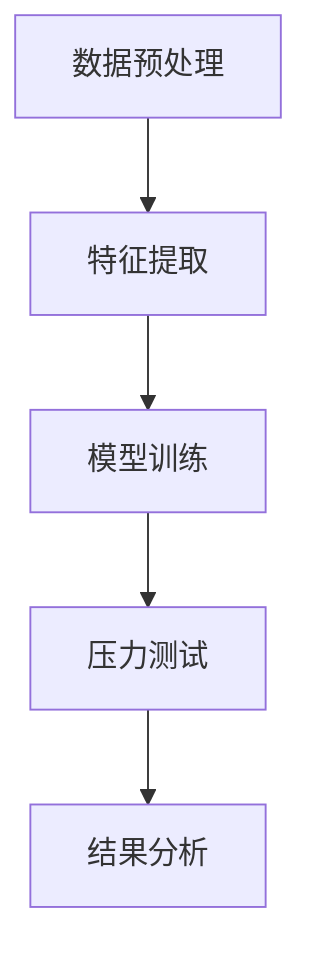
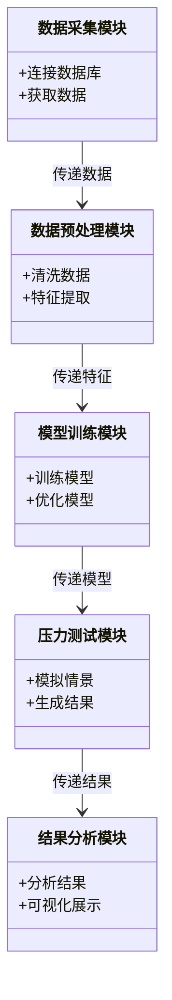
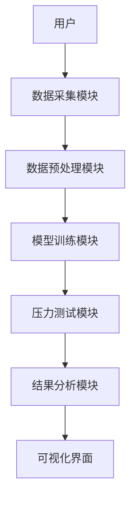

                 


# 设计智能化的企业财务压力测试系统

> 关键词：企业财务压力测试，智能化，机器学习，深度学习，系统架构，算法原理

> 摘要：本文详细探讨了设计智能化的企业财务压力测试系统的各个方面，从核心概念、系统架构到算法实现，再到项目实战，全面解析了如何利用现代技术手段提升企业财务压力测试的效率和准确性。文章结合实际案例，通过系统化的分析和设计，提出了一个高效可靠的解决方案，为企业财务管理提供了新的思路。

---

# 第一部分: 企业财务压力测试系统概述

# 第1章: 企业财务压力测试系统概述

## 1.1 财务压力测试的定义与背景

### 1.1.1 财务压力测试的定义

财务压力测试是一种用于评估企业在特定假设情景下财务状况的方法，旨在识别潜在风险并制定应对策略。随着企业规模的扩大和市场的不确定性增加，传统的手工压力测试方法逐渐暴露出效率低下、结果不准确等问题。

### 1.1.2 财务压力测试的重要性

在企业财务管理中，压力测试是评估企业抗风险能力的重要工具。它能够帮助企业识别潜在的财务风险，提前制定应对策略，从而在面对市场波动或经济危机时保持稳健。

### 1.1.3 智能化财务压力测试的必要性

随着人工智能和大数据技术的发展，智能化财务压力测试能够提高测试的效率和准确性。通过机器学习算法，系统可以自动分析大量财务数据，识别潜在风险，并生成优化的测试方案。

## 1.2 企业财务压力测试的核心概念

### 1.2.1 问题背景与问题描述

企业财务压力测试的核心问题在于如何高效、准确地评估企业在多种假设情景下的财务状况。传统方法依赖于人工分析，存在耗时长、效率低、结果不准确等问题。

### 1.2.2 问题解决的思路与方法

智能化财务压力测试通过引入机器学习和深度学习技术，自动分析财务数据，构建预测模型，模拟不同情景下的财务表现，从而实现高效、准确的压力测试。

### 1.2.3 系统的边界与外延

本系统主要针对企业财务数据进行分析，涵盖数据采集、模型训练、压力测试和结果分析等功能模块。系统的边界包括财务数据的输入和输出，以及与用户的交互界面。

### 1.2.4 核心要素与概念结构

智能化财务压力测试系统的核心要素包括：数据采集模块、模型训练模块、压力测试模块和结果分析模块。这些模块共同作用，完成从数据输入到结果输出的整个流程。

## 1.3 本章小结

本章主要介绍了企业财务压力测试的定义、重要性及智能化的必要性，阐述了系统的核心概念和结构，为后续的系统设计和实现奠定了基础。

---

# 第二部分: 核心概念与联系

# 第2章: 核心概念与系统架构

## 2.1 核心概念原理

### 2.1.1 数据流与信息处理流程

数据流从财务系统中提取，经过预处理、特征提取、模型训练等步骤，最终生成压力测试结果。

### 2.1.2 系统功能模块划分

智能化财务压力测试系统主要包括以下功能模块：
1. 数据采集模块：负责从企业财务系统中获取相关数据。
2. 数据预处理模块：对采集的数据进行清洗和标准化处理。
3. 模型训练模块：基于预处理后的数据，训练机器学习模型。
4. 压力测试模块：利用训练好的模型，模拟不同情景下的财务表现。
5. 结果分析模块：对测试结果进行分析和可视化展示。

## 2.2 核心概念属性特征对比

### 2.2.1 模块功能对比表格

| 模块功能       | 数据采集 | 数据预处理 | 模型训练 | 压力测试 | 结果分析 |
|----------------|----------|------------|----------|----------|----------|
| 描述           | 数据来源与格式标准化 | 数据清洗、特征提取 | 模型训练与优化 | 压力测试场景模拟 | 测试结果分析与可视化 |

## 2.3 ER实体关系图架构

```mermaid
erDiagram
    actor 用户 {
        +id 用户ID
        +name 用户名称
    }
    actor 管理员 {
        +id 管理员ID
        +name 管理员名称
    }
    database 数据库 {
        +id 数据ID
        +data 数据内容
    }
    model 模型 {
        +id 模型ID
        +name 模型名称
        +description 模型描述
    }
    用户 --> 数据库 : 查询数据
    管理员 --> 数据库 : 管理数据
    用户 --> 模型 : 使用模型进行测试
    管理员 --> 模型 : 管理模型
```

## 2.4 本章小结

本章详细阐述了智能化财务压力测试系统的核心概念和系统架构，通过功能模块划分和ER实体关系图，展示了系统的整体结构和各模块之间的关系。

---

# 第三部分: 算法原理讲解

# 第3章: 算法原理与实现

## 3.1 算法原理概述

### 3.1.1 机器学习在压力测试中的应用

机器学习算法可以用于预测企业财务状况的变化趋势，识别潜在风险点。例如，使用回归分析模型预测企业的收入和支出变化。

### 3.1.2 深度学习在压力测试中的应用

深度学习算法，如LSTM（长短期记忆网络），可以用于时间序列分析，预测企业在不同时间点的财务状况。

## 3.2 算法流程图



## 3.3 算法实现代码

```python
# 数据预处理
import pandas as pd
data = pd.read_csv('financial_data.csv')
data = data.dropna()
data = pd.get_dummies(data)

# 特征提取
from sklearn.feature_selection import SelectKBest
selector = SelectKBest(k=10)
selected_features = selector.fit_transform(data, target)

# 模型训练
from sklearn.ensemble import RandomForestRegressor
model = RandomForestRegressor()
model.fit(selected_features, target)

# 压力测试
import numpy as np
test_cases = np.random.normal(loc=0, scale=1, size=100)
results = model.predict(test_cases)

# 结果分析
import matplotlib.pyplot as plt
plt.hist(results, bins=10)
plt.show()
```

## 3.4 数学公式与模型解释

### 3.4.1 回归分析模型

线性回归模型的数学公式为：

$$ y = \beta_0 + \beta_1x_1 + \beta_2x_2 + \dots + \beta_nx_n + \epsilon $$

其中，$y$ 是预测目标，$x_i$ 是特征变量，$\beta_i$ 是回归系数，$\epsilon$ 是误差项。

### 3.4.2 LSTM 网络结构

LSTM 的基本单元包括输入门（Input Gate）、遗忘门（Forget Gate）和输出门（Output Gate）：

$$ 
f_t = \sigma(W_f \cdot [h_{t-1}, x_t] + b_f) 
$$
$$ 
i_t = \sigma(W_i \cdot [h_{t-1}, x_t] + b_i) 
$$
$$ 
o_t = \sigma(W_o \cdot [h_{t-1}, x_t] + b_o) 
$$
$$ 
c_t = f_t \cdot c_{t-1} + i_t \cdot tanh(W_c \cdot [h_{t-1}, x_t] + b_c) 
$$
$$ 
h_t = o_t \cdot tanh(c_t) 
$$

其中，$f_t$ 是遗忘门的输出，$i_t$ 是输入门的输出，$o_t$ 是输出门的输出，$c_t$ 是单元状态，$h_t$ 是隐藏状态。

## 3.5 本章小结

本章详细介绍了机器学习和深度学习在智能化财务压力测试中的应用，通过具体的算法流程图和代码示例，展示了如何实现高效的财务压力测试。

---

# 第四部分: 系统分析与架构设计方案

# 第4章: 系统分析与架构设计

## 4.1 系统分析

### 4.1.1 问题场景介绍

企业财务压力测试系统需要处理大量的财务数据，包括收入、支出、资产、负债等。系统需要能够模拟不同的财务情景，如经济衰退、市场波动等。

### 4.1.2 项目介绍

本项目旨在开发一个智能化的企业财务压力测试系统，通过机器学习算法，实现高效、准确的压力测试。

## 4.2 系统功能设计

### 4.2.1 领域模型设计



### 4.2.2 系统架构设计



## 4.3 本章小结

本章详细分析了系统的需求和功能设计，通过领域模型和系统架构图，展示了系统的整体结构和各模块之间的交互关系。

---

# 第五部分: 项目实战

# 第5章: 项目实战

## 5.1 环境配置

### 5.1.1 系统环境

建议使用Python 3.8及以上版本，安装以下库：

- pandas
- scikit-learn
- tensorflow
- matplotlib

### 5.1.2 安装依赖

```bash
pip install pandas scikit-learn tensorflow matplotlib
```

## 5.2 系统核心实现

### 5.2.1 数据采集模块

```python
import pandas as pd

def fetch_financial_data():
    data = pd.read_csv('financial_data.csv')
    return data
```

### 5.2.2 数据预处理模块

```python
from sklearn.feature_selection import SelectKBest

def preprocess_data(data):
    selector = SelectKBest(k=10)
    selected_features = selector.fit_transform(data, target)
    return selected_features
```

### 5.2.3 模型训练模块

```python
from sklearn.ensemble import RandomForestRegressor

def train_model(X, y):
    model = RandomForestRegressor()
    model.fit(X, y)
    return model
```

### 5.2.4 压力测试模块

```python
def perform_stress_test(model, scenarios):
    results = model.predict(scenarios)
    return results
```

### 5.2.5 结果分析模块

```python
import matplotlib.pyplot as plt

def analyze_results(results):
    plt.hist(results, bins=10)
    plt.show()
```

## 5.3 代码应用解读与分析

通过上述代码，我们可以看到系统各个模块的具体实现。数据采集模块从CSV文件中读取数据，数据预处理模块对数据进行特征提取，模型训练模块使用随机森林回归模型进行训练，压力测试模块模拟不同情景，结果分析模块对测试结果进行可视化展示。

## 5.4 实际案例分析

以某企业为例，假设我们有该企业的财务数据，包括收入、支出、资产、负债等。通过系统进行压力测试，模拟经济衰退情景下的财务状况。测试结果显示，企业在该情景下可能面临现金流短缺的风险。

## 5.5 本章小结

本章通过具体的代码实现和案例分析，展示了智能化财务压力测试系统的实际应用，帮助读者更好地理解和掌握系统的实现过程。

---

# 第六部分: 总结与展望

# 第6章: 总结与展望

## 6.1 系统总结

智能化财务压力测试系统通过引入机器学习和深度学习技术，实现了高效、准确的压力测试，为企业财务管理提供了有力支持。

## 6.2 系统展望

未来，随着人工智能技术的不断发展，智能化财务压力测试系统将更加智能化和自动化。可以进一步优化模型，引入更多的数据源，提高测试的准确性和效率。

## 6.3 最佳实践 tips

- 数据质量是压力测试结果准确性的关键，建议企业在数据采集和预处理阶段严格控制数据质量。
- 在模型训练阶段，建议使用交叉验证等方法优化模型性能。
- 在压力测试结果分析阶段，建议结合业务背景，对结果进行深入解读和分析。

## 6.4 本章小结

本章总结了系统的实现和应用，并展望了未来的发展方向，同时给出了一些最佳实践的建议，帮助读者在实际应用中更好地使用系统。

---

# 作者

作者：AI天才研究院/AI Genius Institute & 禅与计算机程序设计艺术 /Zen And The Art of Computer Programming

---

# 结语

通过本文的详细讲解，读者可以全面了解智能化企业财务压力测试系统的各个方面，从系统设计到算法实现，再到项目实战，为企业的财务管理提供了新的思路和解决方案。

