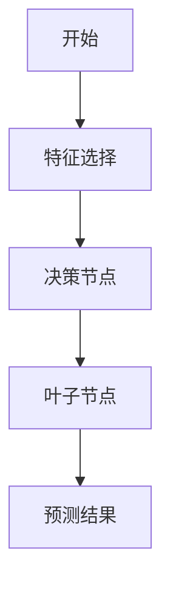
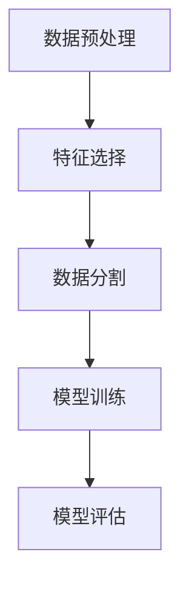
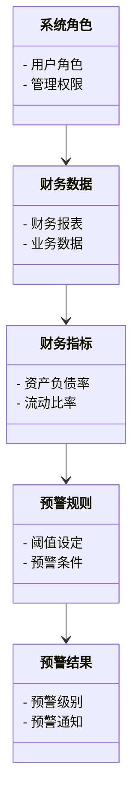
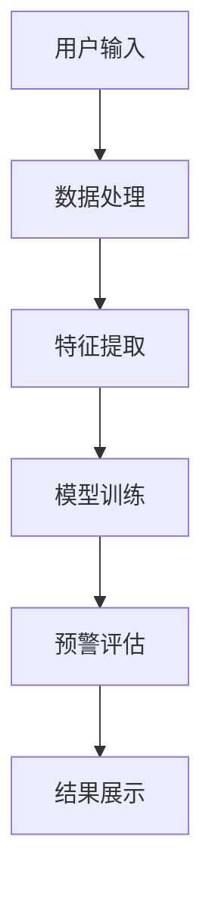

                 


# 设计智能化的企业财务压力预警系统

> 关键词：智能化，财务压力，预警系统，企业财务，人工智能，算法模型

> 摘要：本文旨在探讨如何利用智能化技术设计企业财务压力预警系统，通过分析财务数据，运用机器学习算法，构建实时监控和预警机制，帮助企业及时识别和应对财务风险，保障企业稳健运营。

---

# 第1章: 企业财务压力预警系统概述

## 1.1 问题背景与问题描述

### 1.1.1 企业财务压力的定义与特征
企业的财务压力通常表现为资金链紧张、债务负担过重、盈利能力下降等情况。这些压力可能由内部管理不善或外部市场波动引起，具有隐蔽性、累积性和突发性的特点。

### 1.1.2 企业财务风险的常见来源
- **内部因素**：管理决策失误、成本超支、应收账款回收困难。
- **外部因素**：经济波动、行业竞争加剧、政策变化。

### 1.1.3 财务压力对企业经营的影响
- 资金链断裂风险。
- 信用评级下降。
- 投资能力受限。
- 员工稳定性受影响。

### 1.1.4 系统目标与边界
- **核心目标**：提前预警潜在财务风险，辅助管理层制定应对策略。
- **系统边界**：仅关注财务相关数据，不涉及非财务因素。

---

## 1.2 系统核心要素与概念结构

### 1.2.1 核心概念对比
| 概念 | 属性 | 描述 |
|------|------|------|
| 财务压力 | 数据来源 | 财务报表、业务数据、外部市场数据 |
|       | 预警指标 | 资产负债率、流动比率、速动比率等 |
|       | 预警级别 | 低、中、高、严重 |
|       | 预警机制 | 实时监控、定期评估、触发式预警 |

### 1.2.2 实体关系图
```mermaid
er
  %% 财务压力预警系统实体关系图
  系统角色 --> 财务数据
  财务数据 --> 财务指标
  财务指标 --> 预警规则
  预警规则 --> 预警结果
```

---

# 第2章: 智能化预警系统核心算法与模型

## 2.1 机器学习与深度学习在财务预警中的应用

### 2.1.1 算法选择与数学模型
- **监督学习**：用于分类任务，如财务健康状况的分类。
- **非监督学习**：用于聚类任务，识别异常数据模式。

### 2.1.2 决策树算法实现


### 2.1.3 随机森林算法
- 通过集成学习提高模型鲁棒性。
- 使用袋装法（Bootstrap）和特征随机性减少过拟合。

---

## 2.2 基于决策树的分类算法

### 2.2.1 算法原理
```python
from sklearn.tree import DecisionTreeClassifier
import pandas as pd
from sklearn.model_selection import train_test_split

# 数据预处理
data = pd.DataFrame({
    '特征1': [...],
    '特征2': [...],
    '目标': [...]
})

X = data.drop('目标', axis=1)
y = data['目标']

X_train, X_test, y_train, y_test = train_test_split(X, y, test_size=0.2)

# 模型训练
model = DecisionTreeClassifier()
model.fit(X_train, y_train)

# 预测与评估
print("训练集准确率:", model.score(X_train, y_train))
print("测试集准确率:", model.score(X_test, y_test))
```

---

## 2.3 算法实现步骤与流程图

### 2.3.1 流程图


---

## 2.4 数学公式与模型分析

### 2.4.1 决策树算法的数学模型
- **信息增益公式**：
  $$ \text{信息增益}(D, A) = H(D) - H(D|A) $$
- **基尼指数公式**：
  $$ G = \sum_{i=1}^{n} p_i(1-p_i) $$

### 2.4.2 随机森林模型的数学表达
- **集成学习**：
  $$ y = \sum_{i=1}^{n} f_i(x) $$

---

# 第3章: 系统分析与架构设计

## 3.1 问题场景介绍

### 3.1.1 企业财务压力预警系统架构


---

## 3.2 系统功能设计

### 3.2.1 功能模块划分
- **数据采集模块**：实时采集财务数据。
- **特征提取模块**：提取关键财务指标。
- **模型训练模块**：训练预警模型。
- **预警评估模块**：评估预警结果。
- **结果展示模块**：可视化预警信息。

### 3.2.2 系统架构设计


---

## 3.3 系统接口设计

### 3.3.1 数据接口
- **输入接口**：接收财务数据和业务数据。
- **输出接口**：提供预警结果和建议。

### 3.3.2 模型接口
- **训练接口**：接受特征数据，输出训练好的模型。
- **预测接口**：接受实时数据，输出预警结果。

---

## 3.4 系统交互设计

### 3.4.1 交互流程
```mermaid
sequenceDiagram
  actor 用户
  system 系统
  用户 -> 系统: 提交财务数据
  系统 -> 用户: 返回预警结果
```

---

# 第4章: 项目实战与案例分析

## 4.1 环境安装与配置

### 4.1.1 安装Python环境
```bash
pip install numpy pandas scikit-learn
```

### 4.1.2 安装可视化工具
```bash
pip install matplotlib seaborn
```

---

## 4.2 核心代码实现

### 4.2.1 数据预处理代码
```python
import pandas as pd

data = pd.read_csv('financial_data.csv')
data.dropna(inplace=True)
data = pd.get_dummies(data)
```

### 4.2.2 模型训练代码
```python
from sklearn.ensemble import RandomForestClassifier
from sklearn.metrics import accuracy_score

X = data.drop('target', axis=1)
y = data['target']

X_train, X_test, y_train, y_test = train_test_split(X, y, test_size=0.2)

model = RandomForestClassifier()
model.fit(X_train, y_train)
print("模型准确率:", accuracy_score(y_test, model.predict(X_test)))
```

---

## 4.3 案例分析与优化

### 4.3.1 案例分析
- **数据来源**：某制造企业的财务数据。
- **预警结果**：预测企业将在3个月内面临资金链断裂风险。

### 4.3.2 模型优化
- 增加特征工程。
- 调整模型参数。

---

## 4.4 项目小结

---

# 第5章: 最佳实践与注意事项

## 5.1 最佳实践

### 5.1.1 数据质量管理
- 数据清洗。
- 数据增强。

### 5.1.2 模型调优
- 超参数优化。
- 模型融合。

## 5.2 小结与注意事项

### 5.2.1 注意事项
- 数据隐私保护。
- 模型解释性。
- 系统可扩展性。

---

# 作者：AI天才研究院 & 禅与计算机程序设计艺术

---

**摘要：** 本文系统地探讨了设计智能化企业财务压力预警系统的关键步骤，从背景分析到算法实现，再到系统架构设计和项目实战，为读者提供了一套完整的解决方案。通过本文的指导，企业可以有效利用智能化技术，提前识别和应对财务风险，保障稳健运营。

