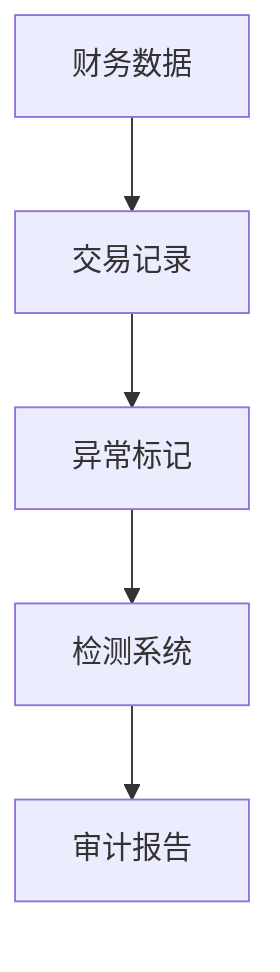
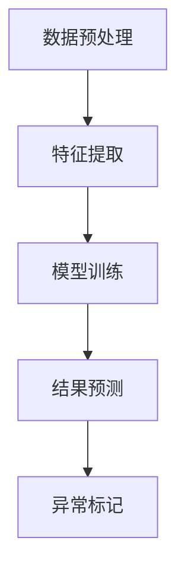
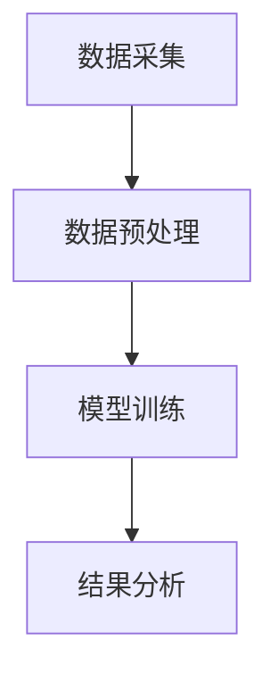
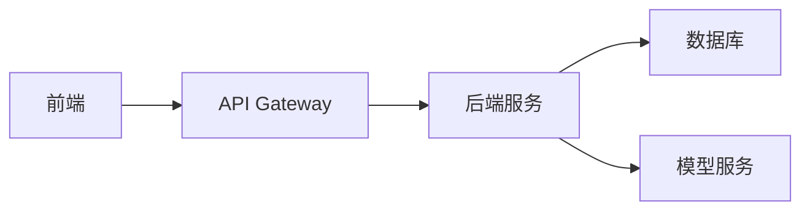
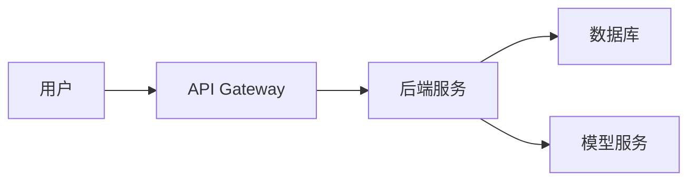

                 


# 设计智能化的企业财务异常交易检测系统

## 关键词：企业财务异常交易、智能化检测、机器学习、深度学习、NLP、异常检测、系统架构

## 摘要：  
本文旨在探讨如何利用人工智能技术设计智能化的企业财务异常交易检测系统。通过分析财务数据，结合机器学习、深度学习和自然语言处理等技术，提出一套高效、准确的异常交易检测方案。本文将从问题背景、核心概念、算法原理、系统架构到项目实战进行全面阐述，为读者提供一个完整的解决方案。

---

# 第1章: 企业财务异常交易检测系统概述

## 1.1 问题背景与现状

### 1.1.1 企业财务舞弊的现状与挑战
企业财务舞弊行为一直是全球关注的焦点。随着经济活动的复杂化，财务舞弊手段日益隐蔽，传统的财务审计方法已难以满足 detecting 精准识别的需求。企业财务舞弊不仅损害了企业的利益，还可能导致投资者信任度下降，甚至引发金融危机。

### 1.1.2 传统财务审计的局限性
传统财务审计主要依赖人工审查，存在以下问题：
- **效率低下**：人工审计需要逐项审查，耗时且成本高。
- **精度有限**：审计人员可能因为经验不足或疏忽而漏掉异常交易。
- **难以应对海量数据**：随着企业规模扩大，财务数据量剧增，人工审计难以覆盖所有交易。

### 1.1.3 智能化检测的必要性
智能化检测通过引入人工智能技术，能够快速、精准地识别异常交易，解决传统审计的痛点。人工智能技术的优势在于：
- **高效处理海量数据**：利用机器学习算法，快速分析大量财务数据。
- **高精度识别**：通过模型训练，能够识别出隐藏在正常交易中的异常行为。
- **实时监控**：智能化系统可以实现对财务交易的实时监控，及时发现并预警潜在风险。

### 1.1.4 系统的目标与意义
本系统的目标是通过智能化技术，实现对企业财务交易的实时监控和异常检测，从而帮助企业降低财务风险，提高审计效率和准确性。

---

## 1.2 系统的核心概念

### 1.2.1 财务异常交易的定义
财务异常交易是指在企业财务记录中，违背正常业务规律的交易行为。这些交易可能涉及虚构交易、关联交易、资金挪用等舞弊行为。

### 1.2.2 智能化检测的定义
智能化检测是指利用人工智能技术（如机器学习、深度学习、自然语言处理等）对财务数据进行分析，识别异常交易行为的过程。

### 1.2.3 相关技术的定义
- **机器学习**：通过训练模型，从数据中学习规律，识别异常交易。
- **深度学习**：利用深层神经网络模型，提取数据的高层次特征。
- **自然语言处理（NLP）**：用于分析非结构化数据（如财务报告、合同文本等）。

### 1.2.4 核心概念之间的关系
通过ER图可以清晰地展示核心概念之间的关系：



---

# 第2章: 智能化检测算法原理

## 2.1 常用算法介绍

### 2.1.1 聚类算法（K-means）
聚类算法适用于将相似的交易分组，识别出异常交易群。



代码实现：

```python
from sklearn.cluster import KMeans
import numpy as np

# 示例数据
X = np.array([[1, 2], [3, 4], [5, 6], [7, 8]])

# 模型训练
model = KMeans(n_clusters=2, random_state=0)
model.fit(X)

# 预测结果
print(model.labels_)
```

### 2.1.2 分类算法（随机森林、SVM）
分类算法适用于将交易分为正常和异常两类。

### 2.1.3 异常检测算法（LOF、Isolation Forest）
异常检测算法专门用于识别异常点。

### 2.1.4 算法对比
以下表格对比了常用算法的优缺点：

| 算法名称          | 优点                            | 缺点                            |
|-------------------|---------------------------------|---------------------------------|
| K-means          | 简单高效，适合小数据集          | 对初始质心敏感，结果不稳定      |
| Random Forest     | 鲁棒性强，适合高维数据          | 训练时间较长                    |
| SVM               | 分离能力强，适合线性可分数据      | 不适合高维数据                  |
| LOF               | 能处理高维数据，结果直观        | 对异常点数量敏感                |
| Isolation Forest  | 适合大规模数据，训练速度快      | 对异常点分布敏感                |

### 2.1.5 算法流程图


---

## 2.2 算法实现代码示例

```python
from sklearn.ensemble import RandomForestClassifier
from sklearn.svm import SVC
from sklearn.metrics import accuracy_score

# 示例数据
X = [[1, 2], [3, 4], [5, 6], [7, 8], [2, 3], [4, 5], [6, 7], [8, 9]]
y = [0, 0, 0, 0, 1, 1, 1, 1]

# 模型训练
model = RandomForestClassifier()
model.fit(X, y)

# 预测结果
y_pred = model.predict(X)
print("Accuracy:", accuracy_score(y, y_pred))
```

---

## 2.3 算法的数学模型与公式

### 2.3.1 K-means算法的数学模型
K-means算法的目标是最小化簇内平方和，公式如下：

$$
\text{目标函数: } \sum_{i=1}^{k} \sum_{j=1}^{n_i} \|x_j - c_i\|^2
$$

其中：
- \(k\) 是簇的数量
- \(n_i\) 是第 \(i\) 个簇中的样本数量
- \(x_j\) 是样本点
- \(c_i\) 是第 \(i\) 个簇的中心点

### 2.3.2 LOF算法的数学公式
LOF算法通过计算局部密度差异来识别异常点，公式如下：

$$
\text{LOF}(x) = \frac{\text{local reachability distance}(x)}{\text{average of local reachability distances of neighbors of } x}
$$

---

# 第3章: 系统分析与架构设计

## 3.1 项目介绍

### 3.1.1 项目背景
本项目旨在设计一个智能化的企业财务异常交易检测系统，通过整合多种人工智能技术，实现对财务数据的实时监控和异常检测。

### 3.1.2 项目目标
- 实现对财务交易的实时监控
- 准确识别异常交易行为
- 提供可扩展的系统架构

### 3.1.3 项目范围
- 数据来源：企业财务系统、交易记录、合同文本等
- 数据类型：结构化数据（如交易金额、时间）和非结构化数据（如财务报告）

## 3.2 系统功能设计

### 3.2.1 功能模块划分
- 数据采集模块：负责采集财务数据
- 数据预处理模块：对数据进行清洗和特征提取
- 模型训练模块：训练异常检测模型
- 结果分析模块：展示检测结果并生成报告

### 3.2.2 功能模块之间的关系



## 3.3 系统架构设计

### 3.3.1 系统架构图



### 3.3.2 系统组件介绍
- **前端**：用户界面，展示检测结果
- **API Gateway**：负责接口路由和认证
- **后端服务**：处理业务逻辑
- **数据库**：存储财务数据和检测结果
- **模型服务**：部署训练好的模型，提供预测服务

### 3.3.3 接口设计
- 数据采集接口：`POST /api/data`
- 模型训练接口：`POST /api/train`
- 检测结果查询接口：`GET /api/results`

## 3.4 交互流程图



---

# 第4章: 项目实战

## 4.1 环境搭建

### 4.1.1 系统要求
- 操作系统：Linux/Windows/MacOS
- Python版本：3.6+
- 硬件要求：4GB以上内存，推荐使用GPU加速

### 4.1.2 安装依赖
```bash
pip install numpy pandas scikit-learn tensorflow transformers
```

## 4.2 数据预处理

### 4.2.1 数据清洗
- 删除重复数据
- 填补缺失值
- 标准化处理

### 4.2.2 特征提取
- 提取交易金额、时间、交易类型等特征
- 使用NLP技术提取文本特征

## 4.3 模型实现

### 4.3.1 模型训练
```python
from sklearn.ensemble import IsolationForest
import numpy as np

# 示例数据
X = np.array([[1, 2], [3, 4], [5, 6], [7, 8]])

# 模型训练
model = IsolationForest(n_estimators=100, random_state=0)
model.fit(X)

# 预测结果
y_pred = model.predict(X)
print(y_pred)
```

### 4.3.2 模型优化
- 调参：选择合适的模型参数
- 交叉验证：评估模型性能

## 4.4 结果分析

### 4.4.1 检测结果展示
- 异常交易标记
- 可视化分析

### 4.4.2 案例分析
- 实际案例分析
- 检测结果解读

---

# 第5章: 最佳实践与总结

## 5.1 总结与反思

### 5.1.1 系统的优势
- 高效性：能够快速处理海量数据
- 准确性：通过模型训练提高检测精度
- 实时性：实现对交易的实时监控

### 5.1.2 系统的不足
- 对异常交易的解释性较差
- 模型需要定期更新

## 5.2 小结与注意事项

### 5.2.1 小结
智能化企业财务异常交易检测系统通过结合人工智能技术，能够显著提高检测效率和准确性。

### 5.2.2 注意事项
- 数据隐私保护
- 模型的可解释性
- 系统的可扩展性

## 5.3 拓展阅读

### 5.3.1 推荐书籍
- 《Python机器学习实战》
- 《深度学习入门：基于Python和TensorFlow》

### 5.3.2 推荐博客
- TensorFlow中文社区
- Keras官方博客

---

# 结语

智能化企业财务异常交易检测系统的设计与实现是一个复杂的工程，需要结合多种人工智能技术。通过本文的探讨，我们希望读者能够理解系统的核心原理，并能够在实际应用中灵活运用这些技术。

---

# 作者：AI天才研究院/AI Genius Institute & 禅与计算机程序设计艺术/Zen And The Art of Computer Programming

