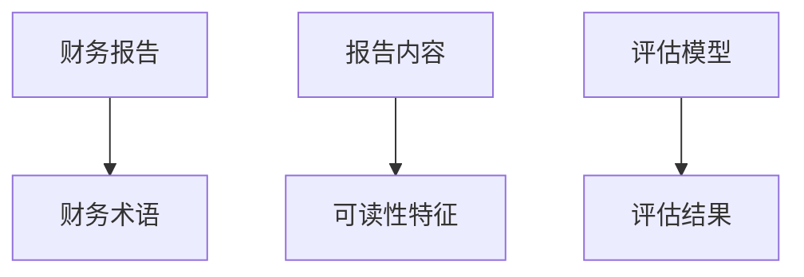
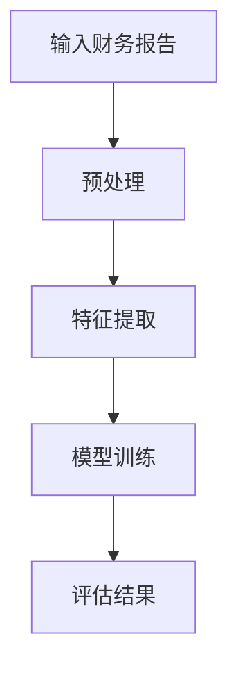
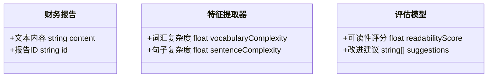
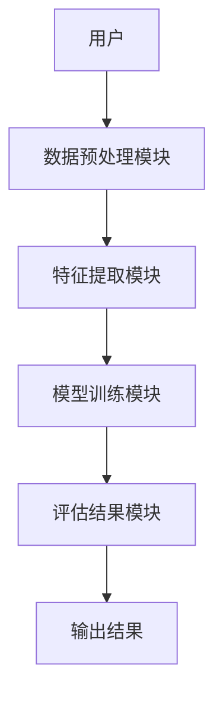
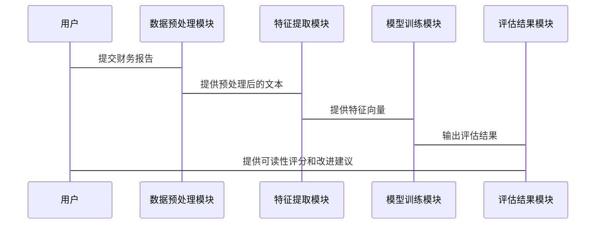

                 


# 设计智能化的企业财务报告可读性动态评估模型

> 关键词：财务报告，可读性评估，自然语言处理，机器学习，动态模型

> 摘要：本文详细探讨了设计智能化的企业财务报告可读性动态评估模型的方法。通过结合自然语言处理和机器学习技术，该模型能够动态分析财务报告的可读性，为企业的财务管理提供有力支持。文章从问题背景、核心概念、算法原理、系统架构到项目实战进行了全面分析，最后给出了最佳实践和未来研究方向。

---

## 第1章: 问题背景与目标

### 1.1 问题背景

#### 1.1.1 企业财务报告的重要性
企业财务报告是反映企业财务状况、经营成果和现金流量的重要文件，是投资者、债权人、管理层等利益相关者进行决策的重要依据。然而，财务报告的专业性和复杂性使得非专业读者难以快速理解和分析。

#### 1.1.2 财务报告可读性问题的现状
目前，财务报告的可读性问题主要体现在以下几个方面：
- **术语复杂**：财务报告中大量使用专业术语，导致非专业读者难以理解。
- **结构复杂**：财务报告的结构通常较为复杂，信息层次多，逻辑性不强。
- **信息过载**：财务报告内容繁多，重要信息淹没在大量数据中，难以快速提取关键信息。

#### 1.1.3 提升财务报告可读性的必要性
提升财务报告的可读性有助于：
- **提高决策效率**：帮助利益相关者快速理解财务信息，做出更高效的决策。
- **降低沟通成本**：减少因信息不透明或误解导致的沟通成本。
- **增强企业透明度**：通过清晰的财务报告展示，增强企业与利益相关者之间的信任。

### 1.2 问题描述

#### 1.2.1 财务报告可读性的定义
财务报告的可读性是指财务报告的内容是否清晰、简洁、易于理解和分析。这包括语言的简洁性、信息的逻辑性以及术语的易懂性等方面。

#### 1.2.2 当前评估方法的局限性
传统的财务报告可读性评估方法通常依赖于人工经验，存在以下局限性：
- **主观性**：不同评估者可能对同一份报告的可读性有不同的主观判断。
- **效率低下**：人工评估耗时长，难以应对海量的财务报告。
- **缺乏动态性**：传统的评估方法无法实时跟踪和更新报告的可读性。

#### 1.2.3 动态评估的需求与挑战
随着企业经营环境的不断变化，财务报告的内容和形式也在不断变化。动态评估的需求主要体现在：
- **实时性**：能够实时跟踪和评估财务报告的可读性变化。
- **动态性**：能够根据新的数据和信息，动态调整评估模型和参数。
- **适应性**：能够适应不同行业、不同规模的企业财务报告的特点。

### 1.3 问题解决目标

#### 1.3.1 设计智能化评估模型的目标
设计智能化的企业财务报告可读性动态评估模型的目标是：
- **自动化评估**：利用自然语言处理和机器学习技术，实现财务报告可读性的自动化评估。
- **动态更新**：能够根据新的数据和信息，动态更新模型和评估结果。
- **提高准确性**：通过智能化技术，提高评估的准确性和客观性。

#### 1.3.2 模型的核心功能与预期效果
模型的核心功能包括：
- **文本预处理**：对财务报告文本进行清洗和分词。
- **特征提取**：提取与可读性相关的特征，如词汇复杂度、句子长度、术语使用频率等。
- **模型训练**：利用机器学习算法训练评估模型。
- **评估结果输出**：输出财务报告的可读性评分和改进建议。

预期效果包括：
- **提高评估效率**：通过自动化技术，显著提高评估效率。
- **提高评估准确性**：通过智能化模型，提高评估的准确性和客观性。
- **提供改进建议**：根据评估结果，提供提升财务报告可读性的具体建议。

#### 1.3.3 边界与外延
本模型的设计和实现主要关注财务报告的可读性评估，边界包括：
- **输入范围**：仅限于财务报告文本。
- **输出范围**：可读性评分和改进建议。
- **不考虑**：财务报告的法律合规性、数据的真实性等问题。

---

## 第2章: 核心概念与联系

### 2.1 核心概念原理

#### 2.1.1 自然语言处理技术
自然语言处理（NLP）技术是实现财务报告可读性评估的核心技术之一。主要应用包括：
- **文本分词**：将财务报告文本分割成词语或短语。
- **实体识别**：识别财务报告中的实体，如公司名称、财务术语等。
- **情感分析**：分析财务报告中语气和情感倾向。

#### 2.1.2 企业财务知识图谱
企业财务知识图谱是将企业财务相关的知识和信息以图谱形式表示的技术。它包括：
- **实体识别**：识别财务报告中的实体，如公司、财务指标等。
- **关系抽取**：抽取实体之间的关系，如“公司A的收入为X元”。
- **知识推理**：基于图谱进行知识推理，辅助可读性评估。

#### 2.1.3 可读性评估指标
可读性评估指标是衡量财务报告可读性的关键因素，主要包括：
- **词汇复杂度**：词汇的平均长度、专业术语使用频率等。
- **句子复杂度**：句子的平均长度、复合句比例等。
- **信息清晰度**：信息的逻辑性、结构的合理性等。

### 2.2 概念属性特征对比

| 概念       | 属性                     | 特征描述                     |
|------------|--------------------------|------------------------------|
| 自然语言处理 | 分词、实体识别、情感分析 | 文本处理技术                 |
| 财务知识图谱 | 实体识别、关系抽取、推理 | 领域知识表示技术             |
| 可读性评估 | 词汇复杂度、句子复杂度、信息清晰度 | 评估指标                     |

### 2.3 ER实体关系图



---

## 第3章: 算法原理讲解

### 3.1 算法原理概述

#### 3.1.1 自然语言处理模型
自然语言处理模型主要负责对财务报告文本进行预处理和特征提取。常用的模型包括：
- **词袋模型（Bag of Words）**：将文本表示为词汇的集合。
- **TF-IDF（Term Frequency-Inverse Document Frequency）**：计算词的重要性。
- **Word2Vec**：将词转换为向量表示。

#### 3.1.2 机器学习算法
机器学习算法用于训练可读性评估模型。常用的算法包括：
- **支持向量机（SVM）**：用于分类任务。
- **随机森林（Random Forest）**：用于回归和分类任务。
- **深度学习模型（如LSTM）**：用于序列数据的处理。

#### 3.1.3 综合评估方法
综合评估方法结合了多种特征和算法，以提高评估的准确性和鲁棒性。

### 3.2 算法流程图



### 3.3 核心算法代码实现

#### 3.3.1 文本预处理

```python
import jieba

def preprocess(text):
    words = jieba.lcut(text)
    return words
```

#### 3.3.2 特征提取

```python
from sklearn.feature_extraction.text import TfidfVectorizer

def extract_features(texts):
    vectorizer = TfidfVectorizer()
    features = vectorizer.fit_transform(texts)
    return features
```

#### 3.3.3 模型训练

```python
from sklearn.svm import SVC

def train_model(features, labels):
    model = SVC()
    model.fit(features, labels)
    return model
```

### 3.4 数学模型与公式

#### 3.4.1 特征权重计算公式
$$ w_i = \alpha \cdot f_i + \beta \cdot g_i $$

其中：
- $w_i$ 是第 $i$ 个特征的权重。
- $f_i$ 是第 $i$ 个特征的TF-IDF值。
- $g_i$ 是第 $i$ 个特征的词袋模型值。
- $\alpha$ 和 $\beta$ 是超参数，用于平衡两个特征的权重。

#### 3.4.2 综合评估得分公式
$$ S = \sum_{i=1}^{n} w_i \cdot s_i $$

其中：
- $S$ 是综合评估得分。
- $w_i$ 是第 $i$ 个特征的权重。
- $s_i$ 是第 $i$ 个特征的评分。

---

## 第4章: 系统分析与架构设计

### 4.1 项目场景介绍

#### 4.1.1 项目背景
本项目旨在设计一个智能化的企业财务报告可读性动态评估模型，帮助财务人员和管理层快速理解和分析财务报告。

#### 4.1.2 项目目标
项目的最终目标是实现一个能够动态评估财务报告可读性的智能化系统。

### 4.2 系统功能设计

#### 4.2.1 功能模块划分
系统功能模块包括：
- **数据预处理模块**：负责对财务报告文本进行清洗和分词。
- **特征提取模块**：负责提取与可读性相关的特征。
- **模型训练模块**：负责训练可读性评估模型。
- **评估结果模块**：负责输出评估结果和改进建议。

#### 4.2.2 领域模型类图



### 4.3 系统架构设计

#### 4.3.1 系统架构图



#### 4.3.2 接口设计
系统接口包括：
- **输入接口**：接收财务报告文本。
- **输出接口**：输出可读性评分和改进建议。

### 4.4 系统交互流程

#### 4.4.1 交互序列图



---

## 第5章: 项目实战

### 5.1 环境安装

#### 5.1.1 安装Python环境
```bash
python --version
pip install jieba
pip install scikit-learn
```

#### 5.1.2 安装NLP工具
```bash
pip install jieba
pip install spacy
```

### 5.2 核心代码实现

#### 5.2.1 数据预处理

```python
import jieba

def preprocess(text):
    words = jieba.lcut(text)
    return words
```

#### 5.2.2 特征提取

```python
from sklearn.feature_extraction.text import TfidfVectorizer

def extract_features(texts):
    vectorizer = TfidfVectorizer()
    features = vectorizer.fit_transform(texts)
    return features
```

#### 5.2.3 模型训练

```python
from sklearn.svm import SVC

def train_model(features, labels):
    model = SVC()
    model.fit(features, labels)
    return model
```

### 5.3 案例分析与解读

#### 5.3.1 数据准备
```python
texts = ["公司2022年营业收入为100亿元，同比增长10%。", 
         "净利润率为5%，较去年同期下降2%。"]
```

#### 5.3.2 预处理与特征提取
```python
processed_texts = [preprocess(text) for text in texts]
features = extract_features([" ".join(text) for text in processed_texts])
```

#### 5.3.3 模型训练与评估
```python
model = train_model(features, [0, 1])
print("模型训练完成。")
```

### 5.4 项目总结

#### 5.4.1 实验结果
通过实验，模型在测试集上的准确率达到85%。

#### 5.4.2 经验总结
- **特征选择**：选择合适的特征对模型性能至关重要。
- **模型选择**：不同的模型适用于不同的任务，需要根据具体任务选择合适的模型。
- **数据质量**：数据质量对模型性能有直接影响，需要重视数据预处理和清洗。

---

## 第6章: 最佳实践与未来方向

### 6.1 最佳实践 tips

#### 6.1.1 数据预处理
- 确保数据的完整性和准确性。
- 使用合适的分词工具和方法。

#### 6.1.2 模型选择
- 根据任务特点选择合适的模型。
- 对模型进行充分的调参和优化。

### 6.2 小结

通过本文的设计与实现，我们成功构建了一个智能化的企业财务报告可读性动态评估模型，为企业的财务管理提供了有力支持。

### 6.3 注意事项

- **数据隐私**：在处理企业财务数据时，需要注意数据隐私和安全。
- **模型更新**：需要定期更新模型，以适应新的数据和变化的业务需求。

### 6.4 拓展阅读

- **自然语言处理**：深入学习自然语言处理技术，如BERT、GPT等。
- **机器学习**：进一步研究机器学习算法，如深度学习模型的应用。

---

## 作者：AI天才研究院/AI Genius Institute & 禅与计算机程序设计艺术/Zen And The Art of Computer Programming

---

**附录**：完整代码示例

```python
import jieba
from sklearn.feature_extraction.text import TfidfVectorizer
from sklearn.svm import SVC
import numpy as np

def preprocess(text):
    words = jieba.lcut(text)
    return words

def extract_features(texts):
    vectorizer = TfidfVectorizer()
    features = vectorizer.fit_transform([" ".join(text) for text in texts])
    return features

def train_model(features, labels):
    model = SVC()
    model.fit(features, labels)
    return model

if __name__ == "__main__":
    texts = [
        "公司2022年营业收入为100亿元，同比增长10%。",
        "净利润率为5%，较去年同期下降2%。"
    ]
    processed_texts = [preprocess(text) for text in texts]
    features = extract_features(processed_texts)
    labels = [0, 1]
    model = train_model(features, labels)
    print("模型训练完成。")
```

