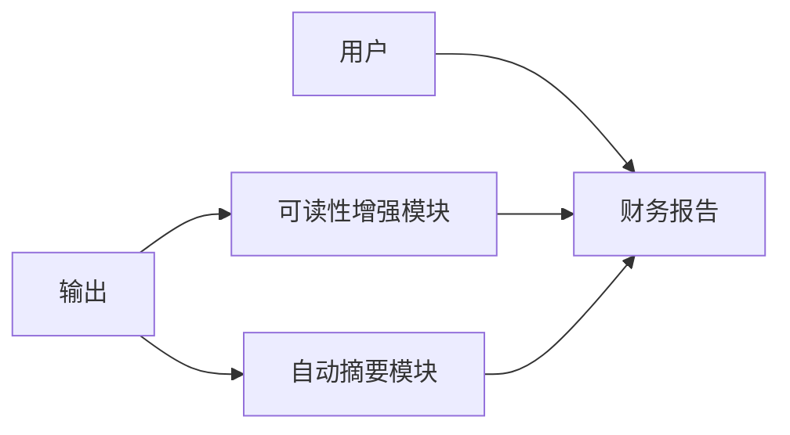
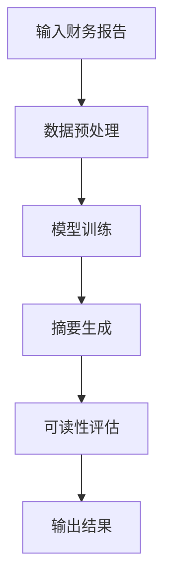
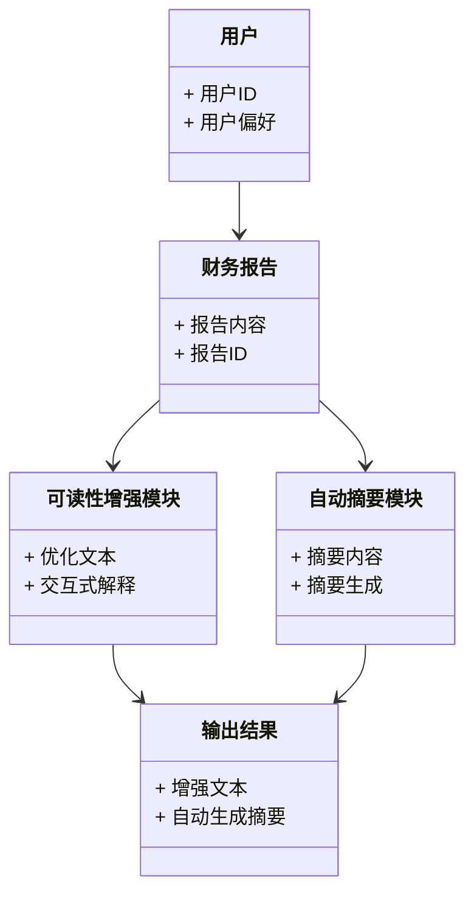
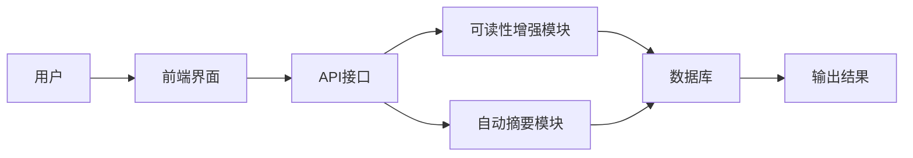
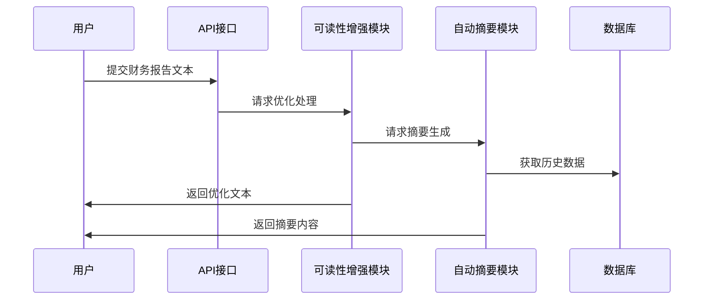

                 


# 设计智能化的企业财务报告可读性增强与自动摘要模型

## 关键词：
- 企业财务报告
- 可读性增强
- 自动摘要模型
- 人工智能
- 自然语言处理

## 摘要：
本文探讨如何利用人工智能技术提升企业财务报告的可读性和自动化摘要能力。通过分析财务报告的特点，结合自然语言处理技术，设计并实现了一种智能化的可读性增强与自动摘要模型。该模型采用深度学习算法，通过数据预处理、模型训练和摘要生成等步骤，显著提高了财务报告的可读性和摘要的准确性。本文详细讲解了模型的算法原理、系统架构设计及实际应用案例，为企业的财务数据管理和分析提供了新的思路。

---

# 第一部分: 企业财务报告可读性增强与自动摘要模型背景介绍

## 第1章: 问题背景与描述

### 1.1 问题背景

#### 1.1.1 传统财务报告的可读性挑战
企业财务报告是反映企业经营状况的重要文件，通常包含大量的数字、表格和专业术语。然而，由于其复杂性和专业性，普通员工或非财务背景的读者往往难以快速理解和提取关键信息。这不仅影响了信息传递的效率，还可能导致决策失误。

#### 1.1.2 企业财务报告的重要性与复杂性
财务报告不仅是企业内部管理的重要工具，也是吸引投资者、债权人等外部利益相关者的关键依据。然而，报告内容的复杂性（如多层级的财务数据、复杂的会计准则等）使得阅读和分析变得耗时且困难。

#### 1.1.3 当前财务报告阅读效率的痛点
随着企业规模的扩大和业务的复杂化，财务报告的内容越来越多，格式也越来越复杂。传统的阅读方式难以满足快速提取关键信息的需求，尤其是在数据量巨大的情况下，人工阅读效率低下，容易出错。

### 1.2 问题描述

#### 1.2.1 财务报告内容的复杂性
财务报告通常包含资产负债表、利润表、现金流量表等多个部分，内容涉及财务术语、行业标准和法规要求。这些内容的复杂性使得普通读者难以快速理解。

#### 1.2.2 用户需求的多样性
不同用户对财务报告的需求不同。例如，高层管理者需要从整体上把握企业财务状况，而财务部门则需要详细分析具体的财务数据。此外，投资者可能更关注财务指标的变化趋势。

#### 1.2.3 现有解决方案的局限性
传统的财务报告阅读和分析方式主要依赖人工操作，效率低且容易出错。虽然有一些工具可以辅助分析，但它们通常仅限于简单的数据展示，无法提供智能化的可读性增强和自动化摘要功能。

### 1.3 问题解决方向

#### 1.3.1 可读性增强的目标
通过技术手段提升财务报告的可读性，使其更易于理解和分析。这包括简化复杂的财务术语、优化报告结构和提供交互式阅读体验。

#### 1.3.2 自动摘要的核心作用
自动摘要模型能够从财务报告中提取关键信息，生成简洁的摘要，帮助用户快速掌握报告的核心内容。这不仅可以提高阅读效率，还能减少人为错误。

#### 1.3.3 结合AI技术的解决方案
利用人工智能技术（如自然语言处理、机器学习）对财务报告进行智能化分析，实现可读性增强和自动摘要。这不仅能够提高阅读效率，还能为企业提供更精准的决策支持。

---

## 第2章: 核心概念与联系

### 2.1 核心概念原理

#### 2.1.1 可读性增强的定义与实现
可读性增强是指通过技术手段优化文本的结构和内容，使其更易于理解和阅读。在财务报告中，这可能包括重新组织内容、简化术语和提供交互式解释功能。

#### 2.1.2 自动摘要模型的工作原理
自动摘要模型通过自然语言处理技术从财务报告中提取关键信息，并生成简洁的摘要。这通常包括文本分词、关键词提取和文本摘要生成等步骤。

#### 2.1.3 结合AI技术的核心优势
AI技术能够从大量的财务数据中提取模式和关系，帮助模型更好地理解报告内容，并生成更准确的摘要。此外，AI还可以通过学习用户偏好，提供个性化的阅读和摘要体验。

### 2.2 概念属性特征对比

| 概念        | 可读性增强 | 自动摘要模型 |
|-------------|------------|--------------|
| **定义**    | 提高文本可读性 | 自动生成摘要 |
| **输入**    | 财务报告文本 | 财务报告文本 |
| **输出**    | 结构优化的文本 | 关键信息摘要 |
| **技术**    | NLP、信息抽取 | NLP、文本摘要 |
| **目标**    | 提高阅读效率 | 快速获取核心信息 |

### 2.3 ER实体关系图



---

## 第3章: 算法原理讲解

### 3.1 算法流程



### 3.2 数学模型与公式

#### 3.2.1 模型训练目标函数
$$ \text{Loss} = -\sum_{i=1}^{n} y_i \log p(y_i) $$

其中，$y_i$ 是真实标签，$p(y_i)$ 是模型预测的概率。

#### 3.2.2 摘要生成概率计算
$$ p(x|y) = \prod_{i=1}^{m} p(x_i|y) $$

其中，$x$ 是生成的摘要，$y$ 是原始文本。

### 3.3 算法实现

#### 3.3.1 数据预处理代码
```python
def preprocess(text):
    # 分词处理
    tokens = tokenizer.tokenize(text)
    # 转换为向量表示
    inputs = tokenizer.encode_plus(tokens, return_tensors='pt')
    return inputs
```

#### 3.3.2 模型训练代码
```python
def train_model(model, optimizer, criterion, train_loader, epochs=10):
    for epoch in range(epochs):
        for batch in train_loader:
            inputs, labels = batch
            outputs = model(inputs)
            loss = criterion(outputs, labels)
            loss.backward()
            optimizer.step()
            optimizer.zero_grad()
```

---

# 第二部分: 系统分析与架构设计方案

## 第4章: 系统分析与架构设计

### 4.1 问题场景介绍

#### 4.1.1 问题场景
企业财务报告的阅读和分析需要依赖大量数据和复杂的信息。通过智能化的可读性增强和自动摘要功能，可以提高财务报告的使用效率。

### 4.2 系统功能设计

#### 4.2.1 系统功能模块


### 4.3 系统架构设计

#### 4.3.1 系统架构图



### 4.4 系统接口设计

#### 4.4.1 接口描述
- **输入接口**：用户输入财务报告文本
- **处理接口**：可读性增强模块和自动摘要模块分别处理输入文本
- **输出接口**：生成优化的文本和摘要，返回给用户

### 4.5 系统交互设计

#### 4.5.1 交互流程



---

## 第5章: 项目实战

### 5.1 环境安装

#### 5.1.1 安装Python和相关库
```bash
pip install torch transformers
```

### 5.2 系统核心实现

#### 5.2.1 模型实现代码
```python
import torch
from transformers import AutoTokenizer, AutoModelForSeq2Seq

tokenizer = AutoTokenizer.from_pretrained('t5-base')
model = AutoModelForSeq2Seq.from_pretrained('t5-base')
```

#### 5.2.2 摘要生成代码
```python
def generate_summary(text):
    inputs = tokenizer.encode("summarize: " + text, return_tensors='pt', max_length=512)
    outputs = model.generate(inputs, max_length=150, min_length=30, do_sample=False)
    summary = tokenizer.decode(outputs[0])
    return summary
```

### 5.3 实际案例分析

#### 5.3.1 案例分析
假设有一份财务报告，内容如下：
```
公司在2023年实现营业收入10亿元，同比增长20%。净利润为2亿元，同比增长15%。研发投入占营业收入的10%。
```

通过可读性增强模块，报告可以优化为：
```
公司在2023年营业收入达到10亿元，同比增长20%，净利润为2亿元，同比增长15%。研发投入占营业收入的10%。
```

自动摘要模型生成的摘要为：
```
公司在2023年营业收入增长20%，净利润增长15%，研发投入占营业收入的10%。
```

### 5.4 项目小结

#### 5.4.1 经验总结
- 数据预处理是关键，需要确保输入数据的质量。
- 模型的选择和调优对生成结果的影响较大。
- 用户反馈对于优化系统非常重要。

#### 5.4.2 注意事项
- 需要处理财务术语的特殊性。
- 模型的泛化能力需要进一步提升。
- 系统的安全性和稳定性需要重点考虑。

---

## 第6章: 最佳实践与总结

### 6.1 最佳实践 Tips

#### 6.1.1 技术实现
- 使用预训练的语言模型（如T5）进行摘要生成。
- 结合领域知识进行模型微调，提升效果。

#### 6.1.2 系统优化
- 引入用户反馈机制，优化摘要生成。
- 提供多语言支持，满足国际化需求。

### 6.2 小结

通过智能化的可读性增强和自动摘要模型，企业可以显著提高财务报告的阅读效率和分析能力。本文详细介绍了模型的设计思路、实现过程和实际应用案例，为后续研究提供了参考。

### 6.3 注意事项

- 数据隐私和安全问题需要高度重视。
- 模型的解释性和透明度需要进一步提升。
- 系统的可扩展性和可维护性需要在设计阶段充分考虑。

### 6.4 拓展阅读

- 《自然语言处理入门》
- 《深度学习与神经网络》
- 《企业信息化与人工智能》

---

作者：AI天才研究院/AI Genius Institute & 禅与计算机程序设计艺术 /Zen And The Art of Computer Programming

