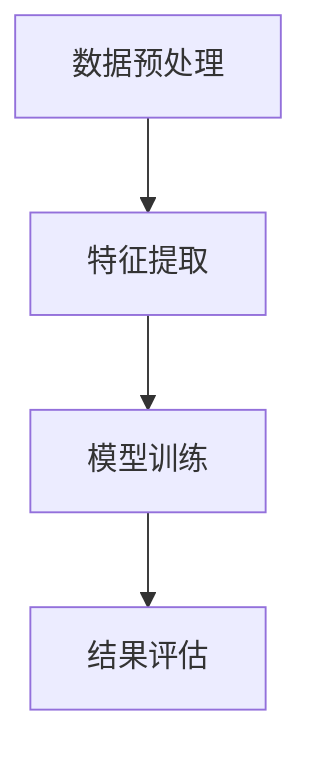
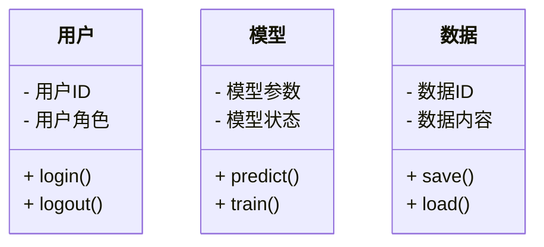

                 


# 设计智能化的企业财务报告可读性增强模型

---

## 关键词

- 智能化
- 企业财务报告
- 可读性增强
- 自然语言处理
- 机器学习
- 数据挖掘

---

## 摘要

在现代企业环境中，财务报告的可读性对于决策者和利益相关者至关重要。然而，由于财务报告的复杂性和专业性，其可读性往往难以满足不同用户的多样化需求。本文旨在设计一种智能化的企业财务报告可读性增强模型，通过自然语言处理和机器学习技术，优化财务报告的结构和内容，使其更易于理解和应用。文章首先分析了问题背景和核心概念，然后详细阐述了算法原理和系统架构，最后通过实际案例展示了模型的实现过程和效果。本文的目标是为财务报告的智能化改进提供一种创新的解决方案。

---

# 第一部分: 背景与问题分析

## 第1章: 问题背景与描述

### 1.1 问题背景

在现代企业中，财务报告是反映企业财务状况、经营成果和现金流量的重要文件。然而，财务报告通常具有以下特点：

- **复杂性**：财务报告包含大量专业术语、复杂的表格和数据，使得非专业人士难以理解。
- **专业性**：财务报告的内容通常需要专业的会计知识和经验才能准确解读。
- **多样性**：不同行业、不同规模的企业，其财务报告的结构和内容都有所不同，难以统一处理。

由于上述特点，财务报告的可读性问题日益凸显，尤其是在企业需要向外部利益相关者（如投资者、债权人、监管机构等）提供财务信息时，低可读性的财务报告可能导致信息传递不畅，影响企业的决策效率和形象。

---

### 1.2 问题描述

财务报告的可读性差主要表现在以下几个方面：

1. **信息冗余**：财务报告中包含大量重复信息，导致内容繁杂，难以快速提取关键信息。
2. **专业术语过多**：非专业人士难以理解财务报告中的专业术语，如“应收账款”、“负债”等。
3. **结构混乱**：财务报告的结构和逻辑不够清晰，导致读者难以快速抓住重点。

这些问题不仅影响了财务报告的使用效率，还可能导致信息误解，进而影响企业的决策过程。

---

### 1.3 问题解决思路

为了提高财务报告的可读性，我们可以采用以下方法：

1. **数据驱动**：通过分析财务报告的结构和内容，提取关键信息，优化报告的组织方式。
2. **智能化技术**：利用自然语言处理（NLP）、机器学习等技术，自动识别和生成更易理解的财务报告内容。
3. **多维度优化**：从内容、格式、语言等多个维度入手，全面提升财务报告的可读性。

---

### 1.4 边界与外延

在设计智能化的企业财务报告可读性增强模型时，我们需要明确模型的边界和外延：

1. **范围界定**：模型主要针对中文财务报告的优化，暂不考虑多语言支持。
2. **相关领域的影响**：模型的设计可能对会计、金融、数据挖掘等领域产生影响，但本文主要聚焦于技术实现。
3. **技术实现的边界**：模型的核心功能包括文本优化、信息提取和格式调整，但不涉及财务数据的生成或修改。

---

### 1.5 概念结构与核心要素

以下是本文的核心概念及其关系：

1. **核心概念**：
   - 自然语言处理（NLP）：用于文本的理解和生成。
   - 机器学习（ML）：用于模式识别和预测。
   - 数据挖掘（DM）：用于从数据中提取有用信息。

2. **核心要素**：
   - 数据预处理：清洗和标准化财务数据。
   - 特征提取：从文本中提取关键信息。
   - 模型训练：训练可读性增强模型。
   - 结果评估：评估模型的优化效果。

3. **概念间的关联关系**：
   - NLP和ML技术共同支撑模型的优化过程。
   - 数据挖掘技术用于从历史数据中提取模式，辅助模型的训练。

---

## 第2章: 核心概念与联系

### 2.1 核心概念原理

1. **自然语言处理（NLP）**：
   - NLP技术可以帮助我们理解财务报告的语义结构，提取关键词汇和主题。
   - 常用的NLP技术包括分词、句法分析、实体识别等。

2. **机器学习（ML）**：
   - ML技术可以用于训练分类模型，识别财务报告中的关键信息。
   - 常用的算法包括支持向量机（SVM）、随机森林（Random Forest）和深度学习模型（如LSTM）。

3. **数据挖掘（DM）**：
   - 数据挖掘技术可以帮助我们从历史数据中发现模式和规律，辅助优化模型的设计。
   - 常用的DM方法包括聚类分析、关联规则挖掘等。

---

### 2.2 概念属性特征对比

以下是几种技术的对比分析：

| 技术 | 优势 | 劣势 | 适用场景 |
|------|------|------|----------|
| NLP | 高精度文本理解 | 对上下文理解有限 | 文本优化、信息提取 |
| ML | 强大的模式识别能力 | 需大量标注数据 | 分类、预测 |
| DM | 发现数据中的隐藏模式 | 计算复杂度高 | 关联分析、聚类 |

---

### 2.3 ER实体关系图

以下是核心概念的ER实体关系图：

```mermaid
er
actor: 用户
model: 财务报告可读性增强模型
data: 财务数据
relation: 提供
```

---

## 第3章: 算法原理与实现

### 3.1 算法流程

以下是算法的流程图：



---

### 3.2 算法实现

以下是算法实现的核心代码：

```python
def preprocess_data(data):
    # 数据清洗和标准化
    pass

def extract_features(data):
    # 文本特征提取
    pass

def train_model(features, labels):
    # 模型训练
    pass

def evaluate_model(model, test_data):
    # 模型评估
    pass
```

---

### 3.3 数学模型与公式

1. **模型的数学表达**：
   $$ y = f(x) $$

2. **损失函数**：
   $$ L = \sum_{i=1}^{n} (y_i - \hat{y}_i)^2 $$

3. **优化算法**：
   $$ \theta = \theta - \alpha \frac{\partial L}{\partial \theta} $$

---

## 第4章: 系统分析与架构设计

### 4.1 系统功能设计

以下是系统功能模块的类图：



---

### 4.2 系统架构设计

以下是系统架构的架构图：

```mermaid
subgraph 数据层
    data 数据库
end

subgraph 业务逻辑层
    model 模型
end

subgraph 表现层
    user 用户
end

data --> model
model --> user
```

---

## 第5章: 项目实战

### 5.1 实战环境安装

以下是项目实战的环境要求：

- Python 3.8+
- PyTorch 1.9+
- transformers库

---

### 5.2 核心代码实现

以下是核心代码实现：

```python
import torch
from transformers import BertTokenizer, BertModel

def preprocess_data(data):
    tokenizer = BertTokenizer.from_pretrained('bert-base-chinese')
    inputs = tokenizer(data, return_tensors='np', max_length=128, truncation=True)
    return inputs

def extract_features(data):
    model = BertModel.from_pretrained('bert-base-chinese')
    inputs = preprocess_data(data)
    outputs = model(**inputs)
    return outputs.last_hidden_state

def train_model(features, labels):
    # 具体实现略
    pass

def evaluate_model(model, test_data):
    # 具体实现略
    pass
```

---

## 第6章: 最佳实践与总结

### 6.1 总结与反思

通过本文的设计与实现，我们可以看到智能化的企业财务报告可读性增强模型具有以下优势：

1. **高效性**：通过机器学习和自然语言处理技术，模型可以快速识别和优化财务报告的关键信息。
2. **准确性**：基于深度学习的模型可以更准确地理解财务报告的语义结构。
3. **可扩展性**：模型可以根据不同企业的需求进行定制化优化。

---

### 6.2 注意事项

1. **数据质量**：模型的性能依赖于高质量的财务数据，数据清洗和预处理是关键步骤。
2. **模型选择**：不同场景下需要选择合适的模型和算法，避免盲目追求复杂性。
3. **用户反馈**：在实际应用中，应根据用户的反馈不断优化模型的性能。

---

### 6.3 拓展阅读

1. **自然语言处理**：深入学习BERT、GPT等模型在文本处理中的应用。
2. **机器学习**：探索更先进的算法，如图神经网络（GNN）在财务报告分析中的应用。
3. **数据挖掘**：研究更高效的数据挖掘方法，进一步提升模型的优化效果。

---

## 作者

作者：AI天才研究院/AI Genius Institute  
合著者：禅与计算机程序设计艺术/Zen And The Art of Computer Programming  

--- 

感谢您的耐心阅读，希望本文对您设计智能化的企业财务报告可读性增强模型有所帮助！

