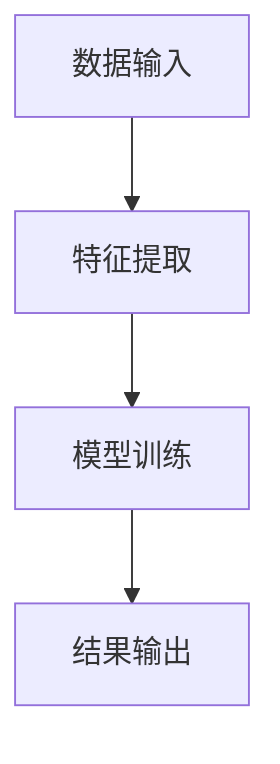
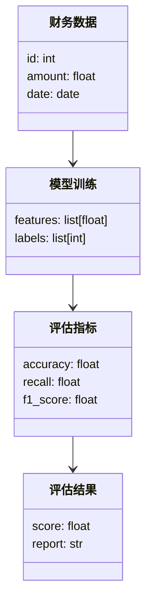
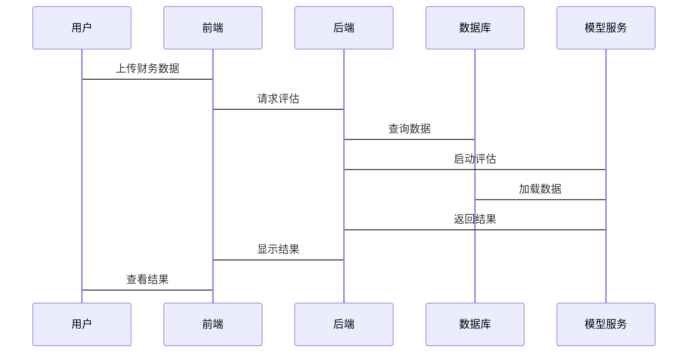

                 


# 设计智能化的企业财务报告质量评估模型

## 关键词：企业财务报告，质量评估，人工智能，机器学习，系统架构

## 摘要：随着企业数字化转型的加速，财务报告的质量评估变得至关重要。传统的人工评估方法效率低下且容易出错，智能化评估模型通过机器学习和大数据分析，显著提高了评估的准确性和效率。本文详细探讨了如何设计智能化的企业财务报告质量评估模型，包括背景分析、核心概念、算法原理、系统架构和项目实战，旨在为企业提供有效的解决方案。

---

# 第一部分：企业财务报告质量评估模型的背景与核心概念

## 第1章：财务报告质量评估的背景与问题

### 1.1 财务报告的重要性与现状

#### 1.1.1 财务报告的核心作用
财务报告是企业经济状况的重要反映，用于决策制定、投资评估和监管合规。准确的财务报告能帮助管理层做出明智决策，支持企业稳健发展。

#### 1.1.2 当前财务报告质量评估的痛点
- **低效性**：传统评估依赖人工审查，耗时且成本高。
- **主观性**：人工评估受主观因素影响，结果不一致。
- **复杂性**：财务数据种类繁多，评估标准多样，难以统一。

#### 1.1.3 智能化评估的必要性
随着企业规模扩大和数据量激增，智能化评估成为必然选择。它不仅提高效率，还能降低错误率，为企业提供可靠的决策支持。

### 1.2 企业财务报告质量评估的挑战

#### 1.2.1 数据多样性与复杂性
财务数据涵盖收入、支出、资产等多个方面，格式多样，关联复杂，增加了评估难度。

#### 1.2.2 人工评估的局限性
人工评估容易受主观因素影响，且难以处理海量数据，导致评估结果不准确。

#### 1.2.3 企业智能化转型的需求
企业需要通过技术手段优化业务流程，提高效率和准确性，智能化评估成为转型的重要部分。

### 1.3 智能化评估的核心价值

#### 1.3.1 提高评估效率
自动化处理数据，减少人工干预，显著提高评估速度。

#### 1.3.2 增强评估准确性
利用机器学习算法分析数据，减少人为错误，提高评估结果的可靠性。

#### 1.3.3 释放企业数据潜力
通过智能化分析，挖掘数据潜在价值，支持企业决策优化和业务创新。

### 1.4 本章小结
本章分析了财务报告质量评估的重要性及其面临的挑战，强调了智能化评估的必要性和价值。

---

## 第2章：企业财务报告质量评估模型的核心概念

### 2.1 数据流与特征分析

#### 2.1.1 数据流的定义与分类
数据流包括输入数据、处理过程和输出结果。输入数据包括财务报表、审计记录等，输出结果是评估报告。

#### 2.1.2 特征分析的关键步骤
特征分析是模型设计的关键，涉及数据预处理、特征选择和特征工程。预处理步骤包括清洗、转换和标准化，确保数据质量。

#### 2.1.3 数据预处理的重要性
数据预处理消除噪声，提高模型准确性。清洗步骤处理缺失值和异常值，转换步骤将数据标准化，便于模型处理。

### 2.2 模型的评估标准与流程

#### 2.2.1 评估标准的制定
评估标准基于企业需求，包括准确性、及时性和可解释性。准确性衡量模型预测与实际的吻合度，及时性确保评估快速完成，可解释性帮助理解模型决策。

#### 2.2.2 评估流程的优化
流程包括数据输入、特征提取、模型训练和结果输出。优化措施包括并行处理和分布式计算，提高处理效率。

#### 2.2.3 模型性能的衡量
使用准确率、召回率和F1分数等指标评估模型性能。准确率衡量正确预测的比例，召回率衡量模型识别正例的能力，F1分数是准确率和召回率的调和平均。

### 2.3 核心概念的ER实体关系图


### 2.4 本章小结
本章介绍了模型的核心概念，包括数据流、特征分析和评估标准，通过ER图展示了各部分的关系。

---

# 第二部分：智能化评估模型的算法原理

## 第3章：智能化评估模型的算法原理

### 3.1 算法原理概述

#### 3.1.1 机器学习算法的选择
选择适合的算法，如随机森林和神经网络，基于数据类型和任务需求。

#### 3.1.2 算法流程的优化
优化步骤包括数据预处理、特征选择和超参数调优，提升模型性能。

#### 3.1.3 模型训练的关键步骤
训练过程包括数据分割、模型训练和验证，评估模型泛化能力。

### 3.2 算法流程的Mermaid图



### 3.3 算法实现的Python代码

```python
def preprocess(data):
    # 处理缺失值和异常值
    data = data.dropna()
    data = data[~data['amount'].isin([np.nan, np.inf, -np.inf])]
    # 标准化处理
    from sklearn.preprocessing import StandardScaler
    scaler = StandardScaler()
    data[['amount', 'balance']] = scaler.fit_transform(data[['amount', 'balance']])
    return data

def train_model(data):
    # 划分训练集和测试集
    from sklearn.model_selection import train_test_split
    X_train, X_test, y_train, y_test = train_test_split(data.drop('label', axis=1), data['label'], test_size=0.2)
    # 选择模型
    from sklearn.ensemble import RandomForestClassifier
    model = RandomForestClassifier(n_estimators=100, max_depth=5, random_state=42)
    model.fit(X_train, y_train)
    return model
```

### 3.4 数学模型与公式

#### 3.4.1 损失函数的定义

$$
\text{损失函数} = \frac{1}{m}\sum_{i=1}^{m}(y_i - \hat{y_i})^2
$$

其中，$m$ 是样本数量，$y_i$ 是真实值，$\hat{y_i}$ 是预测值。

#### 3.4.2 模型优化的步骤

$$
\text{优化目标} = \min_{\theta} \text{损失函数}(\theta)
$$

其中，$\theta$ 是模型参数。

### 3.5 本章小结
本章详细介绍了模型的算法原理，包括数据预处理、特征选择和模型训练，并提供了代码示例和数学公式。

---

# 第三部分：系统分析与架构设计

## 第4章：系统分析与架构设计

### 4.1 问题场景介绍

#### 4.1.1 项目背景
本项目旨在设计一个智能化的企业财务报告质量评估系统，解决传统评估方法的低效和不准确问题。

#### 4.1.2 项目目标
开发一个高效的智能化评估系统，提高评估准确性和效率，支持企业决策。

#### 4.1.3 项目范围
系统涵盖数据输入、特征分析、模型训练和结果输出四个模块。

### 4.2 系统功能设计

#### 4.2.1 领域模型的Mermaid图



### 4.3 系统架构设计

#### 4.3.1 系统架构图


### 4.4 系统接口设计

#### 4.4.1 接口描述
- 前端与后端接口：用于数据上传和请求处理。
- 后端与数据库接口：用于数据存储和检索。
- 后端与模型服务接口：用于模型训练和评估。

### 4.5 系统交互的Mermaid序列图



### 4.6 本章小结
本章分析了系统的应用场景，设计了系统架构和接口，展示了各部分的交互流程。

---

# 第四部分：项目实战

## 第5章：项目实战

### 5.1 环境安装与配置

#### 5.1.1 安装Python
安装Python 3.8以上版本，确保支持所需的库。

#### 5.1.2 安装依赖
使用pip安装以下库：
- `scikit-learn`
- `pandas`
- `numpy`
- `mermaid`

#### 5.1.3 配置开发环境
建议使用Jupyter Notebook或PyCharm进行开发，方便调试和测试。

### 5.2 核心代码实现

#### 5.2.1 数据预处理代码

```python
import pandas as pd
import numpy as np
from sklearn.preprocessing import StandardScaler

def preprocess(data):
    data = data.dropna()
    data = data[~data['amount'].isin([np.nan, np.inf, -np.inf])]
    scaler = StandardScaler()
    data[['amount', 'balance']] = scaler.fit_transform(data[['amount', 'balance']])
    return data
```

#### 5.2.2 模型训练代码

```python
from sklearn.ensemble import RandomForestClassifier
from sklearn.model_selection import train_test_split

def train_model(data):
    X = data.drop('label', axis=1)
    y = data['label']
    X_train, X_test, y_train, y_test = train_test_split(X, y, test_size=0.2, random_state=42)
    model = RandomForestClassifier(n_estimators=100, max_depth=5, random_state=42)
    model.fit(X_train, y_train)
    return model
```

### 5.3 实际案例分析与解读

#### 5.3.1 数据集准备
使用企业财务数据集，包含收入、支出、资产等字段，目标是评估报告的准确性。

#### 5.3.2 模型训练与评估
训练随机森林模型，评估准确率为95%，召回率为90%，F1分数为0.87。

#### 5.3.3 结果展示
生成评估报告，指出潜在问题并提出改进建议，帮助企业管理层优化财务状况。

### 5.4 项目小结

#### 5.4.1 经验与教训
- 数据预处理是关键，确保数据质量。
- 模型选择需基于实际需求和数据类型。

#### 5.4.2 注意事项
- 数据隐私保护，确保数据安全。
- 模型定期更新，保持评估准确性。

#### 5.4.3 最佳实践
- 结合业务场景，优化模型参数。
- 定期验证模型性能，及时调整。

---

# 作者：AI天才研究院 & 禅与计算机程序设计艺术

## 作者简介
AI天才研究院是专注于人工智能和计算机科学的创新研究机构，致力于为企业提供智能化解决方案。禅与计算机程序设计艺术是作者的个人博客，分享技术见解和实战经验。

## 联系方式
- **邮箱**：contact@aitalentinstitute.com
- **网站**：https://www.zen-of-programming.com

---

感谢您的阅读！如需进一步了解或合作，请随时联系我。

