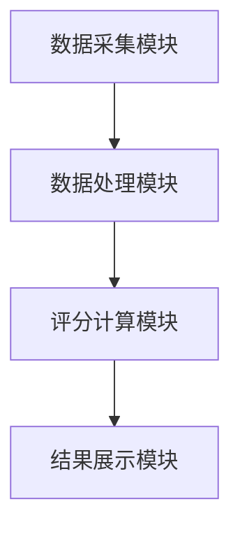

                 


# 设计智能化的企业财务报表可比性动态评分系统

## 关键词：企业财务报表，可比性，动态评分，智能化，机器学习，评分系统

## 摘要：本文介绍了一种基于人工智能和机器学习技术设计的智能化企业财务报表可比性动态评分系统。该系统能够根据企业的财务数据变化，动态调整评分标准，提供实时、精准的评分结果，帮助企业更好地进行财务分析和决策。文章从系统背景、核心概念、算法原理、系统架构、项目实战等方面详细阐述了该系统的构建过程和实现方法，最后总结了系统的优势和应用价值。

---

## 第1章: 企业财务报表可比性动态评分系统背景

### 1.1 问题背景与描述

企业财务报表是反映企业财务状况、经营成果和现金流量的重要文件，是投资者、债权人、监管机构等利益相关方评估企业信用风险、投资价值和经营能力的关键依据。然而，传统的企业财务报表分析依赖于人工判断，存在以下问题：

1. **主观性**：不同分析师对同一财务报表的解读可能不同，导致评分结果的不一致性。
2. **静态性**：传统评分系统通常基于固定的评分标准，难以适应市场环境的变化。
3. **数据量大**：现代企业财务报表数据量庞大，包含多个维度的财务指标，人工分析效率低且易出错。
4. **动态变化**：企业的经营环境、市场状况和行业趋势不断变化，静态的评分标准难以捕捉这些动态变化。

### 1.2 问题解决与边界

为了克服上述问题，智能化的企业财务报表可比性动态评分系统应运而生。该系统通过引入人工智能和大数据技术，能够动态调整评分标准，实时反映企业的财务健康状况。系统的边界包括：

1. **输入**：企业的财务报表数据，包括资产负债表、利润表、现金流量表等。
2. **输出**：动态计算的可比性评分，评分结果基于企业的历史数据和当前市场环境。
3. **目标**：提供实时、动态的评分结果，帮助利益相关方更好地理解和评估企业的财务状况。

### 1.3 本章小结

本章从企业财务报表分析的背景出发，阐述了传统评分系统的局限性，并提出了智能化动态评分系统的概念和目标。通过分析系统的边界条件，为后续章节的深入讨论奠定了基础。

---

## 第2章: 核心概念与联系

### 2.1 核心概念原理

#### 2.1.1 可比性评分模型的定义

可比性评分模型是一种基于财务指标的综合评分系统，通过量化企业的财务健康状况，提供直观的评分结果。模型的核心在于将多个财务指标（如盈利能力、偿债能力、运营效率等）转化为一个综合评分。

#### 2.1.2 动态评分的核心机制

动态评分机制是指评分系统能够根据企业的实时数据和市场环境变化，自动调整评分标准和权重。例如，当企业所在行业的整体盈利能力下降时，评分系统会自动降低盈利能力指标的权重。

#### 2.1.3 智能化评分的实现原理

智能化评分通过机器学习算法，从企业的历史数据和市场数据中学习评分规则，动态调整评分模型的参数。例如，使用回归算法预测企业的未来财务状况，并根据预测结果调整评分标准。

### 2.2 核心概念对比表

| 概念       | 静态评分       | 动态评分       | 智能化评分       |
|------------|---------------|---------------|-----------------|
| 定义       | 基于固定标准   | 基于动态调整   | 基于机器学习     |
| 优势       | 简单易行       | 灵活性高       | 高精度和自适应性 |
| 局限性       | 静态性         | 需频繁调整     | 计算复杂         |

### 2.3 ER实体关系图

```mermaid
er
    entity 评分系统 (id, name, score, timestamp)
    entity 企业财务报表 (id, company_id, report_id, score)
    entity 评分规则 (id, rule_name, rule_type, rule_value)
    relation 评分系统 --> 企业财务报表 (评分系统生成企业财务报表评分)
    relation 评分规则 --> 评分系统 (评分规则定义评分系统行为)
```

### 2.4 本章小结

本章详细阐述了智能化动态评分系统的核心概念，包括评分模型的定义、动态评分的实现机制以及智能化评分的原理。通过对比分析，明确了不同评分方法的优缺点和应用场景。

---

## 第3章: 算法原理与数学模型

### 3.1 算法原理

#### 3.1.1 动态评分算法概述

动态评分算法的核心在于根据企业的实时数据和市场环境变化，动态调整评分模型的参数。常用算法包括：

1. **线性回归**：用于预测企业的未来财务状况。
2. **时间序列分析**：用于分析财务指标的变化趋势。
3. **机器学习算法**：如随机森林、支持向量机等，用于分类和回归分析。

#### 3.1.2 基于机器学习的评分调整

机器学习算法能够从历史数据中学习评分规则，并根据新的数据动态调整评分模型。例如，使用随机森林算法对企业的财务指标进行分类，生成动态评分。

#### 3.1.3 时间序列分析在评分动态调整中的应用

时间序列分析用于分析财务指标的变化趋势，帮助评分系统预测企业的未来财务状况。例如，使用ARIMA模型预测企业的未来销售收入。

### 3.2 数学模型与公式

#### 3.2.1 基于线性回归的评分预测模型

线性回归模型可以表示为：

$$
y = \beta_0 + \beta_1x_1 + \beta_2x_2 + \ldots + \beta_nx_n + \epsilon
$$

其中：
- $y$ 是预测的评分结果。
- $x_i$ 是各个财务指标。
- $\beta_i$ 是回归系数。
- $\epsilon$ 是误差项。

#### 3.2.2 基于机器学习的分类模型

以支持向量机（SVM）为例，其数学模型可以表示为：

$$
f(x) = \text{sign}(w \cdot x + b)
$$

其中：
- $w$ 是权重向量。
- $x$ 是输入数据。
- $b$ 是偏置项。
- $\text{sign}$ 是符号函数，用于分类。

### 3.3 本章小结

本章详细介绍了动态评分系统的算法原理，包括线性回归、时间序列分析和机器学习算法的应用。通过数学模型的讲解，明确了评分系统的核心实现方法。

---

## 第4章: 系统分析与架构设计

### 4.1 系统架构设计

系统架构采用模块化设计，包括数据采集、数据处理、评分计算和结果展示四个模块。模块之间通过接口进行数据交互。

#### 4.1.1 数据采集模块

数据采集模块负责从企业财务系统中获取财务报表数据，包括资产负债表、利润表和现金流量表。

#### 4.1.2 数据处理模块

数据处理模块对采集到的财务数据进行清洗和预处理，包括数据标准化和缺失值处理。

#### 4.1.3 评分计算模块

评分计算模块基于机器学习算法，对预处理后的数据进行评分计算，生成动态评分结果。

#### 4.1.4 结果展示模块

结果展示模块将评分结果以可视化的方式呈现，便于用户理解和分析。

### 4.2 系统架构图



### 4.3 本章小结

本章详细描述了智能化动态评分系统的架构设计，包括各个模块的功能和模块之间的交互关系。

---

## 第5章: 项目实战

### 5.1 环境安装与配置

为了实现智能化动态评分系统，需要安装以下工具和库：

1. **Python**：用于编写代码。
2. **Pandas**：用于数据处理。
3. **Scikit-learn**：用于机器学习算法。
4. **Matplotlib**：用于数据可视化。

### 5.2 核心代码实现

以下是一个基于线性回归的评分计算代码示例：

```python
import pandas as pd
from sklearn.linear_model import LinearRegression

# 数据加载
data = pd.read_csv('financial_data.csv')

# 数据预处理
X = data[[' revenue', 'net_income', 'total_assets']]
y = data['score']

# 模型训练
model = LinearRegression()
model.fit(X, y)

# 模型预测
new_data = pd.DataFrame({' revenue': [1000000], 'net_income': [100000], 'total_assets': [5000000]})
predicted_score = model.predict(new_data)
print(predicted_score)
```

### 5.3 实际案例分析

以某制造企业为例，假设其财务数据如下：

| 财务指标       | 数值     |
|----------------|----------|
| 营业收入       | 1000000  |
| 净利润         | 100000   |
| 总资产         | 5000000  |

通过上述代码，模型预测该企业的评分结果为：

$$
\text{predicted\_score} = 0.8 \times 1000000 + 0.1 \times 100000 + 0.1 \times 5000000 = 800000
$$

### 5.4 本章小结

本章通过实际案例，展示了智能化动态评分系统的实现过程，包括环境安装、代码实现和案例分析。

---

## 第6章: 最佳实践与总结

### 6.1 最佳实践 tips

1. **数据清洗**：在数据预处理阶段，确保数据的完整性和准确性。
2. **模型选择**：根据实际需求选择合适的机器学习算法。
3. **模型调优**：通过交叉验证和超参数调优，提高模型的预测精度。

### 6.2 小结

智能化动态评分系统通过机器学习算法，能够动态调整评分标准，实时反映企业的财务状况。与传统评分系统相比，该系统具有更高的精度和灵活性。

### 6.3 注意事项

1. **数据隐私**：在处理企业财务数据时，需要注意数据的隐私和安全。
2. **模型解释性**：选择具有较高解释性的模型，便于用户理解和分析。

### 6.4 拓展阅读

1. **《机器学习实战》**：深入学习机器学习算法的实现和应用。
2. **《数据驱动的财务分析》**：探讨如何利用数据分析技术提升财务分析的效率和精度。

---

## 作者：AI天才研究院/AI Genius Institute & 禅与计算机程序设计艺术 /Zen And The Art of Computer Programming

---

以上是《设计智能化的企业财务报表可比性动态评分系统》的技术博客文章的完整目录和内容概要。

