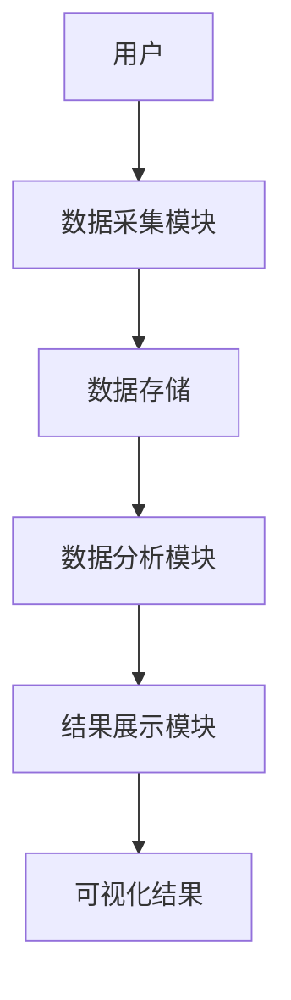

                 


---

# 设计智能化的企业财务报表同行业动态对比分析系统

---

## 关键词：企业财务报表、智能化分析、行业对比、动态分析、系统设计、人工智能

---

## 摘要：

本文系统地探讨了设计智能化的企业财务报表同行业动态对比分析系统的各个方面。首先，我们分析了企业财务报表分析的现状与挑战，提出了智能化分析的必要性。接着，详细阐述了系统的核心概念与技术原理，包括数据预处理、特征提取、聚类分析和回归预测等算法。然后，我们设计了系统的架构，包括功能模块、系统接口和交互流程。最后，通过实际案例展示了系统的实现与应用，并总结了最佳实践与注意事项。

---

# 第1章: 问题背景与分析框架

## 1.1 问题背景

### 1.1.1 企业财务报表分析的现状与挑战

- **现状**：企业财务报表分析是企业管理中的重要环节，传统方法依赖人工分析，效率低且易出错。
- **挑战**：数据量大、维度多、动态变化快，难以实时捕捉行业趋势。

### 1.1.2 问题描述

- **核心问题**：如何利用智能化方法，实现对企业财务报表的同行业动态对比分析。
- **关键目标**：提高分析效率、准确性，挖掘潜在趋势和异常。

### 1.1.3 系统目标与边界

- **目标**：构建一个智能化的财务报表分析系统，支持同行业动态对比。
- **边界**：限定于企业财务报表分析，不涉及其他业务模块。

---

## 1.2 财务报表分析框架

### 1.2.1 财务报表的核心要素

- **收入、利润、成本**：财务报表的三大核心指标。
- **资产、负债、所有者权益**：资产负债表的核心内容。

### 1.2.2 同行业对比分析的维度

- **盈利能力**：净利润率、ROE等。
- **运营能力**：应收账款周转率、存货周转率等。
- **偿债能力**：资产负债率、流动比率等。

### 1.2.3 动态分析的关键指标

- **趋势分析**：年复合增长率、环比增长率。
- **行业基准**：行业平均值、行业趋势。

---

## 1.3 数据采集与处理

### 1.3.1 数据来源与采集方式

- **企业财报数据**：上市公司财报、行业数据报告。
- **数据采集工具**：网络爬虫、API接口。

### 1.3.2 数据清洗与预处理

- **数据清洗**：去除重复、缺失值处理。
- **数据标准化**：统一单位、格式。

### 1.3.3 数据特征提取

- **数值型特征**：收入、利润等。
- **类别型特征**：行业、地区等。
- **时间序列特征**：季度、年度趋势。

---

# 第2章: 核心概念与技术原理

## 2.1 智能化分析的核心概念

### 2.1.1 数据驱动的特征

- **数据量**：海量数据支持。
- **实时性**：动态数据更新。

### 2.1.2 智能算法的核心优势

- **自动化**：算法自动处理数据。
- **高精度**：机器学习提升准确性。

### 2.1.3 人机协同的工作模式

- **分工协作**：人处理策略，机处理数据。
- **反馈优化**：模型迭代优化。

---

## 2.2 核心概念对比表

### 2.2.1 传统分析与智能化分析对比

| 对比维度 | 传统分析 | 智能化分析 |
|----------|----------|------------|
| 效率     | 低       | 高          |
| 准确性   | 一般     | 高          |
| 可扩展性 | 低       | 高          |

### 2.2.2 同行业静态对比与动态对比的差异

| 对比维度 | 静态对比 | 动态对比 |
|----------|----------|----------|
| 时间维度 | 单一时点 | 多时间点 |
| 分析深度 | 浅       | 深       |

---

## 2.3 实体关系图（ER图）

```mermaid
erd
    title 实体关系图
    企业
    财务报表
    财务指标
    行业
    时间
    企业与财务报表: 1..n
    财务报表与财务指标: 1..n
    财务指标与行业: 1..n
    财务指标与时间: 1..n
```

---

# 第3章: 算法原理与数学模型

## 3.1 数据预处理与特征提取

### 3.1.1 数据清洗与标准化

- **数据清洗**：去除异常值、填补缺失值。
- **标准化**：归一化处理。

### 3.1.2 特征选择与降维

- **特征选择**：基于重要性排序。
- **降维**：主成分分析（PCA）。

---

## 3.2 对比分析算法

### 3.2.1 基于聚类的行业分组

- **聚类算法**：K-means、层次聚类。
- **行业分组**：根据财务指标相似性分组。

### 3.2.2 基于回归的动态趋势预测

- **线性回归**：预测未来趋势。
- **模型训练**：使用历史数据训练。

---

## 3.3 数学模型与公式

### 3.3.1 财务指标计算公式

$$ 利润率 = \frac{\text{净利润}}{\text{营业收入}} $$

### 3.3.2 行业基准计算模型

$$ \text{行业基准} = \frac{\sum_{i=1}^{n} \text{行业指标}_i}{n} $$

### 3.3.3 动态趋势预测公式

$$ y_{t} = a + bt $$

---

# 第4章: 系统分析与架构设计

## 4.1 功能模块设计

### 4.1.1 数据采集模块

- **功能**：采集企业财务报表数据。
- **输入**：API接口、文件。
- **输出**：清洗后的数据。

### 4.1.2 数据分析模块

- **功能**：进行行业对比分析。
- **输入**：标准化数据。
- **输出**：分析结果。

### 4.1.3 结果展示模块

- **功能**：可视化分析结果。
- **输入**：分析数据。
- **输出**：图表、报告。

---

## 4.2 系统架构设计



---

# 作者：AI天才研究院 & 禅与计算机程序设计艺术

