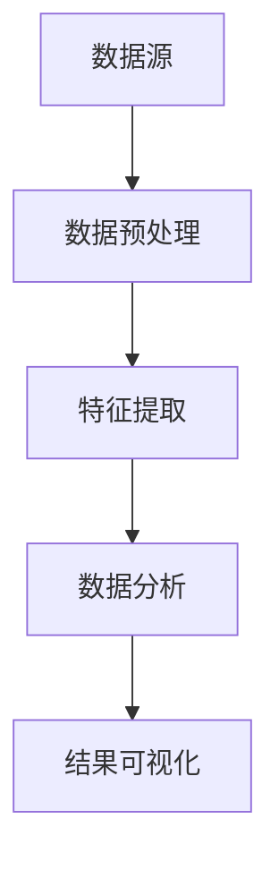
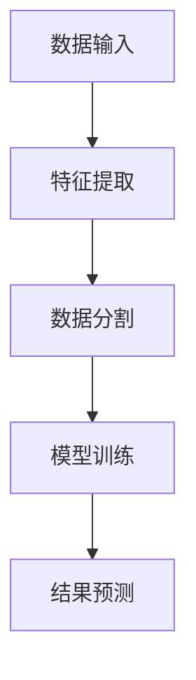
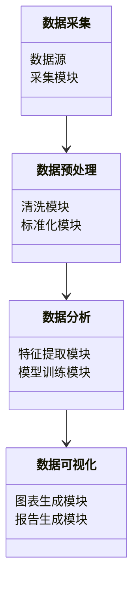
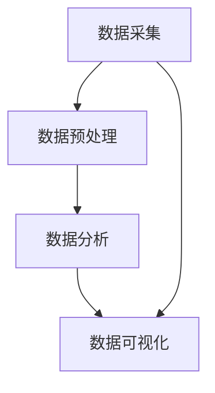
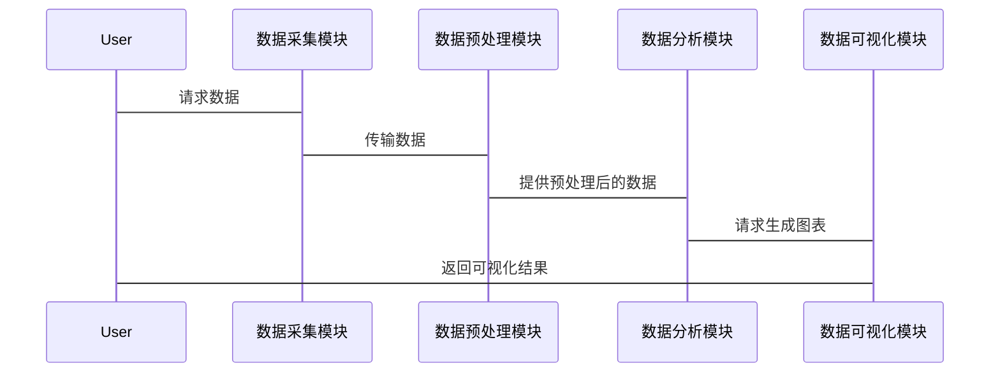

                 


# 设计智能化的企业财务报表同行业对比分析系统

## 关键词：企业财务报表，智能化分析，同行业对比，数据预处理，特征提取，数据分析，数据可视化

## 摘要：本文将详细探讨如何设计一个智能化的企业财务报表同行业对比分析系统。通过对传统财务报表分析的局限性进行分析，提出智能化的解决方案，涵盖数据预处理、特征提取、数据分析与挖掘、数据可视化等关键步骤。结合机器学习和深度学习算法，构建数学模型，设计系统架构，并通过实际案例展示系统实现与应用。最后，总结最佳实践经验和未来发展方向。

---

# 第1章: 问题背景与描述

## 1.1 问题背景

### 1.1.1 传统财务报表分析的局限性
传统财务报表分析依赖人工操作，存在效率低、主观性强、难以横向对比等问题。

### 1.1.2 企业间财务数据对比的重要性
企业间财务数据对比能够揭示行业趋势、竞争优势和潜在风险，对战略决策至关重要。

### 1.1.3 智能化分析的需求驱动
随着数据量的爆炸式增长和人工智能技术的成熟，智能化财务分析成为必然趋势。

## 1.2 问题描述

### 1.2.1 财务数据结构化处理的挑战
非结构化数据难以直接用于分析，需要复杂的预处理步骤。

### 1.2.2 同行业对比分析的复杂性
不同企业财务指标的差异性大，对比分析需要考虑多种因素。

### 1.2.3 系统化解决方案的必要性
需要一个系统化的方法来自动完成数据处理、分析和可视化。

## 1.3 问题解决思路

### 1.3.1 数据采集与预处理
从多种数据源获取财务数据，进行清洗、标准化和归一化处理。

### 1.3.2 数据分析与建模
利用机器学习和深度学习算法，构建预测模型，提取行业特征。

### 1.3.3 结果可视化与报告生成
将分析结果以可视化形式呈现，并自动生成报告。

## 1.4 边界与外延

### 1.4.1 系统功能边界
系统仅处理结构化数据，不涉及非财务数据。

### 1.4.2 数据范围的外延
主要针对公开的财务报表数据，不涉及内部机密数据。

### 1.4.3 应用场景的限制
适用于企业间的横向对比分析，不支持实时数据分析。

## 1.5 概念结构与核心要素

### 1.5.1 核心概念的层次结构
从基础概念到系统架构，构建完整的概念体系。

### 1.5.2 核心要素的定义与关系
数据源、算法、模型、可视化工具之间的关系。

### 1.5.3 系统架构的核心要素
数据层、算法层、结果层的构成与相互作用。

---

# 第2章: 核心概念与联系

## 2.1 智能化企业财务报表分析

### 2.1.1 智能化分析的核心原理
利用人工智能技术，自动化处理和分析财务数据。

### 2.1.2 数据预处理的关键步骤
数据清洗、标准化、归一化处理。

### 2.1.3 特征提取的策略与方法
选择关键财务指标，提取特征向量。

## 2.2 同行业对比分析

### 2.2.1 同行业对比的核心指标
净利润率、毛利率、资产负债率等关键财务指标。

### 2.2.2 数据分析与挖掘的关键技术
聚类分析、回归分析、分类分析等。

### 2.2.3 数据可视化的实现方式
柱状图、折线图、热力图等可视化方法。

## 2.3 核心概念对比分析

### 2.3.1 概念属性特征对比表
| 概念       | 属性特征               |
|------------|-----------------------|
| 数据预处理 | 数据清洗、标准化、归一化 |
| 特征提取   | 选择关键指标、降维    |

### 2.3.2 实体关系图
使用mermaid展示实体关系。



---

# 第3章: 算法原理讲解

## 3.1 机器学习算法

### 3.1.1 线性回归
用于预测连续型变量，模型公式为：
$$ y = \beta_0 + \beta_1x + \epsilon $$

### 3.1.2 决策树
用于分类和回归，基于特征重要性进行分割。

### 3.1.3 随机森林
通过集成多个决策树提升准确性和稳定性。

## 3.2 深度学习算法

### 3.2.1 神经网络
构建多层神经网络，用于复杂的非线性关系建模。

### 3.2.2 支持向量机
通过核函数将数据映射到高维空间，进行分类和回归。

## 3.3 算法实现流程

### 3.3.1 算法流程图
使用mermaid展示算法流程。



### 3.3.2 Python代码实现

```python
import numpy as np
from sklearn.linear_model import LinearRegression

# 示例数据
X = np.array([[1], [2], [3], [4]])
y = np.array([2, 4, 6, 8])

# 创建模型
model = LinearRegression()
model.fit(X, y)

# 预测
print(model.predict([[5]]))  # 输出：[[10]]
```

## 3.4 数学模型与公式

### 3.4.1 线性回归模型
$$ \hat{y} = \beta_0 + \beta_1x $$

### 3.4.2 支持向量机模型
$$ \text{maximize} \quad \frac{1}{2}\|w\|^2 $$
$$ \text{subject to} \quad y_i(w \cdot x_i + b) \geq 1 $$

---

# 第4章: 系统分析与架构设计

## 4.1 问题场景介绍

### 4.1.1 数据获取
从公开数据库获取企业财务报表数据。

### 4.1.2 数据预处理
清洗数据，处理缺失值和异常值。

### 4.1.3 数据分析
应用机器学习算法进行行业对比分析。

### 4.1.4 结果可视化
生成图表和报告，辅助决策。

## 4.2 系统功能设计

### 4.2.1 领域模型
使用mermaid展示领域模型。



### 4.2.2 系统架构设计
使用mermaid展示系统架构图。



### 4.2.3 接口设计
定义RESTful API接口，实现数据传输和功能调用。

### 4.2.4 交互流程图
使用mermaid展示系统交互流程。



---

# 第5章: 项目实战

## 5.1 环境安装

### 5.1.1 安装Python
安装Python 3.8及以上版本。

### 5.1.2 安装依赖库
安装numpy、pandas、scikit-learn等库。

## 5.2 核心代码实现

### 5.2.1 数据预处理代码

```python
import pandas as pd

# 加载数据
df = pd.read_csv('financial_data.csv')

# 处理缺失值
df.dropna(inplace=True)

# 标准化处理
from sklearn.preprocessing import StandardScaler
scaler = StandardScaler()
df_scaled = pd.DataFrame(scaler.fit_transform(df), columns=df.columns)
```

### 5.2.2 模型训练代码

```python
from sklearn.tree import DecisionTreeRegressor

# 特征选择
X = df_scaled[[' revenue', 'net_income']]
y = df_scaled['net_profit_margin']

# 训练模型
model = DecisionTreeRegressor()
model.fit(X, y)

# 预测
print(model.predict([[1000000, 100000]]))  # 示例预测
```

## 5.3 实际案例分析

### 5.3.1 数据来源
使用公开的企业财务报表数据进行分析。

### 5.3.2 数据分析与解读
通过模型预测行业趋势，分析企业的竞争优势。

## 5.4 项目小结

### 5.4.1 系统实现总结
详细总结系统实现的关键步骤和注意事项。

### 5.4.2 实际应用中的经验
分享在实际应用中遇到的问题及解决方案。

---

# 第6章: 最佳实践与总结

## 6.1 小结

### 6.1.1 核心内容回顾
总结文章的核心内容和主要观点。

### 6.1.2 关键技术总结
归纳系统设计与实现的关键技术。

## 6.2 注意事项

### 6.2.1 数据处理中的注意事项
强调数据清洗和特征选择的重要性。

### 6.2.2 模型选择中的注意事项
根据具体场景选择合适的算法。

### 6.2.3 系统设计中的注意事项
注重系统的可扩展性和可维护性。

## 6.3 拓展阅读

### 6.3.1 推荐书籍
推荐相关领域的优秀书籍和技术资料。

### 6.3.2 推荐博客与技术文章
推荐深入探讨相关主题的技术博客和文章。

---

# 作者：AI天才研究院/AI Genius Institute & 禅与计算机程序设计艺术 /Zen And The Art of Computer Programming

---

感谢您的耐心阅读，希望这篇文章能够为您提供有价值的信息和启发！

