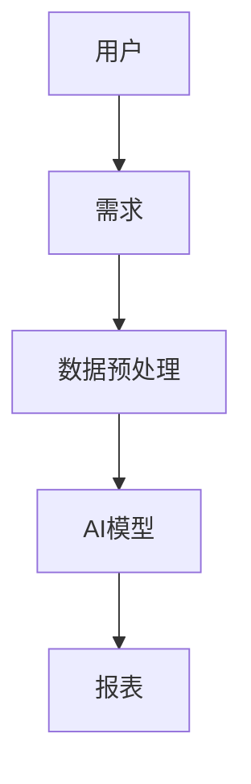
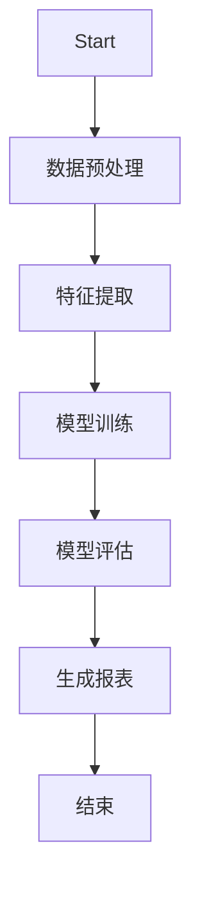
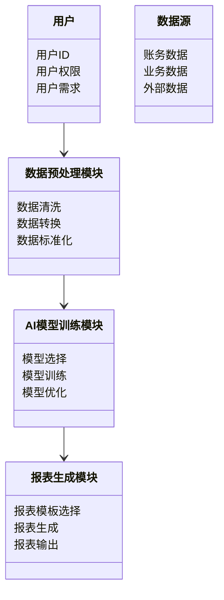
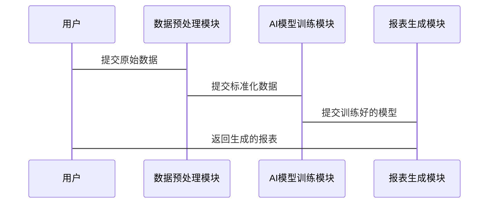

                 


# 设计智能化的企业财务报表生成系统

> 关键词：智能化，财务报表，生成系统，AI技术，数据处理，系统架构

> 摘要：随着企业对高效、精准财务报表生成需求的增加，传统的手动或半自动财务报表生成方式已无法满足现代企业的智能化需求。本文详细探讨了设计智能化企业财务报表生成系统的核心概念、算法原理、系统架构以及实际应用，通过理论与实践相结合的方式，帮助读者全面理解如何利用AI技术实现财务报表的智能化生成。

---

# 第1章: 问题背景与需求分析

## 1.1 问题背景

### 1.1.1 传统财务报表生成的痛点
- 数据输入繁琐：需要手动录入大量财务数据，容易出错且效率低下。
- 报表生成耗时：传统系统依赖人工操作，生成周期长，难以满足实时需求。
- 易错性高：手动操作容易出错，影响报表的准确性和可靠性。

### 1.1.2 企业智能化转型的需求
- 高效性：企业需要快速生成准确的财务报表，以支持决策。
- 精准性：通过AI技术提升数据处理和分析的准确性。
- 自动化：实现从数据输入到报表生成的全流程自动化，减少人工干预。

### 1.1.3 智能化财务报表生成的必要性
- 提高企业运营效率：通过自动化和智能化手段，节省时间和人力资源。
- 增强数据洞察力：利用AI技术挖掘数据背后的价值，提供更精准的财务分析。
- 适应数字化转型：满足企业对智能化系统的迫切需求。

## 1.2 问题描述

### 1.2.1 财务报表生成的流程分析
传统财务报表生成流程包括数据收集、数据处理、报表生成和输出四个主要环节。然而，这一流程依赖大量人工操作，效率低下且容易出错。

### 1.2.2 现有系统的不足
- 数据输入效率低：手动录入数据耗时长，且容易出错。
- 数据处理复杂：需要处理大量异构数据，难以实现标准化。
- 报表生成单一：传统系统生成的报表种类有限，缺乏灵活性。

### 1.2.3 智能化系统的目标与边界
智能化财务报表生成系统的目标是通过AI技术实现数据自动处理、智能分析和自动生成报表。其边界包括数据源的选择、数据预处理、模型训练和报表生成，不涉及数据的原始采集和外部系统的集成。

## 1.3 问题解决思路

### 1.3.1 智能化生成的核心思想
- 数据驱动：利用AI技术对财务数据进行深度分析，提取有用信息。
- 自动化处理：从数据预处理到报表生成实现全流程自动化。
- 智能分析：通过机器学习和深度学习模型，提升数据处理的准确性和效率。

### 1.3.2 数据驱动与AI技术的结合
- 数据预处理：清洗、转换和标准化数据，为AI模型提供高质量输入。
- AI算法应用：利用机器学习和深度学习模型，自动识别数据中的规律和模式。
- 智能决策：基于AI分析结果，生成最优的财务报表。

### 1.3.3 系统架构的设计原则
- 模块化设计：将系统划分为数据预处理、模型训练、报表生成等独立模块，便于维护和扩展。
- 高可用性：确保系统能够稳定运行，避免因单点故障导致系统崩溃。
- 扩展性：支持多种数据源和报表格式，方便未来功能的扩展。

## 1.4 本章小结
本章详细分析了智能化财务报表生成系统的背景、需求和目标，指出了传统系统存在的问题，并提出了通过AI技术实现智能化生成的解决方案。

---

# 第2章: 核心概念与系统架构

## 2.1 核心概念原理

### 2.1.1 数据源与处理流程
系统需要处理多种来源的财务数据，包括会计系统、ERP系统和外部数据库。数据预处理包括数据清洗、转换和标准化，为后续的模型训练提供高质量数据。

### 2.1.2 AI算法在报表生成中的应用
通过机器学习和深度学习算法，系统能够自动识别数据中的模式和规律，生成准确的财务报表。常用算法包括支持向量机（SVM）、随机森林（Random Forest）和卷积神经网络（CNN）。

### 2.1.3 系统功能模块划分
系统主要由数据预处理模块、AI模型训练模块、报表生成模块和用户交互模块组成。每个模块负责不同的功能，协同工作以实现智能化生成。

## 2.2 核心概念属性对比表

| 核心概念 | 输入数据 | 处理方式 | 输出结果 |
|----------|----------|----------|----------|
| 数据预处理 | 原始数据 | 清洗、转换 | 标准化数据 |
| AI模型训练 | 标准化数据 | 模型训练 | 训练好的模型 |
| 报表生成 | 用户需求 | 模型推理 | 生成报表 |

## 2.3 ER实体关系图



## 2.4 本章小结
本章详细介绍了智能化财务报表生成系统的核心概念和架构设计，通过对比表和实体关系图展示了系统的组成部分及其相互关系。

---

# 第3章: 算法原理与实现

## 3.1 算法概述

### 3.1.1 机器学习在报表生成中的应用
机器学习算法能够从历史数据中学习规律，预测未来的财务数据，帮助生成准确的财务报表。

### 3.1.2 深度学习模型的选择
深度学习模型如LSTM（长短期记忆网络）和Transformer在处理时间序列数据和复杂模式时表现优异，适合用于财务数据的分析和预测。

### 3.1.3 算法的优缺点分析
- 优点：高精度、自动化、适应性强。
- 缺点：需要大量数据训练，计算资源消耗大，模型解释性较差。

## 3.2 算法流程图



## 3.3 算法实现代码

```python
def preprocess_data(data):
    # 数据清洗与转换
    processed_data = data.dropna().astype(float)
    return processed_data

def train_model(processed_data):
    # 模型训练
    model = Sequential()
    model.add(LSTM(64, input_shape=(None, processed_data.shape[1])))
    model.add(Dense(1))
    model.compile(optimizer='adam', loss='mean_squared_error')
    model.fit(processed_data, epochs=100, batch_size=32)
    return model

def generate_report(model, user_request):
    # 模型推理与报表生成
    predicted_values = model.predict(user_request)
    report = generate_pdf_report(predicted_values)
    return report
```

## 3.4 数学模型与公式

### 3.4.1 数据预处理公式
$$\text{标准化数据} = \frac{x - \mu}{\sigma}$$

其中，$\mu$ 是数据均值，$\sigma$ 是标准差。

### 3.4.2 模型训练公式
$$\text{损失函数} = \frac{1}{n}\sum_{i=1}^{n}(y_i - \hat{y}_i)^2$$

其中，$y_i$ 是真实值，$\hat{y}_i$ 是预测值，$n$ 是样本数量。

## 3.5 本章小结
本章详细讲解了智能化财务报表生成系统的算法原理，通过流程图和代码示例展示了系统的实现过程。

---

# 第4章: 系统分析与架构设计方案

## 4.1 问题场景介绍

### 4.1.1 项目背景
随着企业数字化转型的推进，智能化财务报表生成系统的需求日益迫切。企业需要快速、准确地生成财务报表，以支持决策和业务发展。

### 4.1.2 项目介绍
本项目旨在开发一款智能化财务报表生成系统，利用AI技术实现数据自动处理和报表自动生成，提升企业的财务效率和准确性。

## 4.2 系统功能设计

### 4.2.1 领域模型


### 4.2.2 系统架构设计
```mermaid
graph TD
    用户 --> API Gateway
    API Gateway --> 数据预处理模块
    数据预处理模块 --> AI模型训练模块
    AI模型训练模块 --> 报表生成模块
    报表生成模块 --> 输出层
    输出层 --> 用户
```

## 4.3 系统接口设计

### 4.3.1 接口设计
系统主要接口包括：
- 数据预处理接口：接收原始数据，返回标准化数据。
- 模型训练接口：接收标准化数据，返回训练好的模型。
- 报表生成接口：接收用户需求，返回生成的报表。

### 4.3.2 系统交互流程图


## 4.4 本章小结
本章详细分析了智能化财务报表生成系统的功能设计和架构设计，展示了系统的整体结构和各模块之间的交互关系。

---

# 第5章: 项目实战

## 5.1 环境安装

### 5.1.1 安装Python环境
使用Anaconda安装Python 3.8以上版本，安装环境命令：`conda create -n fin_report python=3.8`

### 5.1.2 安装依赖库
安装所需的依赖库，包括Keras、TensorFlow、Pandas和Matplotlib：
```bash
pip install keras tensorflow pandas matplotlib
```

## 5.2 系统核心实现源代码

### 5.2.1 数据预处理代码
```python
import pandas as pd

def preprocess_data(data_path):
    data = pd.read_csv(data_path)
    data = data.dropna().astype(float)
    return data
```

### 5.2.2 模型训练代码
```python
from keras.models import Sequential
from keras.layers import LSTM, Dense

def train_model(processed_data):
    model = Sequential()
    model.add(LSTM(64, input_shape=(None, processed_data.shape[1])))
    model.add(Dense(1))
    model.compile(optimizer='adam', loss='mean_squared_error')
    model.fit(processed_data, epochs=100, batch_size=32)
    return model
```

### 5.2.3 报表生成代码
```python
def generate_report(model, user_request):
    predicted_values = model.predict(user_request)
    # 生成PDF报告
    report = generate_pdf_report(predicted_values)
    return report
```

## 5.3 代码应用解读与分析

### 5.3.1 数据预处理模块
- 读取CSV文件中的数据，去除缺失值，将数据转换为浮点型，为后续的模型训练提供标准化数据。

### 5.3.2 模型训练模块
- 使用LSTM网络对数据进行训练，生成能够预测财务数据的模型。
- 训练过程包括选择模型结构、设置优化器和损失函数，以及进行模型训练。

### 5.3.3 报表生成模块
- 使用训练好的模型对用户提供的数据进行预测，生成财务报表。
- 报表生成模块负责将预测结果转换为PDF格式，并返回给用户。

## 5.4 实际案例分析

### 5.4.1 案例背景
某企业需要生成年度财务报表，提供过去三年的财务数据，要求系统自动生成预测的收入和支出。

### 5.4.2 数据预处理
读取CSV文件中的数据，清洗缺失值，标准化数据。

### 5.4.3 模型训练
使用LSTM网络对标准化数据进行训练，生成预测模型。

### 5.4.4 报表生成
根据用户提供的需求，使用训练好的模型生成预测的收入和支出数据，并自动生成年度财务报表。

## 5.5 本章小结
本章通过实际案例展示了智能化财务报表生成系统的实现过程，从数据预处理到模型训练，再到报表生成，详细讲解了系统的实际应用。

---

# 第6章: 最佳实践与总结

## 6.1 最佳实践

### 6.1.1 数据处理
- 确保数据的高质量，清洗和转换数据时要仔细检查。
- 处理异构数据时，使用统一的标准进行转换，避免数据不一致。

### 6.1.2 模型选择
- 根据具体需求选择合适的模型，如时间序列数据适合使用LSTM。
- 对模型进行充分的训练和验证，避免过拟合。

### 6.1.3 系统设计
- 模块化设计便于维护和扩展。
- 系统架构要高可用，避免单点故障。

## 6.2 小结
智能化财务报表生成系统通过AI技术实现了数据的自动处理和报表的自动生成，显著提升了企业的财务效率和准确性。

## 6.3 注意事项

### 6.3.1 数据隐私
处理财务数据时，要注意数据隐私和安全，防止数据泄露。

### 6.3.2 模型解释性
在实际应用中，模型的解释性可能较差，需要通过可视化工具帮助用户理解预测结果。

### 6.3.3 系统性能
模型训练和预测需要消耗大量计算资源，建议使用云服务或高性能计算集群。

## 6.4 拓展阅读

### 6.4.1 推荐书籍
- 《深度学习》—— Ian Goodfellow
- 《机器学习实战》—— 周志华

### 6.4.2 推荐博客和资源
- TensorFlow官方文档
- Keras官方文档
- Medium上的机器学习文章

## 6.5 本章小结
本章总结了智能化财务报表生成系统的最佳实践，指出了在实际应用中需要注意的事项，并推荐了相关的学习资源。

---

# 结语

智能化财务报表生成系统通过结合AI技术和数据处理，显著提升了企业的财务效率和准确性。随着技术的不断发展，未来系统将更加智能化和自动化，为企业提供更高效、更精准的财务支持。

---

# 作者：AI天才研究院/AI Genius Institute & 禅与计算机程序设计艺术 /Zen And The Art of Computer Programming

