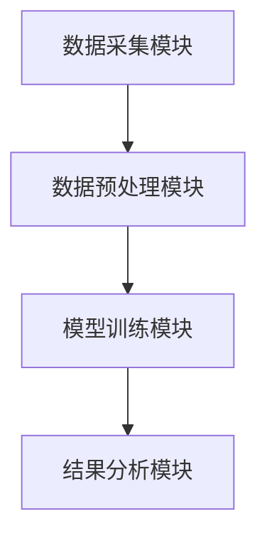

                 


# 设计智能化的企业财务报表舞弊检测系统

> 关键词：企业财务报表，舞弊检测，人工智能，机器学习，系统设计，数据挖掘

> 摘要：随着企业财务数据的日益复杂化和舞弊手段的不断升级，传统的财务报表审核方式已难以应对现代舞弊行为的挑战。本文通过结合人工智能、机器学习和大数据分析等技术，系统性地阐述了智能化企业财务报表舞弊检测系统的构建过程。文章从背景、核心概念、算法原理、系统架构设计、项目实战等多方面展开，详细分析了如何利用先进的技术手段，提升财务报表舞弊检测的效率和准确性。

---

# 第一章: 财务报表舞弊检测的背景与重要性

## 1.1 财务报表舞弊的背景与现状

### 1.1.1 财务报表舞弊的定义与表现形式
- 财务报表舞弊是指企业在财务报表中故意提供虚假信息或隐瞒重要信息的行为。
- 表现形式包括虚增收入、隐瞒负债、虚构资产、调节利润等。

### 1.1.2 当前财务报表舞弊的主要手段
- 通过虚增收入：例如，提前确认收入或虚列销售。
- 通过隐瞒负债：例如，隐藏应付账款或或有负债。
- 通过虚构资产：例如，虚增固定资产或无形资产。
- 通过调节利润：例如，通过关联交易转移利润或调节期间费用。

### 1.1.3 财务报表舞弊对企业的影响
- 损害企业声誉：财务舞弊可能导致企业失去投资者信任。
- 影响决策：财务数据不实会影响企业管理层的决策。
- 法律风险：舞弊行为可能导致企业面临法律诉讼和罚款。

## 1.2 智能化舞弊检测的必要性

### 1.2.1 传统财务报表审核的局限性
- 传统审核方式依赖人工经验，效率低且容易遗漏。
- 人工审核难以发现隐藏的舞弊行为，尤其是在数据量大的情况下。

### 1.2.2 人工智能在财务舞弊检测中的优势
- 数据处理能力强：人工智能能够快速处理大量财务数据，发现隐藏的规律。
- 自动化学习能力：通过机器学习模型，系统可以不断优化检测算法。
- 高准确性：基于大数据分析的模型能够提高舞弊检测的准确性。

### 1.2.3 智能化检测系统的应用场景
- 跨年结转调整：识别跨年结转中的异常数据。
- 财务造假识别：发现财务数据中的虚假信息。
- 关联交易监控：识别企业与关联方之间的异常交易。

## 1.3 本章小结

### 1.3.1 财务报表舞弊检测的核心问题
- 如何准确识别财务数据中的异常信息。
- 如何提高舞弊检测的效率和准确性。

### 1.3.2 智能化检测系统的建设目标
- 建立高效的舞弊检测系统，实现自动化、智能化的财务数据审核。
- 提高企业财务数据的透明度和可信度。

### 1.3.3 系统设计的基本思路
- 基于机器学习的财务数据特征分析。
- 结构化与非结构化数据的融合分析。
- 多维度数据关联分析，发现隐藏的舞弊行为。

---

# 第二章: 智能化财务报表舞弊检测系统的核心概念与联系

## 2.1 机器学习与深度学习技术

### 2.1.1 机器学习的基本原理
- 机器学习是一种通过数据训练模型，使其能够从数据中学习规律的技术。
- 监督学习：根据已标注的数据训练模型，用于分类或回归任务。
- 无监督学习：通过数据聚类发现潜在的结构。
- 强化学习：通过奖励机制优化决策过程。

### 2.1.2 深度学习的核心特点
- 深度学习通过多层神经网络模型，能够自动提取数据的高层次特征。
- 常见的深度学习模型包括卷积神经网络（CNN）、循环神经网络（RNN）等。
- 深度学习在处理非结构化数据（如文本、图像）方面具有优势。

### 2.1.3 机器学习与深度学习在财务舞弊检测中的应用
- 监督学习用于分类财务数据中的正常与异常交易。
- 无监督学习用于发现数据中的潜在异常模式。
- 深度学习用于处理复杂的财务数据关系，发现隐藏的舞弊信号。

## 2.2 财务数据特征分析

### 2.2.1 财务数据的结构化特征
- 收入、成本、利润等财务指标的波动情况。
- 财务比率分析（如资产负债率、净利润率）。
- 时间序列数据的异常变化。

### 2.2.2 非结构化数据的处理方法
- 文本数据挖掘：分析财务报告中的关键词和语义信息。
- 图像识别：识别财务单据中的文字和印章。

### 2.2.3 数据特征对舞弊检测的影响
- 异常特征：收入与成本的不匹配、毛利率异常波动等。
- 时间序列特征：季度性波动、突变点检测。

## 2.3 核心概念与联系

### 2.3.1 财务报表舞弊检测的核心要素
- 数据源：结构化数据、非结构化数据。
- 数据特征：收入、成本、利润、财务比率等。
- 舞弊模式：虚增收入、隐瞒负债等。

### 2.3.2 机器学习算法与财务数据的关联
- 支持向量机（SVM）用于分类财务数据中的异常交易。
- 随机森林（Random Forest）用于特征重要性分析。
- 神经网络（NN）用于复杂的模式识别。

### 2.3.3 系统架构与功能模块的实体关系图
- 数据层：原始数据、预处理数据、特征提取数据。
- 模型层：训练好的机器学习模型。
- 用户层：系统用户和检测结果。

---

# 第三章: 机器学习算法原理与实现

## 3.1 常见机器学习算法概述

### 3.1.1 支持向量机（SVM）
- 原理：寻找一个超平面，使得数据点被正确分类。
- 优点：对小样本数据表现良好，适合高维数据。
- 缺点：对大规模数据处理效率较低。

### 3.1.2 随机森林（Random Forest）
- 原理：通过构建多棵决策树进行投票或平均，降低模型过拟合风险。
- 优点：能够处理高维数据，适合特征重要性分析。
- 缺点：计算复杂度较高。

### 3.1.3 神经网络（NN）
- 原理：通过多层神经网络，自动提取数据特征。
- 优点：能够处理复杂的非线性关系。
- 缺点：需要大量数据和计算资源。

## 3.2 算法实现与代码示例

### 3.2.1 支持向量机（SVM）的实现
```python
from sklearn import svm
# 假设X是特征向量，y是标签
model = svm.SVC()
model.fit(X, y)
# 预测
y_pred = model.predict(X)
```

### 3.2.2 随机森林（Random Forest）的实现
```python
from sklearn.ensemble import RandomForestClassifier
model = RandomForestClassifier(n_estimators=100)
model.fit(X, y)
y_pred = model.predict(X)
```

### 3.2.3 神经网络（NN）的实现
```python
import tensorflow as tf
model = tf.keras.Sequential([
    tf.keras.layers.Dense(64, activation='relu'),
    tf.keras.layers.Dense(1, activation='sigmoid')
])
model.compile(optimizer='adam', loss='binary_crossentropy')
model.fit(X, y, epochs=10)
```

## 3.3 算法的数学模型与公式

### 3.3.1 支持向量机（SVM）
- 最大-margin 分离超平面：
$$ \text{maximize} \quad \frac{1}{2}||w||^2 $$
- 约束条件：
$$ y_i(w \cdot x_i + b) \geq 1 $$

### 3.3.2 随机森林（Random Forest）
- 随机选择特征和样本进行决策树的构建。
- 模型预测结果是各棵决策树的投票结果。

### 3.3.3 神经网络（NN）
- 网络结构：
$$ y = \sigma(w x + b) $$
- 损失函数：
$$ \text{loss} = \frac{1}{n}\sum_{i=1}^{n} (y_i - \hat{y}_i)^2 $$

---

# 第四章: 系统分析与架构设计

## 4.1 问题场景介绍

### 4.1.1 企业财务报表舞弊检测的场景
- 处理结构化和非结构化的财务数据。
- 分析历史财务数据，识别异常交易。
- 提供实时的舞弊检测预警。

### 4.1.2 系统目标
- 实现财务数据的自动采集和预处理。
- 提供多种机器学习算法的模型训练和部署。
- 提供用户友好的可视化界面，展示检测结果。

## 4.2 系统架构设计

### 4.2.1 系统功能模块
- 数据采集模块：负责采集结构化和非结构化数据。
- 数据预处理模块：清洗和特征提取。
- 模型训练模块：训练机器学习模型。
- 结果分析模块：展示检测结果，提供预警信息。

### 4.2.2 系统架构图


### 4.2.3 系统接口设计
- 数据接口：与企业财务系统对接，获取实时数据。
- 用户接口：提供可视化界面，展示检测结果。
- API接口：供其他系统调用检测服务。

## 4.3 系统实现细节

### 4.3.1 数据预处理模块
- 数据清洗：处理缺失值、异常值。
- 特征提取：从原始数据中提取有用的特征。

### 4.3.2 模型训练模块
- 选择合适的算法：根据数据特点选择SVM、随机森林或神经网络。
- 调参优化：通过交叉验证优化模型参数。

### 4.3.3 结果分析模块
- 可视化展示：用图表展示异常交易。
- 预警机制：设置阈值，超过阈值触发预警。

---

# 第五章: 项目实战

## 5.1 环境安装与配置

### 5.1.1 安装Python环境
```bash
# 使用Anaconda安装Python 3.8
conda create -n fraud_detection python=3.8
conda activate fraud_detection
```

### 5.1.2 安装依赖库
```bash
pip install numpy pandas scikit-learn tensorflow
```

## 5.2 核心实现代码

### 5.2.1 数据预处理
```python
import pandas as pd
data = pd.read_csv('fraud_data.csv')
# 删除缺失值
data.dropna(inplace=True)
# 标准化处理
from sklearn.preprocessing import StandardScaler
scaler = StandardScaler()
data_scaled = scaler.fit_transform(data)
```

### 5.2.2 模型训练与预测
```python
from sklearn.ensemble import RandomForestClassifier
model = RandomForestClassifier(n_estimators=100)
model.fit(data_scaled, labels)
y_pred = model.predict(data_scaled)
```

### 5.2.3 结果分析
```python
from sklearn.metrics import classification_report
print(classification_report(labels, y_pred))
```

## 5.3 实际案例分析

### 5.3.1 案例背景
某企业财务数据中存在虚增收入的情况，通过系统检测发现异常交易。

### 5.3.2 数据分析
- 收入与成本的匹配性分析。
- 时间序列分析，发现收入的突变点。

### 5.3.3 系统检测结果
- 模型预测结果：虚增收入交易被识别。
- 提供相关交易的详细信息，供进一步审核。

## 5.4 项目小结

### 5.4.1 项目实现的关键点
- 数据预处理的准确性。
- 模型选择与调参优化。
- 结果分析与可视化展示。

### 5.4.2 系统的优势
- 提高了舞弊检测的效率和准确性。
- 实现了数据的自动化处理和分析。

---

# 第六章: 总结与展望

## 6.1 总结

### 6.1.1 系统设计的核心思想
- 结合机器学习和大数据分析技术，实现智能化的财务舞弊检测。
- 通过系统化的数据处理和模型优化，提高检测的准确性。

### 6.1.2 系统实现的关键技术
- 数据预处理与特征提取。
- 机器学习算法的选择与优化。
- 系统架构设计与实现。

## 6.2 展望

### 6.2.1 系统的改进方向
- 引入更复杂的深度学习模型，提高检测的准确性。
- 增强系统的实时性，实现在线检测。
- 扩展系统的功能，支持更多类型的财务舞弊检测。

### 6.2.2 技术的发展趋势
- 随着AI技术的不断进步，财务舞弊检测系统将更加智能化和自动化。
- 多模态数据（文本、图像、结构化数据）的融合分析将成为未来的研究重点。

---

作者：AI天才研究院/AI Genius Institute & 禅与计算机程序设计艺术 /Zen And The Art of Computer Programming

