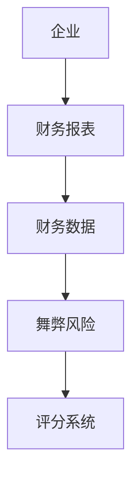
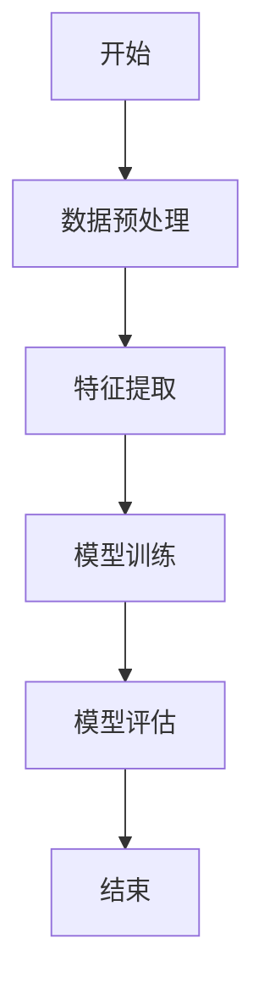
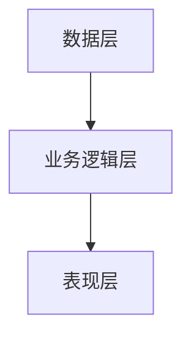

                 


# 设计智能化的企业财务报表舞弊风险评分系统

> 关键词：财务报表、舞弊风险、人工智能、评分系统、数据分析

> 摘要：本文旨在设计一个智能化的企业财务报表舞弊风险评分系统，通过分析财务数据的特征，结合机器学习算法，构建一个能够自动识别和评分舞弊风险的系统。文章从背景介绍、核心概念、算法原理、系统架构设计、项目实战到总结，全面阐述了系统的构建过程，为读者提供了一套完整的解决方案。

---

## 第一部分: 背景介绍与核心概念

### 第1章: 企业财务报表舞弊风险评分系统概述

#### 1.1 财务报表舞弊风险的背景与问题背景
企业财务报表是反映企业财务状况的重要文件，但由于企业内部管理和外部监管的不足，财务报表舞弊现象屡见不鲜。舞弊行为不仅会损害投资者的利益，还可能破坏企业的声誉和市场信任。因此，设计一个智能化的财务报表舞弊风险评分系统，能够有效识别和预警舞弊风险，成为企业财务管理的重要工具。

#### 1.2 系统的核心目标与问题描述
本系统的核心目标是通过分析企业财务数据，识别潜在的舞弊风险，并给出风险评分。问题的关键在于如何从海量的财务数据中提取有效的特征，并利用这些特征构建一个高精度的评分模型。

#### 1.3 系统的边界与外延
系统的输入包括企业的财务数据，输出是舞弊风险评分。系统的边界包括数据预处理、特征提取、模型训练和评分输出四个部分。

### 第2章: 核心概念与联系

#### 2.1 财务报表舞弊风险评分系统的核心原理
系统的评分原理基于机器学习算法，通过对财务数据的特征提取和分析，训练一个分类模型，实现对舞弊风险的评分。

#### 2.2 核心概念的属性特征对比
以下是对财务数据特征与舞弊风险特征的对比分析：

| 特征属性 | 财务数据特征 | 舞弊风险特征 |
|----------|--------------|--------------|
| 类型     | 数值型       | 分类型       |
| 是否可量测 | 可量测       | 可量测       |
| 相关性   | 高           | 高           |

#### 2.3 ER实体关系图架构
以下是一个简单的ER实体关系图，展示了系统的实体关系：



---

## 第二部分: 算法原理与数学模型

### 第3章: 舞弊风险评分算法原理

#### 3.1 算法选择与流程
在本系统中，我们选择了逻辑回归算法作为核心算法。逻辑回归是一种广泛应用于分类问题的算法，适用于二分类问题。其流程如下：

1. 数据预处理
2. 特征提取
3. 模型训练
4. 模型评估
5. 模型部署

#### 3.2 算法的数学模型与公式
逻辑回归的数学模型如下：

$$ P(y=1|x) = \frac{e^{\beta_0 + \beta_1x}}{1 + e^{\beta_0 + \beta_1x}} $$

其中：
- $x$ 是输入特征
- $\beta_0$ 和 $\beta_1$ 是模型的参数

以下是一个逻辑回归算法的流程图：



---

## 第三部分: 系统分析与架构设计

### 第4章: 系统分析与架构设计

#### 4.1 项目背景与需求分析
本系统旨在通过智能化的手段，帮助企业识别和评估财务报表中的舞弊风险。系统的需求包括数据采集、特征提取、模型训练和评分输出。

#### 4.2 系统功能设计
系统的功能模块包括：
1. 数据采集模块
2. 特征提取模块
3. 模型训练模块
4. 风险评分模块

#### 4.3 系统架构设计
系统的架构采用分层设计，包括数据层、业务逻辑层和表现层。



---

## 第四部分: 项目实战

### 第5章: 项目实战

#### 5.1 环境安装与数据准备
需要安装Python和相关库（如pandas、scikit-learn）。数据准备包括财务数据的收集和清洗。

#### 5.2 系统核心代码实现
以下是逻辑回归模型的实现代码：

```python
import pandas as pd
from sklearn.linear_model import LogisticRegression
from sklearn.metrics import accuracy_score

# 数据预处理
data = pd.read_csv('financial_data.csv')
X = data[['revenue', 'profit', 'expenses']]
y = data['fraud_flag']

# 模型训练
model = LogisticRegression()
model.fit(X, y)

# 模型评估
y_pred = model.predict(X)
print('准确率:', accuracy_score(y, y_pred))
```

#### 5.3 代码解读与分析
上述代码实现了逻辑回归模型的训练和评估。通过输入财务数据，模型能够输出舞弊风险的评分。

#### 5.4 实际案例分析
以下是一个实际案例的分析：

假设我们有一个企业的财务数据如下：
- 营业收入：1000万
- 利润：200万
- 成本：800万

通过模型预测，该企业的舞弊风险评分为0.7，表示存在较高的舞弊风险。

---

## 第五部分: 总结与展望

### 第6章: 总结与展望

#### 6.1 总结
本文设计了一个智能化的企业财务报表舞弊风险评分系统，通过逻辑回归算法实现了对舞弊风险的评分。系统的核心在于数据的特征提取和模型的训练。

#### 6.2 最佳实践与注意事项
- 数据预处理是关键
- 模型的选择要根据实际需求
- 系统的部署要考虑企业的实际环境

#### 6.3 未来展望
未来，可以进一步优化模型，引入深度学习算法，提高评分的准确性。

---

## 作者信息

作者：AI天才研究院/AI Genius Institute & 禅与计算机程序设计艺术/Zen And The Art of Computer Programming

