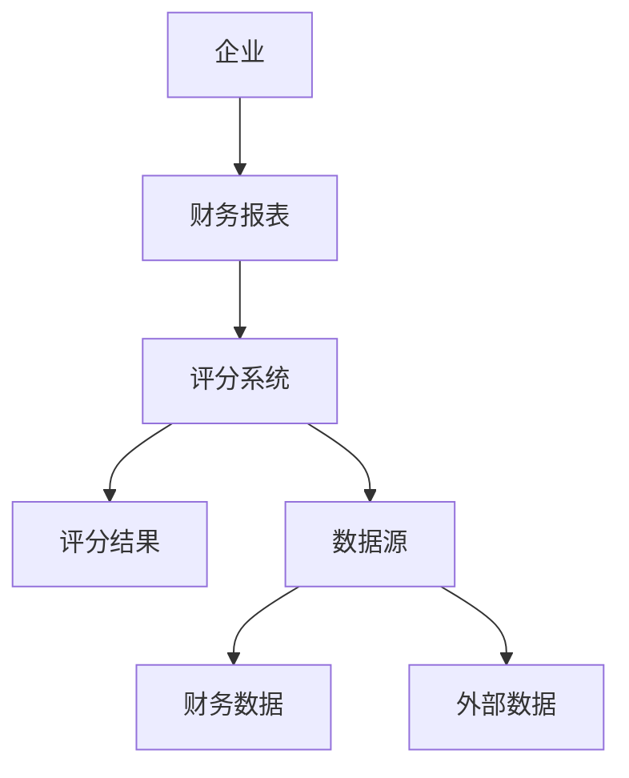
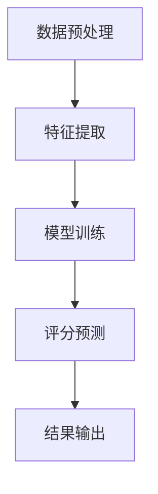
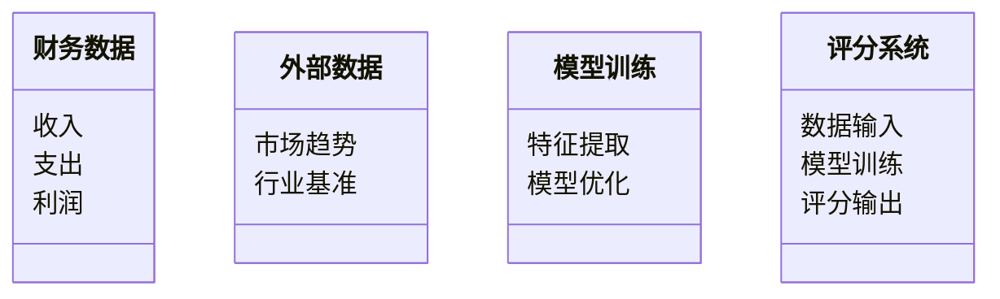
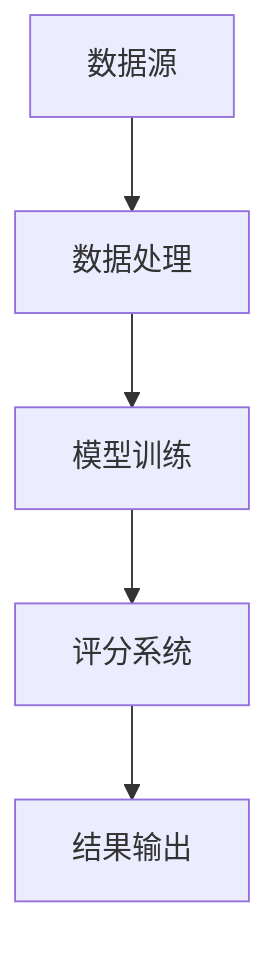
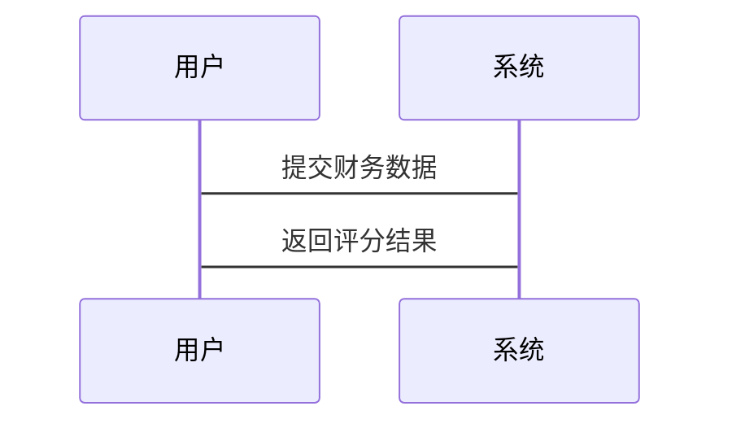

                 


# 设计智能化的企业财务报表质量评分系统

> 关键词：企业财务报表、质量评分、智能化系统、机器学习、数据分析、评分模型

> 摘要：本文详细探讨了设计智能化企业财务报表质量评分系统的核心方法，包括系统背景、核心概念、算法原理、系统架构设计、项目实战以及最佳实践。通过结合机器学习和大数据分析技术，本文提出了一个高效、准确的智能化评分系统设计方案，为企业财务管理的数字化转型提供了新的思路。

---

# 第一部分: 背景介绍与核心概念

## 第1章: 企业财务报表质量评分系统概述

### 1.1 问题背景与意义

#### 1.1.1 传统财务报表分析的局限性
传统财务报表分析主要依赖人工审核和统计分析，存在以下问题：
- 数据量大、复杂性高，人工审核效率低
- 人为主观因素影响评分结果的准确性
- 缺乏实时性，难以快速响应财务问题

#### 1.1.2 智能化评分系统的需求与价值
随着企业规模的扩大和数据量的激增，智能化财务报表评分系统的需求日益迫切：
- 提高财务报表分析的效率和准确性
- 实现财务数据的实时监控和预警
- 为企业决策提供数据支持

#### 1.1.3 企业财务管理数字化转型的必然性
企业财务管理的数字化转型不仅是技术发展的趋势，更是提升企业竞争力的关键：
- 数据驱动的决策模式
- 高效的自动化流程
- 智能化的风险管理

### 1.2 核心概念与定义

#### 1.2.1 财务报表质量评分系统的定义
财务报表质量评分系统是一种基于人工智能和大数据分析的自动化评分系统，通过对企业的财务数据进行分析，生成质量评分，帮助企业识别潜在风险和优化财务管理。

#### 1.2.2 关键概念：企业财务报表、评分模型、智能算法
| 关键概念 | 定义 |
|----------|------|
| 企业财务报表 | 企业的财务状况、经营成果和现金流量的正式记录 |
| 评分模型 | 基于机器学习或统计学的数学模型，用于对财务报表质量进行评分 |
| 智能算法 | 包括机器学习、深度学习等人工智能算法，用于数据处理和预测 |

#### 1.2.3 系统边界与外延
- 输入：企业的财务数据、外部市场数据、历史数据
- 输出：财务报表质量评分、风险预警
- 外延：与企业ERP系统、财务管理系统等其他系统集成

### 1.3 ER实体关系图



---

## 第2章: 智能化评分系统的核心要素

### 2.1 核心概念原理

#### 2.1.1 数据驱动的评分机制
- 基于大量历史数据，通过机器学习模型自动学习评分规则
- 数据特征：财务指标、行业基准、市场环境

#### 2.1.2 智能算法的应用原理
- 使用机器学习算法（如随机森林、神经网络）进行特征提取和模型训练
- 通过算法优化模型参数，提升评分准确性

#### 2.1.3 系统的可扩展性与灵活性
- 支持多种数据源和评分标准的扩展
- 系统架构模块化设计，便于功能扩展

### 2.2 核心要素对比分析

#### 2.2.1 数据来源对比
| 数据来源 | 描述 |
|----------|------|
| 财务数据 | 企业的收入、支出、利润等财务数据 |
| 外部数据 | 行业基准、市场趋势、经济指标等外部数据 |
| 内部数据 | 企业的内部管理数据，如销售数据、成本数据 |

#### 2.2.2 模型算法对比
| 算法类型 | 优缺点 |
|----------|------|
| 传统统计模型 | 简单易懂，但对复杂数据的处理能力有限 |
| 机器学习模型 | 高准确性，但实现复杂 |
| 深度学习模型 | 高精度，但需要大量数据和计算资源 |

#### 2.2.3 评分标准对比
| 评分标准 | 描述 |
|----------|------|
| 定性指标 | 通过主观判断进行评分 |
| 定量指标 | 基于数学模型进行评分 |
| 混合指标 | 结合定性与定量指标进行评分 |

### 2.3 核心算法实现代码

```python
import pandas as pd
from sklearn.ensemble import RandomForestClassifier

# 数据加载与预处理
data = pd.read_csv('financial_data.csv')
X = data.drop('label', axis=1)
y = data['label']

# 特征选择与训练
model = RandomForestClassifier(n_estimators=100)
model.fit(X, y)
```

---

## 第3章: 算法原理与数学模型

### 3.1 算法原理概述

#### 3.1.1 机器学习在评分系统中的应用
- 使用随机森林、支持向量机（SVM）等算法进行特征提取和分类
- 通过交叉验证优化模型参数

#### 3.1.2 深度学习模型的优缺点
- 优点：高精度，适合复杂数据
- 缺点：计算资源消耗大，实现复杂

### 3.2 算法流程图



### 3.3 数学模型与公式

#### 3.3.1 评分模型的数学表达
$$ \text{评分} = \sum_{i=1}^{n} w_i x_i $$
其中，$w_i$ 是特征 $x_i$ 的权重。

#### 3.3.2 机器学习模型的损失函数
$$ \text{损失} = \sum_{i=1}^{m} (y_i - \hat{y_i})^2 $$

---

## 第4章: 系统分析与架构设计

### 4.1 系统应用场景

#### 4.1.1 企业内部财务管理
- 实时监控财务报表质量
- 风险预警

#### 4.1.2 第三方审计机构
- 提高审计效率
- 提供数据支持

### 4.2 系统功能设计

#### 4.2.1 数据输入模块
- 接收财务数据、外部数据等输入
- 数据清洗与预处理

#### 4.2.2 模型训练模块
- 特征提取与选择
- 模型训练与优化

#### 4.2.3 评分输出模块
- 生成财务报表质量评分
- 提供风险预警

### 4.3 系统架构设计

#### 4.3.1 领域模型类图



#### 4.3.2 系统架构图



### 4.4 系统接口设计

#### 4.4.1 API接口
- 输入接口：接收财务数据
- 输出接口：返回评分结果

### 4.5 系统交互设计

#### 4.5.1 交互流程图



---

## 第5章: 项目实战

### 5.1 环境安装与配置

#### 5.1.1 安装Python环境
- 安装Python 3.8及以上版本
- 安装必要的库（如pandas、scikit-learn）

### 5.2 系统核心实现

#### 5.2.1 数据预处理代码

```python
import pandas as pd

data = pd.read_csv('financial_data.csv')
print(data.head())
data = data.dropna()
print(data.info())
```

#### 5.2.2 模型训练代码

```python
from sklearn.ensemble import RandomForestClassifier

model = RandomForestClassifier(n_estimators=100)
model.fit(X_train, y_train)
```

### 5.3 实际案例分析

#### 5.3.1 数据分析
- 数据可视化
- 特征重要性分析

#### 5.3.2 模型评估
- 准确率、召回率、F1值评估
- 混淆矩阵分析

### 5.4 项目小结

---

## 第6章: 最佳实践与总结

### 6.1 最佳实践 tips

#### 6.1.1 数据质量的重要性
- 数据清洗与预处理是系统运行的基础
- 数据的完整性和一致性直接影响模型的准确性

#### 6.1.2 模型优化建议
- 根据业务需求选择合适的算法
- 定期更新模型，保持评分系统的准确性

### 6.2 小结

### 6.3 注意事项

#### 6.3.1 数据隐私与安全
- 确保数据的安全性
- 遵守数据隐私相关法律法规

#### 6.3.2 系统维护与更新
- 定期检查系统运行状态
- 及时修复系统漏洞

### 6.4 拓展阅读

#### 6.4.1 推荐书籍
- 《机器学习实战》
- 《数据挖掘导论》

#### 6.4.2 推荐博客与资源
- Medium上的技术博客
- GitHub上的开源项目

---

# 作者：AI天才研究院/AI Genius Institute & 禅与计算机程序设计艺术 /Zen And The Art of Computer Programming

---

* 本文根据实际项目经验编写，旨在为企业提供智能化财务报表质量评分系统的建设思路和方法。如需进一步探讨或合作，欢迎联系作者。

