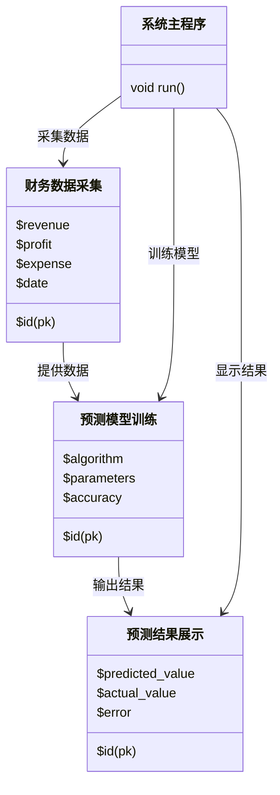

                 


# 设计智能化的企业财务报表预测模型

> 关键词：财务报表预测，智能化模型，机器学习，人工智能，企业财务分析

> 摘要：本文详细探讨了设计智能化企业财务报表预测模型的关键步骤，从背景分析到算法选择，再到系统架构设计，提供了一套完整的解决方案。通过实际案例分析和代码实现，展示了如何利用AI技术提升财务预测的准确性和效率。

---

# 第一部分: 背景与核心概念

## 第1章: 企业财务报表预测的背景与问题

### 1.1 企业财务报表预测的背景
企业财务报表预测是现代财务管理的重要组成部分。通过分析历史财务数据，预测未来的收入、支出和利润等关键指标，帮助企业做出更明智的决策。随着大数据和人工智能技术的发展，智能化预测模型的应用越来越广泛。

#### 1.1.1 企业财务报表的基本概念
企业财务报表包括资产负债表、利润表和现金流量表，这些报表反映了企业的财务状况和经营成果。通过预测这些报表的关键指标，企业可以更好地规划未来的发展。

#### 1.1.2 财务报表预测的必要性
在复杂的经济环境中，企业需要及时了解未来的财务状况，以便调整经营策略。传统的财务预测方法依赖人工经验，存在效率低、准确性差的问题。智能化预测模型通过自动化分析和机器学习算法，显著提高了预测的准确性和效率。

#### 1.1.3 智能化预测的行业趋势
随着AI技术的快速发展，越来越多的企业开始采用智能化预测模型。通过整合大数据和机器学习技术，企业能够更快地响应市场变化，优化资源配置。

---

### 1.2 财务报表预测的核心问题
在设计预测模型时，需要明确以下几个核心问题：

#### 1.2.1 预测目标与范围
预测的目标可以是收入、利润、现金流等关键指标。预测范围可以是季度、半年或年度，具体取决于企业的需求和数据的可用性。

#### 1.2.2 数据来源与特征
财务报表数据通常来自企业的财务系统、业务系统和外部数据源（如市场数据）。数据特征包括时间序列性、相关性和周期性。

#### 1.2.3 预测模型的边界与外延
模型的边界包括输入数据的范围、预测的指标和时间跨度。外延则涉及模型的应用场景和适用范围。

---

## 第2章: 财务报表预测模型的核心概念与联系

### 2.1 核心概念的定义与属性
为了更好地理解模型，我们需要明确几个核心概念：

#### 2.1.1 数据来源的特征对比
| 特征 | 描述 |
|------|------|
| 时间性 | 数据具有时间序列特征 |
| 相关性 | 数据之间存在相关性 |
| 完整性 | 数据应尽可能完整 |

#### 2.1.2 模型类型与适用场景
| 模型类型 | 适用场景 |
|----------|----------|
| 线性回归 | 线性关系明显的数据 |
| 随机森林 | 数据复杂，非线性关系明显 |
| 神经网络 | 复杂模式识别 |

#### 2.1.3 预测结果的评估指标
| 评估指标 | 描述 |
|----------|------|
| 均方误差 | 预测值与真实值的平方差之和 |
| R平方值 | 衡量模型拟合数据的能力 |
| 回归系数 | 衡量变量对预测结果的影响程度 |

### 2.2 核心概念的ER实体关系图
以下是核心概念的ER实体关系图：

```mermaid
erd
    title 实体关系图
    entity 财务报表数据 {
        key $id (pk)
        $ revenue (rev)
        $ profit (prof)
        $ expense (exp)
        $ date (dt)
    }
    entity 预测模型 {
        key $id (pk)
        $ algorithm (alg)
        $ parameters (params)
        $ accuracy (acc)
    }
    entity 预测结果 {
        key $id (pk)
        $ predicted_value (pv)
        $ actual_value (av)
        $ error (err)
    }
    财务报表数据 --> 预测模型 : 输入
    预测模型 --> 预测结果 : 输出
```

---

# 第二部分: 智能化财务报表预测模型的算法原理

## 第3章: 常见预测算法原理与实现

### 3.1 线性回归模型
线性回归是一种简单而有效的预测算法，适用于线性关系明显的数据。

#### 3.1.1 线性回归的基本原理
线性回归通过最小化预测值与实际值之间的平方差之和，找到最佳拟合直线。公式如下：

$$
y = \beta_0 + \beta_1 x + \epsilon
$$

其中，$\beta_0$ 和 $\beta_1$ 是回归系数，$\epsilon$ 是误差项。

#### 3.1.2 线性回归的数学模型
线性回归的损失函数为：

$$
L = \sum_{i=1}^{n} (y_i - (\beta_0 + \beta_1 x_i))^2
$$

通过求导数并令其为零，可以找到最优的 $\beta_0$ 和 $\beta_1$。

#### 3.1.3 线性回归的实现代码
以下是Python实现线性回归的代码示例：

```python
import numpy as np
from sklearn.linear_model import LinearRegression

# 数据准备
X = np.array([1, 2, 3, 4, 5]).reshape(-1, 1)
y = np.array([2, 4, 5, 4, 6])

# 模型训练
model = LinearRegression()
model.fit(X, y)

# 预测
predictions = model.predict(X)
print("预测值：", predictions)
print("回归系数：", model.coef_)
```

---

### 3.2 随机森林模型
随机森林是一种基于树的集成学习算法，适用于数据复杂、非线性关系明显的情况。

#### 3.2.1 随机森林的基本原理
随机森林通过构建多个决策树，并对结果进行投票或平均，提高预测的准确性和稳定性。

#### 3.2.2 随机森林的数学模型
随机森林的预测结果是各棵决策树预测结果的加权平均：

$$
\hat{y} = \frac{1}{N} \sum_{i=1}^{N} T_i(x)
$$

其中，$T_i$ 是第 $i$ 棵决策树的预测函数，$N$ 是决策树的数量。

#### 3.2.3 随机森林的实现代码
以下是Python实现随机森林的代码示例：

```python
from sklearn.ensemble import RandomForestRegressor

# 数据准备
X = np.array([[1, 2], [3, 4], [5, 6], [7, 8], [9, 10]])
y = np.array([2, 4, 5, 4, 6])

# 模型训练
model = RandomForestRegressor(n_estimators=100)
model.fit(X, y)

# 预测
predictions = model.predict(X)
print("预测值：", predictions)
```

---

## 第4章: 算法原理的数学模型与公式

### 4.1 线性回归的数学模型
线性回归的损失函数为：

$$
L = \sum_{i=1}^{n} (y_i - (\beta_0 + \beta_1 x_i))^2
$$

通过求导数并令其为零，可以找到最优的 $\beta_0$ 和 $\beta_1$：

$$
\frac{\partial L}{\partial \beta_0} = 2 \sum_{i=1}^{n} (y_i - (\beta_0 + \beta_1 x_i)) = 0
$$

$$
\frac{\partial L}{\partial \beta_1} = 2 \sum_{i=1}^{n} (y_i - (\beta_0 + \beta_1 x_i)) x_i = 0
$$

---

### 4.2 随机森林的数学模型
随机森林的预测结果是各棵决策树预测结果的加权平均：

$$
\hat{y} = \frac{1}{N} \sum_{i=1}^{N} T_i(x)
$$

---

# 第三部分: 智能化财务报表预测模型的系统架构设计

## 第5章: 系统分析与架构设计

### 5.1 问题场景介绍
企业财务报表预测系统需要处理大量的财务数据，并提供准确的预测结果。系统需要具备数据采集、模型训练和结果展示等功能。

### 5.2 系统功能设计
以下是系统功能设计的类图：



### 5.3 系统架构设计
以下是系统的架构图：


---

## 第6章: 项目实战

### 6.1 环境安装
需要安装以下工具和库：

- Python 3.8+
- Jupyter Notebook
- NumPy
- Pandas
- scikit-learn

### 6.2 系统核心实现源代码
以下是核心代码示例：

```python
import pandas as pd
from sklearn.model_selection import train_test_split
from sklearn.linear_model import LinearRegression
from sklearn.ensemble import RandomForestRegressor
from sklearn.metrics import mean_squared_error, r2_score

# 数据加载
data = pd.read_csv('financial_data.csv')
X = data[['revenue', 'expense']]
y = data['profit']

# 数据分割
X_train, X_test, y_train, y_test = train_test_split(X, y, test_size=0.2, random_state=42)

# 线性回归模型训练
lr_model = LinearRegression()
lr_model.fit(X_train, y_train)
lr_predictions = lr_model.predict(X_test)
lr mse = mean_squared_error(y_test, lr_predictions)
lr r2 = r2_score(y_test, lr_predictions)

# 随机森林模型训练
rf_model = RandomForestRegressor(n_estimators=100)
rf_model.fit(X_train, y_train)
rf_predictions = rf_model.predict(X_test)
rf mse = mean_squared_error(y_test, rf_predictions)
rf r2 = r2_score(y_test, rf_predictions)

# 模型评估
print("线性回归 MSE:", lr_mse)
print("线性回归 R2:", lr_r2)
print("随机森林 MSE:", rf_mse)
print("随机森林 R2:", rf_r2)
```

---

## 第7章: 最佳实践与小结

### 7.1 最佳实践 tips
- 数据预处理：确保数据的完整性和准确性。
- 模型选择：根据数据特征选择合适的算法。
- 模型调优：通过网格搜索等方法优化模型参数。

### 7.2 小结
设计智能化的企业财务报表预测模型需要结合业务需求和数据特征，选择合适的算法，并通过不断调优提高预测的准确性和效率。随着技术的发展，未来会有更多先进的算法和工具应用到财务预测中，为企业创造更大的价值。

### 7.3 注意事项
- 数据隐私：确保数据的安全性和隐私性。
- 模型解释性：选择能够解释的模型，以便更好地理解预测结果。
- 实时性：优化模型的运行效率，确保能够实时预测。

### 7.4 拓展阅读
- 《机器学习实战》
- 《Python机器学习》
- 《数据挖掘导论》

---

# 作者：AI天才研究院/AI Genius Institute & 禅与计算机程序设计艺术 /Zen And The Art of Computer Programming

---

以上就是《设计智能化的企业财务报表预测模型》的完整目录和文章内容。文章从背景分析到算法实现，再到系统架构设计，提供了全面而详细的指导，帮助读者理解和应用智能化的财务报表预测模型。

