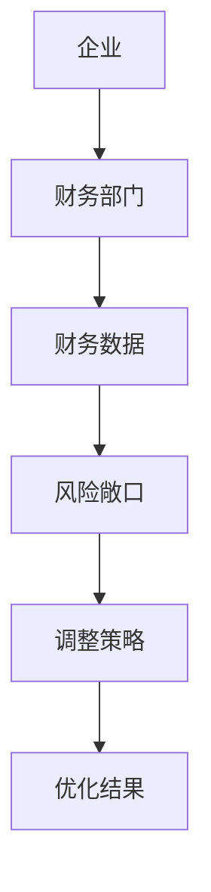
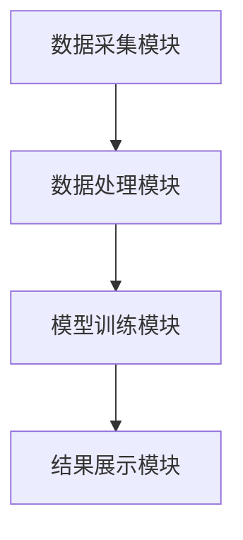

                 


# 设计智能化的企业财务风险敞口动态调整模型

---

## 关键词：企业财务风险管理、风险敞口动态调整、智能化模型、机器学习、大数据分析

---

## 摘要：  
在当前全球化和数字化的商业环境中，企业面临的财务风险日益复杂和多样化。为了有效管理和优化财务风险敞口，本文提出了一种基于智能化技术的企业财务风险敞口动态调整模型。该模型通过整合大数据分析和机器学习算法，能够实时监控和预测财务风险，动态调整风险敞口，为企业制定最优的财务策略提供支持。本文详细阐述了模型的设计思路、核心算法、系统架构以及实际应用案例，为企业的风险管理提供了新的思路和解决方案。

---

## 第1章: 企业财务风险敞口动态调整模型的背景与意义

### 1.1 财务风险敞口的基本概念

#### 1.1.1 财务风险的定义与分类
财务风险是指企业在经营过程中由于内外部因素的影响，导致财务状况出现波动或损失的可能性。常见的财务风险包括市场风险、信用风险、流动性风险等。

#### 1.1.2 风险敞口的定义与度量
风险敞口是指企业在特定市场条件下的潜在损失程度。度量风险敞口的常见指标包括VaR（Value at Risk）和CVaR（Conditional Value at Risk）。

#### 1.1.3 动态调整的必要性与重要性
由于市场环境的不断变化，静态的风险管理方法已无法满足企业的需求。动态调整风险敞口能够帮助企业及时应对市场波动，优化资产配置，降低潜在损失。

---

### 1.2 企业财务风险管理的现状与挑战

#### 1.2.1 传统财务风险管理方法的局限性
传统方法通常依赖于历史数据分析和静态模型，难以捕捉市场变化的实时动态，且缺乏智能化的支持。

#### 1.2.2 数字化转型对企业财务风险管理的影响
随着大数据和人工智能技术的发展，企业能够通过智能化工具实时监控财务数据，提高风险管理的效率和准确性。

#### 1.2.3 当前企业面临的财务风险敞口管理的主要挑战
- 数据来源多样，数据质量参差不齐。
- 风险因素复杂，难以准确预测。
- 动态调整模型的实时性和准确性要求高。

---

### 1.3 智能化动态调整模型的提出

#### 1.3.1 智能化技术在财务风险管理中的应用前景
人工智能和大数据技术为企业提供了实时监控和预测的能力，能够有效提升风险管理和决策效率。

#### 1.3.2 动态调整模型的核心思想与目标
动态调整模型旨在通过智能化算法实时分析市场和企业数据，动态优化风险敞口，降低潜在风险。

#### 1.3.3 本章小结
本章介绍了财务风险敞口的基本概念，分析了传统风险管理的局限性，并提出了智能化动态调整模型的必要性和可行性。

---

## 第2章: 财务风险敞口的特征与影响因素

### 2.1 财务风险敞口的特征

#### 2.1.1 时间维度的动态性
财务风险敞口随时间变化而变化，需要实时监控和调整。

#### 2.1.2 空间维度的多样性
不同市场、行业和企业之间的风险敞口差异显著。

#### 2.1.3 数值维度的波动性
风险敞口的数值受到多种因素影响，具有较高的波动性。

---

### 2.2 主要影响因素分析

#### 2.2.1 市场环境因素
- 经济周期波动
- 市场利率变化
- 汇率波动

#### 2.2.2 企业内部因素
- 资产负债结构
- 经营状况
- 内部管理风险

#### 2.2.3 宏观经济因素
- 宏观政策
- 通货膨胀
- 经济增长

---

### 2.3 核心概念的ER实体关系图



---

## 第3章: 财务风险敞口动态调整模型的算法原理

### 3.1 数据预处理与特征工程

#### 3.1.1 数据清洗与标准化
- 删除缺失值
- 处理异常值
- 标准化数据

#### 3.1.2 特征选择与降维
- 使用主成分分析（PCA）进行降维
- 选择对风险敞口影响最大的特征

#### 3.1.3 时间序列数据的处理
- 使用滑动窗口方法处理时间序列数据
- 考虑滞后效应（Lag）

---

### 3.2 算法选择与模型训练

#### 3.2.1 线性回归模型
线性回归模型用于预测风险敞口的变化趋势。模型的数学表达式如下：

$$ y = \beta_0 + \beta_1x_1 + \beta_2x_2 + \ldots + \beta_nx_n + \epsilon $$

其中，$y$ 是预测的风险敞口，$x_i$ 是特征变量，$\beta_i$ 是回归系数，$\epsilon$ 是误差项。

#### 3.2.2 支持向量机（SVM）
SVM用于分类问题，可以将风险敞口分为高风险和低风险两类。

#### 3.2.3 随机森林
随机森林是一种基于树的集成方法，能够处理非线性关系，适合复杂的风险敞口预测。

---

### 3.3 模型验证与优化

#### 3.3.1 交叉验证
使用K折交叉验证评估模型的泛化能力。

#### 3.3.2 超参数优化
通过网格搜索（Grid Search）优化模型参数，提高模型性能。

---

## 第4章: 财务风险敞口动态调整模型的系统架构设计

### 4.1 系统功能设计

#### 4.1.1 数据采集模块
- 从多个数据源采集财务数据
- 数据格式转换与存储

#### 4.1.2 数据处理模块
- 数据清洗与特征提取
- 数据预处理与标准化

#### 4.1.3 模型训练模块
- 算法选择与模型训练
- 模型验证与优化

#### 4.1.4 结果展示模块
- 风险敞口可视化
- 调整策略展示

---

### 4.2 系统架构设计



---

## 第5章: 财务风险敞口动态调整模型的项目实战

### 5.1 环境配置

```python
# 安装必要的库
pip install numpy
pip install pandas
pip install scikit-learn
pip install matplotlib
```

---

### 5.2 核心代码实现

#### 5.2.1 数据预处理

```python
import pandas as pd
import numpy as np

# 加载数据
data = pd.read_csv('financial_data.csv')

# 删除缺失值
data = data.dropna()

# 标准化数据
from sklearn.preprocessing import StandardScaler
scaler = StandardScaler()
scaled_data = scaler.fit_transform(data)
```

#### 5.2.2 模型训练

```python
from sklearn.ensemble import RandomForestRegressor
from sklearn.metrics import mean_squared_error

# 训练模型
model = RandomForestRegressor()
model.fit(scaled_data, target)

# 预测结果
predictions = model.predict(scaled_data)
```

---

### 5.3 实际案例分析

#### 5.3.1 案例背景
某企业面临市场波动，需要动态调整风险敞口。

#### 5.3.2 数据分析与模型预测
通过模型预测，发现市场波动将导致风险敞口增加，建议调整资产配置。

#### 5.3.3 调整策略实施
根据模型预测结果，调整投资组合，降低风险敞口。

---

## 第6章: 总结与展望

### 6.1 总结

#### 6.1.1 模型的核心优势
- 实时监控与预测
- 智能化调整策略
- 高准确性与可靠性

#### 6.1.2 实际应用价值
帮助企业优化资产配置，降低财务风险。

---

### 6.2 未来展望

#### 6.2.1 模型优化方向
- 提高模型的实时性
- 引入更多数据源
- 结合自然语言处理技术

#### 6.2.2 技术发展趋势
- 深度学习在风险管理中的应用
- 区块链技术在数据安全中的应用

---

## 作者：AI天才研究院/AI Genius Institute & 禅与计算机程序设计艺术 /Zen And The Art of Computer Programming

