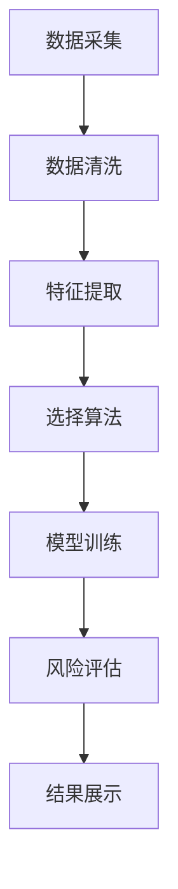
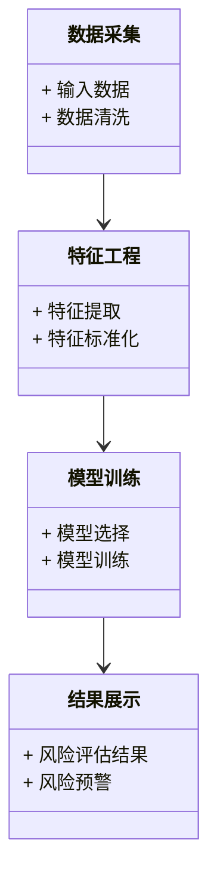
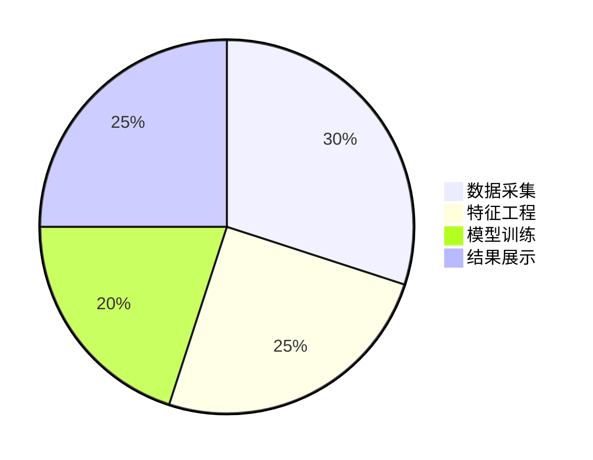

                 


# 设计智能化的企业财务风险敞口量化评估模型

> 关键词：企业财务风险管理、风险敞口量化、智能化评估、机器学习、大数据分析

> 摘要：本文详细探讨了如何设计一个智能化的企业财务风险敞口量化评估模型，结合实际应用场景，从背景分析、核心概念、算法原理到系统架构设计，逐一展开，旨在为企业财务风险管理提供一种高效、准确的解决方案。

---

# 第1章: 企业财务风险敞口量化评估的背景与问题描述

## 1.1 企业财务风险敞口的概念与定义

### 1.1.1 企业财务风险的定义

企业财务风险是指企业在经营过程中由于内外部因素的变化，导致财务状况发生不利变化的可能性。这种风险可能源于市场波动、经济环境变化、管理决策失误等多种因素。

### 1.1.2 风险敞口的定义与分类

风险敞口是企业在特定条件下可能遭受的最大潜在损失，通常以货币价值衡量。根据不同的标准，风险敞口可以分为市场风险敞口、信用风险敞口、流动性风险敞口等。

### 1.1.3 风险敞口量化评估的意义

量化评估能够将抽象的风险转化为具体的数值，帮助企业更直观地理解和管理风险。通过量化评估，企业可以制定更有效的风险管理策略，优化资本配置，降低潜在损失。

---

## 1.2 企业财务风险管理的现状与挑战

### 1.2.1 当前企业财务风险管理的主要模式

传统的财务风险管理模式通常依赖于人工分析和静态模型，难以适应快速变化的市场环境。

### 1.2.2 现有模式的局限性与痛点

- 数据处理能力有限，难以应对海量数据。
- 模型静态化，无法实时更新和调整。
- 缺乏智能化工具，难以精准预测风险。

### 1.2.3 智能化评估的需求与趋势

随着大数据和人工智能技术的发展，企业对智能化财务风险管理的需求日益增长。智能化评估能够通过机器学习算法，实时分析数据，动态调整模型，提供更精准的风险评估。

---

## 1.3 问题背景与目标

### 1.3.1 问题背景分析

企业面临复杂的内外部风险因素，传统的风险管理方法难以满足现代企业的需求。如何利用新技术提升风险管理能力，成为企业亟待解决的问题。

### 1.3.2 问题解决的目标

设计一个智能化的企业财务风险敞口量化评估模型，能够实时分析企业财务数据，量化风险敞口，提供预警和应对策略。

### 1.3.3 边界与外延

模型主要用于评估企业财务风险，边界包括企业内部财务数据和外部市场数据。外延则不包括企业战略决策或其他类型的金融风险。

---

## 1.4 核心概念与组成要素

### 1.4.1 核心概念的结构

智能化评估模型包括数据采集、特征工程、模型训练、结果展示四个主要部分。

### 1.4.2 组成要素的分析

- 数据采集：收集企业的财务数据和市场数据。
- 特征工程：对数据进行清洗、特征提取和标准化。
- 模型训练：使用机器学习算法训练风险评估模型。
- 结果展示：将评估结果可视化，提供预警和建议。

### 1.4.3 概念之间的关系

各组成部分相互关联，形成一个完整的评估系统。数据是基础，特征工程是关键，模型训练是核心，结果展示是输出。

---

# 第2章: 核心概念与联系

## 2.1 模型的核心概念原理

### 2.1.1 风险敞口的量化方法

通过机器学习算法，将财务数据映射到风险敞口的数值范围。

### 2.1.2 智能化评估的关键技术

- 数据挖掘技术
- 机器学习算法
- 自然语言处理

### 2.1.3 核心概念的数学表达

风险敞口量化公式：$$\text{风险敞口} = f(\text{财务数据}, \text{市场数据})$$

---

## 2.2 核心概念属性特征对比

### 2.2.1 各个核心概念的属性分析

| 核心概念 | 属性 | 描述 |
|----------|------|------|
| 数据采集 | 数据来源 | 内部财务数据、外部市场数据 |
| 特征工程 | 特征提取 | 提取关键财务指标 |
| 模型训练 | 算法选择 | 选择合适的机器学习算法 |

### 2.2.2 属性特征对比表格

| 属性 | 数据采集 | 特征工程 | 模型训练 |
|------|----------|----------|----------|
| 优势 | 数据全面性 | 特征提取准确性 | 模型预测准确性 |
| 局限性 | 数据获取成本高 | 特征提取复杂性 | 模型训练时间长 |

---

## 2.3 ER实体关系图架构

```mermaid
erd
    企业
    员工
    财务数据
    市场数据
    风险评估结果

    企业 --|{m:1} 员工
    企业 --|{n:1} 财务数据
    企业 --|{n:1} 市场数据
    财务数据 --> 风险评估结果
    市场数据 --> 风险评估结果
```

---

# 第3章: 算法原理讲解

## 3.1 算法原理概述

### 3.1.1 算法的基本原理

使用随机森林算法进行风险评估，通过特征工程提取关键指标，训练模型进行预测。

### 3.1.2 算法的输入与输出

- 输入：财务数据和市场数据。
- 输出：风险敞口的量化值和风险等级。

---

## 3.2 算法流程图



---

## 3.3 算法的数学模型与公式

### 3.3.1 数学模型的建立

随机森林模型公式：$$\text{风险预测} = \sum_{i=1}^{n} \text{特征权重}_i \times \text{特征值}_i$$

### 3.3.2 公式的详细推导

随机森林通过集成多个决策树模型，提高预测准确性。每个决策树的预测结果取平均值作为最终结果。

---

## 3.4 算法实现的Python源代码

```python
import pandas as pd
from sklearn.ensemble import RandomForestRegressor

# 数据加载与预处理
data = pd.read_csv('financial_data.csv')
X = data.drop(columns=['risk敞口'])
y = data['风险敞口']

# 模型训练
model = RandomForestRegressor(n_estimators=100)
model.fit(X, y)

# 预测与评估
预测值 = model.predict(X)
print('预测值:', 预测值)
```

---

# 第4章: 系统分析与架构设计方案

## 4.1 问题场景介绍

### 4.1.1 问题背景

企业需要实时监控财务风险，及时发现潜在问题。

### 4.1.2 问题分析

现有系统无法实时更新，难以应对快速变化的市场环境。

### 4.1.3 解决方案概述

设计一个智能化的实时监控系统，利用大数据和机器学习技术，动态评估风险敞口。

---

## 4.2 系统功能设计

### 4.2.1 领域模型设计（Mermaid类图）



---

## 4.3 系统架构设计

### 4.3.1 系统架构图（Mermaid架构图）



---

## 4.4 系统接口设计

### 4.4.1 数据接口

- 数据输入接口：接收企业财务数据和市场数据。
- 数据输出接口：输出风险评估结果。

---

## 4.5 系统交互设计

### 4.5.1 交互流程分析

用户输入数据，系统进行处理和分析，输出评估结果，提供预警和建议。

---

# 第5章: 项目实战

## 5.1 环境安装

- 安装Python和必要的库：`pandas`, `numpy`, `scikit-learn`。

## 5.2 核心代码实现

```python
import pandas as pd
from sklearn.ensemble import RandomForestRegressor

# 数据加载
data = pd.read_csv('financial_data.csv')

# 特征工程
X = data.drop(columns=['风险敞口'])
y = data['风险敞口']

# 模型训练
model = RandomForestRegressor(n_estimators=100)
model.fit(X, y)

# 预测与评估
预测值 = model.predict(X)
print('预测值:', 预测值)
```

---

## 5.3 实际案例分析

通过实际企业数据，展示模型的预测结果和风险预警。

---

# 第6章: 总结与展望

## 6.1 最佳实践 tips

- 数据预处理是关键，确保数据质量。
- 选择合适的算法，优化模型性能。
- 定期更新模型，适应市场变化。

## 6.2 小结

本文详细介绍了智能化的企业财务风险敞口量化评估模型的设计与实现，通过理论分析和实际案例，展示了模型的应用价值。

## 6.3 注意事项

- 数据隐私保护
- 模型的实时更新
- 系统的稳定性

## 6.4 拓展阅读

推荐阅读相关领域的书籍和论文，深入学习机器学习和风险管理的知识。

---

# 作者

作者：AI天才研究院/AI Genius Institute & 禅与计算机程序设计艺术 /Zen And The Art of Computer Programming

---

以上是一个完整的技术博客文章的目录大纲和部分内容，希望对您有所帮助！

