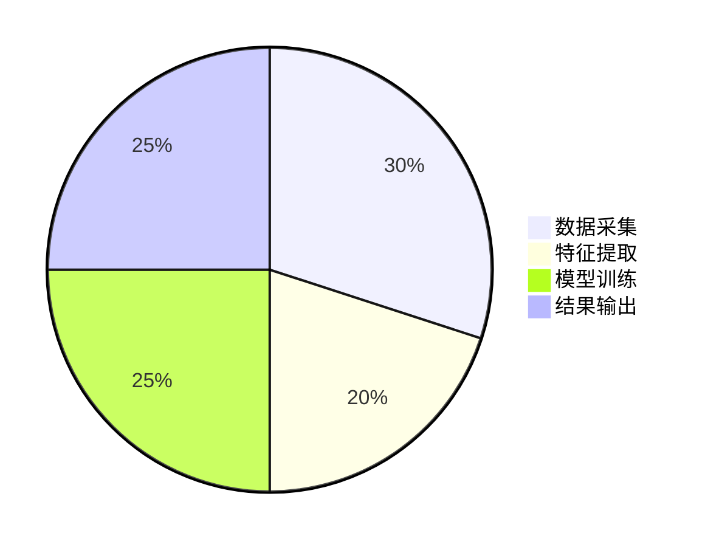

                 


# 《设计智能化的企业财务风险量化评估模型》

> **关键词**：财务风险管理、智能化模型、机器学习、深度学习、风险量化评估

> **摘要**：本文旨在探讨如何设计智能化的企业财务风险量化评估模型。通过分析传统方法的局限性，结合现代机器学习和深度学习技术，构建一个高效、准确的智能化模型，以帮助企业更好地识别和量化财务风险，支持决策制定。文章详细介绍了模型的构建过程，包括核心概念、算法原理、系统架构设计和实际应用案例。

---

## 第一章: 企业财务风险管理的现状与挑战

### 1.1 传统财务风险管理的局限性

传统财务风险管理主要依赖于人工分析和简单的统计方法。这种方法在一定程度上能够帮助企业识别潜在风险，但存在以下问题：

- **数据处理能力有限**：传统方法难以处理大规模、多维度的财务数据，尤其是在数据量急剧增加的今天。
- **主观性较强**：依赖人工判断，容易受到人为因素的影响，导致评估结果不够准确。
- **缺乏实时性**：传统方法通常需要定期进行，无法实时监控财务风险的变化。

### 1.2 财务风险量化评估的必要性

随着全球经济的复杂化和不确定性的增加，企业需要更加精确和及时的财务风险管理工具。财务风险量化评估能够帮助企业：

- **量化风险程度**：通过数学模型将财务风险转化为具体的数值，便于企业理解和管理。
- **支持决策制定**：提供数据支持，帮助企业做出更科学的财务决策。
- **提高效率**：通过自动化处理，减少人工干预，提高风险管理的效率。

### 1.3 智能化财务风险评估的目标与意义

智能化财务风险量化评估的目标是构建一个能够自动学习、适应数据变化的模型，实现对财务风险的实时监控和预测。其意义在于：

- **提升风险管理能力**：通过智能化模型，企业能够更准确地识别和量化风险。
- **优化资源配置**：基于模型的分析结果，企业可以更好地分配资源，降低风险敞口。
- **推动数字化转型**：智能化模型是企业数字化转型的重要组成部分，能够提升企业的整体竞争力。

---

## 第二章: 财务风险量化评估模型的核心概念与联系

### 2.1 财务风险量化评估模型的定义与基本框架

财务风险量化评估模型是一种基于数据驱动的方法，通过收集和分析企业的财务数据，利用机器学习等技术，量化企业的财务风险程度。其基本框架包括数据采集、特征提取、模型训练和结果输出四个阶段。

### 2.2 模型的核心要素与关系

模型的核心要素包括：

- **财务数据**：企业的财务报表数据，包括收入、利润、负债等。
- **风险因子**：影响财务风险的因素，如市场波动、行业趋势等。
- **评估指标**：量化风险程度的指标，如违约概率、风险价值等。

这些要素之间的关系可以通过ER图（实体关系图）表示，展示数据之间的关联性。

```mermaid
erDiagram
    customer[客户] {
        code : string
        name : string
        risk_score : integer
    }
    transaction[交易] {
        id : integer
        amount : float
        date : date
    }
    risk_factor[风险因子] {
        id : integer
        factor_name : string
        value : float
    }
    customer -->
    transaction : "进行"
    customer -->
    risk_factor : "受"
```

### 2.3 模型的构建方法与流程

模型构建的流程包括数据预处理、特征工程、模型训练和模型评估。数据预处理是确保数据质量和一致性的关键步骤，特征工程是提取有价值的信息，模型训练是利用机器学习算法进行风险预测，模型评估是验证模型的准确性和稳定性。

---

## 第三章: 智能化财务风险评估模型的算法原理

### 3.1 机器学习算法在风险评估中的应用

机器学习算法在风险评估中的应用主要体现在特征选择和模型训练两个方面。常用的算法包括逻辑回归、随机森林和梯度提升树（如XGBoost）。

#### 3.1.1 逻辑回归

逻辑回归是一种常用的分类算法，适用于二分类问题。其核心思想是通过Logit函数将线性回归的结果映射到概率空间。

$$ P(y=1|x) = \frac{1}{1 + e^{-\beta x}} $$

#### 3.1.2 随机森林

随机森林是一种基于决策树的集成算法，通过构建多个决策树并取其平均，提高模型的准确性和鲁棒性。

### 3.2 深度学习算法在风险评估中的应用

深度学习算法在处理非结构化数据和复杂模式识别方面具有优势，常用算法包括神经网络和LSTM。

#### 3.2.1 LSTM网络

LSTM（长短期记忆网络）适用于时间序列数据，能够有效捕捉数据中的时间依赖性。

$$ f(t) = \sigma(W_f x_t + U_f h_{t-1} + b_f) $$
$$ i(t) = \sigma(W_i x_t + U_i h_{t-1} + b_i) $$
$$ o(t) = \sigma(W_o x_t + U_o h_{t-1} + b_o) $$
$$ c(t) = f(t) \cdot c_{t-1} + i(t) \cdot g(x_t, h_{t-1}) $$
$$ h(t) = o(t) \cdot c(t) $$

---

## 第四章: 数学模型与公式推导

### 4.1 线性回归模型

线性回归是一种简单但有效的回归算法，适用于线性关系的预测。

$$ y = \beta_0 + \beta_1 x_1 + \beta_2 x_2 + \ldots + \beta_n x_n + \epsilon $$

### 4.2 随机森林模型

随机森林是一种基于决策树的集成算法，通过随机采样和特征选择，提高模型的泛化能力。

---

## 第五章: 系统分析与架构设计

### 5.1 系统功能设计

系统功能模块包括数据采集、特征提取、模型训练和结果输出。

### 5.2 系统架构设计

系统架构采用微服务架构，包括数据处理服务、模型训练服务和结果展示服务。



---

## 第六章: 项目实战

### 6.1 环境安装

安装Python和相关库（如scikit-learn、xgboost、keras等）。

### 6.2 核心实现

以下是模型训练的代码示例：

```python
import pandas as pd
from sklearn.model_selection import train_test_split
from sklearn.ensemble import RandomForestClassifier
from sklearn.metrics import accuracy_score

# 数据加载
data = pd.read_csv('financial_data.csv')

# 特征选择
features = data[['revenue', 'profit', 'debt']]
target = data['risk']

# 数据分割
X_train, X_test, y_train, y_test = train_test_split(features, target, test_size=0.2)

# 模型训练
model = RandomForestClassifier()
model.fit(X_train, y_train)

# 模型评估
y_pred = model.predict(X_test)
print("Accuracy:", accuracy_score(y_test, y_pred))
```

### 6.3 案例分析

通过实际案例分析，验证模型的准确性和稳定性。

---

## 第七章: 最佳实践与总结

### 7.1 小结

智能化财务风险量化评估模型能够有效帮助企业识别和量化风险，支持决策制定。通过机器学习和深度学习技术，模型具有更高的准确性和实时性。

### 7.2 注意事项

- 数据质量是模型性能的关键，需要确保数据的完整性和准确性。
- 模型的选择应基于具体业务需求和数据特征。
- 模型的优化需要结合业务知识和数据科学家的共同努力。

### 7.3 拓展阅读

推荐阅读相关书籍和论文，深入理解机器学习和深度学习在金融领域的应用。

---

**作者：AI天才研究院 & 禅与计算机程序设计艺术**

---

这篇文章全面介绍了智能化企业财务风险量化评估模型的设计与实现，涵盖了背景、核心概念、算法原理、系统架构和项目实战等多个方面。通过详细的分析和具体的代码示例，读者可以深入了解如何利用现代技术提升企业的风险管理能力。

