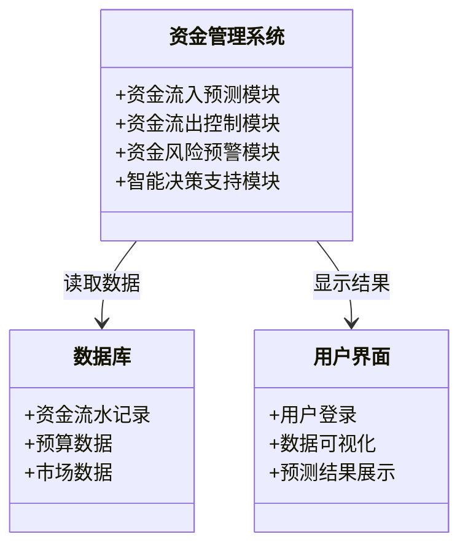
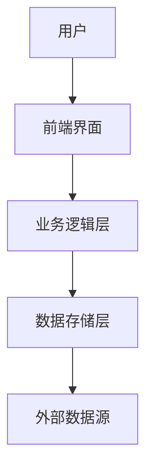
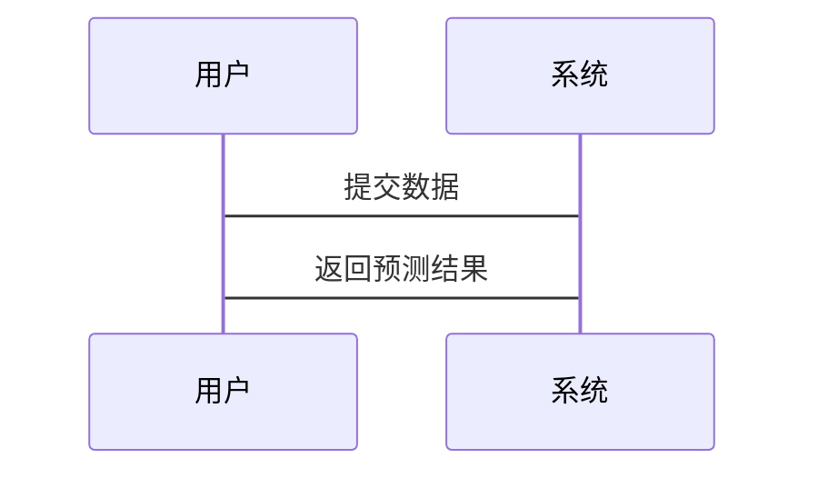

                 


# 设计智能化的企业资金管理系统

> 关键词：企业资金管理，智能化，机器学习，随机森林，系统架构，资金预测

> 摘要：本文详细探讨了设计智能化企业资金管理系统的背景、核心概念、算法原理、系统架构及实现方案。通过对比分析传统资金管理系统与智能化系统的优劣，阐述了智能化转型的必要性，并介绍了线性回归和随机森林算法在资金预测中的应用。结合实际案例，展示了系统的设计与实现过程，为企业的资金管理智能化转型提供了理论支持和实践指导。

---

## 第一部分：智能化企业资金管理系统的背景与核心概念

### 第1章：企业资金管理系统的智能化转型

#### 1.1 传统企业资金管理系统的局限性

- **信息孤岛问题**  
  传统资金管理系统往往孤立运行，难以与其他业务系统（如ERP、CRM）无缝集成，导致数据分散、信息滞后。

- **规则引擎的不足**  
  传统系统依赖预定义的规则和流程，缺乏灵活性和自适应能力，难以应对复杂多变的业务场景。

- **数据处理能力有限**  
  传统系统难以处理海量数据，且缺乏深度分析能力，无法支持精准的资金预测和风险评估。

- **可扩展性差**  
  面对业务增长或多样化需求，传统系统难以快速扩展和调整。

- **缺乏智能化分析与预测**  
  传统系统无法利用AI技术进行智能预测和决策支持，难以满足现代企业对高效管理的需求。

#### 1.2 对比分析：传统系统与智能化系统的优劣

| **对比维度**       | **传统资金管理系统**                | **智能化资金管理系统**               |
|--------------------|------------------------------------|------------------------------------|
| **数据处理能力**    | 有限，依赖人工录入与简单计算       | 强大，支持大数据分析与机器学习       |
| **预测能力**        | 无或基于简单规则                 | 基于机器学习模型，预测精度高         |
| **适应性**          | 固定规则，难以适应变化           | 可自适应业务变化，灵活调整策略       |
| **用户体验**        | 界面简单，操作繁琐               | 智能化交互，用户友好，决策支持直观   |

#### 1.3 企业资金管理智能化的必要性

- **数字化转型的需求**  
  随着企业数字化转型的推进，资金管理需要更加智能化，以支持实时监控和高效决策。

- **提升管理效率**  
  智能化系统能够自动处理大量数据，减少人工干预，显著提升管理效率。

- **应对复杂业务场景**  
  现代企业面临复杂的业务场景，传统系统难以应对，而智能化系统能够提供灵活的解决方案。

- **降低风险**  
  通过智能预测和风险预警，企业可以提前识别和规避资金管理中的潜在风险。

#### 1.4 传统系统向智能化系统转变的过程

1. **数据集成**  
   将分散在不同系统中的数据整合到统一平台，确保数据的完整性和实时性。

2. **引入AI技术**  
   引入机器学习算法，替代传统的规则引擎，实现智能化预测和决策支持。

3. **系统优化**  
   根据实际运行情况不断优化算法模型和系统架构，提升系统的稳定性和性能。

4. **用户培训与系统推广**  
   对企业员工进行培训，确保智能化系统的顺利应用和推广。

---

### 第2章：智能化资金管理系统的定义与优势

#### 2.1 智能化资金管理系统的定义

智能化资金管理系统是一种基于人工智能和大数据技术的管理平台，能够通过机器学习算法对资金流动进行预测、监控和优化，提供智能化的决策支持。

#### 2.2 智能化系统的显著优势

- **高精度预测**  
  利用机器学习算法，系统能够准确预测资金流入和流出，帮助企业在资金调度上更加精准。

- **实时监控与预警**  
  系统实时监控资金流动情况，及时发现异常交易或潜在风险，并发出预警。

- **自动化处理**  
  系统能够自动处理部分资金管理任务，减少人工干预，提升效率。

- **灵活适应性**  
  系统能够根据业务变化自适应调整预测模型，确保预测的准确性。

#### 2.3 智能化资金管理系统的主要功能模块

1. **资金流入预测模块**  
   基于历史数据和市场趋势，预测企业的资金流入情况。

2. **资金流出控制模块**  
   根据企业预算和资金需求，优化资金流出安排。

3. **资金风险预警模块**  
   监控资金流动中的异常情况，提前预警潜在风险。

4. **智能决策支持模块**  
   提供基于数据的决策支持，帮助企业做出最优的资金管理决策。

---

## 第二部分：智能化资金管理系统的算法原理

### 第3章：智能化资金管理系统的算法原理

#### 3.1 算法原理概述

智能化资金管理系统的核心在于机器学习算法的应用。通过训练模型，系统能够从历史数据中学习资金流动的规律，并对未来进行预测。

#### 3.2 线性回归算法实现

##### 3.2.1 线性回归的数学模型

线性回归是一种简单而有效的回归算法，其数学模型如下：

$$ y = \beta_0 + \beta_1x + \epsilon $$

其中，$y$ 是目标变量（如资金流入量），$x$ 是自变量（如时间），$\beta_0$ 和 $\beta_1$ 是回归系数，$\epsilon$ 是误差项。

##### 3.2.2 算法实现代码示例

以下是使用Python实现线性回归的示例代码：

```python
import numpy as np
from sklearn.linear_model import LinearRegression

# 示例数据
X = np.array([[1], [2], [3], [4]])
y = np.array([2, 4, 5, 6])

# 模型训练
model = LinearRegression()
model.fit(X, y)

# 预测
print(model.predict([[5]]))
```

##### 3.2.3 线性回归在资金预测中的应用

线性回归适用于线性关系明显的场景，如简单的时间序列预测。然而，对于复杂的资金流动情况，可能需要更强大的算法。

#### 3.3 随机森林算法应用

##### 3.3.1 随机森林的工作原理

随机森林是一种基于决策树的集成算法，通过构建多个决策树并进行投票或平均，提高模型的准确性和鲁棒性。

##### 3.3.2 随机森林与线性回归的对比分析

| **对比维度** | **线性回归** | **随机森林** |
|--------------|---------------|---------------|
| **准确性**    | 一般           | 高             |
| **计算复杂度**| 低             | 较高           |
| **适用场景**  | 线性关系         | 非线性关系       |
| **过拟合风险**| 易过拟合         | 较低             |

##### 3.3.3 随机森林算法实现

以下是使用Python实现随机森林的示例代码：

```python
from sklearn.ensemble import RandomForestRegressor

# 示例数据
X = np.array([[1], [2], [3], [4]])
y = np.array([2, 4, 5, 6])

# 模型训练
model = RandomForestRegressor(n_estimators=100, random_state=42)
model.fit(X, y)

# 预测
print(model.predict([[5]]))
```

##### 3.3.4 随机森林在资金预测中的优势

随机森林能够处理高维数据，适合复杂的资金流动预测，且具有较强的抗过拟合能力。

---

## 第三部分：智能化资金管理系统的系统架构与实现

### 第4章：系统分析与架构设计

#### 4.1 项目背景与目标

本项目旨在设计一个智能化的资金管理系统，通过引入AI技术，提升资金预测和风险控制的准确性，优化企业资金管理效率。

#### 4.2 领域模型设计

以下是系统的领域模型图（Mermaid类图）：



#### 4.3 系统架构设计

以下是系统的架构图（Mermaid架构图）：



#### 4.4 系统接口设计

- **输入接口**  
  用户输入资金相关数据，如收入、支出、预算等。

- **输出接口**  
  系统输出预测结果、风险预警信息和决策建议。

#### 4.5 系统交互设计

以下是系统的交互流程图（Mermaid序列图）：



---

### 第5章：项目实战

#### 5.1 环境安装与配置

- **Python版本**：3.8及以上
- **安装依赖**：
  ```bash
  pip install numpy scikit-learn matplotlib
  ```

#### 5.2 核心功能实现

##### 5.2.1 数据预处理

```python
import pandas as pd
from sklearn.preprocessing import StandardScaler

# 加载数据
data = pd.read_csv('financial_data.csv')

# 数据清洗
data.dropna(inplace=True)

# 特征工程
scaler = StandardScaler()
scaled_features = scaler.fit_transform(data[['revenue', 'expenses']])
```

##### 5.2.2 模型训练与优化

```python
from sklearn.model_selection import train_test_split
from sklearn.ensemble import RandomForestRegressor
from sklearn.metrics import mean_absolute_error

# 数据分割
X_train, X_test, y_train, y_test = train_test_split(scaled_features, data['net_income'], test_size=0.2, random_state=42)

# 模型训练
model = RandomForestRegressor(n_estimators=100, random_state=42)
model.fit(X_train, y_train)

# 模型评估
print(mean_absolute_error(y_test, model.predict(X_test)))
```

##### 5.2.3 系统优化与部署

通过云平台部署模型，优化算法参数，提升预测精度和运行效率。

#### 5.3 实际案例分析

以某企业为例，分析系统在资金预测和风险预警中的实际应用效果。

#### 5.4 项目小结

总结项目实现的关键点，如数据质量的重要性、算法选择的影响，以及系统架构设计的优化策略。

---

## 第四部分：智能化资金管理系统的最佳实践与注意事项

### 第6章：最佳实践

#### 6.1 数据质量管理

- 确保数据的完整性和准确性。
- 定期更新和维护数据。

#### 6.2 算法选择与优化

- 根据具体场景选择合适的算法。
- 定期重新训练模型，保持模型的准确性。

#### 6.3 系统安全与稳定性

- 加强系统安全性，防止数据泄露。
- 定期备份数据，确保系统的稳定性。

### 第7章：注意事项

#### 7.1 数据隐私与合规性

- 遵守相关法律法规，保护数据隐私。
- 建立完善的数据管理制度。

#### 7.2 系统维护与更新

- 定期检查系统运行状态。
- 及时修复漏洞，优化系统性能。

#### 7.3 用户培训与反馈

- 对用户进行培训，确保系统的正确使用。
- 收集用户反馈，持续改进系统功能。

### 第8章：拓展阅读

推荐相关书籍和论文，帮助读者深入理解智能化资金管理系统的相关知识。

---

## 参考文献

1. 《机器学习实战》, 周志华
2. 《Python机器学习》，Andreas Müller
3. 《企业信息化管理》，张维

---

## 作者

作者：AI天才研究院/AI Genius Institute & 禅与计算机程序设计艺术/Zen And The Art of Computer Programming

