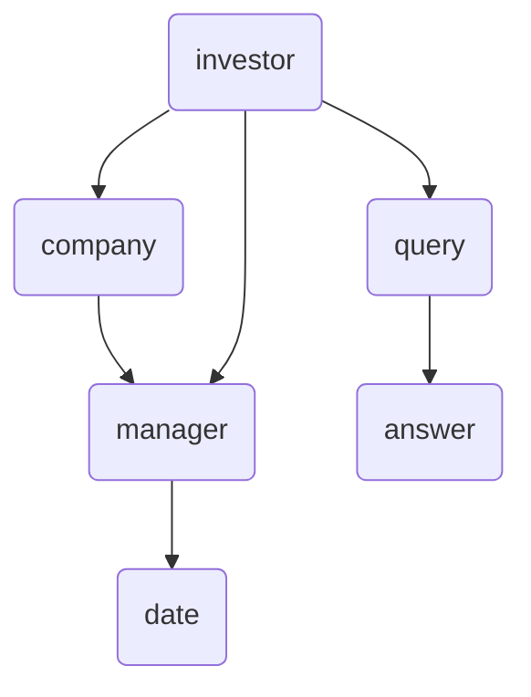
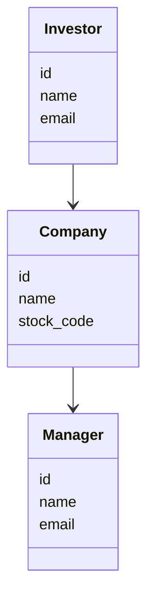

                 


# 设计智能化的投资者关系管理系统

## 关键词
- 投资者关系管理, 智能化系统, 自然语言处理, 机器学习, 系统架构设计

## 摘要
智能化的投资者关系管理系统通过整合先进的人工智能技术，如自然语言处理和机器学习，实现对投资者信息的高效采集、分析和响应。本文从背景介绍、核心概念、算法原理、系统架构设计、项目实战等多方面进行详细探讨，旨在为读者提供一个全面的设计思路。

---

# 第一部分: 背景与概念

## 第1章: 问题背景

### 1.1 问题背景
投资者关系管理（Investor Relations Management，IRM）是企业与投资者之间建立有效沟通和信息传递的重要环节。传统的投资者关系管理依赖人工操作，存在效率低、信息滞后、个性化不足等问题。

#### 1.1.1 当前的主要问题
- **信息滞后**：传统投资者关系管理依赖邮件、传真等方式，信息传递效率低。
- **人工依赖**：需要大量人工筛选、整理和分析投资者信息，效率低下。
- **个性化不足**：无法根据投资者需求提供个性化服务，难以满足多样化的需求。
- **数据孤岛**：投资者数据分散，难以形成统一的分析和决策支持。

#### 1.1.2 智能化管理的必要性
- 提高信息传递效率，实现自动化、实时化。
- 提供个性化服务，提升投资者体验。
- 支持数据驱动的决策，增强企业竞争力。

---

## 第2章: 核心概念

### 2.1 核心概念
智能化的投资者关系管理系统需要整合以下几个核心概念：

#### 2.1.1 数据驱动
- 通过收集和分析投资者数据，提供精准的决策支持。
- 使用大数据技术，挖掘投资者行为特征。

#### 2.1.2 自然语言处理
- 利用NLP技术解析投资者的文本信息，识别情感、意图和关键词。
- 支持智能问答，提供投资者实时咨询。

#### 2.1.3 机器学习
- 使用机器学习算法预测投资者行为和市场趋势。
- 建立投资者画像，实现个性化服务。

---

# 第二部分: 核心概念与联系

## 第3章: 实体关系图与流程图

### 3.1 实体关系图（ER图）


### 3.2 流程图
```mermaid
graph TD
    start --> I(investor sends query)
    I --> M(manager receives query)
    M --> Q(query processed)
    Q --> A(answer generated)
    A --> I(investor receives answer)
    I --> end
```

---

## 第4章: 核心概念对比

### 4.1 对比表格
| 概念         | 传统投资者关系管理 | 智能化投资者关系管理 |
|--------------|--------------------|----------------------|
| 数据处理     | 人工整理           | 自动采集与分析       |
| 信息传递     | 依赖邮件或传真     | 实时在线交互         |
| 个性化服务   | 无或有限           | 高度个性化           |
| 决策支持     | 依赖人工经验       | 数据驱动决策         |

---

# 第三部分: 算法原理

## 第5章: 自然语言处理

### 5.1 文本分类
#### 5.1.1 算法原理
- 使用朴素贝叶斯或支持向量机（SVM）进行文本分类。
- 示例：将投资者的咨询分为财务、战略、技术等类别。

#### 5.1.2 代码实现
```python
from sklearn.feature_extraction.text import TfidfVectorizer
from sklearn.naive_bayes import MultinomialNB

# 假设 training_data 为训练样本
vectorizer = TfidfVectorizer()
X_train = vectorizer.fit_transform(training_data.text)
model = MultinomialNB().fit(X_train, training_data.label)
```

## 第6章: 机器学习

### 6.1 投资者行为预测
#### 6.1.1 算法原理
- 使用逻辑回归或随机森林进行投资者行为预测。
- 示例：预测投资者是否会增持、减持或保持不变。

#### 6.1.2 数学公式
$$ P(y=1|x) = \frac{e^{w \cdot x + b}}{1 + e^{w \cdot x + b}} $$

---

# 第四部分: 系统架构设计

## 第7章: 系统分析

### 7.1 领域模型


---

## 第8章: 系统架构

### 8.1 系统架构图


---

# 第五部分: 项目实战

## 第9章: 环境安装

### 9.1 安装Python与库
```bash
pip install numpy
pip install pandas
pip install scikit-learn
pip install spacy
```

---

## 第10章: 核心代码实现

### 10.1 自然语言处理代码
```python
import spacy

nlp = spacy.load("en_core_web_sm")
doc = nlp("The company's revenue increased by 10% last quarter.")
```

---

## 第11章: 项目总结

### 11.1 总结
智能化投资者关系管理系统通过整合自然语言处理、机器学习等技术，实现了投资者信息的高效管理和个性化服务，提升了投资者体验和企业竞争力。

---

# 结语

## 小结
智能化投资者关系管理系统的设计需要从背景分析、核心概念、算法实现、系统架构等多个方面进行综合考虑。通过引入人工智能技术，可以显著提升投资者关系管理的效率和精准度。

## 注意事项
- 数据隐私保护是设计中的重要环节。
- 系统的可扩展性和灵活性需要重点关注。

## 拓展阅读
- 《机器学习实战》
- 《自然语言处理入门》
- 《系统架构设计方法论》

---

作者：AI天才研究院/AI Genius Institute & 禅与计算机程序设计艺术 /Zen And The Art of Computer Programming

