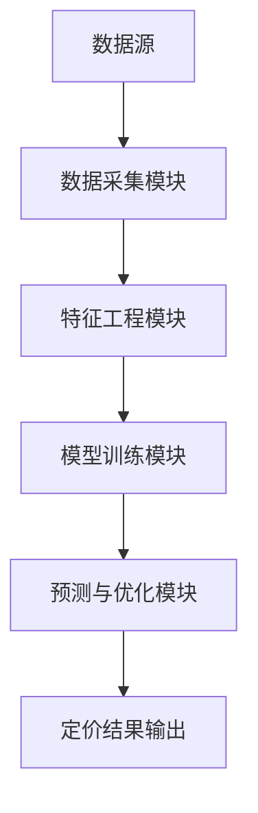

                 


# 设计智能化的资产定价模型

> 关键词：资产定价模型，人工智能，大数据，机器学习，深度学习，金融工程

> 摘要：随着人工智能和大数据技术的快速发展，资产定价模型的设计也在不断进化。本文将从智能化资产定价的背景出发，逐步分析其核心概念、算法原理、系统架构，并通过实际案例展示如何构建一个高效的智能化资产定价模型。通过本文的学习，读者将能够理解智能化定价的核心逻辑，并掌握基于AI的定价模型的设计方法。

---

# 第一部分：智能化资产定价模型的背景与基础

# 第1章：智能化资产定价的背景与必要性

## 1.1 资产定价的核心问题
### 1.1.1 资产定价的基本概念
- 资产定价是金融领域的核心问题，旨在通过模型和算法确定资产的合理价格。
- 资产包括股票、债券、房地产等多种形式，其价格受多种因素影响，如市场波动、经济指标、公司基本面等。

### 1.1.2 资产定价的挑战与痛点
- 数据复杂性：资产价格受多种因素影响，数据维度高且噪声大。
- 市场动态性：市场环境不断变化，传统静态模型难以适应。
- 非线性关系：资产价格与影响因素之间可能存在复杂的非线性关系。

### 1.1.3 智能化定价的必要性
- 传统定价模型的局限性：线性假设难以捕捉复杂市场关系。
- AI与大数据的优势：通过机器学习和深度学习，可以挖掘数据中的非线性关系和隐含模式。
- 实时优化的需求：智能化模型能够快速响应市场变化，实现动态定价。

## 1.2 智能化定价的核心要素
### 1.2.1 数据驱动的定价模型
- 数据是智能化定价的基础，包括历史价格、市场数据、公司财务数据等。
- 数据清洗与特征工程：通过数据预处理提取有用的特征，降低数据噪声。

### 1.2.2 AI在资产定价中的作用
- 机器学习算法：用于发现数据中的复杂模式和关系。
- 深度学习模型：能够捕捉多层特征，提高定价的准确性。

### 1.2.3 大数据与资产定价的结合
- 数据量与多样性：大数据技术能够处理海量数据，为定价提供更全面的视角。
- 数据实时性：通过实时数据流处理，实现动态定价。

## 1.3 本书的核心目标与内容框架
### 1.3.1 本书的核心目标
- 掌握智能化资产定价的核心概念。
- 理解AI算法在资产定价中的应用。
- 学会设计和实现智能化定价模型。

### 1.3.2 本书的内容框架
- 第一部分：智能化资产定价的背景与基础。
- 第二部分：智能化资产定价模型的核心概念与原理。
- 第三部分：智能化资产定价模型的算法原理。
- 第四部分：智能化资产定价系统的架构与实现。
- 第五部分：项目实战与优化。

### 1.3.3 本书的适用读者
- 金融从业者：如基金经理、投资分析师。
- 数据科学家：对AI与大数据感兴趣的读者。
- 学生与研究者：希望深入理解智能化定价模型的读者。

---

# 第2章：智能化资产定价模型的核心概念

## 2.1 资产定价模型的分类
### 2.1.1 传统资产定价模型
- 单因素模型：如CAPM（资本资产定价模型）。
- 多因素模型：如APT（ arbitrage pricing theory）。

### 2.1.2 基于机器学习的定价模型
- 线性回归模型。
- 支持向量机（SVM）。
- 随机森林与梯度提升树。
- 神经网络与深度学习。

### 2.1.3 混合型定价模型
- 结合传统模型与AI模型的混合架构。
- 通过集成学习优化定价精度。

## 2.2 智能化定价的核心原理
### 2.2.1 数据驱动的定价逻辑
- 通过数据特征提取，构建定价的基础。
- 利用数据的动态变化，实现定价的实时调整。

### 2.2.2 AI算法在定价中的应用
- 机器学习算法：用于特征选择与模型训练。
- 深度学习模型：用于捕捉复杂市场关系。

### 2.2.3 动态调整与实时优化
- 基于实时数据流的定价调整。
- 在线学习算法：动态更新模型参数。

## 2.3 核心概念对比分析
### 2.3.1 传统定价与智能化定价的对比
| 对比维度 | 传统定价 | 智能化定价 |
|----------|----------|------------|
| 数据依赖 | 低       | 高         |
| 模型复杂度 | 简单     | 复杂       |
| 实时性 | 低       | 高         |

### 2.3.2 不同智能化定价模型的优劣势
- 优势：基于数据的定价更精准。
- 劣势：模型复杂度高，难以解释。

### 2.3.3 核心概念的ER实体关系图

```mermaid
erd
    customer
    asset
    price
    model
    data
```

---

# 第3章：智能化资产定价模型的算法原理

## 3.1 常见AI算法在定价中的应用
### 3.1.1 线性回归与逻辑回归
- 线性回归：用于预测连续型资产价格。
- 逻辑回归：用于分类问题，如判断资产是否被高估。

### 3.1.2 支持向量机（SVM）
- SVM的优势：适用于高维数据，能够捕捉非线性关系。

### 3.1.3 随机森林与梯度提升树
- 随机森林：通过集成学习提高模型鲁棒性。
- XGBoost：梯度提升树，适合处理复杂关系。

### 3.1.4 神经网络与深度学习
- 神经网络的优势：能够捕捉数据中的深层特征。

## 3.2 基于深度学习的定价模型
### 3.2.1 神经网络的结构与特点
- 输入层、隐藏层、输出层的结构设计。

### 3.2.2 卷积神经网络（CNN）的应用
- 用于处理时间序列数据，如股票价格波动。

### 3.2.3 循环神经网络（RNN）的应用
- 适用于处理序列数据，捕捉时间依赖性。

### 3.2.4 Transformer架构的最新进展
- 在自然语言处理中的应用，及其在资产定价中的潜力。

## 3.3 算法原理的数学模型与公式
### 3.3.1 线性回归模型
$$ y = \beta_0 + \beta_1x + \epsilon $$

### 3.3.2 神经网络的前向传播
$$ a^{(l+1)} = \sigma(w^{(l)}a^{(l)} + b^{(l)}) $$

### 3.3.3 损失函数与优化目标
$$ \text{损失函数} = \frac{1}{n}\sum_{i=1}^n (y_i - \hat{y}_i)^2 $$

### 3.3.4 优化算法（如Adam）
$$ \theta_{t+1} = \theta_t - \eta \frac{\partial L}{\partial \theta} $$

## 3.4 算法实现与案例分析
### 3.4.1 简单线性回归的Python实现
```python
import pandas as pd
from sklearn.linear_model import LinearRegression

# 数据加载与预处理
data = pd.read_csv('asset_price.csv')
X = data[['feature1', 'feature2']]
y = data['target']

# 模型训练
model = LinearRegression()
model.fit(X, y)

# 模型预测
 predictions = model.predict(X)
```

### 3.4.2 神经网络模型的Keras实现
```python
from tensorflow.keras import layers

# 模型构建
model = keras.Sequential()
model.add(layers.Dense(64, activation='relu', input_shape=(n_features,)))
model.add(layers.Dense(1, activation='linear'))

# 模型编译
model.compile(optimizer='adam', loss='mean_squared_error')
```

---

# 第4章：智能化资产定价系统的架构与实现

## 4.1 系统功能设计
### 4.1.1 数据流与模块划分
- 数据采集模块：从数据库中获取资产数据。
- 特征工程模块：对数据进行清洗与特征提取。
- 模型训练模块：基于特征数据训练定价模型。
- 预测与优化模块：输出定价结果并动态优化。

### 4.1.2 系统架构设计



### 4.1.3 系统交互设计
- 用户输入：选择资产类型与数据范围。
- 系统输出：生成定价结果与模型解释。

## 4.2 项目实战：智能化资产定价系统的实现
### 4.2.1 环境安装
- 安装Python、Pandas、Scikit-learn、Keras等库。

### 4.2.2 核心实现代码
```python
import pandas as pd
from sklearn.preprocessing import StandardScaler
from sklearn.model_selection import train_test_split
from sklearn.ensemble import RandomForestRegressor

# 数据加载
data = pd.read_csv('asset_data.csv')
X = data.drop(columns=['price', 'date'])
y = data['price']

# 数据预处理
scaler = StandardScaler()
X_scaled = scaler.fit_transform(X)

# 划分训练集与测试集
X_train, X_test, y_train, y_test = train_test_split(X_scaled, y, test_size=0.2)

# 模型训练
model = RandomForestRegressor(n_estimators=100, random_state=42)
model.fit(X_train, y_train)

# 模型预测
y_pred = model.predict(X_test)

# 模型评估
score = model.score(X_test, y_test)
print(f'模型得分：{score}')
```

---

# 第5章：项目实战与优化

## 5.1 实际案例分析
### 5.1.1 数据收集与预处理
- 数据来源：股票价格、经济指标、公司财务数据。

### 5.1.2 模型训练与评估
- 使用随机森林与神经网络进行对比实验。

### 5.1.3 模型优化
- 调参优化：通过网格搜索找到最佳参数组合。
- 模型集成：结合多种算法提升预测精度。

## 5.2 最佳实践与小结
### 5.2.1 模型选择的注意事项
- 根据数据特性选择合适的算法。
- 避免过拟合，保持模型的泛化能力。

### 5.2.2 系统设计的优化建议
- 数据实时更新，确保模型的动态优化。
- 异常数据处理，提高模型的鲁棒性。

### 5.2.3 拓展阅读
- 关注最新的AI算法在金融领域的应用。
- 学习复杂模型的调优技巧。

---

# 结语

通过本文的系统讲解，读者可以全面了解智能化资产定价模型的设计与实现过程。从背景知识到算法原理，再到实际案例分析，每一步都进行了详细的探讨与实践。希望本书能够为读者提供有价值的参考，帮助他们在金融与AI的交叉领域中取得更好的成果。

---

# 作者：AI天才研究院/AI Genius Institute & 禅与计算机程序设计艺术 /Zen And The Art of Computer Programming

