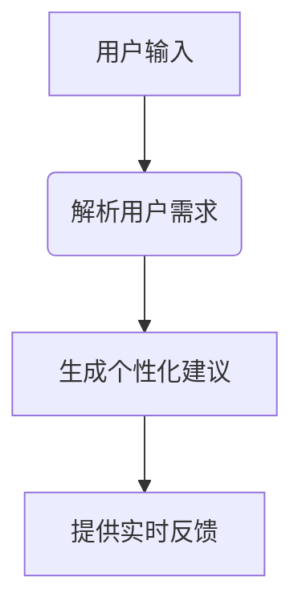
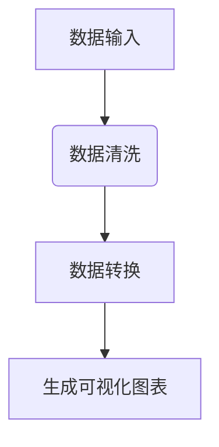
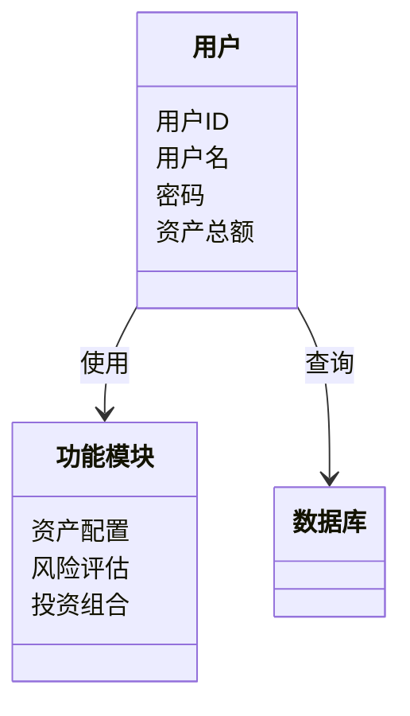
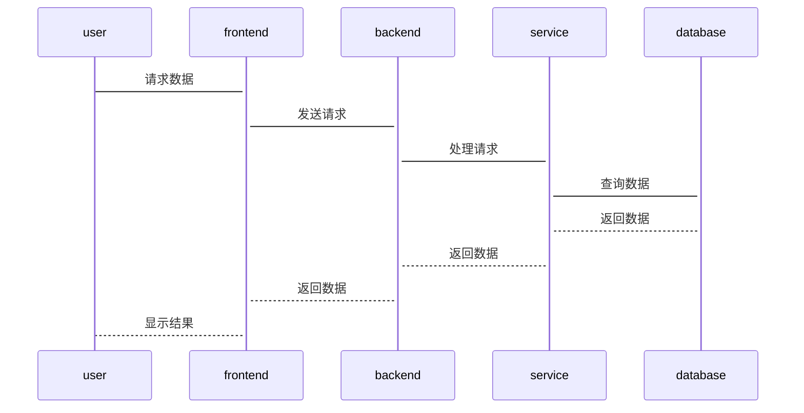
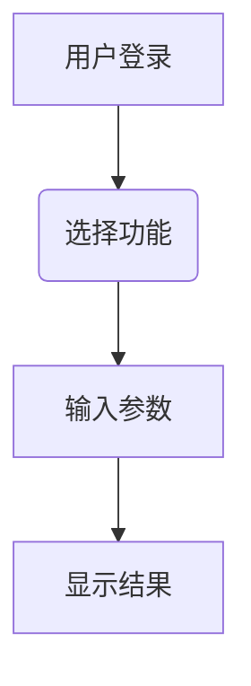

                 


```markdown
# 设计直观易用的投资理财智能助手用户界面

> 关键词：投资理财，智能助手，用户界面设计，用户体验，数据可视化，交互设计

> 摘要：本文详细探讨了设计直观易用的投资理财智能助手用户界面的关键要素，包括用户需求分析、信息架构设计、交互流程优化、数据可视化策略，以及系统架构和实现方法。通过理论与实践相结合，本文为设计者提供了从背景分析到实际操作的全面指导。

---

# 第一部分: 投资理财智能助手的背景与目标

# 第1章: 投资理财智能助手的背景与需求

## 1.1 问题背景
### 1.1.1 投资理财领域的用户痛点
- 理财知识门槛高，用户难以快速理解和决策。
- 信息过载，用户难以筛选和处理有用信息。
- 界面复杂，操作繁琐，用户体验差。

### 1.1.2 智能化工具在投资理财中的作用
- 提供个性化建议，帮助用户做出明智决策。
- 简化操作流程，提升用户体验。
- 通过数据可视化，让用户更直观地理解和分析财务状况。

### 1.1.3 用户对投资理财助手的核心需求
- 界面直观易用，操作简单。
- 数据可视化清晰，信息传达高效。
- 个性化推荐和实时反馈。

## 1.2 用户需求分析
### 1.2.1 不同用户群体的需求特点
- 初次投资者：需要简单易懂的指导和基础功能。
- 经验丰富的投资者：需要高级功能和深度数据分析。
- 中间用户：介于两者之间，需要平衡功能和复杂度。

### 1.2.2 用户行为与决策过程分析
- 用户通常在早晨或晚上使用工具，进行财务规划和投资决策。
- 用户倾向于快速获取信息，避免繁琐的操作步骤。
- 用户偏好直观的图表和简洁的语言，便于快速理解。

### 1.2.3 用户对界面直观易用性的具体要求
- 界面布局简洁，功能分区明确。
- 操作流程直观，减少用户学习成本。
- 提供实时反馈和个性化建议，增强用户体验。

## 1.3 投资理财的特点与挑战
### 1.3.1 投资理财的核心功能与流程
- 资产配置建议。
- 投资组合优化。
- 风险评估与管理。
- 数据跟踪与分析。

### 1.3.2 界面设计中的复杂性与简化性平衡
- 复杂性：涉及多种金融工具和术语。
- 简化性：通过直观设计减少用户认知负担。

### 1.3.3 数据可视化与用户决策的关系
- 数据可视化是用户理解和决策的关键。
- 不同的可视化方式影响用户的理解和信任度。

## 1.4 本章小结
- 介绍了投资理财智能助手的背景和用户需求。
- 分析了不同用户群体的需求特点和行为模式。
- 强调了直观易用界面设计的重要性和挑战。

---

# 第二部分: 直观易用界面的核心要素

# 第2章: 直观易用界面的核心概念与联系

## 2.1 核心概念原理
### 2.1.1 信息架构与用户导航
- 信息架构是用户与系统交互的基础。
- 用户导航决定了用户如何在系统中移动和找到所需信息。

### 2.1.2 交互设计与用户行为
- 交互设计直接影响用户体验。
- 用户行为分析是优化交互设计的关键。

### 2.1.3 视觉设计与用户感知
- 视觉设计是用户对系统第一印象的关键。
- 通过颜色、布局和字体设计影响用户感知。

## 2.2 核心概念属性对比
| 设计要素 | 属性 | 描述 |
|---------|------|------|
| 信息架构 | 可见性 | 用户能否快速找到所需信息 |
| 交互设计 | 易用性 | 用户能否轻松完成操作 |
| 视觉设计 | 一致性 | 系统元素是否统一协调 |

## 2.3 ER实体关系图
```mermaid
erDiagram
    user} o-|{ role : 用户与角色关联
    role} o-|{ function : 角色与功能关联
    function} o-|{ interface : 功能与界面关联
    interface} o-|{ element : 界面与元素关联
```

---

# 第三部分: 界面设计的算法与数学模型

# 第3章: 界面设计的算法原理

## 3.1 用户行为分析算法
### Mermaid图: 用户行为分析流程


### Python代码示例: 用户行为数据处理
```python
import pandas as pd

# 示例数据
data = {'用户ID': [1, 2, 3], '行为': ['登录', '搜索', '点击']}
df = pd.DataFrame(data)

# 数据处理
df['时间戳'] = pd.to_datetime(df['行为'])
print(df.head())
```

## 3.2 数据可视化算法
### Mermaid图: 数据可视化算法流程


### Python代码示例: 数据可视化实现
```python
import matplotlib.pyplot as plt

# 示例数据
x = [1, 2, 3, 4]
y = [10, 20, 15, 25]

# 绘制折线图
plt.plot(x, y)
plt.xlabel('时间')
plt.ylabel('金额')
plt.title('投资组合变化')
plt.show()
```

## 3.3 数学模型与公式
### 投资组合风险评估公式
$$\sigma^2 = \sum_{i=1}^{n} w_i^2 \sigma_i^2 + 2 \sum_{i<j} w_i w_j \sigma_i \sigma_j \rho_{ij}$$

### 相似度计算公式
$$S(相似度) = \sum_{i=1}^{n} |f_i - g_i|$$

---

# 第四部分: 系统分析与架构设计

# 第4章: 投资理财助手系统分析

## 4.1 项目背景与目标
### 4.1.1 项目背景介绍
- 项目旨在为用户提供智能化的投资理财辅助工具。
- 目标是打造一个高效、易用、可信赖的智能助手。

## 4.2 系统功能设计
### Mermaid图: 领域模型类图


### Mermaid图: 系统架构图


## 4.3 系统接口与交互设计
### Mermaid图: 系统接口设计


### Mermaid图: 用户交互流程图


---

# 第五部分: 项目实战与实现

# 第5章: 投资理财助手界面实战

## 5.1 环境搭建与工具安装
### 5.1.1 开发环境配置
- 操作系统：Windows 10 或 macOS 10.15+
- 开发工具：Visual Studio Code 或 PyCharm
- 依赖管理：pip install flask matplotlib pandas

### 5.1.2 设计工具安装
- Figma 或 Sketch：用于界面设计
- Postman：用于API测试

## 5.2 系统核心实现
### 5.2.1 界面设计实现
```python
# 示例代码：使用Flask实现简单的投资组合页面
from flask import Flask, render_template

app = Flask(__name__)

@app.route('/')
def home():
    return render_template('index.html')

if __name__ == '__main__':
    app.run(debug=True)
```

### 5.2.2 数据可视化实现
```python
# 示例代码：使用Matplotlib绘制投资组合变化图
import matplotlib.pyplot as plt

data = {'投资组合': [100, 120, 110, 130]}
df = pd.DataFrame(data)
plt.plot(df['投资组合'], label='投资组合价值')
plt.xlabel('时间')
plt.ylabel('金额')
plt.title('投资组合变化')
plt.legend()
plt.show()
```

## 5.3 项目小结
- 通过实际案例展示了投资理财助手界面设计的关键步骤。
- 强调了理论与实践相结合的重要性。
- 提供了从环境搭建到代码实现的详细指导。

---

# 第六部分: 最佳实践与总结

# 第6章: 最佳实践与注意事项

## 6.1 小结
- 设计直观易用的投资理财助手界面需要综合考虑用户需求、信息架构、交互设计和视觉设计。
- 数据可视化是提升用户体验的重要手段。
- 系统架构和算法设计是实现高效功能的基础。

## 6.2 注意事项
- 在设计过程中要关注用户的实际需求，避免过度复杂化界面。
- 数据安全和隐私保护是设计中的重要考量。
- 定期收集用户反馈，持续优化界面和功能。

## 6.3 拓展阅读
- 《用户体验设计入门》
- 《数据可视化与用户行为分析》
- 《投资理财算法与系统架构》

---

作者：AI天才研究院/AI Genius Institute & 禅与计算机程序设计艺术 /Zen And The Art of Computer Programming
```

