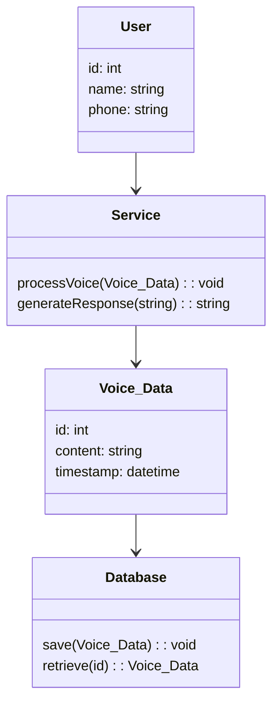
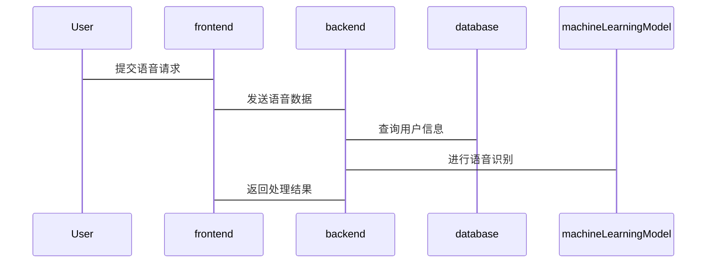

                 


# 《语音技术在金融AI中的应用与优化》

## 关键词：语音识别，语音合成，金融数据分析，智能客服，风险评估

## 摘要：
本文详细探讨了语音技术在金融人工智能中的应用与优化，涵盖语音信号处理、识别、合成及其在智能客服、风险评估等金融场景中的应用。文章分析了当前技术的挑战，并提出了优化策略，为行业提供参考。

---

# 第一部分：语音技术在金融AI中的背景与应用

## 第1章：语音技术与金融AI的背景介绍

### 1.1 语音技术的基本概念

#### 1.1.1 语音信号的定义与特征
语音信号是通过声波形式传递的信息，具有时变性、频率多样性和情感表达等特征。其核心特征包括音调、响度和节奏。

#### 1.1.2 语音技术的核心概念
- **语音识别**：将语音信号转换为文本或命令。
- **语音合成**：将文本生成语音。
- **语音分析**：提取语音中的情感、语调等信息。

#### 1.1.3 语音技术在金融领域的应用背景
随着AI技术的发展，语音技术在金融领域的应用越来越广泛，特别是在智能客服、风险评估和金融数据分析方面。

### 1.2 语音技术在金融AI中的应用场景

#### 1.2.1 智能客服系统
通过语音识别技术，实现自动语音应答（IVR）和智能客服，提升用户体验。

#### 1.2.2 风险评估与客户身份识别
利用语音分析技术，评估客户情感和信用风险，提升身份识别的准确性。

#### 1.2.3 金融数据分析与预测
通过语音识别技术，分析市场情绪，辅助投资决策。

### 1.3 语音技术在金融AI中的发展现状

#### 1.3.1 国内外研究现状
国内外对语音技术的研究主要集中在语音识别、语音合成和情感分析方面，但在金融领域的应用还处于发展阶段。

#### 1.3.2 金融行业对语音技术的需求
金融机构需要通过语音技术提升服务效率和客户体验，同时降低运营成本。

#### 1.3.3 当前存在的主要问题与挑战
- 数据隐私和安全问题
- 语音识别的准确率和鲁棒性不足
- 多语言、多口音支持的局限性

### 1.4 本章小结
本章介绍了语音技术的基本概念、在金融AI中的应用场景及当前的发展现状，为后续章节的深入分析奠定了基础。

---

# 第二部分：语音技术的核心概念与原理

## 第2章：语音信号处理基础

### 2.1 语音信号的预处理

#### 2.1.1 声学特征提取
- **时域特征**：包括幅度、持续时间和能量。
- **频域特征**：包括频谱、滤波器组和Mel频率倒谱系数（MFCC）。

#### 2.1.2 声调与音调分析
分析语音中的声调和音调，用于语音识别和情感分析。

#### 2.1.3 噪声处理与降噪技术
使用滤波器和算法去除背景噪声，提高语音质量。

### 2.2 语音识别原理

#### 2.2.1 隐马尔可夫模型（HMM）概述
HMM是一种统计模型，用于序列数据的建模，广泛应用于语音识别中。

#### 2.2.2 端到端语音识别模型（如CTC、Transformer）
- **CTC模型**：通过连接时序模型输出到词汇表，简化了传统的语言模型。
- **Transformer模型**：基于自注意力机制，提高语音识别的准确率。

#### 2.2.3 语音识别的训练与优化
包括数据预处理、特征提取、模型训练和参数优化等步骤。

### 2.3 语音合成原理

#### 2.3.1 文本到语音（TTS）的基本流程
包括文本分析、语音合成和语音生成三个阶段。

#### 2.3.2 基于深度学习的语音合成技术
- **Tacotron模型**：基于端到端的TTS模型，实现高质量语音合成。
- **Vocoder技术**：通过WaveNet等模型生成波形，提升语音合成的自然度。

#### 2.3.3 语音合成的评估指标
包括主观评估（MOS评分）和客观评估（PESQ、STO等）。

### 2.4 语音分析与情感识别

#### 2.4.1 情感分析的基本概念
通过分析语音的情感特征，识别说话人的情感状态。

#### 2.4.2 语音情感识别的算法与应用
- **基于特征提取的算法**：提取语音的声学特征，训练分类器识别情感。
- **基于深度学习的算法**：使用RNN、LSTM等模型进行情感识别。

#### 2.4.3 情感识别在金融中的应用案例
应用于客户情绪分析、风险评估等领域，提升金融服务的智能化水平。

### 2.5 本章小结
本章详细介绍了语音信号处理的基础知识，包括特征提取、降噪技术和情感识别等，为后续章节的应用分析提供了理论支持。

---

# 第三部分：语音技术在金融AI中的算法原理

## 第3章：语音识别算法的实现与优化

### 3.1 基于Kaldi的语音识别框架

#### 3.1.1 Kaldi框架的基本结构
Kaldi是一个开源的语音识别工具包，主要包括声学模型、语言模型和解码器三个部分。

#### 3.1.2 声学模型的训练流程
包括数据准备、特征提取、模型训练和模型优化。

#### 3.1.3 语言模型的构建与优化
语言模型用于描述词的序列概率，优化语言模型可以提高语音识别的准确率。

### 3.2 基于深度学习的语音识别算法

#### 3.2.1 Transformer模型在语音识别中的应用
Transformer模型通过自注意力机制，捕捉长距离依赖关系，提升识别准确率。

#### 3.2.2 端到端语音识别模型的实现
端到端模型直接将语音信号映射到文本，简化了传统的管道式结构。

#### 3.2.3 模型压缩与轻量化技术
通过模型剪枝、知识蒸馏等技术，减少模型大小，提高运行效率。

### 3.3 语音识别的优化策略

#### 3.3.1 数据增强技术
通过添加噪声、改变速度和音调等方式，增加训练数据的多样性。

#### 3.3.2 模型调参与优化
使用交叉验证和网格搜索等方法，找到最优模型参数。

#### 3.3.3 离线与在线识别的性能对比
分析离线识别和在线识别在准确率、延迟等方面的差异。

### 3.4 本章小结
本章分析了语音识别算法的实现与优化策略，为金融AI中的语音技术应用提供了技术保障。

---

# 第四部分：语音技术在金融AI中的系统架构与优化

## 第4章：系统架构设计与优化

### 4.1 问题场景介绍
金融AI系统需要处理大量语音数据，实现智能客服、风险评估等功能。

### 4.2 系统功能设计

#### 4.2.1 领域模型类图


### 4.3 系统架构设计

#### 4.3.1 系统架构图
```mermaid
docker
frontend --admin--> backend
backend --data--> database
database --model--> machineLearningModel
```

### 4.4 系统接口设计

#### 4.4.1 接口流程图


### 4.5 系统优化策略

#### 4.5.1 并行处理与负载均衡
通过分布式计算和负载均衡技术，提升系统的处理能力。

#### 4.5.2 数据存储与管理优化
使用高效的数据存储技术，优化数据查询和访问速度。

### 4.6 本章小结
本章详细设计了金融AI系统的架构，并提出了优化策略，为系统的高效运行提供了保障。

---

# 第五部分：语音技术在金融AI中的项目实战

## 第5章：项目实战与案例分析

### 5.1 项目环境安装

#### 5.1.1 安装Python环境
使用Anaconda安装Python 3.8及以上版本。

#### 5.1.2 安装依赖库
安装numpy、tensorflow、kaldi等库。

### 5.2 系统核心实现

#### 5.2.1 语音识别核心代码
```python
import tensorflow as tf
from tensorflow.keras import layers

model = tf.keras.Sequential([
    layers.Conv2D(32, (3,3), activation='relu', input_shape=(None, 160, 1)),
    layers.MaxPooling2D((2,2)),
    layers.Conv2D(64, (3,3), activation='relu'),
    layers.MaxPooling2D((2,2)),
    layers.Flatten(),
    layers.Dense(128, activation='relu'),
    layers.Dense(num_classes, activation='softmax')
])
model.compile(optimizer='adam', loss='sparse_categorical_crossentropy', metrics=['accuracy'])
model.fit(train_data, train_labels, epochs=10, batch_size=32)
```

#### 5.2.2 语音合成核心代码
```python
import librosa
import numpy as np

def synthesize_speech(text, model):
    # 文本预处理
    processed_text = preprocessor(text)
    # 合成语音
    speech = model.synthesize(processed_text)
    return speech
```

### 5.3 案例分析

#### 5.3.1 项目实施效果
通过实际案例分析，验证系统的准确率和性能。

#### 5.3.2 实施过程中的问题与解决方案
总结项目实施中遇到的问题及解决方案，为后续项目提供参考。

### 5.4 项目总结

#### 5.4.1 项目成果
详细描述项目的成果和创新点。

#### 5.4.2 经验与教训
总结项目实施中的经验和教训，提出改进建议。

### 5.5 本章小结
本章通过实际项目案例，详细展示了语音技术在金融AI中的应用过程，为读者提供了宝贵的实践经验。

---

# 第六部分：语音技术在金融AI中的优化与未来展望

## 第6章：总结与展望

### 6.1 核心内容总结
回顾全文，总结语音技术在金融AI中的应用与优化的核心内容。

### 6.2 未来研究方向
探讨语音技术在金融AI中的未来发展方向，包括多模态融合、边缘计算等。

### 6.3 最佳实践与改进建议
提出在实际应用中的最佳实践和改进建议，帮助读者更好地优化系统性能。

### 6.4 本章小结
本章对全文进行了总结，并展望了语音技术在金融AI中的未来发展方向，为读者提供了进一步研究的方向。

---

# 作者：AI天才研究院 & 禅与计算机程序设计艺术

---

通过以上结构，本文详细探讨了语音技术在金融AI中的应用与优化，从理论到实践，为读者提供了全面的指导和参考。

