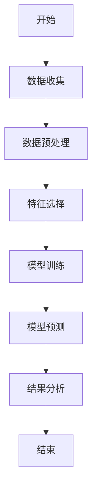
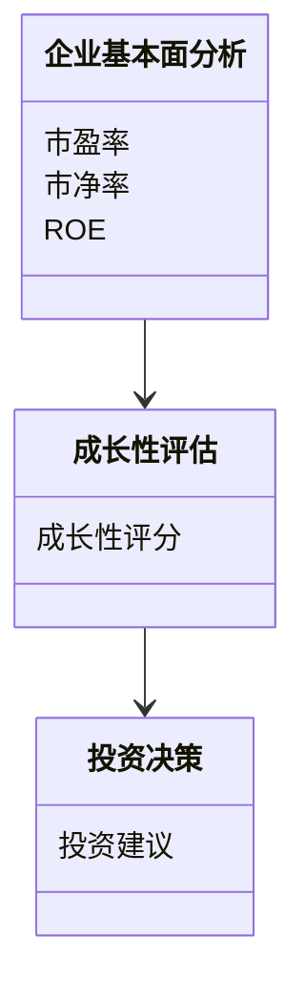
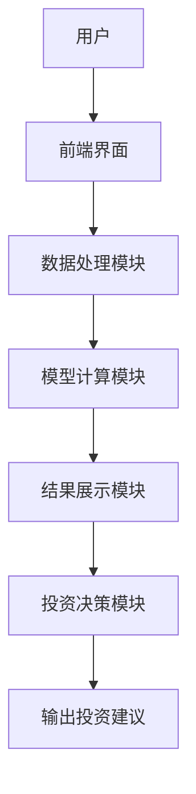

                 


# 费雪到现代：成长型投资的发展

---

## 关键词

成长型投资、费雪、投资理念、量化分析、机器学习、投资系统设计

---

## 摘要

本文系统地探讨了成长型投资从费雪到现代的发展历程，从其核心理念到现代量化分析方法，再到系统的架构设计。文章首先介绍了成长型投资的起源和核心概念，然后深入讲解了其背后的算法原理和数学模型。接着，通过构建一个简单的投资分析系统，展示了成长型投资在实际中的应用。最后，通过一个具体的案例分析，总结了成长型投资的最佳实践和注意事项。

---

## 第1章: 成长型投资的背景与起源

### 1.1 费雪的成长型投资理念

#### 1.1.1 费雪的生平简介

菲利普·费雪（Philip Fisher）是20世纪美国著名的投资家，被誉为“成长型投资之父”。他于1906年进入哈佛大学，主修化学，但在大学期间逐渐对投资产生了浓厚兴趣。毕业后，他开始涉足股票市场，并逐渐发展出一套独特的投资理念。

#### 1.1.2 费雪的成长型投资核心思想

费雪认为，投资的核心是选择那些具有持续增长潜力的企业。他提出了“成长股”的概念，强调企业销售收入、利润和市场份额的持续增长。他认为，投资的成功不仅取决于企业的当前表现，还取决于其未来的成长潜力。

#### 1.1.3 费雪投资理念的现代意义

尽管费雪的投资理念诞生于20世纪中期，但其核心思想在现代投资中仍然具有重要的指导意义。尤其是随着科技的发展，成长型投资在科技股、互联网企业等领域得到了广泛应用。

---

### 1.2 成长型投资的定义与特点

#### 1.2.1 成长型投资的定义

成长型投资是一种以投资具有高成长潜力的企业为目标的投资策略。其核心在于选择那些能够持续增长的企业，而非仅仅关注企业的当前价值。

#### 1.2.2 成长型投资的核心特点

- **高成长性**：投资对象通常是那些销售收入、利润和市场份额持续增长的企业。
- **长期导向**：注重企业的长期增长潜力，而非短期收益。
- **高风险高回报**：由于成长型企业通常处于高速发展阶段，其股票价格波动较大，风险较高，但回报也较高。

#### 1.2.3 成长型投资与价值投资的区别

| 投资策略 | 成长型投资 | 价值投资 |
|----------|------------|-----------|
| 核心目标 | 寻找高成长潜力的企业 | 寻找被市场低估的优质企业 |
| 投资期限 | 长期投资为主 | 长期和短期投资结合 |
| 风险特征 | 高风险高回报 | 中等风险中等回报 |

---

### 1.3 成长型投资的背景与演变

#### 1.3.1 成长型投资的起源

成长型投资的起源可以追溯到费雪在20世纪中期提出的“成长股”理念。他强调企业销售收入、利润和市场份额的持续增长，并提出了“护城河”概念，认为具有强大竞争优势的企业更容易实现持续增长。

#### 1.3.2 成长型投资的演变过程

随着金融市场的不断发展，成长型投资逐渐从单纯的定性分析向定量分析转变。尤其是近年来，随着大数据和人工智能技术的发展，成长型投资开始更多地借助量化方法进行筛选和评估。

#### 1.3.3 成长型投资的现代发展

现代成长型投资不仅关注企业的基本面，还结合了技术分析、量化分析等多种方法。尤其是在科技领域的快速发展下，成长型投资在互联网、人工智能、生物技术等领域表现出色。

---

## 第2章: 成长型投资的核心概念与联系

### 2.1 成长型投资的核心要素

#### 2.1.1 企业基本面分析

企业基本面分析是成长型投资的基础，主要包括对企业销售收入、利润、市场份额、资产负债表等方面的研究。通过这些分析，投资者可以判断企业的成长潜力。

#### 2.1.2 企业竞争优势分析

竞争优势分析是成长型投资的重要组成部分。企业是否具有独特的竞争优势（如专利、品牌、技术壁垒等）直接影响其成长潜力。

#### 2.1.3 企业成长性评估

成长性评估是通过对企业的历史增长趋势和未来增长潜力进行分析，判断其是否符合成长型投资的标准。

---

### 2.2 成长型投资的属性特征对比

#### 2.2.1 成长型投资与价值投资的对比

| 投资策略 | 成长型投资 | 价值投资 |
|----------|------------|-----------|
| 核心目标 | 寻找高成长潜力的企业 | 寻找被市场低估的优质企业 |
| 投资期限 | 长期投资为主 | 长期和短期投资结合 |
| 风险特征 | 高风险高回报 | 中等风险中等回报 |

---

## 第3章: 成长型投资的算法原理

### 3.1 成长型投资的量化分析方法

#### 3.1.1 基于多因子模型的分析

多因子模型是成长型投资中常用的量化分析方法之一。它通过多个因子（如市盈率、市净率、ROE等）来评估企业的成长潜力。

#### 3.1.2 基于机器学习的预测模型

机器学习在成长型投资中的应用越来越广泛。通过训练模型，可以预测企业的未来增长潜力。

#### 3.1.3 算法流程图



---

### 3.2 算法实现

#### 3.2.1 Python代码实现

```python
import pandas as pd
import numpy as np

# 示例数据集
data = {
    '公司': ['A', 'B', 'C', 'D'],
    '市盈率': [15, 20, 25, 30],
    '市净率': [2, 3, 4, 5],
    'ROE': [10, 15, 20, 25]
}

df = pd.DataFrame(data)

# 计算成长性评分
def calculate_growth_score(row):
    score = row['市盈率'] + row['市净率'] + row['ROE']
    return score

df['成长性评分'] = df.apply(calculate_growth_score, axis=1)
print(df)
```

---

## 第4章: 成长型投资的数学模型与公式

### 4.1 成长性评估公式

$$ 成长性评分 = \alpha \times 市盈率 + \beta \times 市净率 + \gamma \times ROE $$

其中，$\alpha$、$\beta$、$\gamma$为权重系数，通常根据实际情况调整。

### 4.2 市盈率计算公式

$$ 市盈率 = \frac{股价}{每股收益} $$

---

## 第5章: 成长型投资的系统分析与架构设计

### 5.1 系统功能设计

#### 5.1.1 领域模型



#### 5.1.2 系统架构设计



---

## 第6章: 成长型投资的项目实战

### 6.1 环境安装

```bash
pip install pandas numpy
```

### 6.2 核心代码实现

```python
import pandas as pd
import numpy as np

# 示例数据集
data = {
    '公司': ['A', 'B', 'C', 'D'],
    '市盈率': [15, 20, 25, 30],
    '市净率': [2, 3, 4, 5],
    'ROE': [10, 15, 20, 25]
}

df = pd.DataFrame(data)

# 计算成长性评分
def calculate_growth_score(row):
    score = row['市盈率'] + row['市净率'] + row['ROE']
    return score

df['成长性评分'] = df.apply(calculate_growth_score, axis=1)
print(df)
```

### 6.3 案例分析

以苹果公司为例，通过上述模型计算其成长性评分，并根据评分结果提出投资建议。

---

## 第7章: 成长型投资的最佳实践

### 7.1 小结

成长型投资是一种以长期视角寻找高成长潜力企业的投资策略。随着科技的发展，其方法和工具也在不断进化。

### 7.2 注意事项

- **风险控制**：成长型投资风险较高，需注意分散投资。
- **持续学习**：市场环境不断变化，需持续关注企业的成长潜力。
- **深入研究**：投资前需对企业进行深入研究，避免盲目跟风。

### 7.3 拓展阅读

- 《彼得·林奇的成功投资》
- 《价值投资实战》
- 《技术分析的真谛》

---

## 作者：AI天才研究院/AI Genius Institute & 禅与计算机程序设计艺术 /Zen And The Art of Computer Programming

