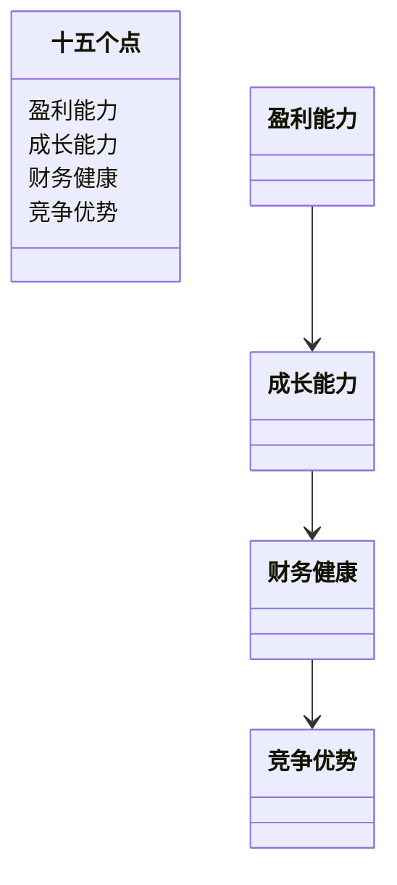
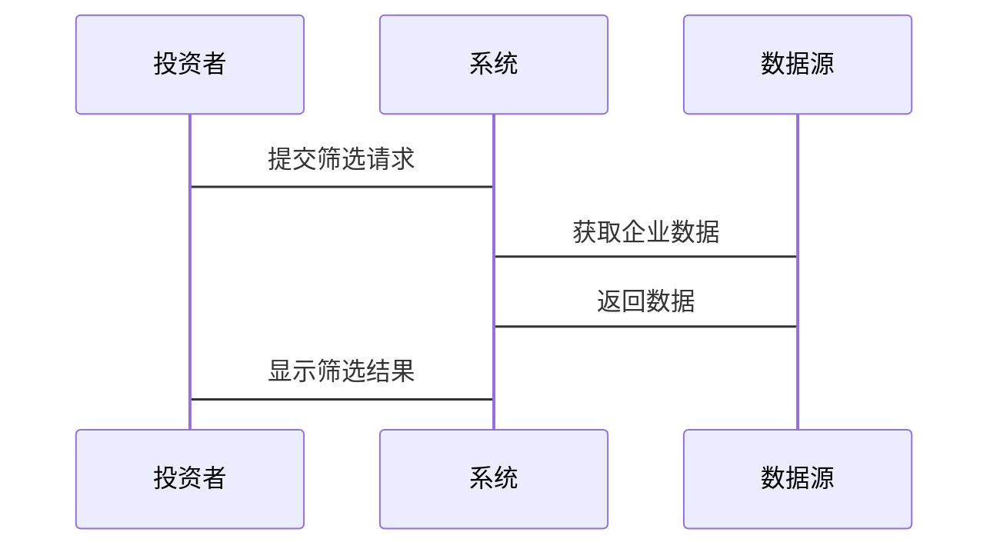

                 

# 费雪的“十五个点”在当代投资中的应用与调整

## 关键词：
费雪，十五个点，投资策略，风险管理，现代投资，投资调整

## 摘要：
本文深入分析了费雪的“十五个点”投资筛选方法在当代投资环境中的应用与调整。通过结合现代投资理论和实际案例，探讨了如何优化传统方法以适应当前市场变化，特别是在风险管理、技术分析和动态调整方面进行了详细阐述。文章结构清晰，内容详实，旨在为投资者提供实用的策略和建议。

---

## # 第一章：引言

### # 1.1 费雪的投资理念概述

#### # 1.1.1 投资学的基本原理
投资学作为一门研究如何有效配置资源以实现财富增长的学科，其核心在于理解和应用有效的投资策略。费雪的“十五个点”理论是这一领域的经典成果之一，它为投资者提供了一套系统的筛选标准。

#### # 1.1.2 十五个点的提出背景
20世纪中期，费雪提出了“十五个点”理论，旨在通过分析企业的多个维度来评估其投资价值。这一方法在当时具有开创性，为投资者提供了可操作的筛选标准。

#### # 1.1.3 十五个点的核心思想
费雪的理论强调长期投资和价值发现，认为通过筛选满足特定标准的企业，可以实现稳健的投资回报。核心思想包括企业盈利能力、成长潜力和财务健康等多方面的评估。

### # 1.2 当代投资环境的变化

#### # 1.2.1 经济全球化与投资环境的新特点
随着经济全球化的发展，市场环境变得更加复杂，企业面临的竞争和风险也显著增加。这些变化要求投资者必须调整传统的筛选标准。

#### # 1.2.2 技术进步对投资的影响
现代技术的发展，尤其是大数据和人工智能的应用，使得投资分析更加精准和高效。新的工具和技术为传统筛选方法的优化提供了可能。

#### # 1.2.3 投资者行为的变化
现代投资者的行为更加多样化，机构投资者和个人投资者的比例增加，投资者的需求和风险承受能力也更加多元化。

### # 1.3 十五个点在当代的应用价值

#### # 1.3.1 传统投资策略的局限性
传统的投资策略在面对复杂多变的市场时，往往显得不够灵活，难以适应快速变化的市场环境。

#### # 1.3.2 十五个点的现代意义
费雪的“十五个点”理论在现代投资中仍然具有重要的参考价值，尤其是在企业基本面分析和风险管理方面。

#### # 1.3.3 本书的目的与结构安排
本文旨在探讨如何调整和优化“十五个点”理论，使其更好地适应现代投资环境。结构安排包括理论分析、应用探讨、案例研究等多个部分。

---

## # 第二章：费雪“十五个点”的核心内容

### # 2.1 十五个点的定义与分类

#### # 2.1.1 十五个点的基本定义
费雪的“十五个点”包括企业盈利稳定性、成长潜力、财务健康等多个方面，每个点都代表一个筛选标准。

#### # 2.1.2 十五个点的分类与特点
十五个点可以分为盈利能力、成长能力、财务健康和竞争优势四大类，每类包含具体的评估指标。

#### # 2.1.3 十五个点的逻辑结构
通过逻辑结构图（类图）可以清晰地展示各类点之间的关系和相互作用。

### # 2.2 十五个点的理论基础

#### # 2.2.1 投资学的基本原理
投资学的核心原理包括资产定价、风险与收益的关系以及市场效率等，为“十五个点”理论提供了理论支持。

#### # 2.2.2 十五个点的经济学基础
基于经济学中的企业价值理论和市场行为分析，费雪提出了“十五个点”作为企业价值评估的工具。

#### # 2.2.3 十五个点的数学模型
通过数学模型可以量化各筛选标准，例如使用市盈率、市净率等指标进行评估。

### # 2.3 十五个点的优缺点分析

#### # 2.3.1 十五个点的优点
包括全面性、系统性和可操作性，能够帮助投资者全面评估企业的投资价值。

#### # 2.3.2 十五个点的局限性
过于严格的标准可能导致遗漏优质企业，且静态筛选忽视了动态变化。

#### # 2.3.3 十五个点的适用场景
适用于长期价值投资，尤其在成熟市场和稳定行业表现突出。

---

## # 第三章：十五个点的现代应用

### # 3.1 十五个点的现代应用

#### # 3.1.1 现代投资环境的挑战
包括全球化、技术进步和市场波动加剧等挑战，要求投资策略更具灵活性。

#### # 3.1.2 十五个点的现代优化
结合现代技术手段，优化筛选标准，动态调整投资组合。

#### # 3.1.3 十五个点的未来发展方向
随着AI和大数据的应用，未来的发展将更加智能化和个性化。

### # 3.2 十五个点在股票筛选中的应用

#### # 3.2.1 现代股票筛选的标准
包括盈利能力、成长潜力、财务健康和竞争优势等方面，结合现代技术进行动态评估。

#### # 3.2.2 筛选流程的优化
从数据收集到筛选评估，再到结果分析，每个环节都需要优化以提高效率和准确性。

#### # 3.2.3 应用案例分析
通过具体案例展示如何应用“十五个点”筛选优质股票，分析调整后的效果。

### # 3.3 十五个点在投资组合管理中的应用

#### # 3.3.1 投资组合的构建
基于筛选结果，构建多元化投资组合，分散风险，提高收益。

#### # 3.3.2 组合管理的动态调整
根据市场变化和企业动态，定期评估和调整投资组合，以维持最优配置。

#### # 3.3.3 风险管理的策略
通过组合管理和风险分散，降低整体投资风险，确保稳健回报。

---

## # 第四章：案例分析与经验总结

### # 4.1 案例分析

#### # 4.1.1 投资组合调整前后的对比
通过具体案例展示调整后的投资组合如何表现更好，分析调整策略的有效性。

#### # 4.1.2 调整过程中的关键决策
包括筛选标准的优化、权重的调整以及时机的选择，分析这些决策对结果的影响。

#### # 4.1.3 经验教训与总结
总结案例中的成功经验与失败教训，为未来投资策略的优化提供参考。

### # 4.2 经验总结

#### # 4.2.1 调整策略的有效性
分析调整后的策略在实际投资中的表现，评估其对投资回报的影响。

#### # 4.2.2 风险管理的重要性
强调在调整过程中风险管理的重要性，避免过度集中和市场波动带来的风险。

#### # 4.2.3 投资者的心理因素
分析投资者心理在调整过程中的作用，强调理性决策的重要性。

---

## # 第五章：系统设计与实现

### # 5.1 系统设计

#### # 5.1.1 系统架构设计
基于现代技术，设计一个投资筛选系统，包括数据收集、筛选评估和结果分析模块。

#### # 5.1.2 功能模块设计
功能模块包括数据输入、筛选标准设置、评估分析和结果展示等。

#### # 5.1.3 系统架构图
展示系统的整体架构，包括前端界面和后端处理模块。

### # 5.2 系统实现

#### # 5.2.1 环境安装
安装必要的软件和工具，如Python、数据处理库（Pandas、NumPy）和可视化工具（Matplotlib、Seaborn）。

#### # 5.2.2 核心代码实现
编写筛选标准的代码，实现数据处理和分析功能，生成评估结果。

#### # 5.2.3 代码解读与分析
详细解读代码，解释每个部分的功能和作用，分析其对投资决策的影响。

### # 5.3 应用解读与分析

#### # 5.3.1 系统功能展示
通过实际运行结果展示系统的功能，包括数据输入、筛选评估和结果输出。

#### # 5.3.2 动态调整的实现
展示如何通过系统进行动态调整，分析调整后的投资组合表现。

#### # 5.3.3 技术优势分析
对比传统方法，分析系统在效率、准确性和可扩展性方面的优势。

---

## # 第六章：结论与展望

### # 6.1 结论

#### # 6.1.1 费雪的“十五个点”在现代投资中的应用价值
总结费雪理论在现代投资中的应用，强调其优化和调整的重要性。

#### # 6.1.2 调整策略的成功与不足
分析调整策略在实际应用中的成果和存在的问题，为未来优化提供方向。

### # 6.2 未来展望

#### # 6.2.1 技术进步对投资策略的影响
随着AI和大数据技术的发展，投资策略将更加智能化和个性化。

#### # 6.2.2 投资理论的进一步发展
未来投资理论将更加注重动态调整和风险管理，结合现代技术实现更优的配置。

#### # 6.2.3 投资者的教育与培训
加强对投资者的教育，提高其对新策略和工具的理解和应用能力。

---

## # 作者：AI天才研究院/AI Genius Institute & 禅与计算机程序设计艺术 /Zen And The Art of Computer Programming

---

这篇文章详细探讨了费雪的“十五个点”理论在当代投资中的应用与调整，结合现代技术手段和实际案例，提供了系统的分析和实用的建议，帮助投资者在复杂多变的市场中实现稳健的投资回报。

