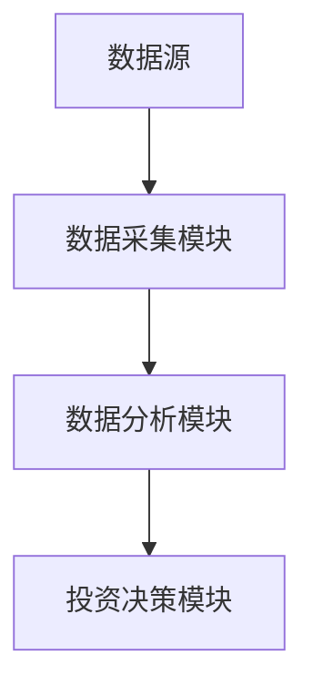

                 


# 费雪的'探索型投资'：发现未被市场认可的潜力股

> 关键词：探索型投资，彼得·费雪，成长股，潜力股，投资策略，风险管理

> 摘要：本文深入探讨了费雪的“探索型投资”策略，分析了其核心理念、筛选方法以及实际应用。通过结合费雪的投资哲学、成功案例和系统化方法，本文为读者提供了如何识别未被市场认可的潜力股的详细指导。文章还探讨了风险管理、投资组合构建以及探索型投资的未来发展方向。

---

## 第1章: 探索型投资的背景与核心理念

### 1.1 投资的基本概念

#### 1.1.1 投资的定义与分类
投资是指将资金投入到某个项目或资产中，以期获得未来收益的行为。根据投资对象的不同，投资可以分为股票、债券、房地产等多种类型。股票投资是最常见的形式之一，而探索型投资则是股票投资中的一个特定策略。

#### 1.1.2 传统投资与探索型投资的区别
传统投资通常基于价值评估和市场趋势，强调稳定性和低风险。而探索型投资则更注重发现那些尚未被市场广泛认可，但具备高增长潜力的公司。这种策略的风险较高，但潜在回报也更大。

#### 1.1.3 探索型投资的起源与发展
探索型投资的概念起源于20世纪，彼得·费雪是这一领域的先驱。他的成长股理论强调公司的成长性和盈利能力，而非仅仅关注市盈率等传统指标。

### 1.2 探索型投资的核心理念

#### 1.2.1 什么是探索型投资
探索型投资是一种主动投资策略，旨在通过深入研究和分析，发现那些被市场低估或尚未被广泛认知的高成长潜力公司。

#### 1.2.2 探索型投资的核心要素
- **成长性**：公司未来收入和利润的高增长潜力。
- **竞争优势**：公司在市场中的独特优势，如技术壁垒、成本优势等。
- **管理团队**：公司的管理层能力和战略规划。

#### 1.2.3 探索型投资的哲学与方法
探索型投资不仅仅是寻找股票，更是寻找那些能够改变行业格局的公司。这种方法要求投资者具备敏锐的洞察力和长期的视角。

### 1.3 为什么探索型投资值得研究

#### 1.3.1 当前市场环境的变化
随着科技的发展和市场的细分，新兴行业和创新型公司不断涌现，为探索型投资提供了丰富的标的。

#### 1.3.2 探索型投资的优势与不足
优势：高增长潜力，回报率高；不足：风险较高，需要深入研究。

#### 1.3.3 探索型投资的未来趋势
随着市场的成熟和信息的透明化，探索型投资将更加依赖于对公司的深度分析和长期跟踪。

---

## 第2章: 彼得·费雪的投资理念

### 2.1 费雪的投资哲学

#### 2.1.1 费雪的成长股投资理论
费雪认为，投资的回报主要来自公司的成长，而非市场的波动。他强调选择那些收入和利润持续增长的公司。

#### 2.1.2 费雪的投资策略
费雪的策略包括：
- 长期持有：避免频繁交易，减少成本。
- 分批买入：逐步建仓，分散风险。

#### 2.1.3 费雪的成功案例
费雪在20世纪50年代投资的德州仪器和西方电气等公司，均取得了显著的回报。

### 2.2 费雪的成长股筛选标准

#### 2.2.1 成长股的定义
成长股是指那些收入和利润持续以高于行业平均水平的速度增长的公司。

#### 2.2.2 成长股的筛选指标
- **收入增长率**：过去几年收入持续增长。
- **净利润增长率**：净利润持续增长。
- **ROE（净资产收益率）**：衡量公司盈利能力的重要指标。

#### 2.2.3 投资组合管理
费雪建议投资者分散投资，将资金分配到不同行业和阶段的公司中。

### 2.3 费雪投资理论的现代应用

#### 2.3.1 现代成长股投资
现代投资者可以利用大数据和量化工具，更高效地筛选成长股。

#### 2.3.2 费雪投资理论的局限性
- **市场波动**：成长股在市场波动中可能遭受更大的损失。
- **估值问题**：高增长的公司可能估值过高，导致投资回报不佳。

#### 2.3.3 未来发展方向
结合技术分析和基本面分析，优化成长股的筛选和投资策略。

---

## 第3章: 识别未被市场认可的潜力股

### 3.1 市场认知偏差与投资机会

#### 3.1.1 市场认知偏差的定义与表现
市场认知偏差是指投资者在决策过程中，由于心理因素影响，导致判断失误。

#### 3.1.2 市场认知偏差对投资机会的影响
- **忽视小公司**：市场可能低估小型成长公司的潜力。
- **过度关注大公司**：投资者可能过于关注已知的大公司，忽视新兴的小公司。

#### 3.1.3 如何利用市场认知偏差寻找投资机会
- **逆向思维**：寻找市场忽视的公司。
- **深入研究**：通过细致分析发现被低估的机会。

### 3.2 潜力股的特征

#### 3.2.1 潜力股的定义
潜力股是指那些当前被市场低估，但具备高成长潜力的股票。

#### 3.2.2 潜力股的特征
- **低市盈率**：相对于成长性，市盈率较低。
- **高ROE**：净资产收益率高。
- **稳定的收入增长**：过去几年收入持续增长。

#### 3.2.3 潜力股的分类
- **周期性潜力股**：周期性行业中的公司。
- **成长型潜力股**：高增长行业的公司。

### 3.3 探索型投资中的股票筛选方法

#### 3.3.1 基本面分析法
基本面分析包括对公司财务状况、行业地位和管理团队的分析。

#### 3.3.2 技术分析法
技术分析通过股票价格和成交量的变化，预测未来走势。

#### 3.3.3 综合分析法
结合基本面和技术分析，综合判断股票的投资价值。

---

## 第4章: 探索型投资的系统化方法

### 4.1 投资系统的构建

#### 4.1.1 投资系统的目标
构建一个能够持续筛选出潜力股的系统。

#### 4.1.2 投资系统的构成
- **数据采集模块**：收集公司财务数据和市场数据。
- **分析模块**：运用算法筛选出潜力股。
- **决策模块**：根据分析结果制定投资策略。

#### 4.1.3 投资系统的优化
通过回测和实证分析，不断优化筛选模型。

### 4.2 数据收集与分析

#### 4.2.1 数据来源
- **公开财报**：公司财务报表。
- **市场数据**：股票价格、成交量等。

#### 4.2.2 数据分析方法
- **财务指标分析**：ROE、收入增长率等。
- **趋势分析**：分析公司财务数据的变化趋势。

#### 4.2.3 数据分析工具
- **Excel**：常用的数据分析工具。
- **Python**：使用Pandas和NumPy进行数据分析。

### 4.3 投资决策模型

#### 4.3.1 模型的构建
- **筛选指标**：收入增长率、净利润增长率、ROE等。
- **权重分配**：根据重要性分配指标权重。

#### 4.3.2 模型的验证
通过历史数据验证模型的有效性。

#### 4.3.3 模型的优化
根据验证结果调整筛选指标和权重。

---

## 第5章: 探索型投资的实战案例

### 5.1 成功案例分析

#### 5.1.1 案例一：某科技公司
- **背景**：公司是一家新兴的科技公司，收入增长迅速。
- **分析**：ROE高，收入增长率快。
- **结果**：投资回报率高。

#### 5.1.2 案例二：某医药公司
- **背景**：公司专注于创新药研发。
- **分析**：高ROE，收入增长稳定。
- **结果**：长期持有获得丰厚回报。

### 5.2 失败案例分析

#### 5.2.1 案例：某互联网公司
- **背景**：公司曾是行业领先者，但管理问题导致业绩下滑。
- **分析**：ROE下降，收入增长停滞。
- **结果**：投资损失。

### 5.3 案例分析总结

#### 5.3.1 成功案例的共同点
- 高成长性。
- 良好的管理团队。

#### 5.3.2 失败案例的教训
- 管理问题。
- 市场环境变化。

#### 5.3.3 如何避免失败
- 深入研究公司管理。
- 保持对市场的敏感性。

---

## 第6章: 探索型投资的风险管理

### 6.1 风险的来源

#### 6.1.1 市场风险
市场波动可能导致股票价格下跌。

#### 6.1.2 个股风险
公司自身经营问题可能导致投资损失。

### 6.2 风险管理策略

#### 6.2.1 分散投资
将资金分配到不同的股票和行业。

#### 6.2.2 设置止损点
当股票价格下跌到一定程度时，卖出止损。

#### 6.2.3 定期评估
定期检查投资组合，调整持仓。

---

## 第7章: 探索型投资的系统架构设计

### 7.1 系统功能设计

#### 7.1.1 数据采集模块
- 从多种数据源获取公司财务数据和市场数据。

#### 7.1.2 数据分析模块
- 使用算法筛选出具备高成长潜力的公司。

#### 7.1.3 投资决策模块
- 根据分析结果制定投资策略。

### 7.2 系统架构设计

#### 7.2.1 模块划分
- 数据采集、数据分析、投资决策。

#### 7.2.2 数据流图


#### 7.2.3 系统交互设计
```mermaid
sequenceDiagram
    投资者 -> 数据采集模块: 提供数据源
    数据采集模块 -> 数据分析模块: 分析数据
    数据分析模块 -> 投资决策模块: 制定投资策略
    投资者 <- 投资决策模块: 提供投资建议
```

---

## 第8章: 探索型投资的最佳实践

### 8.1 小结
探索型投资是一种高风险高回报的投资策略，需要投资者具备深入的分析能力和长期的视角。

### 8.2 注意事项
- 风险控制：设置止损点，分散投资。
- 持续学习：关注行业动态，更新投资策略。

### 8.3 拓展阅读
- 《彼得·费雪的投资哲学》
- 《探索型投资的系统化方法》

---

## 作者信息

作者：AI天才研究院/AI Genius Institute & 禅与计算机程序设计艺术 /Zen And The Art of Computer Programming

---

以上是《费雪的'探索型投资'：发现未被市场认可的潜力股》的技术博客文章，涵盖了从理论到实践的各个方面，帮助读者全面理解探索型投资的核心理念和实际应用。

