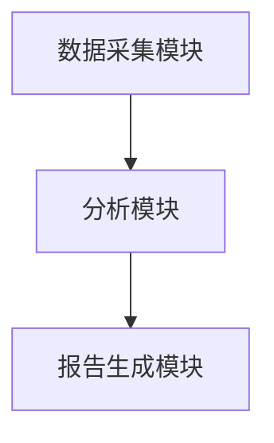

                 


# 《费雪的产业链分析技巧》

## 关键词：产业链分析，费雪分析法，产业价值链，竞争优势，投资机会

## 摘要：  
本文深入探讨了费雪的产业链分析技巧，从基础概念到实际应用，系统地介绍了如何通过产业链分析识别行业竞争优势和投资机会。文章结合理论与实践，详细讲解了产业链的核心要素、分析方法、数学模型和系统架构，并通过具体案例展示了如何在实际项目中应用这些技巧。

---

## 第一部分: 费雪的产业链分析基础

## 第1章: 产业链分析的基本概念

### 1.1 产业链的基本概念

#### 1.1.1 产业链的定义与特点  
产业链是指从原材料供应到最终产品交付的完整过程，包括上游、中游和下游三个主要环节。其特点包括：  
1. **链条性**：各环节相互依存，形成一个完整的生产链。  
2. **价值传递**：从上游到下游，价值逐步增加。  
3. **协同性**：各环节协同工作，确保产业链的高效运转。  

#### 1.1.2 产业链的构成要素  
产业链的构成要素包括：  
- **上游**：提供原材料和基础资源的企业。  
- **中游**：进行加工和制造的企业。  
- **下游**：面向终端消费者的企业。  

#### 1.1.3 产业链分析的必要性  
产业链分析有助于：  
1. **识别行业风险**：了解各环节的瓶颈和潜在风险。  
2. **优化资源配置**：通过分析各环节的效率，优化资源分配。  
3. **制定投资策略**：找到具有竞争优势的环节进行投资。  

### 1.2 费雪的产业链分析方法

#### 1.2.1 费雪分析法的起源与背景  
费雪（Philip Fisher）是20世纪著名的投资家，他提出了“成长股投资法”，其中产业链分析是其方法的重要组成部分。费雪认为，投资成功的关键在于选择具有持续增长潜力的企业，而产业链分析则是评估企业增长潜力的重要工具。

#### 1.2.2 费雪分析法的核心思想  
费雪的产业链分析强调：  
1. **竞争优势**：识别产业链中具有竞争优势的企业。  
2. **协同效应**：分析产业链各环节之间的协同效应。  
3. **长期增长**：关注那些能够持续增长的行业和企业。  

#### 1.2.3 费雪分析法的应用范围  
费雪分析法广泛应用于：  
- **投资决策**：帮助投资者选择具有竞争优势的企业。  
- **行业分析**：分析行业结构，识别行业趋势。  
- **企业战略**：帮助企业制定长期发展战略。  

---

## 第2章: 产业链分析的核心要素

### 2.1 产业链的上游环节

#### 2.1.1 上游环节的定义与特点  
上游环节是产业链的起点，主要包括原材料供应和基础资源提供。其特点包括：  
1. **基础性**：上游环节是整个产业链的基础。  
2. **波动性**：原材料价格波动较大，影响整个产业链的成本。  

#### 2.1.2 上游环节的关键要素分析  
1. **原材料价格**：原材料价格的波动对整个产业链的成本影响较大。  
2. **供应商集中度**：供应商集中度高的上游环节更容易形成垄断，影响价格和供应稳定性。  

#### 2.1.3 上游环节对产业链的影响  
1. **成本影响**：上游环节的成本直接影响整个产业链的利润。  
2. **供应链稳定性**：上游环节的稳定性对整个产业链的运行至关重要。  

### 2.2 产业链的中游环节

#### 2.2.1 中游环节的定义与特点  
中游环节是产业链的核心部分，主要包括加工和制造。其特点包括：  
1. **增值性**：中游环节通过加工和制造，实现价值增值。  
2. **技术依赖性**：中游环节的技术水平直接影响产品的竞争力。  

#### 2.2.2 中游环节的关键要素分析  
1. **技术水平**：技术水平高的中游环节更具竞争力。  
2. **生产效率**：生产效率高的中游环节能够降低成本，提高利润。  

#### 2.2.3 中游环节对产业链的影响  
1. **成本控制**：中游环节的成本控制能力直接影响整个产业链的成本。  
2. **产品竞争力**：中游环节的产品竞争力影响整个产业链的市场表现。  

---

## 第3章: 费雪的产业链分析方法

### 3.1 费雪的产业链分析步骤

#### 3.1.1 确定产业链的关键环节  
在进行产业链分析时，首先需要确定产业链的关键环节。例如，在汽车产业链中，关键环节包括零部件制造、整车制造等。  

#### 3.1.2 分析各环节的竞争优势  
接下来，需要分析各环节的竞争优势，包括成本优势、技术优势等。  

#### 3.1.3 识别协同效应  
协同效应是指产业链各环节之间相互合作，共同提升整体竞争力。  

#### 3.1.4 制定投资策略  
根据分析结果，制定投资策略，选择具有竞争优势的企业进行投资。  

### 3.2 费雪分析法的数学模型

#### 3.2.1 成本分析模型  
成本分析模型用于评估产业链各环节的成本。  
公式：$$ \text{总成本} = \sum (\text{原材料成本} + \text{加工成本}) $$  

#### 3.2.2 利润率分析模型  
利润率分析模型用于评估企业的盈利能力。  
公式：$$ \text{利润率} = \frac{\text{净利润}}{\text{营业收入}} \times 100\% $$  

---

## 第4章: 系统分析与架构设计

### 4.1 系统功能设计

#### 4.1.1 领域模型设计  
领域模型设计包括产业链各环节的实体关系。  
- **上游环节**：原材料供应商、基础资源提供者。  
- **中游环节**：加工企业、制造企业。  
- **下游环节**：分销商、零售商。  

#### 4.1.2 功能模块设计  
功能模块包括：  
1. **数据采集模块**：采集产业链各环节的数据。  
2. **分析模块**：对数据进行分析，识别竞争优势。  
3. **报告生成模块**：生成分析报告。  

### 4.2 系统架构设计

#### 4.2.1 架构图  
以下是系统架构图：  



---

## 第5章: 项目实战

### 5.1 项目背景

#### 5.1.1 项目目标  
通过分析新能源汽车产业链，识别具有竞争优势的企业。  

#### 5.1.2 数据获取  
数据来源包括行业报告、企业财报等。  

### 5.2 核心代码实现

#### 5.2.1 环境安装  
需要安装Python和相关库（如Pandas、Matplotlib）。  

#### 5.2.2 核心代码  
以下是Python代码：  

```python
import pandas as pd
import matplotlib.pyplot as plt

# 数据获取
data = pd.read_csv('产业链数据.csv')

# 成本分析
cost_analysis = data.groupby('环节')['成本'].sum()
print('成本分析结果：', cost_analysis)

# 可视化
cost_analysis.plot(kind='bar', figsize=(10, 6))
plt.title('产业链各环节成本分析')
plt.xlabel('环节')
plt.ylabel('成本')
plt.show()
```

#### 5.2.3 代码解读  
- 数据获取：从CSV文件中读取数据。  
- 成本分析：按环节分组，计算各环节的成本。  
- 可视化：绘制柱状图，展示各环节的成本。  

### 5.3 案例分析

#### 5.3.1 分析结果  
通过分析，新能源汽车产业链中游的电池制造环节具有较高的竞争优势。  

#### 5.3.2 投资建议  
建议投资者关注电池制造环节的企业，如宁德时代。  

---

## 第6章: 最佳实践

### 6.1 小结  
费雪的产业链分析技巧是一种有效的工具，能够帮助投资者和企业识别行业竞争优势和投资机会。  

### 6.2 注意事项  
- 数据的准确性和完整性对分析结果至关重要。  
- 分析过程中需要结合行业特点和实际背景。  

### 6.3 拓展阅读  
- 《费雪的投资哲学》  
- 《产业链分析与企业战略》  

---

## 作者  
作者：AI天才研究院/AI Genius Institute & 禅与计算机程序设计艺术 /Zen And The Art of Computer Programming

