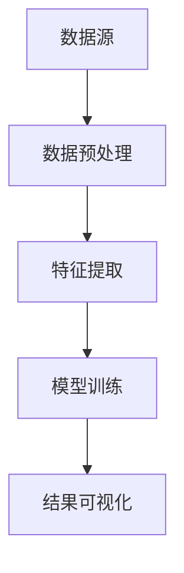

                 

# 费雪的产品生命周期分析在投资中的应用

> 关键词：产品生命周期，投资分析，费雪理论，财务指标，投资策略

> 摘要：本文深入探讨了费雪的产品生命周期理论在投资分析中的应用，通过详细分析产品的四个阶段（引入期、成长期、成熟期、衰退期），结合财务指标和系统架构，构建了产品生命周期分析的框架，并通过实际案例展示了如何将理论应用于投资决策，同时探讨了风险管理与未来趋势。

---

## 第一章：产品生命周期概述

### 1.1 费雪产品生命周期理论的起源

#### 1.1.1 理论背景与提出者介绍
费雪的产品生命周期理论由著名经济学家菲利普·费雪提出，该理论将产品视为一个有机体，经历引入、成长、成熟和衰退四个阶段。费雪认为，投资者应关注企业的成长潜力，而非仅仅依赖当前的财务表现。

#### 1.1.2 理论的核心思想与意义
费雪的理论强调，产品的生命周期直接影响企业的收入、利润和增长潜力。通过识别产品所处的阶段，投资者可以更好地评估其投资价值。

#### 1.1.3 费雪理论在投资分析中的应用范围
该理论广泛应用于股票分析、行业分析和投资组合管理中，帮助投资者识别高增长企业，避免投资衰退期企业。

### 1.2 产品生命周期的核心概念

#### 1.2.1 产品生命周期的定义与阶段划分
产品生命周期定义为从引入市场到最终被淘汰的阶段变化。四个阶段分别为引入期、成长期、成熟期和衰退期。

#### 1.2.2 不同阶段的特征与表现
- **引入期**：市场需求小，企业研发投入大，收入低，亏损可能较大。
- **成长期**：需求快速增长，收入和利润大幅上升。
- **成熟期**：市场需求饱和，竞争加剧，利润增速放缓。
- **衰退期**：需求下降，企业可能面临利润减少甚至亏损。

#### 1.2.3 产品生命周期与企业价值的关系
产品的生命周期阶段直接影响企业的财务表现和投资价值。成长期和成熟期企业通常具有较高的投资价值。

### 1.3 产品生命周期分析在投资中的重要性

#### 1.3.1 投资决策中的周期性思维
投资者应根据产品生命周期阶段调整投资策略，避免在衰退期投资，而在成长期寻找机会。

#### 1.3.2 产品生命周期与企业成长的关系
企业成长与产品生命周期密切相关，处于成长期的企业通常具有更高的增长潜力。

#### 1.3.3 周期性视角对投资收益的影响
周期性思维帮助投资者识别市场趋势，优化资产配置，降低投资风险。

---

## 第二章：产品生命周期的四个阶段

### 2.1 引入期（Introduction Phase）

#### 2.1.1 引入期的特征与表现
市场需求小，企业研发投入大，收入低，亏损可能较大。

#### 2.1.2 市场反应与企业策略
企业需进行市场推广，建立品牌知名度，逐步扩大市场份额。

#### 2.1.3 投资机会与风险分析
风险高，但潜在回报大，投资者需谨慎评估企业的市场潜力。

### 2.2 成长期（Growth Phase）

#### 2.2.1 市场需求的快速增长
产品需求激增，企业收入和利润大幅上升。

#### 2.2.2 企业盈利的显著提升
企业盈利增加，市场份额扩大，投资价值显著提升。

#### 2.2.3 投资者的机会与挑战
投资者需抓住增长机遇，但也需警惕竞争加剧带来的风险。

### 2.3 成熟期（Maturity Phase）

#### 2.3.1 市场增长放缓
市场需求趋于饱和，产品价格稳定，竞争加剧。

#### 2.3.2 企业竞争加剧
企业面临降价压力和成本控制挑战，利润增速放缓。

#### 2.3.3 投资者的战略选择
投资者需评估企业的竞争优势，寻找具有持续创新能力的企业。

### 2.4 衰退期（Decline Phase）

#### 2.4.1 市场需求的萎缩
市场需求下降，企业收入和利润减少。

#### 2.4.2 企业的困境与转型
企业需寻找新的增长点，或逐步退出市场。

#### 2.4.3 投资者的退出策略
投资者需制定退出策略，避免进一步损失。

---

## 第三章：产品生命周期分析在投资中的应用框架

### 3.1 投资分析的周期性视角

#### 3.1.1 周期性思维在投资中的重要性
周期性思维帮助投资者识别市场趋势，优化资产配置。

#### 3.1.2 产品生命周期与资产配置的关系
根据产品生命周期阶段，调整资产配置策略，降低投资风险。

#### 3.1.3 不同周期阶段的投资策略调整
在引入期谨慎投资，成长期加大投入，成熟期稳健投资，衰退期逐步退出。

### 3.2 费雪分析法的核心步骤

#### 3.2.1 确定产品的生命周期阶段
通过分析财务指标和市场数据，识别产品所处的生命周期阶段。

#### 3.2.2 分析企业的财务表现
评估收入、利润、现金流等指标的变化趋势，判断企业成长潜力。

#### 3.2.3 评估企业的竞争优势
分析企业的市场地位、品牌影响力和创新能力，判断其持续发展能力。

---

## 第四章：产品生命周期分析的系统架构设计

### 4.1 系统分析与功能设计

#### 4.1.1 问题场景介绍
通过产品生命周期分析，帮助投资者制定科学的投资策略。

#### 4.1.2 系统功能设计
- 数据收集模块：收集企业的财务数据和市场信息。
- 特征提取模块：计算财务指标，识别产品生命周期阶段。
- 模型构建模块：使用机器学习算法分类产品阶段。
- 可视化模块：展示分析结果，辅助投资决策。

### 4.2 系统架构设计

#### 4.2.1 系统架构图

---

## 第五章：产品生命周期分析的实战案例

### 5.1 实战案例分析

#### 5.1.1 选择行业与企业
以科技行业为例，选择苹果公司进行分析。

#### 5.1.2 数据收集与分析
收集苹果过去五年的财务数据，分析收入和利润趋势，判断其处于成熟期。

#### 5.1.3 投资策略制定
根据成熟期特征，调整投资策略，关注企业的创新能力和竞争优势。

---

## 第六章：风险管理与投资策略

### 6.1 风险管理

#### 6.1.1 周期性波动带来的风险
产品生命周期的波动可能导致投资收益的不稳定。

#### 6.1.2 应对衰退期的策略
通过多元化投资和及时退出，降低衰退期带来的损失。

### 6.2 投资策略调整

#### 6.2.1 宏观经济环境的影响
根据宏观经济趋势调整投资策略，规避系统性风险。

#### 6.2.2 行业趋势与政策变化
关注行业发展趋势和政策变化，及时调整投资组合。

---

## 第七章：产品生命周期分析的未来展望

### 7.1 技术进步与产品生命周期

#### 7.1.1 数字化与智能化的影响
技术进步可能缩短产品生命周期，创造新的投资机会。

#### 7.1.2 新兴技术的市场应用
新兴技术如人工智能和区块链可能改变传统产品的生命周期。

### 7.2 产品生命周期分析的未来趋势

#### 7.2.1 数据驱动的分析方法
通过大数据和人工智能技术，提高产品生命周期分析的准确性。

#### 7.2.2 多因素分析模型
结合宏观经济、行业趋势和企业基本面，构建多因素分析模型。

---

## 第八章：结论与建议

### 8.1 总结

产品生命周期分析是投资决策的重要工具，帮助投资者识别投资机会和风险。通过深入分析产品所处的生命周期阶段，投资者可以制定科学的投资策略，优化资产配置。

### 8.2 投资建议

- 关注企业的财务表现和市场地位。
- 根据产品生命周期阶段调整投资策略。
- 多元化投资，分散风险。

---

## 参考文献

1. 费雪《如何选择成长股》
2. 投资学经典教材
3. 相关学术论文

---

作者：AI天才研究院 & 禅与计算机程序设计艺术

---

通过以上思考，我整理出了这篇文章的结构和内容。接下来，我将按照这个大纲撰写完整的技术博客，确保每个部分都详细展开，涵盖理论、分析、应用和案例，并提供实际的操作步骤和风险管理策略。

