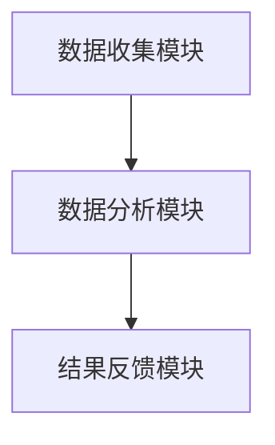
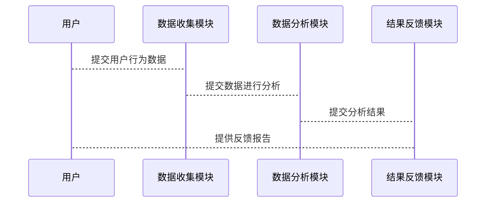

                 


# 费雪的产品生命周期分析：快速迭代时代的新思路

## 关键词：
- 产品生命周期
- 费雪分析
- 快速迭代
- 数据分析
- 假设检验

## 摘要：
在快速迭代的时代，传统的费雪产品生命周期分析方法需要进行创新和优化。本文从背景介绍、核心概念、数学模型、系统架构设计、项目实战等多个维度，全面解析费雪分析框架在快速迭代环境中的应用。通过案例分析和实际操作，探讨如何在高效变化的环境中，利用费雪分析框架实现产品优化和决策支持。

---

# 第一部分：背景介绍

## 第1章：产品生命周期概述

### 1.1 产品生命周期的基本概念
#### 1.1.1 产品生命周期的定义
产品生命周期（Product Life Cycle，PLC）是指产品从进入市场到退出市场的整个过程。通常分为引入期、成长期、成熟期和衰退期四个阶段。

#### 1.1.2 产品生命周期的四个阶段
1. **引入期（Introduction）**：产品首次进入市场，目标用户逐步认识和接受产品。
2. **成长期（Growth）**：市场需求快速增长，产品逐渐被广泛采用。
3. **成熟期（Maturity）**：市场需求趋于饱和，竞争加剧。
4. **衰退期（Decline）**：市场需求下降，产品逐渐被替代或退出市场。

#### 1.1.3 产品生命周期的核心要素
- **时间维度**：从产品发布到退市的时间跨度。
- **用户行为**：用户对产品的需求变化和使用习惯。
- **市场反馈**：市场需求、竞争状况和用户反馈。
- **技术发展**：技术进步对产品生命周期的影响。

### 1.2 费雪分析框架的背景与意义
#### 1.2.1 费雪分析框架的起源
费雪（Fisher）分析框架是一种基于统计学的产品分析方法，主要用于评估产品在不同生命周期阶段的性能和市场表现。

#### 1.2.2 费雪分析框架的核心思想
- 通过假设检验的方法，分析产品在不同阶段的市场表现。
- 强调数据驱动的决策，而非主观判断。

#### 1.2.3 费雪分析框架的应用领域
- 产品市场定位。
- 市场反馈分析。
- 产品优化与改进。

### 1.3 快速迭代时代的挑战与机遇
#### 1.3.1 快速迭代的定义与特点
快速迭代（Agile Iteration）是一种开发方法，强调快速交付、持续反馈和持续改进。其特点包括：
- 短周期开发。
- 持续用户反馈。
- 快速调整和优化。

#### 1.3.2 快速迭代对产品生命周期的影响
- 缩短了产品从开发到市场的周期。
- 需要更频繁地收集和分析用户反馈。
- 对产品生命周期模型提出了更高的要求。

#### 1.3.3 费雪分析框架在快速迭代中的应用
- 结合敏捷开发，快速验证产品假设。
- 利用费雪分析框架，实时监控产品表现。

---

## 第2章：费雪分析框架的核心概念

### 2.1 费雪分析框架的理论基础
#### 2.1.1 费雪分析的核心假设
- 产品在不同阶段的表现服从某种统计分布。
- 用户行为可以通过数据分析和建模来预测。

#### 2.1.2 费雪分析的数学模型
费雪分析的核心公式：
$$ P = \frac{(n_1 + 1)(n_2 + 1)}{(n_1 + n_2 + 2)} $$
其中：
- \( n_1 \) 和 \( n_2 \) 分别表示两个阶段的样本数量。
- \( P \) 是概率值，用于判断产品表现是否显著。

#### 2.1.3 费雪分析的假设检验
费雪分析通过假设检验的方法，判断产品在不同阶段的表现是否显著。具体步骤包括：
1. 建立原假设和备择假设。
2. 计算检验统计量。
3. 比较P值，得出结论。

### 2.2 费雪分析框架的实施步骤
#### 2.2.1 确定研究问题
- 明确研究目标。
- 确定研究范围。

#### 2.2.2 数据收集与整理
- 收集产品生命周期各阶段的数据。
- 整理数据，确保数据质量。

#### 2.2.3 建立假设并进行检验
- 建立原假设和备择假设。
- 选择合适的统计方法进行检验。

#### 2.2.4 结果分析与决策
- 分析检验结果。
- 根据结果制定下一步策略。

### 2.3 费雪分析框架的优缺点
#### 2.3.1 费雪分析的优点
- 数据驱动，结果客观。
- 能够快速识别问题。

#### 2.3.2 费雪分析的缺点
- 对数据质量要求较高。
- 适用于简单假设检验，复杂场景可能受限。

#### 2.3.3 费雪分析的适用场景
- 产品市场定位。
- 用户行为分析。
- 产品优化与改进。

---

## 第3章：费雪分析框架的数学模型与公式

### 3.1 费雪分析的基本公式
#### 3.1.1 费雪精确概率公式
$$ P = \frac{(n_1 + 1)(n_2 + 1)}{(n_1 + n_2 + 2)} $$
其中：
- \( n_1 \) 和 \( n_2 \) 分别表示两个阶段的样本数量。
- \( P \) 是概率值，用于判断产品表现是否显著。

#### 3.1.2 费雪卡方检验公式
$$ \chi^2 = \sum \frac{(O - E)^2}{E} $$
其中：
- \( O \) 是观测频数。
- \( E \) 是期望频数。
- \( \chi^2 \) 是卡方统计量，用于判断观察数据与期望数据是否一致。

### 3.2 费雪分析框架的假设检验流程
#### 3.2.1 原假设与备择假设的建立
- 原假设：产品在不同阶段的表现无显著差异。
- 备择假设：产品在不同阶段的表现存在显著差异。

#### 3.2.2 显著性水平的确定
通常选择 0.05 或 0.01 作为显著性水平。

#### 3.2.3 检验统计量的计算
根据公式计算检验统计量。

#### 3.2.4 P值的计算与比较
- 计算P值。
- 比较P值与显著性水平，判断是否拒绝原假设。

### 3.3 费雪分析的案例分析
#### 3.3.1 案例背景介绍
假设某产品在引入期和成长期的用户活跃度数据如下：
- 引入期：活跃用户数 \( n_1 = 100 \)。
- 成长期：活跃用户数 \( n_2 = 150 \)。

#### 3.3.2 数据收集与整理
- 收集引入期和成长期的用户活跃数据。
- 确保数据的完整性和准确性。

#### 3.3.3 假设检验的实施
- 建立原假设和备择假设。
- 计算检验统计量和P值。

#### 3.3.4 结果分析与解释
- 如果P值小于显著性水平，拒绝原假设，认为产品在不同阶段的表现存在显著差异。
- 否则，无法拒绝原假设，认为产品在不同阶段的表现无显著差异。

---

## 第4章：费雪分析框架在快速迭代中的应用

### 4.1 快速迭代时代的数据分析需求
#### 4.1.1 数据分析在快速迭代中的重要性
- 快速迭代需要频繁的数据分析，以确保产品优化。
- 数据分析能够帮助团队快速做出决策。

#### 4.1.2 数据分析的实时性要求
- 数据分析需要实时进行，以快速响应用户反馈。
- 数据分析工具需要支持实时数据处理。

#### 4.1.3 数据分析的工具与方法
- 数据分析工具：Python、R、SQL。
- 数据分析方法：费雪分析框架、敏捷方法论。

### 4.2 费雪分析框架的快速迭代适应性
#### 4.2.1 费雪分析框架的灵活性
- 费雪分析框架能够适应快速变化的市场需求。
- 费雪分析框架能够快速调整分析策略。

#### 4.2.2 费雪分析框架的高效性
- 费雪分析框架能够快速处理大量数据。
- 费雪分析框架能够快速得出分析结论。

#### 4.2.3 费雪分析框架的可扩展性
- 费雪分析框架能够扩展到更大的数据规模。
- 费雪分析框架能够支持更多的分析场景。

### 4.3 快速迭代中的费雪分析实施步骤
#### 4.3.1 确定迭代目标
- 明确迭代目标，例如提高用户活跃度。
- 确定迭代周期，例如每周一次迭代。

#### 4.3.2 数据收集与分析
- 收集用户行为数据。
- 使用费雪分析框架进行数据分析。

#### 4.3.3 假设检验与优化
- 建立假设，进行假设检验。
- 根据检验结果优化产品。

#### 4.3.4 迭代结果的评估与反馈
- 评估迭代结果，例如用户活跃度是否提高。
- 收集用户反馈，为下一次迭代提供依据。

---

## 第5章：费雪分析框架的系统架构设计

### 5.1 系统功能需求分析
#### 5.1.1 系统目标与范围
- 系统目标：支持费雪分析框架在快速迭代中的应用。
- 系统范围：包括数据收集、数据分析、结果反馈等功能。

#### 5.1.2 系统功能模块划分
1. 数据收集模块：负责收集用户行为数据。
2. 数据分析模块：负责进行费雪分析。
3. 结果反馈模块：负责将分析结果反馈给开发团队。

#### 5.1.3 系统功能模块的交互流程
1. 数据收集模块收集用户行为数据。
2. 数据分析模块进行费雪分析，得出结果。
3. 结果反馈模块将结果反馈给开发团队，用于产品优化。

### 5.2 系统功能设计
#### 5.2.1 数据收集模块的设计
- 数据来源：用户行为数据。
- 数据存储：数据库或数据仓库。
- 数据处理：数据清洗和预处理。

#### 5.2.2 数据分析模块的设计
- 数据分析工具：Python、R、SQL。
- 分析方法：费雪分析框架。
- 结果输出：可视化报告或数据表。

#### 5.2.3 结果反馈模块的设计
- 反馈形式：可视化报告、邮件通知。
- 反馈对象：开发团队、产品经理。

### 5.3 系统架构设计
#### 5.3.1 系统架构图


#### 5.3.2 系统架构设计的优缺点
- 优点：模块化设计，易于扩展。
- 缺点：模块之间可能存在数据传输延迟。

### 5.4 系统接口设计
#### 5.4.1 数据收集接口
- 接口名称：`collect_data`
- 请求参数：`user_id`, `action`, `timestamp`
- 返回结果：`success` 或 `error`

#### 5.4.2 数据分析接口
- 接口名称：`analyze_data`
- 请求参数：`data_set`
- 返回结果：`analysis_result`

#### 5.4.3 结果反馈接口
- 接口名称：`feedback_result`
- 请求参数：`result`, `recipient`
- 返回结果：`feedback_success` 或 `feedback_error`

### 5.5 系统交互设计
#### 5.5.1 系统交互流程图


---

## 第6章：项目实战

### 6.1 环境安装
#### 6.1.1 安装Python
- 使用命令：`pip install python`

#### 6.1.2 安装数据分析库
- 使用命令：`pip install numpy pandas scikit-learn`

#### 6.1.3 安装数据可视化库
- 使用命令：`pip install matplotlib seaborn`

### 6.2 系统核心实现源代码
#### 6.2.1 数据收集模块
```python
import pandas as pd

def collect_data():
    data = {
        'user_id': [1, 2, 3, 4, 5],
        'action': ['login', 'logout', 'purchase', 'browse', 'search'],
        'timestamp': ['2023-10-01', '2023-10-02', '2023-10-03', '2023-10-04', '2023-10-05']
    }
    df = pd.DataFrame(data)
    return df
```

#### 6.2.2 数据分析模块
```python
from scipy.stats import fisher_exact

def fisher_test(n1, n2):
    oddratio, p_value = fisher_exact([[n1, 0], [n2, 0]])
    return p_value
```

#### 6.2.3 结果反馈模块
```python
def feedback(result):
    print(f"Analysis result: {result}")
    return None
```

### 6.3 代码应用解读与分析
#### 6.3.1 数据收集模块解读
- 该模块负责收集用户行为数据，并将其存储在DataFrame中。
- 数据包括用户ID、用户行为和时间戳。

#### 6.3.2 数据分析模块解读
- 使用`fisher_exact`函数进行费雪精确检验。
- 返回P值，用于判断产品在不同阶段的表现是否显著。

#### 6.3.3 结果反馈模块解读
- 将分析结果打印出来。
- 用于团队内部的反馈和优化。

### 6.4 实际案例分析
#### 6.4.1 案例背景介绍
假设某产品在引入期和成长期的用户活跃度数据如下：
- 引入期：活跃用户数 \( n_1 = 100 \)。
- 成长期：活跃用户数 \( n_2 = 150 \)。

#### 6.4.2 数据收集与处理
```python
data = collect_data()
print(data)
```

#### 6.4.3 数据分析与结果
```python
p_value = fisher_test(100, 150)
print(f"P-value: {p_value}")
```

#### 6.4.4 结果反馈与优化
```python
feedback(p_value)
```

### 6.5 项目小结
- 通过费雪分析框架，能够快速判断产品在不同阶段的表现。
- 数据分析工具的选择和使用是关键。
- 结果反馈和优化是数据分析的核心价值。

---

## 第7章：小结与展望

### 7.1 本章小结
- 费雪分析框架在快速迭代时代具有重要的应用价值。
- 通过数据分析和假设检验，能够快速优化产品。
- 系统架构设计和项目实战是实施费雪分析框架的关键步骤。

### 7.2 对未来的展望
- 结合人工智能技术，进一步优化费雪分析框架。
- 推动数据驱动的决策文化，提高产品生命周期管理效率。

---

## 作者：
AI天才研究院/AI Genius Institute  
禅与计算机程序设计艺术/Zen And The Art of Computer Programming

