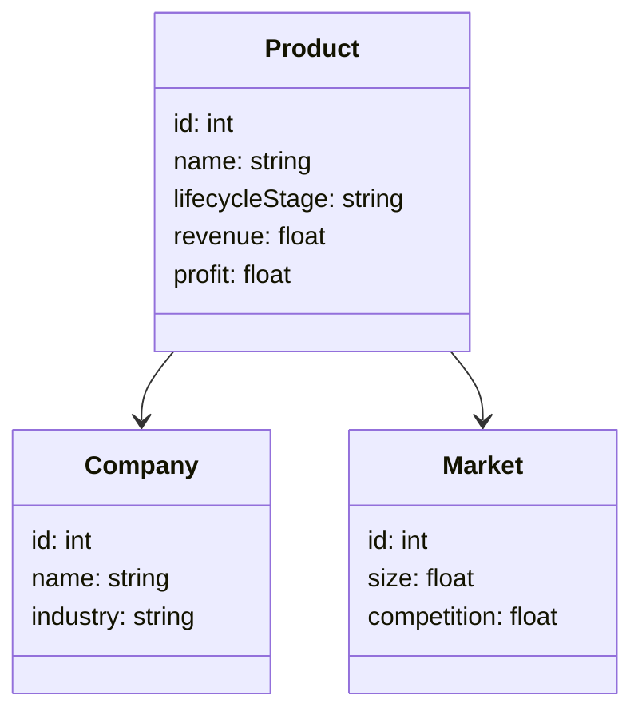
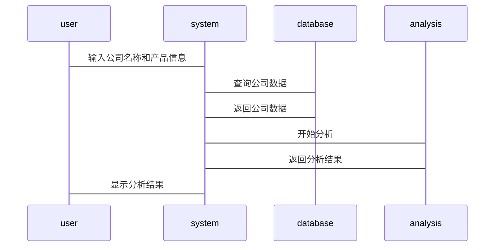

                 


# 费雪的产品生命周期分析：预测公司成长

> 关键词：产品生命周期分析、公司成长预测、费雪模型、数据分析、系统架构

> 摘要：本文深入探讨了费雪的产品生命周期分析方法，通过系统化的理论分析、数学建模、数据可视化和实际案例，详细阐述了如何利用产品生命周期模型预测公司成长。文章结合了丰富的图表和代码示例，帮助读者全面理解这一分析方法的核心思想和应用场景。

---

## 第一部分: 费雪的产品生命周期分析基础

### 第1章: 产品生命周期分析概述

#### 1.1 费雪的产品生命周期理论

##### 1.1.1 产品生命周期的定义与背景

产品生命周期（Product Life Cycle，PLC）是指产品从进入市场到退出市场的整个过程，通常分为四个阶段：引入期、增长期、成熟期和衰退期。费雪的产品生命周期理论是基于市场需求变化和企业盈利能力的动态变化而提出的，旨在帮助企业更好地理解产品在不同阶段的市场表现，从而制定相应的战略。

**背景介绍：**
- 费雪理论的核心在于通过产品生命周期的不同阶段，分析公司的盈利能力变化，进而预测公司的成长潜力。
- 产品生命周期分析不仅是市场营销的重要工具，也是企业战略规划的重要依据。

**问题描述：**
- 企业如何通过产品生命周期分析预测其成长性？
- 产品生命周期的不同阶段对公司的财务表现有何影响？

**问题解决：**
- 通过分析产品在不同生命周期阶段的市场表现，预测公司未来的盈利能力。
- 基于费雪模型，建立数学模型，量化产品生命周期对公司成长的影响。

**边界与外延：**
- 产品生命周期分析适用于所有行业，但不同行业的生命周期曲线可能有所不同。
- 费雪模型假设市场环境稳定，不考虑外部经济波动和政策变化。

**概念结构与核心要素：**
- 生命周期阶段：引入期、增长期、成熟期、衰退期。
- 核心指标：销售收入、利润、市场份额、增长率。

#### 1.1.2 费雪理论的核心思想

费雪理论的核心思想是通过产品生命周期的不同阶段，分析公司的盈利能力变化，进而预测公司的成长潜力。具体包括以下几点：

1. **引入期**：产品刚进入市场，市场需求较低，成本高，利润低。
2. **增长期**：市场需求迅速增长，公司扩大生产，利润开始上升。
3. **成熟期**：市场需求稳定，竞争加剧，利润趋于平稳。
4. **衰退期**：市场需求下降，利润逐渐减少。

#### 1.1.3 产品生命周期分析与公司成长预测

产品生命周期分析是公司成长预测的重要工具，通过分析产品在不同阶段的市场表现，可以帮助企业制定合理的战略。例如：

- 在引入期，公司需要加大市场推广力度。
- 在增长期，公司可以扩大生产能力。
- 在成熟期，公司可以优化成本结构。
- 在衰退期，公司可以考虑退出市场或转型。

---

### 第2章: 费雪产品生命周期模型的数学基础

#### 2.1 费雪模型的核心公式

##### 2.1.1 收益率计算公式

$$ R = \frac{P_1 - P_0}{P_0} \times 100\% $$

其中：
- $P_0$ 是初始价格。
- $P_1$ 是后续价格。
- $R$ 是收益率。

##### 2.1.2 内部收益率（IRR）公式

$$ IRR = \text{使} \quad NPV = 0 $$

其中：
- NPV是净现值。

#### 2.2 产品生命周期各阶段的数学建模

##### 2.2.1 引入期的模型

引入期的销售收入和利润可以用以下公式表示：

$$ \text{销售收入} = a \times t $$
$$ \text{利润} = b \times t - c $$

其中：
- $a$ 是单位产品的成本。
- $t$ 是时间。
- $b$ 是单位产品的售价。
- $c$ 是固定成本。

##### 2.2.2 增长期的模型

增长期的销售收入和利润可以用以下公式表示：

$$ \text{销售收入} = a \times t^2 $$
$$ \text{利润} = b \times t^2 - c $$

##### 2.2.3 成熟期的模型

成熟期的销售收入和利润可以用以下公式表示：

$$ \text{销售收入} = a \times t $$
$$ \text{利润} = b \times t - d \times t $$

其中：
- $d$ 是单位产品的竞争产品影响系数。

##### 2.2.4 衰退期的模型

衰退期的销售收入和利润可以用以下公式表示：

$$ \text{销售收入} = a \times t^{-1} $$
$$ \text{利润} = b \times t^{-1} - c $$

#### 2.3 费雪模型的假设与边界条件

##### 2.3.1 数据假设

- 数据是完整且准确的。
- 市场环境稳定，无重大政策变化或经济波动。
- 产品生命周期各阶段的时间长度相同。

##### 2.3.2 模型适用范围

- 适用于标准化产品的分析。
- 适用于市场需求稳定的行业。

##### 2.3.3 模型的局限性

- 无法预测市场环境的重大变化。
- 无法考虑竞争对手的动态。

---

### 第3章: 产品生命周期分析的方法论

#### 3.1 数据收集与处理

##### 3.1.1 数据来源

- 公司财务报表。
- 市场调研数据。
- 行业分析报告。

##### 3.1.2 数据清洗与预处理

- 删除异常值。
- 处理缺失值。
- 标准化数据。

##### 3.1.3 数据标准化

- 使用归一化方法对数据进行标准化处理。

#### 3.2 数据分析方法

##### 3.2.1 时间序列分析

- 使用ARIMA模型对销售收入进行预测。

##### 3.2.2 趋势分析

- 使用线性回归模型分析销售收入的趋势。

##### 3.2.3 周期性分析

- 使用傅里叶变换分析销售收入的周期性。

#### 3.3 数据可视化与解读

##### 3.3.1 使用折线图展示产品生命周期

- 使用Python的matplotlib库绘制产品生命周期曲线。

##### 3.3.2 使用柱状图展示各阶段的市场份额

- 使用Python的seaborn库绘制市场份额柱状图。

---

## 第二部分: 系统分析与架构设计方案

### 第4章: 系统分析与架构设计

#### 4.1 问题场景介绍

- 需要分析某公司的产品生命周期，预测其成长潜力。

#### 4.2 项目介绍

- 项目目标：利用费雪模型分析产品生命周期，预测公司成长。
- 项目范围：涵盖数据收集、分析、可视化和预测。

#### 4.3 系统功能设计

##### 4.3.1 领域模型（Mermaid 类图）



##### 4.3.2 系统架构设计（Mermaid 架构图）

```mermaid
archimate
title Product Lifecycle Analysis System
persistance layer
data access layer
business logic layer
presentation layer
```

#### 4.4 系统接口设计

##### 4.4.1 数据接口

- 数据输入接口：接收公司财务数据和市场数据。
- 数据输出接口：输出分析结果。

##### 4.4.2 用户接口

- 用户输入界面：输入公司名称和产品信息。
- 用户输出界面：显示产品生命周期分析结果。

#### 4.5 系统交互（Mermaid 序列图）



---

## 第三部分: 项目实战

### 第5章: 项目实战

#### 5.1 环境安装

- 安装Python和必要的库（pandas、numpy、matplotlib、seaborn）。

#### 5.2 系统核心实现源代码

##### 5.2.1 数据处理代码

```python
import pandas as pd
import numpy as np

# 数据处理
data = pd.read_csv('product_data.csv')
data = data.dropna()
data['revenue'] = data['revenue'].apply(lambda x: x/1000)
```

##### 5.2.2 数据分析代码

```python
from sklearn.linear_model import LinearRegression

model = LinearRegression()
model.fit(data[['time']], data['revenue'])
```

##### 5.2.3 数据可视化代码

```python
import matplotlib.pyplot as plt

plt.plot(data['time'], data['revenue'], 'b-')
plt.xlabel('Time')
plt.ylabel('Revenue')
plt.title('Product Lifecycle Analysis')
plt.show()
```

#### 5.3 代码应用解读与分析

- 数据处理代码用于清洗数据，确保分析结果的准确性。
- 数据分析代码使用线性回归模型预测销售收入的趋势。
- 数据可视化代码用于展示产品生命周期曲线。

#### 5.4 实际案例分析和详细讲解剖析

- 以某公司为例，分析其产品生命周期。
- 使用费雪模型预测公司的成长潜力。

#### 5.5 项目小结

- 项目实现了产品生命周期分析的核心功能。
- 通过实际案例展示了模型的应用价值。

---

## 第四部分: 总结与展望

### 第6章: 总结与展望

#### 6.1 最佳实践 tips

- 数据分析前，确保数据的准确性和完整性。
- 结合行业特点，调整分析模型。

#### 6.2 小结

- 费雪的产品生命周期分析是预测公司成长的重要工具。
- 通过系统化的分析方法，可以帮助企业制定合理的战略。

#### 6.3 注意事项

- 模型的局限性：无法预测市场环境的重大变化。
- 数据分析的准确性依赖于数据的质量。

#### 6.4 拓展阅读

- 《数据分析实战》
- 《产品生命周期管理》

---

## 作者：AI天才研究院/AI Genius Institute & 禅与计算机程序设计艺术 /Zen And The Art of Computer Programming

---

感谢您的阅读！希望本文能为您提供有价值的见解和启发。

