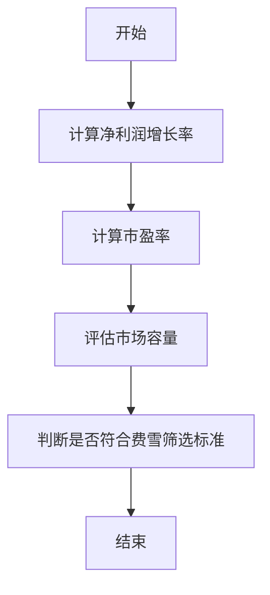
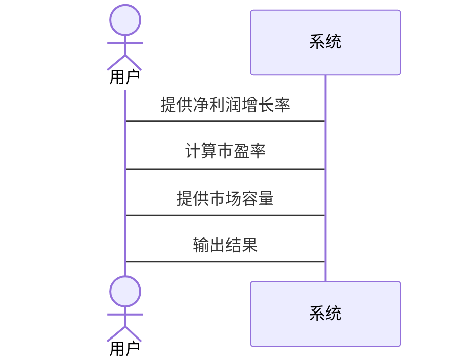

                 


# 费雪的优质成长股特征

---

## 关键词

- 费雪投资理念
- 成长股特征
- 净利润增长率
- 市盈率
- 投资决策系统

---

## 摘要

本文系统阐述了费雪的优质成长股特征，从投资理念、筛选标准到数学模型、系统设计，全面解析如何识别和投资优质成长股。文章结合理论与实践，提供详细的算法流程图和代码示例，帮助读者掌握费雪的成长股筛选方法，并通过实际案例分析，深入理解其投资策略。

---

# 目录大纲

---

## 第1章: 费雪投资理念与成长股基础

### 1.1 费雪的投资哲学与方法

- 费雪的投资理念起源
- 成长股的定义与核心特征
- 费雪与成长股投资的关联

### 1.2 成长股的定义与特征

- 成长股的定义
- 成长股的核心特征
- 成长股与价值股的对比

### 1.3 费雪对成长股的筛选标准

- 盈利能力分析
- 成长性评估
- 行业地位与竞争优势

### 1.4 费雪投资理念的实际应用

- 成长股投资的逻辑框架
- 费雪筛选模型的步骤
- 费雪投资理念的优缺点

### 1.5 本章小结

---

## 第2章: 费雪的成长股筛选标准

### 2.1 盈利能力分析

- 净利润与ROE分析
- 收入增长与利润率的关系
- 盈利能力的量化指标

### 2.2 成长性评估

- 市场增长率与公司增长率
- 盈利增长的持续性
- 市场容量与公司潜力

### 2.3 行业地位与竞争优势

- 行业集中度分析
- 市场份额与品牌优势
- 行业周期与公司战略

### 2.4 费雪筛选模型的数学公式

- 净利润增长率公式
- 市盈率与成长性的关系
- 市场容量与公司潜力的数学模型

### 2.5 本章小结

---

## 第3章: 费雪成长股投资的数学模型与算法

### 3.1 费雪筛选模型的数学表达

- 净利润增长率公式
  $$\text{净利润增长率} = \frac{\text{本期净利润} - \text{上期净利润}}{\text{上期净利润}} \times 100\%$$
- 市盈率与成长性的关系
  $$\text{市盈率} = \frac{\text{股价}}{\text{每股收益}}$$
- 市场容量与公司潜力的数学模型
  $$\text{市场容量} = \text{行业规模} \times \text{公司市场份额}$$

### 3.2 算法流程图



### 3.3 算法实现代码

```python
def fisher_growth_analysis(net_profit_prev, net_profit_curr, market_size, company_share):
    # 计算净利润增长率
    net_profit_growth = ((net_profit_curr - net_profit_prev) / net_profit_prev) * 100
    # 计算市盈率
    eps = net_profit_curr / market_size
    pe_ratio = (market_size * 100) / eps  # 示例市盈率计算
    # 评估市场容量
    market_capacity = market_size * company_share
    # 判断是否符合费雪筛选标准
    if net_profit_growth > 15 and pe_ratio < 15 and market_capacity > 1000:
        return "符合优质成长股特征"
    else:
        return "不符合优质成长股特征"
```

### 3.4 本章小结

---

## 第4章: 费雪成长股投资的系统分析与架构设计

### 4.1 问题场景介绍

- 成长股投资的复杂性
- 系统化筛选的必要性
- 投资决策系统的功能需求

### 4.2 系统功能设计

- 领域模型设计
  ```mermaid
  classDiagram
  class 成长股筛选系统 {
    净利润增长率
    市盈率
    市场容量
  }
  ```

- 系统架构设计
  ```mermaid
  graph TD
  A[用户] --> B[前端界面]
  B --> C[筛选模块]
  C --> D[后端逻辑]
  D --> E[数据库]
  E --> F[结果输出]
  ```

### 4.3 系统接口设计

- 输入接口：净利润增长率、市盈率、市场容量
- 输出接口：是否符合优质成长股特征

### 4.4 系统交互设计



### 4.5 本章小结

---

## 第5章: 项目实战——费雪成长股筛选系统实现

### 5.1 环境安装

- 安装Python与必要的库
  ```bash
  pip install numpy pandas matplotlib
  ```

### 5.2 系统核心实现源代码

```python
import pandas as pd

def load_data(file_path):
    return pd.read_csv(file_path)

def calculate_profit_growth(data):
    return data['净利润'].pct_change() * 100

def calculate_pe_ratio(data):
    return data['股价'] / data['每股收益']

def main():
    data = load_data('stock_data.csv')
    growth = calculate_profit_growth(data)
    pe = calculate_pe_ratio(data)
    selected_stocks = data[growth > 15 & pe < 15]
    print(selected_stocks)

if __name__ == "__main__":
    main()
```

### 5.3 代码应用解读与分析

- 数据加载与预处理
- 净利润增长率计算
- 市盈率计算
- 筛选结果输出

### 5.4 实际案例分析

- 案例：苹果公司
- 数据分析与结果解读

### 5.5 项目小结

---

## 第6章: 费雪成长股投资的注意事项与最佳实践

### 6.1 小结

- 费雪投资理念的核心要点
- 成长股筛选的关键因素
- 系统化投资的优势

### 6.2 注意事项

- 数据的准确性和及时性
- 市场环境的变化影响
- 风险管理的重要性

### 6.3 拓展阅读

- 费雪的经典著作推荐
- 其他成长股筛选方法
- 投资组合管理策略

### 6.4 本章小结

---

## 作者：AI天才研究院/AI Genius Institute & 禅与计算机程序设计艺术 /Zen And The Art of Computer Programming

--- 

希望这个大纲能为您提供清晰的写作思路和结构参考！

