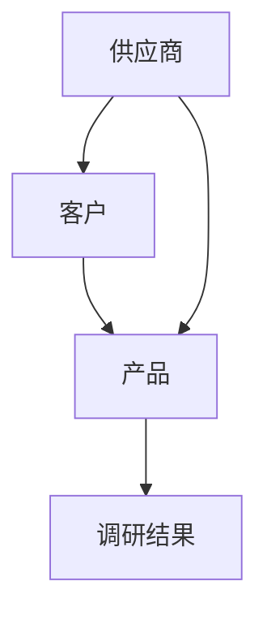
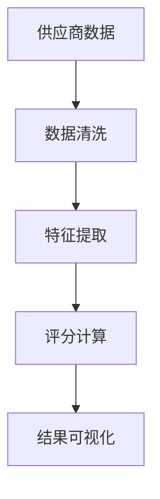
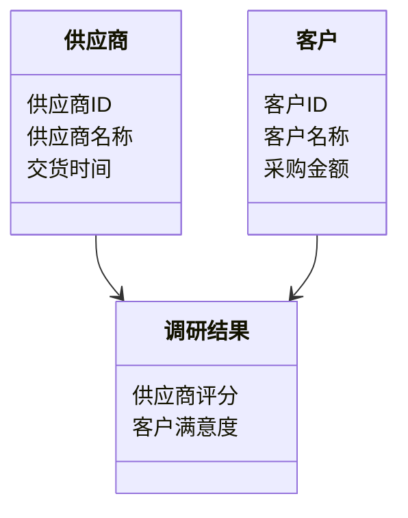
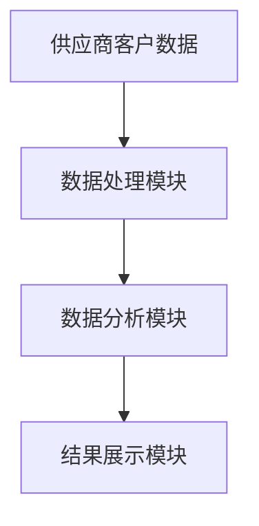

                 


```markdown
# 费雪的供应商客户调研：360度了解公司

> 关键词：供应商调研，客户调研，费雪方法，企业分析，数据分析

> 摘要：本文介绍费雪的供应商客户调研方法，从供应商和客户的多维度数据分析，构建企业画像，识别潜在风险，提供管理建议。通过系统化方法和工具，结合数据分析和可视化，实现企业全方位了解。

---

# 目录

## 第1章 背景介绍

### 1.1 问题背景

#### 1.1.1 供应商和客户调研的重要性
- 供应商和客户是企业运营的关键环节
- 调研数据是企业决策的基础
- 费雪调研方法的提出背景

#### 1.1.2 当前企业调研的痛点
- 数据分散，缺乏系统性
- 调研方法单一，结果不全面
- 调研成本高，效率低

#### 1.1.3 费雪调研方法的提出
- 系统化调研方法
- 多维度数据分析
- 结果可视化

### 1.2 问题描述

#### 1.2.1 供应商和客户调研的核心问题
- 数据收集困难
- 数据分析复杂
- 结果应用有限

#### 1.2.2 调研数据的不完整性
- 数据孤岛
- 数据格式不统一
- 数据清洗困难

#### 1.2.3 调研方法的局限性
- 单一维度分析
- 结果缺乏深度
- 应用场景有限

### 1.3 问题解决

#### 1.3.1 费雪调研方法的优势
- 系统化调研流程
- 多维度数据分析
- 结果可视化

#### 1.3.2 费雪调研方法的具体步骤
- 数据收集
- 数据清洗
- 数据分析
- 结果呈现

#### 1.3.3 费雪调研方法的实际应用案例
- 某制造企业的应用
- 某零售企业的应用
- 某科技企业的应用

### 1.4 边界与外延

#### 1.4.1 费雪调研方法的适用范围
- 适用于制造业、零售业、科技业等
- 中小企业和大型企业均可应用
- 适用于供应商和客户调研

#### 1.4.2 费雪调研方法的局限性
- 数据量要求高
- 需要专业人员操作
- 成本较高

#### 1.4.3 费雪调研方法与其他调研方法的对比
- 对比问卷调研
- 对比访谈调研
- 对比数据分析

### 1.5 概念结构与核心要素

#### 1.5.1 费雪调研的核心要素
- 数据收集
- 数据分析
- 结果呈现

#### 1.5.2 调研数据的分类
- 供应商数据
- 客户数据
- 产品数据

#### 1.5.3 调研结果的呈现方式
- 数据可视化
- 报告呈现
- 互动分析

---

## 第2章 核心概念与联系

### 2.1 核心概念原理

#### 2.1.1 供应商调研的核心要素
- 供应商的基本信息
- 供应商的交付能力
- 供应商的信用状况

#### 2.1.2 客户调研的核心要素
- 客户的基本信息
- 客户的采购需求
- 客户的满意度

#### 2.1.3 供应商与客户之间的关系
- 供应商的产品质量影响客户满意度
- 供应商的交付能力影响客户采购计划
- 供应商的价格影响客户的成本

### 2.2 概念属性特征对比表格

| 概念       | 供应商调研 | 客户调研 | 共同点                  |
|------------|------------|----------|------------------------|
| 数据类型    | 供应商ID、供应商名称、交货时间 | 客户ID、客户名称、采购金额 | 数据类型多样              |
| 调研目的    | 评估供应商能力 | 了解客户需求 | 为企业决策提供支持    |
| 调研方法    | 调查问卷、数据分析 | 访谈、数据分析 | 数据分析是主要方法    |

### 2.3 ER实体关系图架构



---

## 第3章 算法原理讲解

### 3.1 算法原理

#### 3.1.1 供应商评分模型



#### 3.1.2 加权评分公式

$$
\text{供应商评分} = \sum (\text{特征权重} \times \text{特征值})
$$

### 3.2 算法实现

#### 3.2.1 Python代码实现

```python
import pandas as pd

# 数据加载
data = pd.read_csv('供应商客户数据.csv')

# 数据清洗
data = data.dropna()
data = data.drop_duplicates()

# 特征提取
features = ['供应商ID', '交货时间', '质量评分']

# 加权评分计算
weights = {'供应商ID': 0.3, '交货时间': 0.4, '质量评分': 0.3}
supplier_score = data[features].apply(lambda x: sum(weights[f] * x[f] for f in features), axis=1)

# 结果可视化
import matplotlib.pyplot as plt
plt.hist(supplier_score)
plt.show()
```

---

## 第4章 系统分析与架构设计

### 4.1 系统功能设计

#### 4.1.1 领域模型



#### 4.1.2 系统架构设计



---

## 第5章 项目实战

### 5.1 环境安装

- 安装Python和必要的库：pandas、numpy、matplotlib
- 安装Jupyter Notebook

### 5.2 核心代码实现

```python
# 数据处理模块
import pandas as pd

data = pd.read_csv('供应商客户数据.csv')
data_clean = data.dropna().drop_duplicates()

# 数据分析模块
from sklearn import preprocessing
encoder = preprocessing.LabelEncoder()
data_encoded = data_clean.apply(encoder.fit_transform)

# 结果展示模块
import matplotlib.pyplot as plt

supplier_score = data_encoded['供应商评分']
plt.hist(supplier_score, bins=10)
plt.show()
```

---

## 第6章 最佳实践

### 6.1 小结

- 费雪调研方法的优势
- 数据分析的关键作用
- 可视化结果的重要性

### 6.2 注意事项

- 数据清洗的重要性
- 特征选择的策略
- 结果解读的技巧

### 6.3 扩展阅读

- 数据分析的高级方法
- 供应商客户关系管理（SCM）
- 数据可视化工具的深入应用

---

# 作者

作者：AI天才研究院/AI Genius Institute & 禅与计算机程序设计艺术 /Zen And The Art of Computer Programming
```

