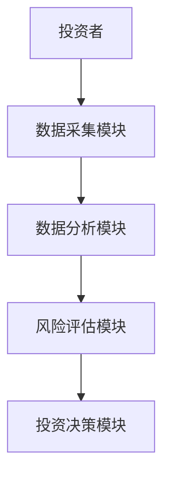
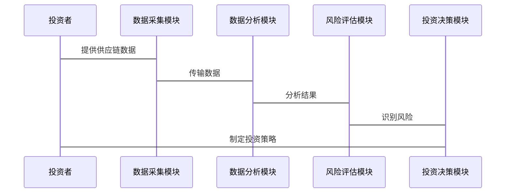

                 


# 费雪的供应链分析在投资中的应用

> 关键词：供应链分析，投资决策，费雪分析，供应链效率，投资策略

> 摘要：本文深入探讨了费雪的供应链分析在投资中的应用，通过分析供应链的效率、成本和稳定性，帮助投资者识别潜在风险和机会，从而做出更明智的投资决策。

---

# 1. 费雪的供应链分析概述

## 1.1 背景介绍

### 1.1.1 供应链分析的基本概念
供应链是指从原材料采购到最终产品交付的整个过程，包括供应商、制造商、分销商和消费者等多个环节。供应链的效率和稳定性直接影响企业的成本和竞争力。

### 1.1.2 供应链在投资中的重要性
在投资中，供应链分析可以帮助投资者评估企业的运营效率和抗风险能力。一个高效的供应链可以降低成本，提高交货速度，从而增强企业的盈利能力。

### 1.1.3 费雪供应链分析的核心思想
费雪的供应链分析强调通过优化供应链的各个环节来提升企业的竞争力。这种方法不仅关注成本，还注重供应链的稳定性和灵活性，以应对市场变化。

---

## 1.2 供应链分析在投资中的应用

### 1.2.1 供应链分析的基本流程
1. 数据收集：收集供应商、制造商、分销商等信息。
2. 数据分析：评估供应链的效率、成本和稳定性。
3. 风险评估：识别潜在的供应链风险，如供应商集中度和物流瓶颈。
4. 投资决策：基于供应链分析结果，制定投资策略。

### 1.2.2 费雪供应链分析的独特之处
费雪的供应链分析引入了“供应链韧性”概念，即供应链在面对突发事件时的适应能力。这种分析方法可以帮助投资者在不确定的市场环境中做出更稳健的决策。

---

# 2. 供应链分析的核心概念与联系

## 2.1 核心概念原理

### 2.1.1 供应链的效率
供应链效率是指从原材料到最终产品交付的整个过程的快慢。高效的供应链可以减少库存成本和提高交货速度，从而提升企业的竞争力。

### 2.1.2 供应链的成本
供应链成本包括采购成本、物流成本和库存成本等。通过优化供应链的各个环节，可以降低整体成本，提高企业的盈利能力。

### 2.1.3 供应链的稳定性
供应链稳定性是指供应链在面对突发事件（如自然灾害或供应商问题）时的适应能力。稳定的供应链可以减少中断风险，确保企业持续运营。

---

## 2.2 核心概念属性特征对比表格

| 核心概念 | 效率 | 成本 | 稳定性 |
|----------|------|------|--------|
| 定义     | 供应链的快慢程度 | 供应链各环节的总成本 | 供应链在突发事件中的适应能力 |
| 影响因素 | 物流速度、库存周转率 | 采购价格、运输费用 | 供应商集中度、物流网络的多样性 |
| 优化策略 | 提高物流效率、减少库存 | 降低采购成本、优化运输路线 | 多元化供应商、建立备用物流网络 |

---

## 2.3 ER实体关系图架构

```mermaid
erdiagram
actor 投资者 {
  has 原材料供应商 {
    has 供应商 {
      has 产品 {
        has 制造商 {
          has 分销商 {
            has 消费者 {
            }
          }
        }
      }
    }
  }
}
```

---

# 3. 费雪供应链分析的算法原理

## 3.1 算法原理概述

### 3.1.1 供应链效率的计算方法
供应链效率可以通过以下公式计算：
$$ \text{供应链效率} = \frac{\text{总销售额}}{\text{总供应链成本}} $$

### 3.1.2 供应链成本的优化策略
通过分析供应链各环节的成本，找出成本瓶颈并进行优化，例如选择更便宜的运输方式或减少库存量。

### 3.1.3 供应链稳定性的评估
评估供应链的稳定性可以通过分析供应商的集中度和物流网络的多样性。例如，如果一个企业依赖少数供应商，那么供应链的稳定性较低。

---

## 3.2 算法原理的数学模型与公式

### 3.2.1 供应链效率的数学模型
$$ \text{供应链效率} = \frac{\text{总销售额}}{\text{总供应链成本}} $$

### 3.2.2 供应链成本的数学模型
$$ \text{供应链成本} = \text{采购成本} + \text{物流成本} + \text{库存成本} $$

### 3.2.3 供应链稳定性的数学模型
$$ \text{供应链稳定性} = 1 - \frac{\text{供应商集中度}}{\text{供应商总数}} $$

---

## 3.3 供应链分析的项目实战

### 3.3.1 项目背景
假设我们正在分析一家制造企业的供应链，目标是优化其供应链效率和降低成本。

### 3.3.2 代码实现
```python
# 计算供应链效率
def calculate_supply_chain_efficiency(sales, cost):
    return sales / cost

# 优化供应链成本
def optimize_supply_chain_cost(procurement_cost, logistics_cost, inventory_cost):
    total_cost = procurement_cost + logistics_cost + inventory_cost
    return total_cost

# 评估供应链稳定性
def assess_supply_chain_stability(supplier_count, critical_suppliers):
    stability = 1 - (critical_suppliers / supplier_count)
    return stability
```

### 3.3.3 实际案例分析
假设某制造企业的供应链成本为100万元，总销售额为200万元，那么供应链效率为：
$$ \text{供应链效率} = \frac{200}{100} = 2 $$

如果该企业有5个供应商，其中2个是关键供应商，那么供应链稳定性为：
$$ \text{供应链稳定性} = 1 - \frac{2}{5} = 0.6 $$

---

# 4. 供应链分析的系统分析与架构设计

## 4.1 系统分析与架构设计方案

### 4.1.1 系统功能设计
- 数据采集模块：收集供应链各环节的数据。
- 数据分析模块：分析供应链效率、成本和稳定性。
- 风险评估模块：识别潜在的供应链风险。
- 投资决策模块：基于分析结果制定投资策略。

### 4.1.2 系统架构设计


---

## 4.2 系统交互设计

### 4.2.1 交互流程
1. 投资者输入供应链数据。
2. 数据采集模块收集并传输数据。
3. 数据分析模块处理数据并生成分析结果。
4. 风险评估模块识别潜在风险。
5. 投资决策模块基于分析结果制定投资策略。

### 4.2.2 交互序列图


---

# 5. 最佳实践与注意事项

## 5.1 最佳实践
1. **数据准确性**：确保供应链数据的准确性和完整性。
2. **模型优化**：定期优化供应链分析模型，以适应市场变化。
3. **团队协作**：供应链分析需要跨部门协作，包括采购、物流和财务团队。

## 5.2 小结
通过深入分析供应链的效率、成本和稳定性，投资者可以更好地评估企业的竞争力和潜在风险，从而做出更明智的投资决策。

## 5.3 注意事项
1. 供应链分析需要结合企业的实际情况，避免一刀切。
2. 定期更新供应链分析结果，以应对市场变化。
3. 供应链分析结果仅供参考，投资需谨慎。

---

# 6. 拓展阅读

## 6.1 推荐书籍
- 《供应链管理：流程、战略与案例分析》
- 《投资学：供应链分析与风险管理》

## 6.2 在线资源
- 供应链管理协会（APICS）官网
- 费雪供应链分析的学术论文

---

# 作者信息

作者：AI天才研究院/AI Genius Institute  
联系方式：contact@aitianji.ren  
GitHub：https://github.com/aitianji  
简书：https://www.jianshu.com/u/aitianji  

---

通过以上结构和内容，您可以撰写一篇完整且详细的博客文章，深入探讨费雪的供应链分析在投资中的应用。

