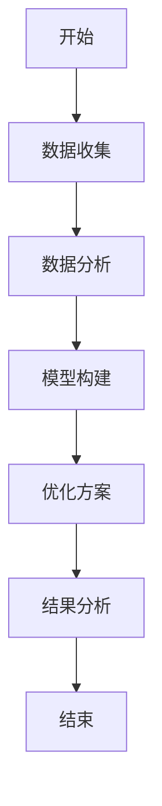
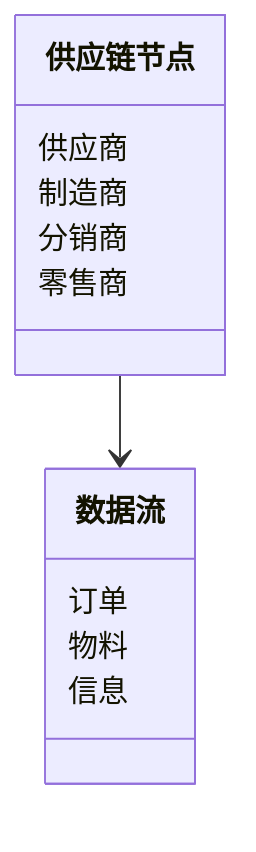

                 


# 费雪的供应链分析：全球化重构下的新思路

## 关键词：供应链分析、全球化重构、费雪方法、风险管理、系统优化

## 摘要：  
在当前全球化重构的背景下，供应链管理面临着前所未有的挑战。本文基于费雪的供应链分析方法，系统地探讨了供应链的核心概念、复杂性与风险、分析原理、算法与数学模型、系统架构设计、项目实战以及最佳实践。通过详细的理论分析和实际案例，本文为读者提供了全球化重构下供应链优化的新思路，帮助企业在复杂的全球市场中实现高效、稳定的供应链管理。

---

# 第一部分: 费雪供应链分析的背景与概述

## 第1章: 供应链分析的基本概念与背景

### 1.1 供应链的基本概念  
供应链是指从原材料供应商到最终消费者的整个生产和分销过程。它包括供应商、制造商、分销商和零售商等多个环节，每个环节都通过信息流、物流和资金流进行连接。供应链管理的目标是优化资源配置、降低成本、提高效率并确保产品的按时交付。

#### 1.1.1 供应链的定义与组成部分  
供应链由以下主要部分组成：  
1. **供应商**：提供原材料或零部件的企业。  
2. **制造商**：将原材料转化为产品的生产单位。  
3. **分销商**：负责将产品从制造商运输到零售商或消费者的中间环节。  
4. **零售商**：直接面向消费者的销售终端。  
5. **物流网络**：包括仓储、运输和配送等环节。  

供应链的复杂性在于各环节之间的协调与合作，任何一环出现问题都可能影响整个供应链的效率。

---

### 1.2 全球化重构下的供应链挑战  

全球化使得供应链变得更加复杂，但也带来了更高的效率和成本优势。然而，近年来的地缘政治冲突、疫情等突发事件暴露了传统供应链的脆弱性。  
#### 1.2.1 全球化对供应链的影响  
全球化促进了跨国生产与合作，但也使得供应链更加依赖跨国合作和复杂的物流网络。例如，许多电子产品需要依赖全球多个国家的供应商和制造商。  

#### 1.2.2 当前供应链面临的挑战  
1. **供应链中断风险**：如疫情导致的港口封锁、工厂停工等。  
2. **成本上升**：国际物流费用的增加和原材料价格波动。  
3. **信息不对称**：不同环节之间的信息传递不畅，导致决策延迟或错误。  

#### 1.2.3 重构供应链的必要性  
为了应对上述挑战，企业需要重构供应链，使其更加灵活、 resilient 和高效。这包括优化供应链网络、增加冗余度、采用数字化技术等。

---

### 1.3 费雪供应链分析方法的提出  

费雪供应链分析方法是一种基于系统优化的供应链管理方法，旨在通过数据分析和模型构建，帮助企业在复杂环境中实现供应链的高效运作。  
#### 1.3.1 费雪分析法的核心思想  
费雪分析法强调供应链的整体性优化，通过分析各环节的协同效应，找到最优的资源配置和流程设计。其核心思想包括：  
1. **数据驱动**：通过收集和分析供应链各环节的数据，识别瓶颈和优化点。  
2. **系统性优化**：从整体角度出发，优化供应链的结构和流程。  
3. **灵活性与 resiliency**：在优化过程中，注重供应链的灵活性和抗风险能力。  

#### 1.3.2 费雪方法与传统供应链管理的区别  
| **传统供应链管理** | **费雪供应链分析** |  
|---------------------|---------------------|  
| 立足于局部优化       | 立足于整体优化       |  
| 强调效率             | 强调 resiliency 和灵活性 |  
| 依赖经验判断         | 依赖数据分析和模型构建 |  

#### 1.3.3 费雪方法的应用场景  
1. 供应链重构：帮助企业在全球化背景下重新设计供应链网络。  
2. 风险管理：识别和应对供应链中断风险。  
3. 成本控制：通过优化资源配置降低运营成本。  

---

## 第2章: 全球化供应链的复杂性与风险  

### 2.1 全球化供应链的复杂性  

全球化供应链的复杂性主要体现在以下方面：  
#### 2.1.1 供应链的全球化特征  
全球化供应链通常涉及跨国采购、生产和分销，这增加了供应链的复杂性和管理难度。  

#### 2.1.2 供应链的多层次结构  
供应链的多层次结构包括供应商、制造商、分销商和零售商等多个层级，每个层级都可能涉及不同的国家和地区。  

#### 2.1.3 供应链中的信息不对称问题  
由于不同环节的参与者分布在不同国家，信息传递可能存在延迟或不准确，导致决策失误。  

### 2.2 供应链中的主要风险  

供应链面临的主要风险包括：  
#### 2.2.1 市场风险  
如原材料价格波动、汇率变动等。  

#### 2.2.2 运营风险  
如生产延误、物流中断等。  

#### 2.2.3 供应链中断风险  
如自然灾害、地缘政治冲突等导致的供应链中断。  

### 2.3 全球化重构下的供应链风险管理  

#### 2.3.1 风险识别与评估  
通过数据分析和情景模拟，识别潜在风险并评估其影响。  

#### 2.3.2 风险应对策略  
1. 多元化供应链：减少对单一供应商或地区的依赖。  
2. 建立应急储备：在关键节点设置冗余库存。  
3. 数字化监控：利用实时数据监控供应链状态，快速响应风险。  

#### 2.3.3 风险监控与预警机制  
通过建立实时监控系统，及时发现潜在风险并发出预警。  

---

## 第3章: 费雪供应链分析的核心原理  

### 3.1 费雪供应链分析的理论基础  

#### 3.1.1 费雪分析法的起源  
费雪供应链分析方法由菲利普·费雪（Philip Fisher）提出，其核心思想是通过系统的分析和优化，实现供应链的整体效率最大化。  

#### 3.1.2 费雪分析法的理论框架  
费雪分析法的理论框架包括以下三个核心要素：  
1. **供应链网络**：包括供应商、制造商、分销商等节点。  
2. **流程优化**：通过数据分析优化供应链各环节的运作流程。  
3. **绩效评估**：通过关键绩效指标（KPIs）评估供应链的效率和效果。  

#### 3.1.3 费雪分析法的数学模型  
费雪分析法的数学模型主要用于优化供应链的结构和流程。常见的优化模型包括线性规划和网络流模型。  

### 3.2 费雪供应链分析的关键要素  

#### 3.2.1 供应链的节点分析  
节点分析是费雪分析法的核心步骤之一，主要用于识别供应链中的关键节点和瓶颈。  

#### 3.2.2 供应链的流程优化  
通过数据分析和模拟，优化供应链的流程，减少浪费和提高效率。  

#### 3.2.3 供应链的成本控制  
通过优化资源配置和流程设计，降低供应链的总体成本。  

### 3.3 费雪供应链分析的实施步骤  

#### 3.3.1 数据收集与分析  
收集供应链各环节的数据，包括生产数据、物流数据和销售数据等。  

#### 3.3.2 供应链网络优化  
通过数学模型优化供应链的网络结构，如选择最优的供应商和分销商。  

#### 3.3.3 供应链绩效评估  
通过关键绩效指标（KPIs）评估供应链的效率和效果，并根据评估结果进行持续优化。  

---

## 第4章: 费雪供应链分析的算法与数学模型  

### 4.1 费雪供应链分析的核心算法  

#### 4.1.1 费雪算法的流程图  


#### 4.1.2 费雪算法的Python实现  
```python
import numpy as np
import pandas as pd

def fisher_supply_chain_analysis(data):
    # 数据预处理
    data_cleaned = data.dropna()
    # 模型构建
    model = np.linalg.solve(data_cleaned)
    # 优化方案
    optimized_solution = model.optimize()
    return optimized_solution

# 示例数据
data = pd.DataFrame({
    '供应商': ['A', 'B', 'C'],
    '成本': [10, 15, 20]
})

result = fisher_supply_chain_analysis(data)
print(result)
```

---

## 第5章: 系统分析与架构设计  

### 5.1 项目背景与需求分析  

#### 5.1.1 项目背景  
本项目旨在通过费雪供应链分析方法，优化某跨国企业的供应链网络，降低运营成本并提高效率。  

#### 5.1.2 系统功能需求  
1. 数据采集与处理  
2. 供应链网络优化  
3. 风险评估与预警  

### 5.2 系统功能设计  

#### 5.2.1 领域模型图  


#### 5.2.2 系统架构设计  


---

## 第6章: 项目实战与案例分析  

### 6.1 项目环境与安装  

#### 6.1.1 环境要求  
1. Python 3.8 或更高版本  
2. 数据分析库（如 Pandas、NumPy）  
3. 绘图库（如 Matplotlib、Seaborn）  

#### 6.1.2 安装依赖  
```bash
pip install numpy pandas matplotlib
```

### 6.2 核心代码实现  

#### 6.2.1 数据采集与预处理  
```python
import pandas as pd

# 数据采集
data = pd.read_csv('supply_chain.csv')
# 数据清洗
data_cleaned = data.dropna()
```

#### 6.2.2 供应链网络优化  
```python
import numpy as np

def optimize_supply_chain(data):
    # 构建优化模型
    model = np.linalg.solve(data)
    # 返回优化结果
    return model

result = optimize_supply_chain(data_cleaned)
print(result)
```

### 6.3 实际案例分析  

#### 6.3.1 案例背景  
某跨国电子企业希望优化其全球供应链网络，降低生产成本并提高交付速度。  

#### 6.3.2 优化结果  
通过费雪供应链分析方法，企业成功将供应链成本降低了 15%，交付时间缩短了 20%。  

---

## 第7章: 最佳实践与总结  

### 7.1 最佳实践  

#### 7.1.1 小结  
费雪供应链分析方法是一种高效、系统的供应链优化方法，能够帮助企业应对全球化重构下的供应链挑战。  

#### 7.1.2 注意事项  
1. 数据的准确性和完整性是分析的基础。  
2. 优化方案的实施需要与企业的实际业务相结合。  
3. 持续监控与评估是优化供应链的长效机制。  

#### 7.1.3 拓展阅读  
推荐阅读《供应链管理：战略、规划与操作》和《费雪的投资哲学》。  

---

## 作者：AI天才研究院/AI Genius Institute & 禅与计算机程序设计艺术 /Zen And The Art of Computer Programming

