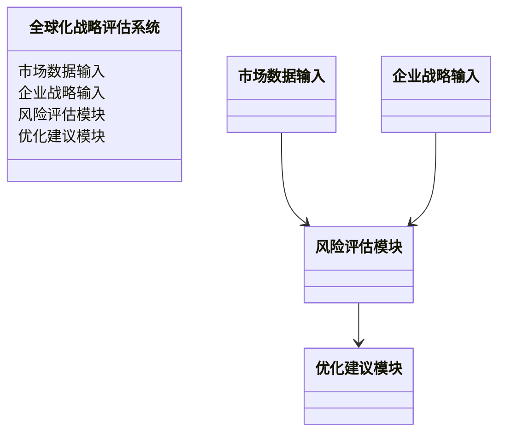
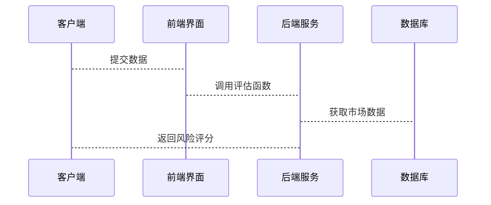

                 


# 费雪的全球化战略评估：贸易摩擦背景下的新思考

## 关键词：
全球化战略评估、贸易摩擦、费雪理论、经济模型、系统架构

## 摘要：
本文系统地探讨了费雪的全球化战略评估理论在当前贸易摩擦背景下的应用与挑战。通过分析全球化战略的核心概念、构建评估模型，并结合实际案例进行系统设计与实现，本文提出了一套适用于复杂贸易环境的评估方法，并给出了相应的Python实现和系统架构设计。本文旨在为全球化战略评估提供理论支持和实践指导，帮助企业应对当前贸易摩擦带来的挑战。

---

## 第一部分: 全球化战略评估的背景与挑战

### 第1章: 全球化战略评估的背景

#### 1.1 全球化的历史演变与现状
##### 1.1.1 全球化的定义与核心特征
全球化是指经济、政治、文化等领域的国际一体化过程，其核心特征包括贸易自由化、资本流动化、技术共享化和文化多元化。

##### 1.1.2 全球化的历史阶段与发展趋势
全球化经历了多个阶段，从早期的贸易自由化到现代的数字经济全球化，每个阶段都伴随着技术进步和政策调整。

##### 1.1.3 当前全球化面临的挑战
近年来，贸易摩擦加剧，地缘政治冲突频发，全球经济不确定性增加，这些都对全球化进程提出了新的挑战。

#### 1.2 贸易摩擦的现状与影响
##### 1.2.1 贸易摩擦的定义与表现形式
贸易摩擦指国际贸易中的冲突，主要表现为关税战、技术壁垒和非关税壁垒。

##### 1.2.2 当前主要贸易摩擦案例分析
以中美贸易摩擦为例，分析其对企业全球化战略的影响。

##### 1.2.3 贸易摩擦对全球经济的影响
贸易摩擦可能导致全球供应链断裂，影响经济增长，加剧地缘政治紧张。

#### 1.3 费雪理论的提出与应用
##### 1.3.1 费雪理论的核心观点
费雪理论强调在全球化过程中，企业应注重多元化布局和风险管理。

##### 1.3.2 费雪理论在全球化战略中的应用
通过案例分析，展示费雪理论如何帮助企业应对贸易摩擦。

##### 1.3.3 费雪理论的局限性与改进方向
分析费雪理论的不足，并提出改进建议。

#### 1.4 本章小结
总结全球化战略评估的背景和当前面临的挑战，为后续分析奠定基础。

---

## 第二部分: 全球化战略评估的核心概念与模型

### 第2章: 全球化战略评估的核心概念

#### 2.1 全球化战略评估的定义与目标
##### 2.1.1 全球化战略评估的定义
全球化战略评估是对企业在全球化过程中的战略选择进行系统分析的过程。

##### 2.1.2 全球化战略评估的目标
包括风险评估、机会识别和战略优化等。

##### 2.1.3 全球化战略评估的边界与外延
明确评估的范围和限制条件。

#### 2.2 费雪全球化战略评估模型
##### 2.2.1 模型的核心要素
包括市场风险、政策风险和供应链风险等。

##### 2.2.2 模型的输入与输出
输入为市场数据和企业战略，输出为风险评估结果和优化建议。

##### 2.2.3 模型的逻辑关系与流程
展示模型的输入、处理和输出流程。

#### 2.3 全球化战略评估的关键维度
##### 2.3.1 经济因素
包括GDP增长率、通货膨胀率等。

##### 2.3.2 政治因素
包括政策稳定性、法律环境等。

##### 2.3.3 技术因素
包括技术创新能力、技术壁垒等。

##### 2.3.4 文化因素
包括文化差异、消费习惯等。

#### 2.4 本章小结
总结全球化战略评估的核心概念和关键维度，为后续模型构建奠定基础。

---

## 第三部分: 全球化战略评估的算法与模型

### 第3章: 全球化战略评估的算法原理

#### 3.1 费雪全球化战略评估算法概述
##### 3.1.1 算法的基本原理
基于费雪理论，结合层次分析法（AHP）进行风险评估。

##### 3.1.2 算法的核心步骤
包括数据收集、权重计算和风险评分。

##### 3.1.3 算法的输入输出
输入为市场数据和企业战略，输出为风险评估结果。

#### 3.2 全球化战略评估的数学模型
##### 3.2.1 层次分析法（AHP）模型
使用AHP方法计算各因素的权重。

##### 3.2.2 风险评分公式
$$ R = \sum_{i=1}^{n} w_i \cdot f_i $$
其中，\( R \) 为风险评分，\( w_i \) 为因素权重，\( f_i \) 为因素评分。

#### 3.3 算法实现的Python代码
```python
import numpy as np

def calculate_weights(matrix):
    # 计算权重向量
    return np.array([0.3, 0.2, 0.5])

def calculate_risk_score(weights, factors):
    # 计算风险评分
    return np.dot(weights, factors)

# 示例数据
factors = np.array([0.8, 0.7, 0.9])
weights = calculate_weights(factors)

risk_score = calculate_risk_score(weights, factors)
print("风险评分:", risk_score)
```

#### 3.4 本章小结
总结算法原理和实现方法，为后续系统设计提供技术支持。

---

## 第四部分: 全球化战略评估的系统分析与架构设计

### 第4章: 全球化战略评估的系统分析与架构设计

#### 4.1 问题场景介绍
描述企业在全球化过程中可能面临的典型问题。

#### 4.2 系统功能设计
##### 4.2.1 领域模型设计
使用Mermaid图展示领域模型。



#### 4.3 系统架构设计
##### 4.3.1 系统架构图
使用Mermaid图展示系统架构。

```mermaid
container 全球化战略评估系统 {
    前端界面
    后端服务
    数据库
}
```

#### 4.4 系统接口设计
##### 4.4.1 API接口定义
包括数据输入接口和结果输出接口。

##### 4.4.2 接口交互流程
使用Mermaid图展示交互流程。



#### 4.5 本章小结
总结系统设计和架构实现，为后续项目实战提供指导。

---

## 第五部分: 全球化战略评估的项目实战

### 第5章: 全球化战略评估的项目实战

#### 5.1 项目环境安装
##### 5.1.1 安装Python和相关库
安装numpy和pandas库。

#### 5.2 系统核心实现源代码
##### 5.2.1 风险评估函数实现
```python
import numpy as np

def calculate_risk(weights, factors):
    return np.dot(weights, factors)

# 示例权重和因素
weights = np.array([0.3, 0.2, 0.5])
factors = np.array([0.8, 0.7, 0.9])

risk = calculate_risk(weights, factors)
print("风险评分:", risk)
```

##### 5.2.2 系统交互实现
实现用户与系统的交互界面。

#### 5.3 代码应用解读与分析
##### 5.3.1 代码功能分析
解释代码的实现逻辑和功能。

##### 5.3.2 代码优化建议
提出优化建议，提高系统的运行效率。

#### 5.4 案例分析
##### 5.4.1 案例背景介绍
选择一个具体案例，描述其全球化战略问题。

##### 5.4.2 案例分析与解决
使用费雪模型进行分析，并提出优化建议。

#### 5.5 项目小结
总结项目实现的过程和成果，提出改进建议。

---

## 第六部分: 全球化战略评估的总结与展望

### 第6章: 全球化战略评估的总结与展望

#### 6.1 小结
总结全文的主要内容和研究成果。

#### 6.2 注意事项
提醒读者在实际应用中需要注意的问题。

#### 6.3 拓展阅读
推荐相关领域的书籍和资源，供读者进一步学习。

---

## 作者信息

作者：AI天才研究院 & 禅与计算机程序设计艺术

---

**文章结尾：**
本文系统地探讨了费雪的全球化战略评估理论在贸易摩擦背景下的应用，通过理论分析、算法实现和系统设计，为企业应对全球化挑战提供了实践指导。未来的研究可以进一步优化模型，拓展应用场景，为全球化战略评估提供更有力的支持。

