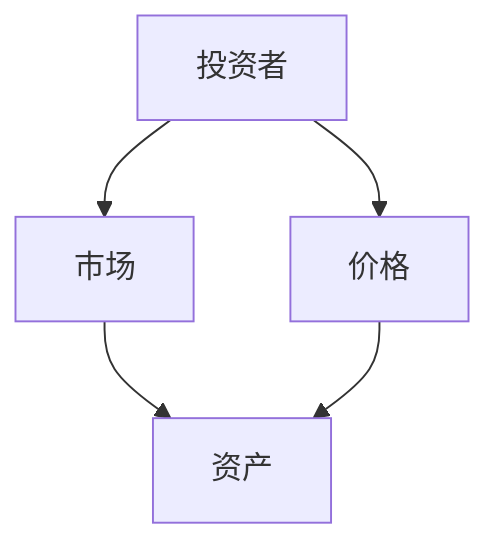
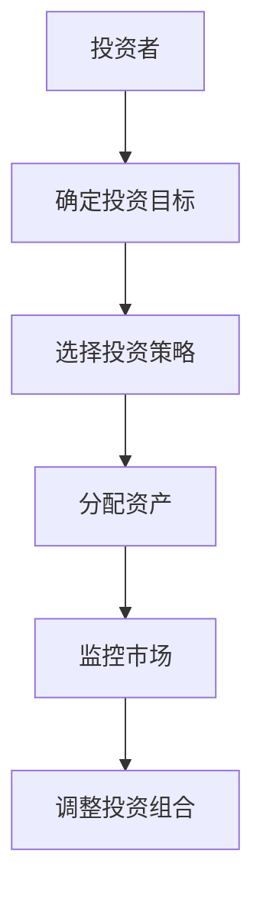
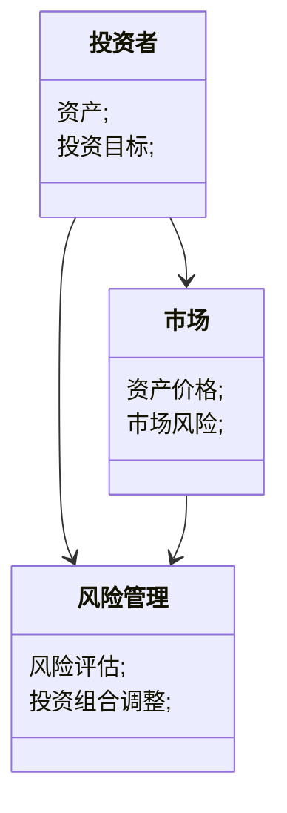

                 


# 费雪的全球化投资视角

> 关键词：费雪，全球化投资，投资视角，技术分析，投资策略，投资工具

> 摘要：本文从费雪的投资哲学出发，结合全球化背景，系统性地分析了全球化投资的核心概念、算法原理、系统架构以及实际案例。通过技术视角，深入探讨了全球化投资的复杂性与机遇，为投资者提供了实用的策略和方法。

---

# 第一部分: 全球化投资的背景与概念

## 第1章: 全球化投资的背景与现状

### 1.1 全球化投资的背景介绍

#### 1.1.1 经济全球化的演进历程
经济全球化是人类社会发展的必然趋势，从16世纪的地理大发现到现代的跨国公司，全球化经历了数百年的发展。进入21世纪，互联网和信息技术的飞速发展进一步推动了全球化的进程。全球化使得资本、技术、信息等资源在世界范围内自由流动，为投资者提供了前所未有的机会。

#### 1.1.2 全球化对投资领域的影响
全球化使得投资者可以跨越国界进行投资，投资标的不再局限于本地市场。同时，不同国家和地区的市场具有不同的风险收益特征，投资者可以通过全球化投资来分散风险、优化资产配置。

#### 1.1.3 当前全球化投资的主要特点
- 多样性：投资者可以选择股票、债券、外汇、期货等多种投资工具。
- 全球化：投资标的覆盖全球市场，投资者可以投资于任何一个国家的资产。
- 风险分散：通过全球化配置，投资者可以降低单一市场的风险。

### 1.2 费雪的投资理念与全球化视角

#### 1.2.1 费雪的投资哲学概述
费雪是价值投资的代表人物之一，他强调长期投资、注重基本面分析。他认为，投资的本质是寻找具有持续竞争优势的企业，而非短期价格波动。

#### 1.2.2 费雪全球化投资的核心观点
费雪认为，全球化为投资者提供了更多的选择和机会。通过全球化投资，投资者可以投资于全球范围内具有竞争优势的企业，从而实现更高的收益。

#### 1.2.3 费雪投资理念与现代投资理论的结合
现代投资理论（如CAPM模型）强调资产配置的重要性，而费雪的投资理念则注重个股选择。两者的结合使得全球化投资更加科学化和系统化。

### 1.3 全球化投资的主要参与者

#### 1.3.1 主要投资者类型分析
- 机构投资者：如基金公司、保险公司等。
- 个人投资者：包括高净值个人和散户。
- 对冲基金：通过杠杆和做空等手段进行投资。

#### 1.3.2 全球化投资市场的主体构成
- 股票市场：如纽约证券交易所、伦敦金融交易所。
- 债券市场：包括政府债券和企业债券。
- 外汇市场：全球最大的金融市场。

#### 1.3.3 不同市场参与者的行为特征
- 机构投资者：注重长期收益，投资策略较为保守。
- 个人投资者：交易频率较高，受情绪影响较大。
- 对冲基金：高风险高收益，善于利用市场套利机会。

### 1.4 全球化投资的主要工具与渠道

#### 1.4.1 股票、债券、基金等传统投资工具
股票：代表企业所有权，具有较高的收益潜力。
债券：代表债务所有权，收益相对稳定。
基金：通过集合投资分散风险。

#### 1.4.2 外汇、期货、期权等衍生品工具
外汇：用于汇率套期保值。
期货：可以在未来以固定价格买卖资产。
期权：赋予买方在特定时间以特定价格买卖资产的权利。

#### 1.4.3 全球化投资的新兴渠道
- ETF（交易所交易基金）：可以投资于全球市场。
- P2P借贷：通过互联网平台直接投资于全球个人或企业。
- 数字货币：如比特币等，具有全球流通性。

## 1.5 本章小结
本章从全球化投资的背景出发，分析了其对投资领域的影响，详细介绍了费雪的投资理念及其在全球化背景下的应用。同时，还分析了全球化投资的主要参与者和工具，为后续章节的深入分析奠定了基础。

---

## 第2章: 全球化投资的核心概念

### 2.1 全球化投资的基本概念

#### 2.1.1 全球化投资的定义
全球化投资是指投资者在全球范围内配置资产，以实现投资目标的行为。

#### 2.1.2 全球化投资的核心要素
- 投资目标：如追求超额收益、风险分散等。
- 投资工具：股票、债券、外汇等。
- 市场选择：选择适合投资的国家和地区。

#### 2.1.3 全球化投资的边界与外延
全球化投资的边界在于投资者的风险承受能力和投资目标。外延则包括新兴市场和非传统投资工具。

### 2.2 全球化投资的关键属性

#### 2.2.1 投资标的的多样性
全球化投资允许投资者在多个市场中选择投资标的，从而实现资产的多元化配置。

#### 2.2.2 市场风险的全球化特征
全球市场的联动性使得风险具有全球化特征，如全球经济波动可能影响所有市场。

#### 2.2.3 投资收益的跨国比较
不同国家和地区的市场具有不同的收益水平，投资者需要进行跨国比较以优化投资组合。

### 2.3 全球化投资的核心要素对比

#### 2.3.1 不同投资工具的属性对比
| 投资工具 | 收益性 | 风险性 | 流动性 |
|----------|--------|--------|--------|
| 股票     | 高     | 高     | 高     |
| 债券     | 中     | 中     | 高     |
| 外汇     | 中     | 中     | 高     |
| 期货     | 高     | 高     | 中     |

#### 2.3.2 不同市场的风险收益特征对比
| 市场类型 | 风险水平 | 收益水平 |
|----------|----------|----------|
| 发达市场 | 中        | 中        |
| 新兴市场 | 高        | 高        |

#### 2.3.3 不同投资者行为特征的对比
| 投资者类型 | 投资期限 | 投资策略 |
|------------|----------|----------|
| 机构投资者 | 长期      | 价值投资 |
| 个人投资者 | 短期      | 技术投资 |

### 2.4 全球化投资的核心概念联系

#### 2.4.1 全球化投资的实体关系图


#### 2.4.2 全球化投资的流程图


---

## 第3章: 全球化投资的核心概念联系

### 3.1 全球化投资的核心概念总结
全球化投资的核心在于通过多市场的资产配置，优化风险收益比。投资者需要结合自身的投资目标和风险承受能力，选择合适的投资工具和策略。

### 3.2 全球化投资的系统架构

#### 3.2.1 系统功能设计
- 投资目标设定：投资者确定自己的投资目标和风险偏好。
- 资产分配：根据目标分配资产到不同市场和工具。
- 风险管理：监控市场波动并及时调整投资组合。

#### 3.2.2 系统架构图


### 3.3 本章小结
本章通过分析全球化投资的核心概念，探讨了不同投资工具、市场和投资者行为之间的关系，并通过实体关系图和流程图展示了全球化投资的系统架构。

---

## 第4章: 全球化投资的算法与技术实现

### 4.1 投资组合优化算法

#### 4.1.1 均值-方差优化模型
$$\text{目标：} \min \sigma^2$$
$$\text{约束：} \sum w_i = 1, \sum w_i r_i = \mu$$

#### 4.1.2 风险平价投资策略
$$\text{目标：} \min \sum (w_i \sigma_i)^2$$

#### 4.1.3 马科维茨有效前沿
通过计算有效前沿，投资者可以在不同风险水平下找到最优的投资组合。

### 4.2 全球化投资的Python实现

#### 4.2.1 环境安装
```bash
pip install numpy pandas matplotlib
```

#### 4.2.2 核心代码实现
```python
import numpy as np
import pandas as pd

# 示例数据
returns = pd.DataFrame({
    '股票': [0.1, 0.05, 0.08],
    '债券': [0.05, 0.04, 0.06],
    '外汇': [0.02, 0.03, 0.04]
})

# 均值-方差优化
means = returns.mean()
cov_matrix = returns.cov()
```

### 4.3 本章小结
本章通过技术视角，详细介绍了全球化投资的算法与实现，包括均值-方差优化模型和风险平价策略，并通过Python代码展示了如何进行投资组合优化。

---

## 第5章: 全球化投资的系统分析与架构设计

### 5.1 系统功能设计

#### 5.1.1 领域模型


### 5.2 系统架构设计

#### 5.2.1 系统架构图


### 5.3 系统接口设计

#### 5.3.1 接口描述
- 输入接口：投资者的投资目标和风险偏好。
- 输出接口：优化后的投资组合和风险敞口报告。

### 5.4 系统交互流程图

#### 5.4.1 交互流程图


### 5.5 本章小结
本章通过系统视角，详细设计了全球化投资的系统架构，包括功能设计、架构设计和交互流程设计，为实际应用提供了参考。

---

## 第6章: 全球化投资的项目实战

### 6.1 项目介绍

#### 6.1.1 项目目标
构建一个基于Python的全球化投资组合优化系统。

### 6.2 项目实现

#### 6.2.1 核心代码实现
```python
import numpy as np
import pandas as pd

# 示例数据
returns = pd.DataFrame({
    '股票': [0.1, 0.05, 0.08],
    '债券': [0.05, 0.04, 0.06],
    '外汇': [0.02, 0.03, 0.04]
})

# 均值-方差优化
means = returns.mean()
cov_matrix = returns.cov()
```

### 6.3 项目总结

#### 6.3.1 项目成果
通过本项目，投资者可以实现全球化投资组合的优化配置。

#### 6.3.2 经验总结
全球化投资需要结合市场情况和投资者自身特点，选择合适的投资策略和工具。

### 6.4 本章小结
本章通过实际案例，展示了全球化投资的项目实战，帮助读者更好地理解和应用相关技术。

---

## 第7章: 全球化投资的最佳实践

### 7.1 投资策略建议

#### 7.1.1 风险管理
- 设定止损点
- 定期调整投资组合

#### 7.1.2 资产配置
- 根据市场情况调整资产配置比例
- 选择具有竞争优势的企业

### 7.2 小结
全球化投资需要投资者具备全球视野和风险意识，同时结合技术手段优化投资策略。

### 7.3 注意事项
- 风险控制是投资成功的关键
- 投资者需根据自身情况选择合适的投资策略
- 全球化投资具有较高的复杂性，建议投资者寻求专业帮助

### 7.4 拓展阅读
- 阅读费雪的经典著作《股票作手回忆录》
- 学习现代投资组合理论（MPT）

---

## 第8章: 总结与展望

### 8.1 总结
本文从费雪的投资哲学出发，结合全球化背景，系统性地分析了全球化投资的核心概念、算法原理、系统架构以及实际案例。通过技术视角，深入探讨了全球化投资的复杂性与机遇。

### 8.2 展望
未来，随着人工智能和大数据技术的发展，全球化投资将更加智能化和个性化。投资者需要不断学习和适应新的技术手段和市场环境。

---

## 作者：AI天才研究院/AI Genius Institute & 禅与计算机程序设计艺术 /Zen And The Art of Computer Programming

