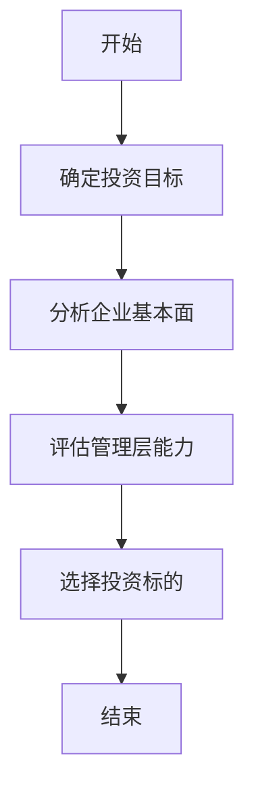
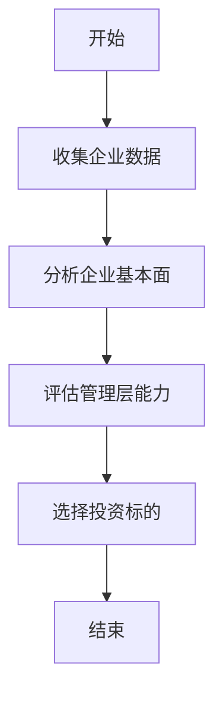
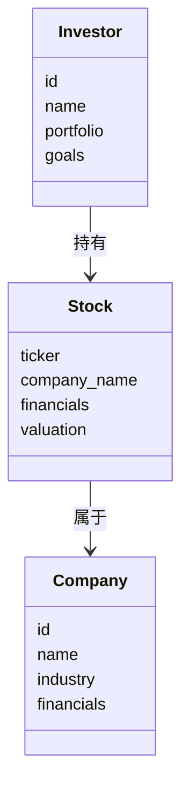
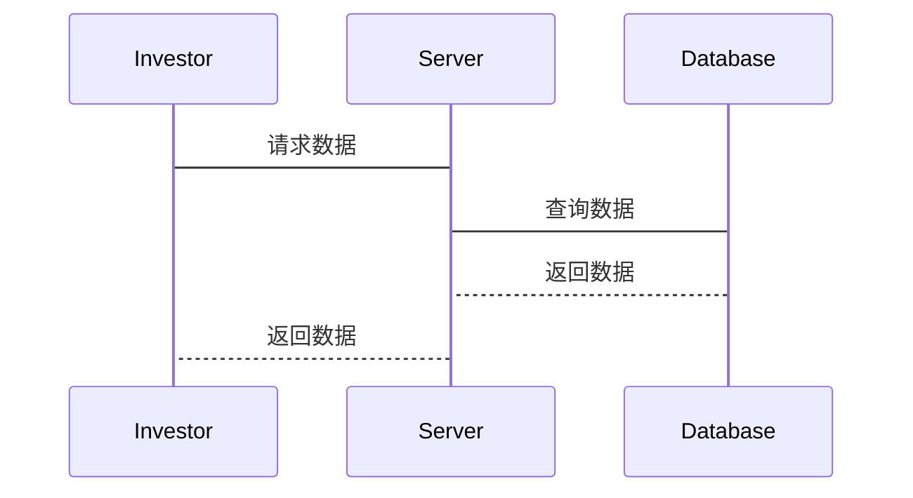

                 


# 费雪的全球视野：如何在国际市场中寻找机会

> 关键词：费雪，全球视野，投资机会，技术分析，投资策略

> 摘要：本文从费雪的全球投资理念出发，结合技术分析和投资策略，详细探讨如何在全球化市场中寻找投资机会。通过系统分析和实战案例，为投资者提供科学的投资决策框架。

---

## 第1章：费雪投资理念的背景与核心概念

### 1.1 投资全球化的历史背景

#### 1.1.1 全球化经济的演进
全球化经济的演进使得投资市场的范围不断扩大，投资者可以接触到更多的市场和资产类别。这种趋势为费雪的投资理念提供了更广阔的舞台。

#### 1.1.2 费雪投资理念的提出背景
费雪的投资理念以成长股为核心，强调长期投资和企业基本面分析。他的方法在20世纪中叶提出，但其核心思想在今天依然具有重要的指导意义。

#### 1.1.3 全球化投资的现状与趋势
随着技术的进步和信息的透明化，全球化投资已成为主流。投资者需要具备全球视野，才能在全球市场中找到投资机会。

---

### 1.2 费雪投资理念的核心要素

#### 1.2.1 成长股投资的基本原理
成长股投资的核心是寻找那些具有持续增长潜力的企业。费雪强调，投资的最终目标是找到能够持续增长的企业。

#### 1.2.2 投资决策的关键因素
费雪认为，投资决策的关键在于对企业管理层、行业地位和竞争优势的分析。他提出了“护城河”概念，认为只有具备竞争优势的企业才能长期增长。

#### 1.2.3 费雪投资理念的边界与外延
费雪的投资理念不仅适用于本土市场，也可以扩展到全球市场。全球化的背景下，投资者需要考虑更多的因素，如汇率、政策和文化差异。

---

### 1.3 费雪投资理念的结构与要素

#### 1.3.1 投资目标的定义
费雪的投资目标是寻找具有持续增长潜力的企业，这些企业需要具备强大的竞争优势和优秀的管理层。

#### 1.3.2 投资策略的选择
费雪的投资策略以长期持有为核心，强调对企业基本面的深入分析。他建议投资者关注企业的成长性和盈利能力。

#### 1.3.3 投资组合的构建
费雪的投资组合构建强调分散投资，以降低风险。他建议投资者将资金分配到不同行业和市场的资产中，以分散风险。

---

## 第2章：费雪投资理念的核心概念与联系

### 2.1 费雪投资理念的原理

#### 2.1.1 成长股的定义与特征
成长股是指那些具有持续增长潜力的企业股票。这些企业通常处于高速发展的行业，并且具备强大的竞争优势。

#### 2.1.2 投资决策的逻辑框架
费雪的投资决策逻辑框架包括以下几个步骤：
1. 确定投资目标：寻找具有持续增长潜力的企业。
2. 分析企业基本面：包括财务状况、行业地位和竞争优势。
3. 评估管理层：管理层的能力和诚信是决定企业成功的关键因素。
4. 选择投资标的：基于以上分析，选择具有长期增长潜力的企业进行投资。

#### 2.1.3 费雪投资理念的数学模型
费雪的投资理念可以通过以下公式进行量化：
$$ \text{投资回报} = \text{企业增长潜力} \times \text{竞争优势} \times \text{管理层能力} $$

---

### 2.2 核心概念对比分析

#### 2.2.1 成长股与价值股的对比
| 特性 | 成长股 | 价值股 |
|------|--------|--------|
| 定义 | 具有持续增长潜力的企业 | 被市场低估的优质企业 |
| 投资策略 | 长期持有，等待增长 | 买入低估资产，等待价值回归 |
| 适用场景 | 高增长行业 | 市场低迷或低估资产 |

#### 2.2.2 费雪理念与巴菲特理念的对比
| 特性 | 费雪 | 巴菲特 |
|------|------|--------|
| 投资理念 | 成长股与长期持有 | 价值投资与安全边际 |
| 分析重点 | 企业成长性与竞争优势 | 企业内在价值与市场定价 |

#### 2.2.3 全球化投资与本土化投资的对比
| 特性 | 全球化投资 | 本土化投资 |
|------|----------|----------|
| 市场范围 | 全球市场 | 本土市场 |
| 风险分散 | 更高 | 较低 |
| 机会多样性 | 更多 | 较少 |

---

### 2.3 实体关系图

#### 2.3.1 费雪投资理念的ER实体关系图
```mermaid
erDiagram
    investor++---"投资"++ stock
    stock++---"属于"++ company
    company++---"拥有"++ management_team
```

#### 2.3.2 投资决策的流程图


---

## 第3章：费雪投资理念的算法原理

### 3.1 投资决策的数学模型

#### 3.1.1 成长股的评估公式
$$ \text{成长股价值} = \text{未来现金流的现值} $$

#### 3.1.2 投资组合的优化模型
$$ \text{最优投资组合} = \argmin_{w} \left( w^T \Sigma w \right) $$

#### 3.1.3 风险与收益的平衡公式
$$ \text{夏普比率} = \frac{\mu - r}{\sigma} $$

---

### 3.2 算法流程图

#### 3.2.1 费雪投资算法的mermaid流程图


#### 3.2.2 投资决策的步骤分解
1. 收集企业数据：包括财务报表、行业地位和竞争优势。
2. 分析企业基本面：评估企业的财务状况和成长潜力。
3. 评估管理层能力：分析管理层的能力和诚信。
4. 选择投资标的：基于以上分析，选择具有长期增长潜力的企业进行投资。

#### 3.2.3 投资组合的动态调整流程
1. 定期评估投资组合的表现。
2. 根据市场变化和企业基本面调整投资组合。
3. 保持长期持有，避免频繁交易。

---

### 3.3 代码实现

#### 3.3.1 投资组合评估的Python代码
```python
import pandas as pd
import numpy as np

def calculate Sharpe_ratio(returns, risk_free_rate):
    excess_returns = returns - risk_free_rate
    sharpe_ratio = np.mean(excess_returns) / np.std(excess_returns)
    return sharpe_ratio

# 示例数据
returns = pd.Series([0.05, 0.03, 0.07, 0.02], index=['2020', '2021', '2022', '2023'])
risk_free_rate = 0.01

print("夏普比率:", calculate_Sharpe_ratio(returns, risk_free_rate))
```

---

## 第4章：系统分析与架构设计

### 4.1 投资管理系统的需求分析

#### 4.1.1 问题场景介绍
投资者需要一个系统来帮助他们在全球市场中寻找投资机会。系统需要具备数据收集、分析和决策支持功能。

#### 4.1.2 系统目标与范围
系统的目标是帮助投资者在全球市场中找到具有增长潜力的企业。系统范围包括数据收集、分析和投资决策支持。

#### 4.1.3 用户需求分析
用户需求包括：
1. 数据收集与处理
2. 企业基本面分析
3. 投资组合优化
4. 风险评估与管理

---

### 4.2 系统功能设计

#### 4.2.1 领域模型的mermaid类图


#### 4.2.2 系统架构的mermaid架构图


#### 4.2.3 系统接口设计
1. API接口：提供数据收集和分析功能。
2. 用户界面：提供投资决策支持和投资组合管理功能。

#### 4.2.4 系统交互的mermaid序列图


---

## 第5章：项目实战与案例分析

### 5.1 项目环境安装

#### 5.1.1 投资分析工具的安装
安装Python和必要的库：
```bash
pip install pandas numpy matplotlib
```

#### 5.1.2 数据源的获取与处理
从金融数据供应商获取数据，如Yahoo Finance。

---

### 5.2 核心代码实现

#### 5.2.1 成长股筛选的Python代码
```python
import pandas as pd

def screen_growths(tickers):
    df = pd.DataFrame()
    for ticker in tickers:
        # 获取数据
        data = get_data(ticker)
        # 计算增长率
        growth_rate = calculate_growth_rate(data)
        if growth_rate > 0.1:
            df[ticker] = growth_rate
    return df

# 示例
tickers = ['AAPL', 'MSFT', 'GOOGL']
growth_data = screen_growths(tickers)
print(growth_data)
```

---

### 5.3 案例分析与解读

#### 5.3.1 案例背景
假设我们关注美国科技行业，选择AAPL、MSFT和GOOGL作为投资标的。

#### 5.3.2 分析过程
1. 数据收集：获取这些公司的财务数据和市场数据。
2. 企业基本面分析：评估公司的成长性和竞争优势。
3. 投资组合优化：基于分析结果，构建投资组合。

#### 5.3.3 投资结果
通过长期持有这些股票，投资者可以获得稳定的回报。

---

## 第6章：最佳实践、小结、注意事项和拓展阅读

### 6.1 最佳实践
1. 长期投资：避免频繁交易，降低交易成本。
2. 风险管理：分散投资，降低风险。
3. 持续学习：关注市场变化和企业动态。

### 6.2 小结
费雪的投资理念在全球化市场中仍然具有重要的指导意义。通过系统分析和实战案例，我们可以更好地在全球市场中寻找投资机会。

### 6.3 注意事项
1. 风险控制：投资有风险，需谨慎。
2. 数据质量：确保数据的准确性和及时性。
3. 法律合规：遵守相关法律法规。

### 6.4 拓展阅读
1. 《股市长线思维》
2. 《投资的艺术》
3. 《投资之道》

---

## 作者：AI天才研究院/AI Genius Institute & 禅与计算机程序设计艺术 /Zen And The Art of Computer Programming

---

以上是完整的文章目录和内容框架，您可以根据实际需求进一步扩展或调整各部分内容。

