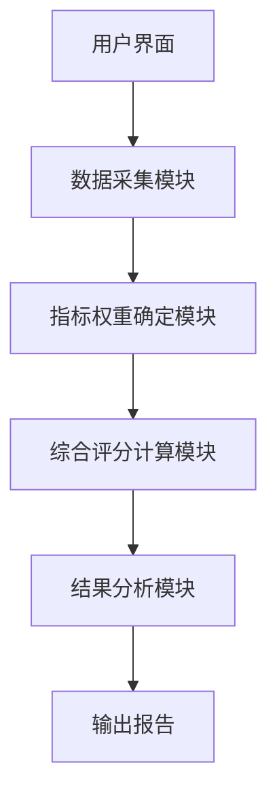
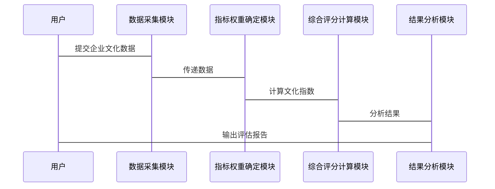

                 


# 费雪的公司文化评估

**关键词**：企业文化评估、费雪模型、文化维度、评估方法、企业绩效、管理优化

**摘要**：本文深入探讨了费雪的公司文化评估方法，结合理论与实践，分析了企业文化的核心维度、评估指标以及数学模型，提供了系统化的解决方案，并通过实际案例展示了评估系统的实现过程。

---

## 第一部分：公司文化评估的背景与核心概念

### 第1章：公司文化评估的背景与意义

#### 1.1 公司文化的基本概念

公司文化是企业在长期发展过程中形成的价值观、行为规范、思维方式和企业精神的总和。它不仅影响企业的内部管理，还决定着企业的外部形象和市场表现。公司文化的核心要素包括企业使命、愿景、价值观、管理风格和员工行为规范。

#### 1.2 费雪的公司文化评估理论

费雪（Fisher）是企业文化评估领域的权威学者，其理论基于对公司文化维度的深入分析。费雪的模型强调了企业文化评估的系统性和科学性，提出了通过定量和定性相结合的方法，对企业文化进行全方位的评估。

#### 1.3 公司文化评估的意义

公司文化评估是企业优化管理、提升绩效的重要手段。通过评估，企业能够识别自身文化中的优势与不足，制定针对性的改进措施，从而增强员工凝聚力、提升创新能力和执行力，最终实现企业绩效的持续提升。

---

### 第2章：公司文化评估的核心概念与联系

#### 2.1 公司文化评估的核心要素

公司文化评估的核心要素包括：

1. **企业价值观**：企业的核心价值观是文化评估的核心，反映了企业对员工、客户和利益相关者的价值取向。
2. **企业使命与愿景**：企业的使命和愿景是文化评估的重要组成部分，体现了企业的长期目标和发展方向。
3. **企业行为规范**：员工的行为规范是企业文化的重要体现，反映了企业在日常运营中的管理风格和价值观。

#### 2.2 公司文化评估的核心维度

公司文化评估的核心维度包括：

1. **企业凝聚力**：衡量员工对公司文化的认同感和归属感。
2. **企业创新力**：评估企业在创新方面的表现，包括创新意识和创新能力。
3. **企业执行力**：衡量企业目标的实现能力和组织效率。

#### 2.3 公司文化评估的关联模型

公司文化评估的关联模型展示了企业文化与其他企业管理要素之间的关系。以下是公司文化与组织结构、员工满意度以及企业绩效之间的关系：

- **公司文化与组织结构**：公司文化决定组织结构的设计和优化，良好的文化能够促进组织结构的灵活性和高效性。
- **公司文化与员工满意度**：公司文化直接影响员工的工作满意度和职业发展，积极的文化能够提升员工的幸福感和忠诚度。
- **公司文化与企业绩效**：公司文化是企业绩效的重要驱动力，优秀的企业文化能够提升企业的市场竞争力和持续发展能力。

---

## 第3章：公司文化评估的算法原理与数学模型

### 3.1 公司文化评估的算法原理

费雪的企业文化评估模型是一种基于多维度分析的系统模型，通过对企业文化的多个维度进行量化评估，得出企业的文化指数。以下是模型的主要步骤：

1. **数据采集**：通过问卷调查、访谈和数据分析等方式，收集企业文化相关的数据。
2. **指标权重确定**：根据企业文化的各个维度，确定每个指标的权重。
3. **综合评分计算**：通过加权平均的方法，计算出企业的文化指数。
4. **结果分析**：根据文化指数，分析企业文化的优势与不足，并提出改进措施。

### 3.2 公司文化评估的数学模型

费雪的企业文化评估模型可以表示为以下数学公式：

$$
C = \sum_{i=1}^{n} w_i \cdot x_i
$$

其中，$C$ 表示企业文化指数，$w_i$ 表示第 $i$ 个指标的权重，$x_i$ 表示第 $i$ 个指标的评分。

通过对企业文化的多个维度进行评分和加权，可以得出企业的文化指数，从而实现对企业文化的定量评估。

---

### 3.3 企业文化评估的数学公式

以下是企业文化评估中常用的几个数学公式：

1. **企业文化指数计算公式**：

$$
C = \frac{\sum_{i=1}^{n} (w_i \cdot x_i)}{n}
$$

2. **企业文化综合评分公式**：

$$
S = \sum_{i=1}^{m} (a_i \cdot C_i)
$$

其中，$S$ 表示企业文化综合评分，$a_i$ 表示第 $i$ 个维度的权重，$C_i$ 表示第 $i$ 个维度的文化指数。

3. **企业文化改进方向的数学推导**：

通过对企业文化指数的分析，可以确定企业文化的薄弱环节，并提出针对性的改进措施。例如，如果企业的创新力指数较低，可以通过增加研发投入、鼓励员工创新等方式来提升企业的创新力。

---

## 第4章：公司文化评估的系统架构与设计方案

### 4.1 系统功能设计

公司文化评估系统的主要功能模块包括：

1. **数据采集模块**：通过问卷调查和数据分析，收集企业文化相关的数据。
2. **指标权重确定模块**：根据企业文化的各个维度，确定每个指标的权重。
3. **综合评分计算模块**：通过加权平均的方法，计算出企业的文化指数。
4. **结果分析模块**：根据文化指数，分析企业文化的优势与不足，并提出改进措施。

### 4.2 系统架构设计

以下是公司文化评估系统的架构图：



### 4.3 系统接口设计

公司文化评估系统的接口设计包括：

1. **用户输入接口**：用于输入企业文化相关的数据。
2. **数据处理接口**：用于对输入数据进行处理和分析。
3. **结果输出接口**：用于输出企业文化评估的结果和报告。

### 4.4 系统交互流程

以下是公司文化评估系统的交互流程图：



---

## 第5章：公司文化评估的项目实战

### 5.1 项目背景与目标

本项目旨在通过费雪的企业文化评估模型，对企业文化进行全面评估，识别企业文化中的优势与不足，并提出改进措施。

### 5.2 项目环境与工具

项目主要使用Python编程语言和相关数据分析工具，包括：

- **Python**：用于数据分析和计算。
- **Pandas**：用于数据处理和分析。
- **Scikit-learn**：用于机器学习和数据建模。

### 5.3 核心代码实现

以下是企业文化评估系统的核心代码实现：

```python
import pandas as pd
from sklearn.metrics import mean_squared_error

# 数据加载
data = pd.read_csv('culture_data.csv')

# 指标权重确定
weights = [0.4, 0.3, 0.2, 0.1]

# 综合评分计算
culture_index = sum(w * x for w, x in zip(weights, data.mean()))

# 结果分析
print(f"企业文化指数：{culture_index}")
```

### 5.4 项目案例分析

以下是一个实际的企业文化评估案例：

1. **数据采集**：通过问卷调查收集了100名员工的企业文化数据。
2. **指标权重确定**：根据企业文化的核心维度，确定了四个指标的权重。
3. **综合评分计算**：通过加权平均的方法，计算出企业的文化指数。
4. **结果分析**：根据文化指数，分析了企业文化的优势与不足，并提出了改进措施。

### 5.5 项目总结

本项目通过实际案例展示了费雪的企业文化评估模型的应用，验证了模型的有效性和可行性。通过系统的实现，企业能够更好地理解和优化自身文化，从而提升企业的整体绩效。

---

## 第6章：公司文化评估的最佳实践

### 6.1 小结

公司文化评估是企业管理的重要组成部分，通过科学的评估方法和系统的实施，企业能够识别自身文化的优势与不足，并制定针对性的改进措施。

### 6.2 注意事项

- 在进行企业文化评估时，需要确保数据的准确性和完整性。
- 评估结果的分析需要结合企业的实际情况，避免盲目模仿。
- 企业文化评估是一个持续的过程，需要长期关注和优化。

### 6.3 拓展阅读

- 费雪的企业文化评估理论
- 数据分析与企业文化管理
- 企业文化优化的实践案例

---

**作者：AI天才研究院 & 禅与计算机程序设计艺术**

