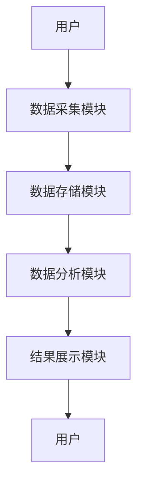

                 


# 费雪的公司文化评估：优秀企业的隐形资产

## 关键词：公司文化评估、费雪方法、企业文化、企业绩效、管理实践

## 摘要：  
本文深入探讨了费雪的公司文化评估方法，分析其在企业管理中的重要性。文章从公司文化的定义、核心要素出发，结合费雪评估模型的构建与实现，详细阐述了如何通过系统化的方法评估和优化企业文化。通过实际案例分析，本文展示了公司文化作为企业隐形资产的价值，并为管理者提供了实践建议。

---

# 第1章: 公司文化评估的背景与重要性

## 1.1 公司文化的基本概念

### 1.1.1 公司文化的定义与内涵  
公司文化是企业在长期经营过程中形成的共同价值观、行为准则和思维方式的总和，是企业的灵魂。它包括企业使命、愿景、价值观、管理风格和员工关系等多个方面。

### 1.1.2 公司文化的核心要素  
- **企业使命**：企业的存在目的和长期目标。  
- **企业愿景**：对未来发展的期望和蓝图。  
- **企业价值观**：企业认同的核心信念和道德标准。  
- **企业精神**：企业的精神风貌和工作作风。  
- **企业氛围**：员工的工作环境和团队协作氛围。

### 1.1.3 公司文化与企业绩效的关系  
公司文化直接影响员工的工作态度、团队协作能力和创新精神，进而影响企业的经营绩效。优秀的企业文化能够提升员工满意度、增强企业凝聚力和市场竞争力。

## 1.2 费雪的公司文化评估方法

### 1.2.1 费雪的公司文化评估理论概述  
费雪的评估方法基于对公司文化核心要素的系统分析，通过定量和定性相结合的方式，帮助企业识别文化优势和改进点。

### 1.2.2 费雪评估方法的核心思想  
- 企业文化是企业的无形资产，需通过系统化的方法进行评估。  
- 评估的核心在于发现文化与企业战略和目标之间的匹配程度。  
- 通过持续优化文化，提升企业的整体绩效和竞争力。

### 1.2.3 费雪方法与其他文化评估方法的对比  
- **定性分析**：其他方法多侧重于员工满意度调查，而费雪方法更注重文化与战略的匹配性。  
- **系统性**：费雪方法结合了定量和定性分析，更具科学性和可操作性。

## 1.3 公司文化作为企业隐形资产的价值

### 1.3.1 公司文化的无形资产特性  
公司文化是企业的软实力，体现在员工的凝聚力、创新能力和团队协作中。它是企业的核心竞争力之一。

### 1.3.2 公司文化对企业竞争力的影响  
- 良好的企业文化能够吸引和留住优秀人才。  
- 企业文化决定了企业的创新能力，影响企业的市场地位。  
- 企业文化影响企业的品牌形象和客户信任度。

### 1.3.3 公司文化在企业长期发展中的作用  
公司文化是企业长期发展的基石，决定了企业在变化环境中的适应能力和持续发展能力。

## 1.4 本章小结  
本章从公司文化的定义、核心要素出发，介绍了费雪的公司文化评估方法及其与其他方法的区别，强调了公司文化作为企业隐形资产的重要性。

---

# 第2章: 公司文化的构成要素与评估维度

## 2.1 公司文化的核心要素

### 2.1.1 企业使命与愿景  
- 企业使命是企业存在的根本目的。  
- 企业愿景是企业未来发展的蓝图，激励员工为企业目标而努力。

### 2.1.2 企业价值观  
- 企业价值观是企业的核心信念，指导员工的行为和决策。  
- 例如，一些企业强调客户至上，另一些则强调创新。

### 2.1.3 企业精神与氛围  
- 企业精神是企业的精神风貌，影响员工的工作态度。  
- 企业氛围是员工的工作环境，包括团队协作、沟通效率等。

## 2.2 公司文化评估的主要维度

### 2.2.1 员工满意度  
- 员工满意度是衡量企业文化的重要指标。  
- 通过员工满意度调查，可以发现员工对公司文化的认可程度。

### 2.2.2 团队协作能力  
- 团队协作能力反映了企业文化是否促进合作与创新。  
- 通过观察团队合作效率，可以评估企业文化的效果。

### 2.2.3 企业文化认同度  
- 企业文化认同度是员工对企业核心价值观的认同程度。  
- 高认同度的企业文化能够增强员工的归属感和忠诚度。

## 2.3 公司文化评估的边界与外延

### 2.3.1 评估范围的界定  
- 公司文化评估应涵盖企业的各个层面，包括管理层、中层和基层员工。  
- 评估范围可以是整个企业，也可以是特定部门。

### 2.3.2 评估对象的选择标准  
- 评估对象应具有代表性，能够反映企业的整体文化。  
- 应选择不同岗位的员工，确保评估结果的全面性。

### 2.3.3 评估结果的应用场景  
- 评估结果可用于企业文化的优化和改进。  
- 评估结果也可以作为企业战略决策的参考依据。

## 2.4 本章小结  
本章分析了公司文化的核心要素，包括企业使命、愿景、价值观、精神和氛围，并提出了公司文化评估的主要维度，如员工满意度、团队协作能力和文化认同度。

---

# 第3章: 费雪公司文化评估模型的构建

## 3.1 费雪评估模型的核心原理

### 3.1.1 模型的理论基础  
费雪评估模型基于系统论和管理学理论，强调企业文化与企业战略的匹配性。通过系统分析，帮助企业识别文化优势和改进点。

### 3.1.2 模型的逻辑架构  
费雪模型将企业文化分解为若干个核心要素，通过权重赋值的方式，评估每个要素对企业绩效的贡献程度。

### 3.1.3 模型的适用范围  
费雪模型适用于各类企业，尤其是希望优化企业文化以提升竞争力的企业。

## 3.2 费雪评估模型的结构与功能

### 3.2.1 模型的输入与输出  
- 输入：企业文化核心要素、员工满意度数据、企业绩效数据。  
- 输出：企业文化评估结果、文化优化建议。

### 3.2.2 模型的组成部分  
- 数据采集模块：收集企业文化相关数据。  
- 数据分析模块：对数据进行处理和分析。  
- 结果展示模块：将评估结果以可视化方式呈现。

### 3.2.3 模型的运行机制  
- 通过数据采集，获取企业文化的核心要素和员工满意度数据。  
- 利用权重赋值方法，计算每个要素对企业绩效的贡献程度。  
- 根据分析结果，提出文化优化建议。

## 3.3 费雪评估模型的实现步骤

### 3.3.1 数据采集与处理  
- 数据采集：通过问卷调查、访谈等方式收集企业文化相关数据。  
- 数据处理：对数据进行清洗和预处理，确保数据的准确性和完整性。

### 3.3.2 数据分析与评估  
- 数据分析：利用统计方法和数据分析工具，对数据进行分析。  
- 模型评估：根据分析结果，评估企业文化的优势和改进点。

### 3.3.3 结果展示与优化建议  
- 结果展示：将评估结果以图表、报告等形式呈现。  
- 优化建议：根据评估结果，提出企业文化优化的具体建议。

## 3.4 本章小结  
本章详细介绍了费雪评估模型的构建过程，包括模型的理论基础、结构与功能，以及实现步骤，为后续的企业文化评估提供了理论依据和实践指导。

---

# 第4章: 费雪评估方法的具体步骤

## 4.1 数据采集与处理

### 4.1.1 数据采集方法  
- 问卷调查：设计企业文化评估问卷，收集员工对企业文化的看法和建议。  
- 访谈法：通过与管理层和员工的访谈，获取企业文化的相关信息。  
- 文档分析：分析企业的规章制度、政策文件等，提取企业文化的核心要素。

### 4.1.2 数据清洗与预处理  
- 数据清洗：去除无效数据，确保数据的准确性和完整性。  
- 数据标准化：将数据进行标准化处理，确保不同数据之间的可比性。

## 4.2 数据分析与评估

### 4.2.1 数据分析方法  
- 统计分析：利用统计方法，分析企业文化各要素与企业绩效的相关性。  
- 因子分析：通过因子分析，提取企业文化的核心因子。  
- 聚类分析：将企业文化要素进行聚类，发现潜在的规律和模式。

### 4.2.2 评估指标权重赋值  
- 根据企业目标和实际情况，为每个企业文化要素赋予相应的权重。  
- 权重赋值可以通过专家评分法、层次分析法等方式实现。

## 4.3 结果解读与优化建议

### 4.3.1 评估结果的解读  
- 分析评估结果，识别企业文化的优势和不足。  
- 通过对比分析，找出与其他企业文化的差距。

### 4.3.2 优化建议的制定  
- 根据评估结果，制定企业文化优化的具体措施。  
- 提出针对性的改进建议，如加强员工培训、优化管理流程等。

## 4.4 本章小结  
本章详细介绍了费雪评估方法的具体步骤，包括数据采集、分析与评估，以及结果解读和优化建议的制定，为实际应用提供了清晰的操作指南。

---

# 第5章: 公司文化评估系统架构设计

## 5.1 系统设计与功能模块

### 5.1.1 系统功能模块划分  
- 数据采集模块：负责采集企业文化相关数据。  
- 数据分析模块：对数据进行处理和分析。  
- 结果展示模块：将分析结果以可视化方式呈现。  
- 系统管理模块：负责系统的日常维护和管理。

### 5.1.2 功能模块的实现  
- 数据采集模块：支持多种数据采集方式，如问卷调查、访谈记录等。  
- 数据分析模块：集成数据分析工具，支持多种分析方法。  
- 结果展示模块：生成可视化图表，帮助用户直观理解分析结果。

## 5.2 系统架构设计

### 5.2.1 系统架构图  


### 5.2.2 系统交互设计  
- 用户通过数据采集模块提交数据。  
- 数据存储模块对数据进行存储和管理。  
- 数据分析模块对数据进行分析，生成分析结果。  
- 结果展示模块将分析结果以图表形式展示给用户。

## 5.3 系统接口设计

### 5.3.1 系统接口定义  
- 数据采集接口：用于接收企业文化相关数据。  
- 数据分析接口：用于调用数据分析工具进行数据处理。  
- 结果展示接口：用于展示分析结果。

### 5.3.2 接口实现方式  
- 数据采集接口：通过API实现，支持多种数据格式。  
- 数据分析接口：通过调用数据分析工具的API实现。  
- 结果展示接口：通过前端开发实现，支持多种可视化方式。

## 5.4 本章小结  
本章详细描述了公司文化评估系统的架构设计，包括功能模块划分、系统架构图和接口设计，为系统的实际开发提供了参考。

---

# 第6章: 项目实战：费雪评估方法的应用

## 6.1 项目环境与工具安装

### 6.1.1 环境要求  
- 操作系统：Windows、macOS或Linux。  
- 开发工具：Python、Jupyter Notebook、数据库管理系统。  
- 数据分析工具：Pandas、NumPy、Matplotlib。

### 6.1.2 工具安装  
- Python安装：通过pip安装必要的库，如pandas、numpy、matplotlib。  
- 数据库安装：安装MySQL或MongoDB等数据库系统。

## 6.2 核心代码实现

### 6.2.1 数据采集与处理  
```python
import pandas as pd

# 数据采集
def collect_data():
    # 示例数据：员工满意度调查
    data = {
        '员工ID': [1, 2, 3, 4, 5],
        '满意度': [85, 90, 75, 95, 80]
    }
    return pd.DataFrame(data)

# 数据清洗
def preprocess_data(df):
    # 去除重复数据
    df = df.drop_duplicates()
    # 填充缺失值
    df = df.fillna(0)
    return df

# 数据处理
df = collect_data()
df = preprocess_data(df)
print(df)
```

### 6.2.2 数据分析与评估  
```python
import pandas as pd
import numpy as np

# 数据分析
def analyze_data(df):
    # 计算平均满意度
    avg_satisfaction = df['满意度'].mean()
    # 找出满意度最高的员工
    top_employees = df.sort_values('满意度', ascending=False).head(3)
    return avg_satisfaction, top_employees

avg_satisfaction, top_employees = analyze_data(df)
print("平均满意度:", avg_satisfaction)
print("满意度最高的员工:")
print(top_employees)
```

### 6.2.3 结果展示与优化建议  
```python
import matplotlib.pyplot as plt

# 结果展示
def visualize_results(df):
    plt.figure(figsize=(10, 6))
    df['满意度'].hist(bins=10, edgecolor='black')
    plt.title('员工满意度分布')
    plt.xlabel('满意度')
    plt.ylabel('人数')
    plt.show()

visualize_results(df)
```

## 6.3 案例分析与经验总结

### 6.3.1 案例分析  
- 某企业通过费雪评估方法，发现员工满意度较低的主要原因是缺乏职业发展机会。  
- 根据评估结果，企业优化了员工培训计划，提高了员工满意度和团队协作能力。

### 6.3.2 经验总结  
- 数据采集是评估的基础，确保数据的准确性和完整性。  
- 数据分析是关键，选择合适的分析方法能够提高评估结果的准确性。  
- 结果展示是关键环节，通过可视化方式帮助管理层更好地理解和应用评估结果。

## 6.4 本章小结  
本章通过一个实际案例，详细展示了费雪评估方法的应用过程，包括环境准备、数据采集与处理、数据分析与评估以及结果展示，为读者提供了实践参考。

---

# 第7章: 总结与展望

## 7.1 企业文化评估的重要意义  
公司文化是企业的隐形资产，其优劣直接影响企业的经营绩效和长期发展。通过系统化的评估方法，可以帮助企业识别文化优势和改进点，优化企业文化，提升竞争力。

## 7.2 费雪评估方法的优势与局限性  
- **优势**：费雪方法结合了定量和定性分析，评估结果具有较高的科学性和可操作性。  
- **局限性**：评估过程较为复杂，需要专业的知识和技能。  

## 7.3 企业文化评估的未来展望  
随着企业环境的不断变化，企业文化评估需要不断创新和优化。未来，可以通过引入人工智能和大数据技术，提高评估的效率和准确性。

## 7.4 最佳实践 Tips  
- 定期进行企业文化评估，确保文化与企业战略的匹配性。  
- 注重员工参与，鼓励员工积极参与企业文化建设。  
- 企业文化评估结果应与企业绩效挂钩，确保评估结果的有效应用。

## 7.5 本章小结  
本章总结了企业文化评估的重要意义，分析了费雪评估方法的优势与局限性，并提出了未来的发展方向和最佳实践建议。

---

# 作者：AI天才研究院/AI Genius Institute & 禅与计算机程序设计艺术 /Zen And The Art of Computer Programming

