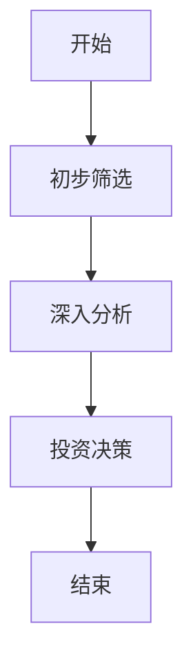
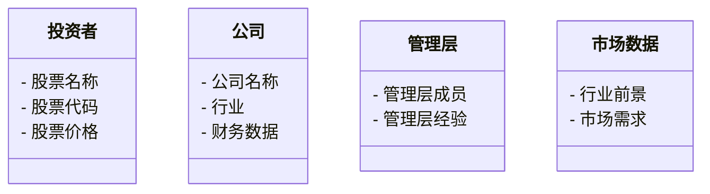
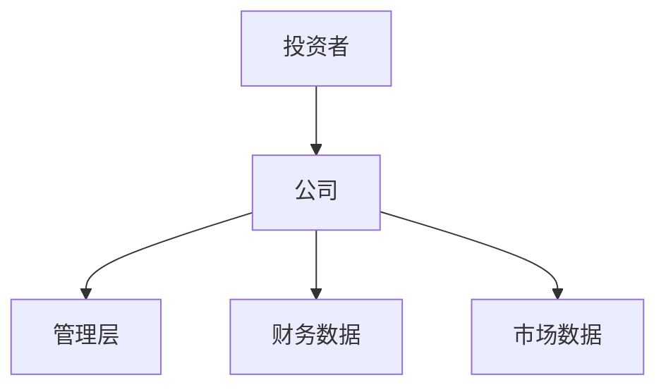
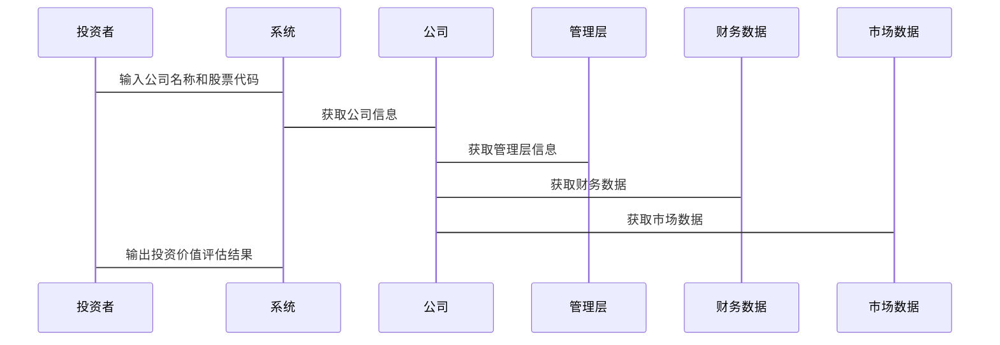

                 


# 费雪的公司调研技巧

## 关键词：菲利普·费雪、价值投资、公司调研、投资技巧、基本面分析

## 摘要：本文深入探讨了菲利普·费雪的公司调研技巧，分析了其投资理念的核心要素，包括管理层分析、财务状况评估、行业地位判断等，并通过实例展示了如何应用这些技巧进行投资决策。文章结构清晰，内容详实，适合投资新手和资深投资者参考。

---

## 第1章 费雪的公司调研技巧概述

### 1.1 费雪的背景与投资理念

#### 1.1.1 费雪的生平简介
菲利普·费雪（Philip Fisher）是美国著名的投资专家，被誉为“成长型股票投资之父”。他于1907年出生，是价值投资的先驱之一。费雪的职业生涯跨越了数十年，他的投资理念对现代投资理论产生了深远影响。

#### 1.1.2 费雪的投资哲学
费雪的投资哲学以“买入并长期持有优质股票”为核心。他认为，成功的投资取决于对公司的深入了解，尤其是管理层的质量、公司的财务状况以及行业前景。费雪强调长期投资，避免短期市场的波动干扰。

#### 1.1.3 费雪对公司调研的重视
费雪认为，投资决策的关键在于对公司基本面的深入调研。他主张投资者应该像侦探一样，对公司进行全方位的调查，包括管理层的背景、财务报表的细节、行业地位以及市场前景等。

### 1.2 公司调研技巧的核心概念

#### 1.2.1 公司调研的基本定义
公司调研是指通过对公司及其所处环境的系统性分析，评估其投资价值的过程。这种调研不仅仅是对财务数据的分析，还包括对公司管理层、行业地位、市场前景等多方面的考察。

#### 1.2.2 费雪调研技巧的独特性
费雪的调研技巧独特之处在于其对“成长型股票”的关注。他认为，投资于具有持续增长潜力的公司，而非仅仅关注短期收益，是实现长期投资收益的关键。

#### 1.2.3 费雪调研技巧的应用场景
费雪的调研技巧适用于所有类型的投资者，无论是个人投资者还是机构投资者。尤其是在选择成长型股票时，这种技巧尤为重要。

### 1.3 费雪调研技巧的背景与意义

#### 1.3.1 当前投资环境的挑战
在当前复杂多变的投资环境中，投资者面临诸多挑战，如市场的波动性、信息的不对称性以及全球经济的不确定性。在这种背景下，费雪的调研技巧显得尤为重要。

#### 1.3.2 费雪调研技巧的现实意义
费雪的调研技巧为投资者提供了一种系统性、科学化的投资方法。通过深入分析公司的基本面，投资者可以更好地识别具有长期增长潜力的公司。

#### 1.3.3 费雪调研技巧的未来发展
随着金融市场的不断发展，费雪的调研技巧将不断完善和创新。未来的投资决策将更加依赖于对公司的深度分析，而不仅仅是依赖于市场趋势。

### 1.4 本章小结
本章主要介绍了菲利普·费雪的背景及其投资哲学，重点阐述了公司调研技巧的核心概念和其独特性。通过分析当前投资环境的挑战和费雪调研技巧的现实意义，我们进一步理解了这种技巧的重要性。

---

## 第2章 费雪调研技巧的核心要素

### 2.1 费雪调研技巧的核心要素概述

#### 2.1.1 管理层分析
管理层是公司运营的核心，其素质和能力直接关系到公司的未来发展。费雪认为，投资者应该重点关注管理层的背景、经验和决策能力。

#### 2.1.2 财务状况评估
财务状况是评估公司价值的重要指标。费雪强调，投资者应该仔细分析公司的财务报表，包括收入、利润、资产负债等关键指标。

#### 2.1.3 行业地位分析
行业地位反映了公司在行业中的竞争地位。费雪认为，投资者应该选择那些在行业中具有领先地位的公司。

#### 2.1.4 市场前景分析
市场前景是评估公司未来增长潜力的关键因素。费雪主张，投资者应该选择那些处于增长型行业的公司。

### 2.2 费雪调研技巧的核心要素对比

#### 2.2.1 管理层与财务状况的对比
管理层的素质和财务状况是公司调研的两个重要方面。管理层的决策能力和财务状况的好坏直接关系到公司的未来表现。

#### 2.2.2 行业地位与市场前景的对比
行业地位反映了公司在行业中的竞争能力，而市场前景则决定了公司未来的发展空间。两者相辅相成，共同影响公司的投资价值。

#### 2.2.3 核心要素的综合分析
通过综合分析管理层、财务状况、行业地位和市场前景等核心要素，投资者可以更全面地评估公司的投资价值。

### 2.3 费雪调研技巧的ER实体关系图

```mermaid
er
actor: 投资者
model: 公司
relation: 股东
model: 财务报表
relation: 投资者分析
model: 行业数据
```

### 2.4 本章小结
本章详细阐述了费雪调研技巧的核心要素，包括管理层分析、财务状况评估、行业地位分析和市场前景分析。通过对比和综合分析，投资者可以更全面地评估公司的投资价值。

---

## 第3章 费雪调研技巧的算法原理

### 3.1 费雪调研技巧的算法概述

#### 3.1.1 算法的基本原理
费雪调研技巧的算法基于对公司基本面的系统性分析。通过收集和整理公司的相关信息，投资者可以评估其投资价值。

#### 3.1.2 算法的核心步骤
1. 初步筛选：通过行业数据和财务指标对目标公司进行初步筛选。
2. 深入分析：对通过初步筛选的公司进行详细调查，包括管理层背景、财务状况、行业地位和市场前景等。
3. 投资决策：根据分析结果，决定是否投资于目标公司。

#### 3.1.3 算法的输入输出
- **输入**：公司的财务数据、行业数据、管理层信息等。
- **输出**：公司投资价值的评估结果。

### 3.2 费雪调研技巧的算法流程图



### 3.3 费雪调研技巧的数学模型

#### 3.3.1 数学模型的定义
费雪调研技巧的数学模型主要用于评估公司的投资价值。通过分析公司的财务数据和行业数据，投资者可以量化公司的价值。

#### 3.3.2 数学模型的详细讲解
- **市盈率（P/E）**：用于评估公司的估值。
$$P/E = \frac{股票价格}{每股收益}$$
- **市净率（P/B）**：用于评估公司的资产价值。
$$P/B = \frac{股票价格}{每股净资产}$$
- **ROE（净资产收益率）**：用于评估公司的盈利能力。
$$ROE = \frac{净利润}{净资产}$$

#### 3.3.3 数学模型的举例说明
假设某公司股票价格为50元，每股收益为5元，每股净资产为10元，净利润为1000万元，净资产为5000万元。
- 市盈率：$$P/E = \frac{50}{5} = 10$$
- 市净率：$$P/B = \frac{50}{10} = 5$$
- ROE：$$ROE = \frac{1000}{5000} = 0.2$$

### 3.4 本章小结
本章通过算法流程图和数学模型，详细介绍了费雪调研技巧的原理和实现方法。通过对公司的财务数据和行业数据的分析，投资者可以量化公司的投资价值。

---

## 第4章 费雪调研技巧的系统分析与架构设计

### 4.1 问题场景介绍
投资者需要通过系统化的方法对公司进行调研，以评估其投资价值。

### 4.2 系统功能设计

#### 4.2.1 领域模型类图



#### 4.2.2 系统架构设计



### 4.3 系统接口设计
- **输入接口**：投资者输入公司名称和股票代码。
- **输出接口**：系统输出公司投资价值的评估结果。

### 4.4 系统交互序列图



### 4.5 本章小结
本章通过系统架构设计和交互序列图，展示了如何通过系统化的方法对公司进行调研。投资者可以通过输入公司名称和股票代码，系统输出投资价值评估结果。

---

## 第5章 费雪调研技巧的项目实战

### 5.1 环境安装
投资者需要安装必要的金融分析工具，如Excel、Python（用于数据分析）等。

### 5.2 核心实现源代码

#### 5.2.1 数据收集
```python
import pandas as pd

# 下载财务数据
def get_financial_data(ticker):
    df = pd.read_csv(f'data/{ticker}.csv')
    return df

# 下载行业数据
def get_industry_data(industry):
    df = pd.read_csv(f'data/{industry}.csv')
    return df
```

#### 5.2.2 数据分析
```python
import pandas as pd

def analyze_company(ticker):
    df_company = get_financial_data(ticker)
    df_industry = get_industry_data(df_company['行业'][0])
    
    # 计算市盈率
    pe = df_company['股票价格'].mean() / df_company['每股收益'].mean()
    # 计算市净率
    pb = df_company['股票价格'].mean() / df_company['每股净资产'].mean()
    # 计算ROE
    roe = df_company['净利润'].mean() / df_company['净资产'].mean()
    
    return pe, pb, roe

pe, pb, roe = analyze_company('AAPL')
print(f"PE={pe}, PB={pb}, ROE={roe}")
```

#### 5.2.3 投资决策
```python
def investment_decision(pe, pb, roe):
    if pe < 15 and pb < 3 and roe > 0.1:
        return "买入"
    elif pe < 20 and pb < 4 and roe > 0.08:
        return "观望"
    else:
        return "卖出"

decision = investment_decision(pe, pb, roe)
print(f"投资决策：{decision}")
```

### 5.3 实际案例分析
以苹果公司（AAPL）为例，通过上述代码进行分析，得出投资决策。

### 5.4 本章小结
本章通过实战案例，展示了如何应用费雪调研技巧进行投资决策。通过Python代码实现数据收集和分析，投资者可以更高效地评估公司的投资价值。

---

## 第6章 费雪调研技巧的最佳实践

### 6.1 最佳实践 tips
- **持续学习**：投资环境不断变化，投资者需要不断学习新的知识和技巧。
- **分散投资**：不要将所有资金投入到单一股票中，分散投资可以降低风险。
- **长期持有**：选择具有长期增长潜力的公司，长期持有可以实现稳定的收益。

### 6.2 小结
通过本文的介绍，投资者可以掌握费雪的公司调研技巧，并在实际投资中应用这些方法。

### 6.3 注意事项
- **风险管理**：投资有风险，投资者需要做好风险管理，避免过度投资。
- **信息来源**：确保数据来源的可靠性和准确性，避免因信息不对称导致决策失误。

### 6.4 拓展阅读
- 《投资的艺术》——菲利普·费雪
- 《证券分析》——本杰明·格雷厄姆

---

## 作者：AI天才研究院/AI Genius Institute & 禅与计算机程序设计艺术 /Zen And The Art of Computer Programming

---

通过本文的详细讲解，读者可以系统地掌握费雪的公司调研技巧，并在实际投资中灵活应用这些方法。希望本文能为投资者提供有价值的参考和指导。

