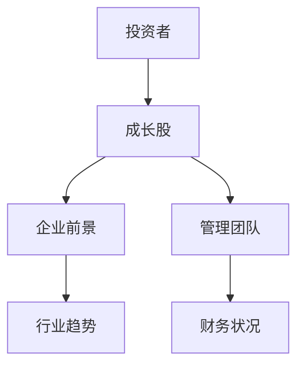
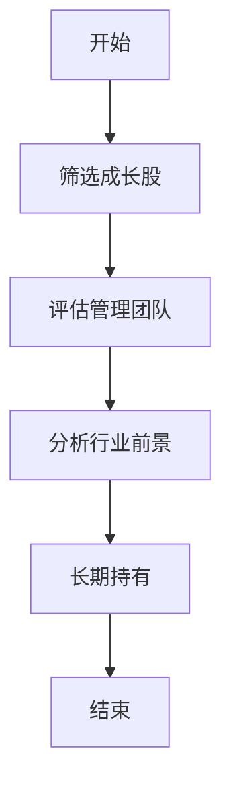
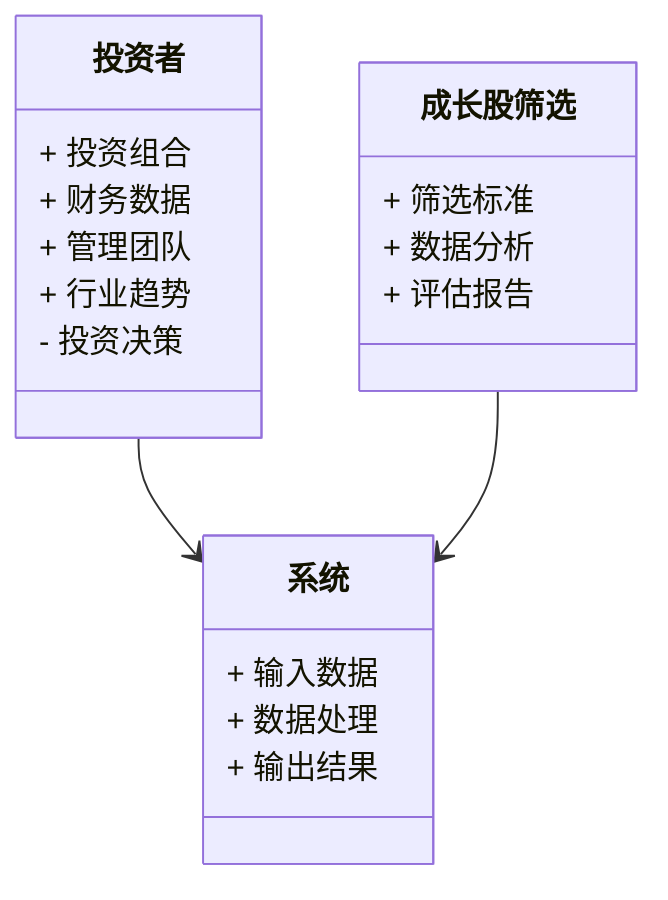

                 


# 费雪的创新企业投资法则

> 关键词：费雪、投资法则、成长股、长期持有、管理团队、企业前景

> 摘要：本文系统介绍了费雪的投资法则，强调长期持有优质成长股，关注管理团队和行业前景。通过分析核心概念、数学模型、系统架构和实战案例，帮助读者掌握费雪的投资理念，优化投资策略。

---

## 第一部分：背景介绍

### 第1章：费雪投资法则的核心概念

#### 1.1 问题背景与问题描述

投资领域充满了不确定性，投资者常常面临如何选择优质股票的挑战。传统投资方法往往关注短期波动，而忽视了企业的长期价值。费雪提出的投资法则，专注于长期持有优质成长股，为投资者提供了新的视角。

#### 1.2 费雪法则的解决方案

费雪的投资法则强调选择具有强劲增长潜力的企业，并长期持有，关注企业的管理团队和行业前景。这种策略帮助投资者避免短期波动，捕捉企业的成长价值。

#### 1.3 费雪法则的边界与外延

费雪法则适用于成长股投资，但并非适用于所有投资类型。本文将探讨其适用范围，并与其他投资策略进行对比，帮助读者更好地理解其独特性。

#### 1.4 核心要素与概念结构

费雪法则的核心要素包括收入增长、利润率提升、管理质量等，构建了一个系统的投资框架。

---

## 第二部分：核心概念与联系

### 第2章：费雪法则的核心原理

#### 2.1 投资策略的原理分析

费雪的投资策略基于复利效应和成长股的内在价值，强调长期持有优质企业，以实现财富的长期增长。

#### 2.2 核心概念的属性特征对比

| 投资策略 | 长期持有 | 短期交易 |
|----------|----------|----------|
| 风险     | 较低     | 较高     |
| 回报     | 稳定     | 不稳定   |

#### 2.3 实体关系图



---

## 第三部分：算法原理讲解

### 第3章：费雪投资法则的分析框架

#### 3.1 算法流程图



#### 3.2 核心指标计算

计算PEG比率：

```python
def calculate_pe_ratio(price, earnings):
    return price / earnings

def calculate_growth_rate(earnings, previous_earnings):
    return (earnings - previous_earnings) / previous_earnings

def calculate_peg(price, earnings, previous_earnings):
    pe = calculate_pe_ratio(price, earnings)
    growth = calculate_growth_rate(earnings, previous_earnings)
    return pe / growth
```

---

## 第四部分：数学模型与公式

### 第4章：关键数学模型

#### 4.1 PEG比率公式

$$PEG = \frac{P}{E \times G}$$

其中，$P$是股价，$E$是每股收益，$G$是收益增长率。

#### 4.2 成长股评估模型

$$V = \sum_{t=1}^{n} \frac{CF_t}{(1 + r)^t}$$

其中，$CF_t$是第$t$年的现金流，$r$是折现率。

---

## 第五部分：系统分析与架构设计

### 第5章：投资决策支持系统

#### 5.1 系统功能设计



---

## 第六部分：项目实战

### 第6章：实战案例分析

#### 6.1 环境配置

安装必要的投资分析工具，如财务数据分析软件。

#### 6.2 核心代码实现

```python
def main():
    import pandas as pd
    df = pd.read_csv('stock_data.csv')
    df['PEG'] = df['Price'] / (df['Earnings'] * df['Growth'])
    print(df[df['PEG'] < 1.5])
    
if __name__ == "__main__":
    main()
```

#### 6.3 案例分析

以科技行业为例，分析成长股的投资价值，展示如何应用费雪法则进行投资决策。

---

## 第七部分：最佳实践与总结

### 第7章：投资策略的优化

#### 7.1 最佳实践Tips

保持耐心，避免短期波动，定期评估投资组合，持续关注企业的基本面。

#### 7.2 小结与注意事项

费雪的投资法则强调长期持有和深入研究，但需注意市场波动和企业风险。

#### 7.3 拓展阅读建议

进一步学习价值投资的经典著作，如《巴菲特的股东之道》。

---

## 作者

作者：AI天才研究院/AI Genius Institute & 禅与计算机程序设计艺术 /Zen And The Art of Computer Programming

---

以上文章详细介绍了费雪的投资法则，通过系统化的分析和实战案例，帮助读者掌握这一经典的投资策略。

