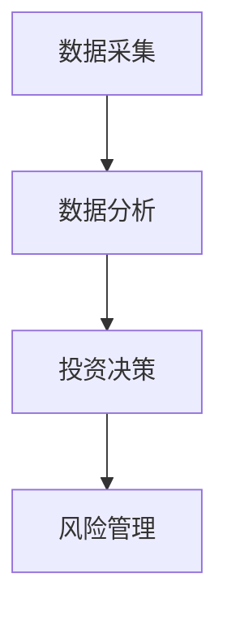

                 

# 费雪的创新企业投资策略

## 关键词：费雪、投资策略、创新企业、成长股、安全边际、风险管理

## 摘要：  
本文深入探讨了菲利普·费雪（Philip Fisher）的创新企业投资策略，从其投资哲学、成长股筛选标准到安全边际的计算，结合实际案例分析，展示了如何在现代市场中应用费雪的策略。文章通过系统设计、算法实现和项目实战，详细阐述了费雪策略的数学模型和系统架构，并提供了实际操作中的最佳实践和风险管理建议。  

---

## 第一部分：背景介绍  

### 第1章：费雪的投资哲学  

#### 1.1 费雪的生平简介  
菲利普·费雪（Philip Fisher）是20世纪美国著名的投资家，被誉为“成长股投资之父”。他于1906年进入投资领域，职业生涯长达数十年，期间积累了丰富的投资经验。费雪的投资哲学以“成长股”为核心，强调选择具有持续增长潜力的企业进行投资。  

#### 1.2 费雪的投资理念  
费雪提出了“投资三步走”策略，即**买入优质资产、长期持有、分散投资**。他认为，成功的投资不仅取决于企业的财务状况，还取决于企业的管理团队、创新能力和市场定位。  

#### 1.3 费雪与价值投资的区别与联系  
与巴菲特的价值投资不同，费雪更关注企业的成长性而非静态的估值。他认为，成长股的投资回报来源于企业的持续增长，而非市场的短期波动。  

---

### 第2章：创新企业的定义与特征  

#### 2.1 创新企业的定义  
创新企业是指那些能够持续推出新产品、服务或商业模式的企业。这些企业通常具有较高的研发投入和创新能力，能够通过创新保持竞争优势。  

#### 2.2 创新企业的核心特征  
| 特征 | 描述 |  
|------|------|  
| 技术领先 | 拥有独特的技术或专利 |  
| 创新能力强 | 具备快速迭代和创新能力 |  
| 市场定位明确 | 在目标市场中有明确的定位 |  
| 高增长潜力 | 具备高于行业平均水平的增长率 |  

#### 2.3 创新企业与传统企业的对比  
| 对比维度 | 创新企业 | 传统企业 |  
|----------|----------|----------|  
| 成长性 | 高 | 低或稳定 |  
| 创新能力 | 强 | 弱或无 |  
| 风险 | 高 | 中或低 |  

---

## 第二部分：费雪投资策略的核心概念  

### 第3章：费雪的成长股筛选标准  

#### 3.1 成长股的定义  
成长股是指那些具有持续增长潜力，且市盈率低于行业平均水平的企业股票。  

#### 3.2 成长股的筛选标准  
| 筛选标准 | 描述 |  
|----------|------|  
| 财务健康 | 净利润增长率高于行业平均水平 |  
| 管理团队 | 团队具备经验和创新能力 |  
| 市场地位 | 企业具备竞争优势 |  
| 创新能力 | 持续推出新产品或服务 |  

#### 3.3 成长股投资组合的构建  
费雪建议投资者将资金分散投资于5-10只成长股，以降低单一股票的风险。  

---

### 第4章：安全边际的计算方法  

#### 4.1 安全边际的定义  
安全边际是指股票的市场价格低于其内在价值的部分。费雪认为，安全边际能够为投资者提供缓冲，避免因市场波动导致的损失。  

#### 4.2 安全边际的计算公式  
$$ \text{安全边际} = \text{内在价值} - \text{市场价格} $$  

#### 4.3 安全边际的实际应用  
以某创新企业为例，假设其内在价值为100元，市场价格为80元，则安全边际为20元。  

---

## 第三部分：费雪投资策略的算法与系统设计  

### 第5章：费雪投资模型的构建  

#### 5.1 投资模型的输入变量  
| 输入变量 | 描述 |  
|----------|------|  
| 企业财务数据 | 包括收入、利润、研发投入等 |  
| 市场数据 | 包括市盈率、市净率等 |  
| 管理团队信息 | 包括团队经验和创新能力 |  

#### 5.2 投资模型的输出结果  
| 输出结果 | 描述 |  
|----------|------|  
| 投资建议 | 包括买入、持有或卖出建议 |  
| 安全边际 | 计算出的安全边际值 |  
| 风险评估 | 评估投资风险等级 |  

#### 5.3 投资模型的数学公式  
$$ \text{内在价值} = \frac{\text{未来现金流}}{\text{折现率}} $$  

---

### 第6章：费雪投资策略的系统架构设计  

#### 6.1 系统功能模块划分  
| 功能模块 | 描述 |  
|----------|------|  
| 数据采集 | 采集企业财务数据和市场数据 |  
| 数据分析 | 分析企业财务状况和市场定位 |  
| 投资决策 | 生成投资建议和安全边际计算 |  
| 风险管理 | 评估投资风险并提出应对策略 |  

#### 6.2 系统架构图  

---

## 第四部分：项目实战  

### 第7章：创新企业投资案例分析  

#### 7.1 案例背景  
以某科技创新公司为例，分析其是否符合费雪的成长股筛选标准。  

#### 7.2 财务数据分析  
| 数据 | 数值 |  
|------|------|  
| 净利润增长率 | 20% |  
| 研发投入占比 | 15% |  
| 市盈率 | 30 |  

#### 7.3 安全边际计算  
$$ \text{内在价值} = \frac{\text{未来现金流}}{\text{折现率}} = \frac{100}{0.1} = 1000 $$  
$$ \text{安全边际} = 1000 - 800 = 200 $$  

---

## 第五部分：最佳实践  

### 第8章：风险管理与投资策略  

#### 8.1 风险管理的重要性  
投资者需要定期评估投资组合的风险，并根据市场变化调整投资策略。  

#### 8.2 投资策略的优化  
结合市场环境和企业实际情况，动态调整投资组合。  

#### 8.3 持续学习与成长  
投资是一项终身学习的事业，投资者需要不断更新知识和技能。  

---

## 第六部分：总结与展望  

### 第9章：总结  

#### 9.1 费雪投资策略的核心思想  
费雪的投资策略以成长股为核心，强调企业的创新能力和管理团队。  

#### 9.2 费雪策略的现代应用  
在现代市场中，费雪的策略仍然具有重要的指导意义，尤其是在投资创新企业时。  

---

### 第10章：展望  

#### 10.1 未来投资趋势  
随着科技的快速发展，创新企业的投资机会将不断增加。  

#### 10.2 费雪策略的未来发展  
费雪策略将与其他投资策略结合，形成更加完善的综合投资体系。  

---

## 作者：AI天才研究院 & 禅与计算机程序设计艺术

