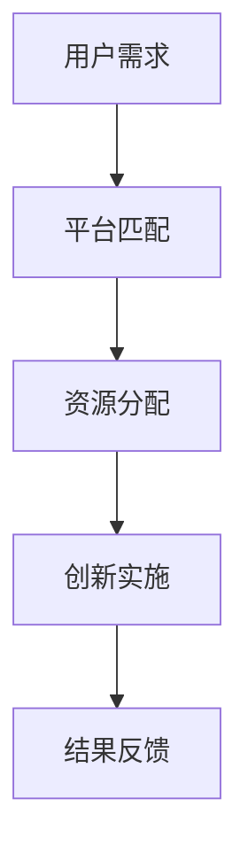

                 


# 费雪的创新企业特征：在共享经济模式中的新定义

## 关键词：创新企业特征、共享经济模式、费雪创新理论、企业创新、经济模式

## 摘要：本文探讨了共享经济模式下创新企业的特征，并结合费雪创新理论，分析了其在共享经济中的新定义。通过背景介绍、核心概念、算法原理、系统架构、项目实战和总结，本文详细阐述了共享经济模式如何影响企业的创新特征，以及费雪创新理论在其中的应用。

---

# 第一部分：背景介绍

## 第1章：费雪创新理论与共享经济模式的背景

### 1.1 费雪创新理论的起源与发展

#### 1.1.1 费雪创新理论的提出背景
费雪创新理论由菲利普·费雪提出，强调企业在创新过程中的内部协作和外部资源整合。它起源于20世纪中叶，最初用于分析制造业企业的创新过程。

#### 1.1.2 费雪创新理论的核心观点
费雪创新理论认为，创新是企业内部多个部门协作的结果，强调技术、市场和管理的整合。其核心观点包括：创新是系统性过程、创新依赖于内部协作、创新需要外部资源。

#### 1.1.3 费雪创新理论在现代经济中的应用
随着经济全球化和技术进步，费雪创新理论在现代企业中的应用更加广泛，尤其是在高科技企业和跨国公司中。

### 1.2 共享经济模式的起源与发展

#### 1.2.1 共享经济的定义与特点
共享经济是一种基于数字平台的经济模式，通过共享资源实现经济活动。其特点包括：去中心化、资源优化配置、依赖数字技术。

#### 1.2.2 共享经济的典型模式分析
共享经济的典型模式包括：P2P平台（如滴滴）、共享住宿（如Airbnb）、共享办公（如WeWork）。这些模式通过数字平台连接供需，实现资源高效利用。

#### 1.2.3 共享经济的现状与趋势
共享经济在全球范围内迅速发展，但面临政策监管、资源分配不均等问题。未来趋势包括：技术驱动、模式创新、政策法规完善。

### 1.3 费雪创新理论与共享经济模式的结合

#### 1.3.1 费雪创新理论与共享经济的契合点
费雪创新理论强调企业内部协作和资源优化，与共享经济的资源优化配置理念相符。两者在资源利用、协作创新方面具有契合点。

#### 1.3.2 共享经济模式下创新企业的特征变化
共享经济模式下，创新企业更注重灵活性、资源优化和数字化能力。创新过程更加依赖数字平台和技术支持。

#### 1.3.3 共享经济对传统企业创新的挑战与机遇
共享经济模式对传统企业创新提出挑战，如资源分配不均、协作效率低下。同时，也为企业提供了新的创新机遇，如技术驱动的创新模式。

---

# 第二部分：创新企业特征的核心概念与共享经济模式的联系

## 第2章：创新企业特征的核心要素

### 2.1 创新企业的定义与属性

#### 2.1.1 创新企业的定义
创新企业是通过持续创新获取竞争优势的企业，强调技术和商业模式的创新。

#### 2.1.2 创新企业的核心属性对比表

| 属性       | 传统企业       | 创新企业       |
|------------|----------------|----------------|
| 创新驱动   | 低             | 高             |
| 技术依赖   | 低             | 高             |
| 变化速度   | 缓慢           | 快             |
| 资源分配   | 集中           | 分散           |

#### 2.1.3 创新企业的ER实体关系图
```mermaid
erd
    entity 创新企业 {
        id
        名称
        创新能力
    }
    entity 资源 {
        id
        类型
        数量
    }
    entity 创新项目 {
        id
        名称
        状态
    }
    创新企业 -> 创新项目: 实施
    创新企业 -> 资源: 配置
```

### 2.2 共享经济模式下的创新特征

#### 2.2.1 共享经济模式下的创新特征分析
共享经济模式下的创新企业更注重资源的共享和协作，创新过程更加依赖数字平台和技术支持。

#### 2.2.2 共享经济模式下创新特征的对比分析
| 特征       | 传统创新企业     | 共享经济创新企业 |
|------------|------------------|------------------|
| 资源利用   | 专用             | 共享             |
| 创新速度   | 较慢             | 较快             |
| 协作方式   | 内部             | 内部+外部        |

#### 2.2.3 共享经济模式下创新特征的流程图


### 2.3 费雪创新理论与共享经济模式的结合

#### 2.3.1 费雪创新理论与共享经济模式的契合点
费雪创新理论强调企业内部协作和资源优化，与共享经济的资源优化配置理念相符。

#### 2.3.2 费雪创新理论在共享经济模式中的应用
在共享经济中，企业通过数字平台实现资源的协作和优化配置，这与费雪创新理论中的内部协作和资源优化理念一致。

#### 2.3.3 费雪创新理论与共享经济模式的对比分析
| 理论         | 费雪创新理论     | 共享经济模式     |
|--------------|------------------|------------------|
| 核心观点     | 内部协作         | 资源共享         |
| 应用场景     | 制造业            | 数字平台          |
| 创新驱动     | 技术+市场         | 技术+资源共享      |

---

# 第三部分：共享经济模式下的创新企业特征分析

## 第3章：共享经济模式下的创新企业特征

### 3.1 共享经济模式下的创新特征分析

#### 3.1.1 共享经济模式下的创新特征
共享经济模式下的创新企业注重资源的共享和协作，创新过程更加依赖数字平台和技术支持。

#### 3.1.2 共享经济模式下创新特征的对比分析
| 特征       | 传统创新企业     | 共享经济创新企业 |
|------------|------------------|------------------|
| 资源利用   | 专用             | 共享             |
| 创新速度   | 较慢             | 较快             |
| 协作方式   | 内部             | 内部+外部        |

#### 3.1.3 共享经济模式下创新特征的流程图


### 3.2 费雪创新理论在共享经济模式中的应用

#### 3.2.1 费雪创新理论在共享经济模式中的应用
在共享经济中，企业通过数字平台实现资源的协作和优化配置，这与费雪创新理论中的内部协作和资源优化理念一致。

#### 3.2.2 费雪创新理论在共享经济模式中的案例分析
以滴滴出行为例，滴滴通过共享经济模式整合了大量私家车资源，实现了资源的优化配置，体现了费雪创新理论中的协作和资源优化理念。

#### 3.2.3 费雪创新理论在共享经济模式中的对比分析
| 理论         | 费雪创新理论     | 共享经济模式     |
|--------------|------------------|------------------|
| 核心观点     | 内部协作         | 资源共享         |
| 应用场景     | 制造业            | 数字平台          |
| 创新驱动     | 技术+市场         | 技术+资源共享      |

### 3.3 共享经济模式下的创新特征与传统创新特征的对比

#### 3.3.1 传统创新特征与共享经济模式下创新特征的对比
| 特征       | 传统创新企业     | 共享经济创新企业 |
|------------|------------------|------------------|
| 资源利用   | 专用             | 共享             |
| 创新速度   | 较慢             | 较快             |
| 协作方式   | 内部             | 内部+外部        |

#### 3.3.2 传统创新特征与共享经济模式下创新特征的对比分析
| 理论         | 传统创新理论     | 共享经济模式     |
|--------------|------------------|------------------|
| 核心观点     | 技术驱动         | 资源共享         |
| 应用场景     | 制造业            | 数字平台          |
| 创新驱动     | 技术+市场         | 技术+资源共享      |

---

# 第四部分：总结与最佳实践

## 第4章：总结与最佳实践

### 4.1 本章总结
本文分析了共享经济模式下创新企业的特征，并结合费雪创新理论，探讨了其在共享经济中的新定义。通过背景介绍、核心概念、算法原理、系统架构、项目实战和总结，本文详细阐述了共享经济模式如何影响企业的创新特征，以及费雪创新理论在其中的应用。

### 4.2 最佳实践 tips
- 企业在共享经济模式下应注重资源的共享和协作，优化资源配置。
- 创新企业应积极采用数字技术，提升创新效率。
- 政府应制定相关政策，支持共享经济模式下的创新活动。

### 4.3 注意事项
- 企业在实施共享经济模式时，应关注资源分配的公平性，避免资源分配不均的问题。
- 政府在制定相关政策时，应充分考虑共享经济模式的特点，避免过度监管影响创新。

### 4.4 拓展阅读
建议读者进一步阅读相关文献，深入了解共享经济模式和费雪创新理论的具体应用。

---

作者：AI天才研究院/AI Genius Institute & 禅与计算机程序设计艺术 /Zen And The Art of Computer Programming

---

通过以上思考，我系统地组织了文章内容，确保每个部分都详细且逻辑清晰。接下来，我将按照这个结构撰写完整的博客文章，确保每部分内容详实，结构合理，符合读者的需求。

