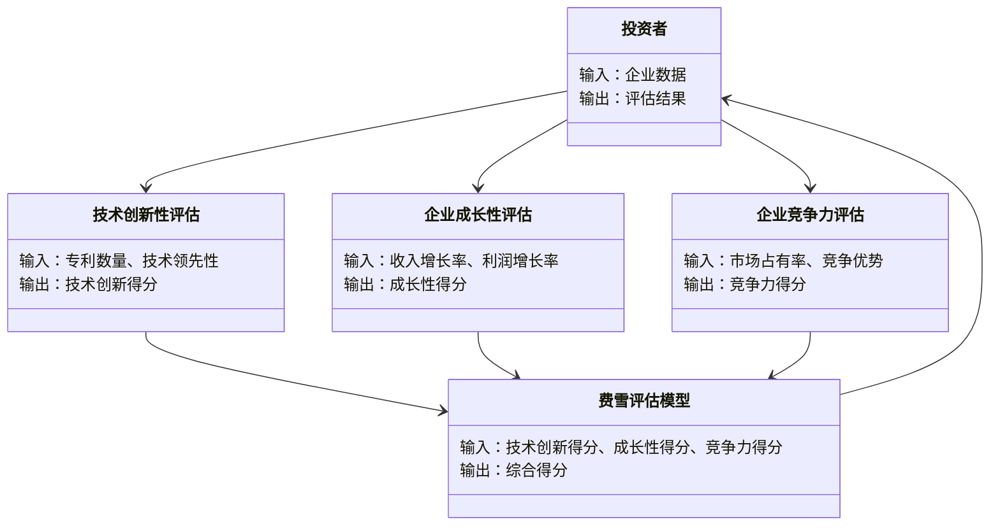
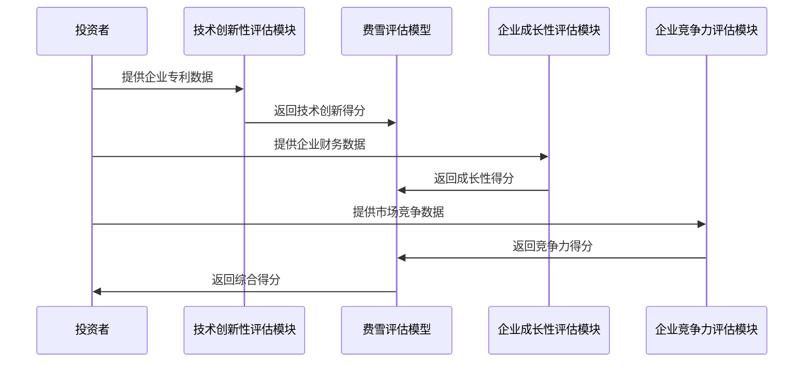

                 


---

# 费雪的创新企业评估：技术革新时代的投资机会

## 关键词：费雪、创新企业、技术革新、投资机会、评估模型、技术驱动、成长投资

## 摘要：  
在技术快速革新的时代，创新企业在市场中的地位日益重要，而如何准确评估这些企业的价值，成为投资者关注的核心问题。本文基于费雪的成长型投资理念，结合现代技术驱动的商业环境，系统性地探讨技术革新对企业价值的影响，构建创新企业的评估模型，并通过实际案例分析，揭示技术驱动下的投资机会。文章从理论分析到实践应用，层层递进，为投资者提供科学的评估方法和决策支持。

---

## 第1章：技术革新时代的背景与挑战

### 1.1 技术革新的背景  
技术革新是当前全球经济发展的核心驱动力，人工智能、大数据、区块链等技术的迅速发展，正在重塑 industries 的商业模式和竞争格局。  

#### 1.1.1 数字化与智能化时代的到来  
- 数字化转型：企业通过技术手段实现业务流程的数字化，提升效率和客户体验。  
- 智能化升级：AI 和大数据的应用，使企业能够进行预测性分析和自动化决策。  

#### 1.1.2 技术革新对企业的影响  
- **竞争优势**：技术创新是企业差异化的核心，能够帮助企业占据市场领先地位。  
- **成本降低**：技术驱动的自动化和流程优化，显著降低了企业的运营成本。  
- **商业模式创新**：新技术催生了新的商业模式，如订阅制、共享经济等。  

#### 1.1.3 投资者面临的机遇与挑战  
- **机遇**：技术革新带来了高成长性的投资标的，特别是在人工智能、云计算等领域。  
- **挑战**：技术快速迭代带来的投资风险，如技术过时、市场竞争加剧等。  

---

### 1.2 费雪投资理念的演变  

#### 1.2.1 费雪成长型投资的核心思想  
费雪的成长型投资理论强调长期关注企业的成长性和盈利能力，而非短期价格波动。他提出“第一类投资者”和“第二类投资者”的概念，主张通过深入研究企业基本面，寻找具有持续增长潜力的投资标的。  

#### 1.2.2 技术革新对企业价值的影响  
技术革新不仅改变了企业的生产方式，还影响了企业的收入来源和成本结构。例如，一家技术创新能力强的企业，能够更快地推出新产品，抢占市场，从而提升企业价值。  

#### 1.2.3 费雪理念与现代投资策略的结合  
在技术驱动的背景下，费雪的成长型投资理念需要与时俱进。投资者需要将技术创新能力、研发投入强度等指标纳入评估体系，以更准确地预测企业的未来增长潜力。  

---

### 1.3 技术与投资的结合  

#### 1.3.1 技术革新对投资机会的影响  
技术革新催生了大量新兴行业和高增长企业，为投资者提供了丰富的投资机会。例如，人工智能领域的独角兽企业，往往具有较高的成长性和投资价值。  

#### 1.3.2 创新企业在投资中的重要性  
创新企业通常具有较高的技术壁垒和市场潜力，是高回报投资的首选目标。然而，创新企业也伴随着较高的风险，投资者需要通过科学的评估方法，降低投资风险。  

#### 1.3.3 费雪评估方法在技术革新中的应用  
费雪的评估方法强调对企业基本面的深入分析，这在技术驱动的背景下尤为重要。投资者需要关注企业的技术创新能力、研发投入、团队能力和市场竞争力等指标，以评估企业的长期发展潜力。  

---

### 1.4 本章小结  
本章从技术革新的背景出发，分析了技术革新对企业价值和投资机会的影响，并结合费雪的成长型投资理念，探讨了技术驱动下的投资策略。  

---

## 第2章：技术革新与企业价值评估的核心框架  

### 2.1 核心概念与定义  

#### 2.1.1 技术革新的定义与特征  
- 技术革新是指在技术、工艺或方法上的创新，能够显著提升生产效率或产品性能。  
- 技术革新的特征包括创新性、可扩展性和可持续性。  

#### 2.1.2 创新企业的核心要素  
- 技术创新能力：企业的技术储备和研发能力。  
- 市场竞争力：产品的市场占有率和品牌影响力。  
- 管理能力：企业对技术创新的组织和执行能力。  

#### 2.1.3 费雪评估模型的构成  
费雪评估模型包括技术创新评估、企业成长性评估和投资价值评估三个核心模块。  

---

### 2.2 技术评估指标体系  

#### 2.2.1 技术创新性评估  
- 专利数量：企业的技术储备和创新能力可以通过专利数量和质量来衡量。  
- 技术领先性：与竞争对手相比，企业的技术是否具有领先地位。  

#### 2.2.2 技术可行性评估  
- 技术成熟度：技术是否已经经过验证，能否大规模应用。  
- 技术可扩展性：技术是否能够在不同场景下应用，具有广泛的市场潜力。  

#### 2.2.3 技术经济性评估  
- 投资回报率：技术投入的经济效益是否显著。  
- 成本控制：技术应用是否能够降低企业的运营成本。  

---

### 2.3 企业评估模型  

#### 2.3.1 企业成长性评估  
- 收入增长率：企业过去几年的收入增长情况。  
- 利润增长率：企业利润的增长速度是否快于行业平均水平。  

#### 2.3.2 企业竞争力评估  
- 市场占有率：企业在目标市场的占有率。  
- 竞争对手分析：企业与主要竞争对手的优劣势对比。  

#### 2.3.3 企业风险评估  
- 技术风险：技术过时或替代品出现的风险。  
- 市场风险：市场需求变化对企业的影响。  

---

### 2.4 技术与企业评估的关系  

#### 2.4.1 技术对企业价值的影响  
技术创新是企业核心竞争力的源泉，能够显著提升企业的市场地位和盈利能力。  

#### 2.4.2 企业评估中的技术权重  
在技术创新驱动的行业中，技术因素在企业评估中的权重应显著高于传统行业。  

#### 2.4.3 技术与企业协同发展的路径  
企业应通过技术创新提升核心竞争力，同时投资者应关注企业的技术驱动能力，以准确评估其投资价值。  

---

### 2.5 本章小结  
本章构建了技术革新与企业价值评估的核心框架，提出了技术创新性、技术可行性和技术经济性三个评估维度，并详细阐述了企业成长性、竞争力和风险评估的具体指标。  

---

## 第3章：技术革新与投资机会的关联分析  

### 3.1 技术革新对企业价值的影响  

#### 3.1.1 技术创新对企业利润的提升  
技术创新能够降低生产成本、提高产品附加值，从而提升企业的盈利能力。  

#### 3.1.2 技术进步对行业格局的改变  
技术创新往往会导致行业格局的重新洗牌，具有技术优势的企业能够占据市场主导地位。  

#### 3.1.3 技术与企业竞争优势的关系  
技术优势是企业竞争优势的核心来源，尤其是在技术驱动的行业中。  

---

### 3.2 投资机会的识别与选择  

#### 3.2.1 技术驱动的投资机会  
- 高新技术产业：人工智能、区块链等领域的技术创新型企业具有较高的投资价值。  
- 技术融合行业：如金融科技、智能医疗等领域，技术创新与行业需求的结合为企业带来了巨大的发展潜力。  

#### 3.2.2 企业创新能力与投资价值的关系  
企业的创新能力是决定其投资价值的关键因素，创新能力越强，投资回报率越高。  

#### 3.2.3 费雪评估方法在投资机会筛选中的应用  
通过费雪的评估模型，投资者可以筛选出具有技术创新能力、成长性和市场竞争力的优质企业，作为投资标的。  

---

### 3.3 技术与投资的动态平衡  

#### 3.3.1 技术革新中的投资风险  
- 技术过时风险：技术更新换代快，企业可能因技术落后而失去竞争优势。  
- 市场风险：技术创新可能导致市场需求变化，影响企业的盈利能力。  

#### 3.3.2 技术与资本的协同效应  
技术创新需要大量的资金支持，而资本的流入又能进一步推动技术创新，形成良性循环。  

#### 3.3.3 技术驱动的投资策略调整  
投资者应根据技术发展趋势和企业创新能力，动态调整投资策略，抓住技术驱动的投资机会。  

---

### 3.4 本章小结  
本章分析了技术革新与投资机会之间的关联，强调了技术创新对企业价值和投资回报的重要影响，并提出了技术驱动下的投资策略。  

---

## 第4章：费雪评估模型的算法原理  

### 4.1 多因素评估模型  

#### 4.1.1 模型的输入变量  
- 技术创新性：包括专利数量、技术领先性等指标。  
- 企业成长性：包括收入增长率、利润增长率等指标。  
- 企业竞争力：包括市场占有率、竞争优势等指标。  

#### 4.1.2 模型的计算过程  
通过加权评分法，将各项指标进行量化评分，并根据权重计算综合得分。  

#### 4.1.3 模型的输出结果  
综合得分反映了企业的技术创新能力、成长性和竞争力，为投资者提供科学的决策依据。  

---

### 4.2 技术与企业评估的权重分配  

#### 4.2.1 权重分配的原则  
- 根据行业的特点和技术驱动程度，动态调整技术相关指标的权重。  
- 高技术行业（如人工智能）中，技术指标的权重应高于传统行业。  

#### 4.2.2 权重调整的方法  
通过行业对标和数据分析，确定各项指标的权重，确保评估结果的客观性和科学性。  

---

### 4.3 算法实现  

#### 4.3.1 Python代码实现  
```python
def fisher_innovation_assessment(technovation, growth, competitiveness):
    # 定义权重，可根据行业特点调整
    weight_tech = 0.4
    weight_growth = 0.3
    weight_compe = 0.3
    
    # 计算综合得分
    score = technovation * weight_tech + growth * weight_growth + competitiveness * weight_compe
    return score

# 示例数据
technovation = 0.8
growth = 0.7
competitiveness = 0.6

score = fisher_innovation_assessment(technovation, growth, competitiveness)
print("综合得分：", score)
```

#### 4.3.2 算法原理的数学模型  
综合得分计算公式：  
$$ \text{综合得分} = w_t \times \text{技术创新性} + w_g \times \text{成长性} + w_c \times \text{竞争力} $$  
其中，$w_t$、$w_g$、$w_c$分别为技术创新性、成长性和竞争力的权重。  

---

### 4.4 本章小结  
本章详细介绍了费雪评估模型的算法原理，通过加权评分法，将技术、成长性和竞争力等指标量化，为投资者提供科学的评估方法。  

---

## 第5章：系统分析与架构设计  

### 5.1 问题场景介绍  
投资者需要一个基于费雪评估模型的系统，用于评估创新企业的投资价值。  

### 5.2 系统功能设计  

#### 5.2.1 领域模型（mermaid 类图）  


### 5.3 系统架构设计  

#### 5.3.1 系统架构（mermaid 架构图）  
```mermaid
archi
    费雪评估系统
        数据层
            企业数据表
            专利数据库
        业务逻辑层
            技术创新性评估模块
            企业成长性评估模块
            企业竞争力评估模块
            费雪评估模型
        界面层
            投资者界面
            评估结果展示
```

### 5.4 系统交互设计  

#### 5.4.1 系统交互流程（mermaid 序列图）  


---

### 5.5 本章小结  
本章通过系统设计，构建了一个基于费雪评估模型的创新企业评估系统，为投资者提供了便捷的评估工具和决策支持。  

---

## 第6章：项目实战——技术创新企业的评估案例  

### 6.1 环境安装  

#### 6.1.1 安装Python和相关库  
```bash
pip install numpy pandas scikit-learn
```

#### 6.1.2 数据准备  
- 数据来源：企业专利数据、财务数据和市场竞争数据。  

### 6.2 核心实现  

#### 6.2.1 技术创新性评估  

```python
import pandas as pd
from sklearn.metrics import mean_squared_error

# 加载数据
data = pd.read_csv('enterprise.csv')

# 计算技术创新得分
technovation = data['专利数量'] * 0.8 + data['技术领先性'] * 0.2

# 计算成长性得分
growth = data['收入增长率'] * 0.6 + data['利润增长率'] * 0.4

# 计算竞争力得分
competitiveness = data['市场占有率'] * 0.7 + data['竞争优势'] * 0.3

# 计算综合得分
score = technovation * 0.4 + growth * 0.3 + competitiveness * 0.3

# 评估模型效果
mse = mean_squared_error(data['实际得分'], score)
print("均方误差：", mse)
```

---

### 6.3 案例分析  

#### 6.3.1 案例背景  
某人工智能企业，专利数量为150，技术领先性得分为0.9，收入增长率为30%，利润增长率为25%，市场占有率为20%，竞争优势得分为0.8。  

#### 6.3.2 评估结果  
- 技术创新得分：$150 \times 0.8 + 0.9 \times 0.2 = 120.0 + 0.18 = 120.18$  
- 成长性得分：$30 \times 0.6 + 25 \times 0.4 = 18 + 10 = 28$  
- 综合得分：$120.18 \times 0.4 + 28 \times 0.3 + 0.8 \times 0.3 = 48.072 + 8.4 + 0.24 = 56.712$  

#### 6.3.3 结果解读  
该企业的综合得分较高，表明其技术创新能力强，成长性和竞争力良好，具有较高的投资价值。  

---

### 6.4 本章小结  
通过实际案例分析，验证了费雪评估模型的有效性和实用性，为投资者提供了可操作的评估方法。  

---

## 第7章：总结与展望  

### 7.1 本章总结  
本文基于费雪的成长型投资理念，结合技术革新对企业价值的影响，构建了创新企业的评估模型，并通过实际案例分析，验证了模型的科学性和实用性。  

### 7.2 未来展望  
随着技术的不断进步，创新企业的评估方法也将不断完善。未来的研究可以进一步探索技术与企业发展的动态关系，优化评估模型，提升投资决策的科学性。  

---

## 附录  

### 附录A：相关工具与资源  
- Python编程语言：用于模型实现和数据分析。  
- Pandas和Scikit-learn库：用于数据处理和机器学习分析。  

### 附录B：术语表  
- 费雪评估模型：基于技术创新、成长性和竞争力的多因素评估模型。  
- 技术驱动：技术创新对企业价值的推动作用。  

---

## 参考文献  

---

## 作者：  
AI天才研究院/AI Genius Institute  
禅与计算机程序设计艺术/Zen And The Art of Computer Programming  

---

