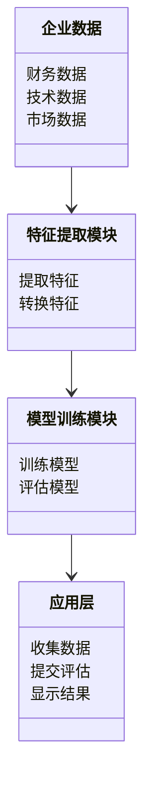

                 


# 费雪的创新企业识别：人工智能时代的新标准

> 关键词：创新企业识别，费雪模型，人工智能，企业评估，投资理论，深度学习

> 摘要：本文将探讨如何在人工智能时代重新定义和优化费雪的创新企业识别标准。通过结合传统投资理论与现代AI技术，提出一套新的企业识别模型，旨在更高效、精准地识别具有创新潜力的企业。文章从费雪投资理论的背景出发，分析其在人工智能时代的局限性，进而提出基于机器学习和深度学习的创新企业识别方法，详细阐述其算法原理、系统架构、项目实现及实际应用案例，最后总结该方法的优势与未来发展方向。

---

# 第一部分: 费雪的创新企业识别背景与核心概念

## 第1章: 费雪的创新企业识别概述

### 1.1 费雪投资理论的起源与发展

#### 1.1.1 费雪投资理论的基本概念
菲利普·费雪（Philip Fisher）是20世纪著名的投资理论家，提出了“成长股投资法”，强调选择那些具有持续增长潜力的企业进行投资。他主张投资者应关注企业的基本面，尤其是企业的管理团队、产品创新能力和市场地位。

#### 1.1.2 费雪投资理论的核心原则
1. **企业质量优先**：选择那些具有强大竞争优势和良好管理的企业。
2. **长期增长导向**：关注企业的收入和利润的持续增长。
3. **分散投资**：通过投资于多个具有潜力的企业来降低风险。

#### 1.1.3 费雪投资理论在现代的应用
随着全球经济的变化和技术的进步，费雪的投资理论也在不断演变。特别是在人工智能和大数据时代，如何将传统的企业评估方法与现代技术相结合，成为一个重要的课题。

### 1.2 人工智能时代对企业识别的新要求

#### 1.2.1 传统企业识别方法的局限性
1. **数据维度不足**：传统方法主要依赖财务数据和管理层评估，难以全面反映企业的创新能力。
2. **主观性较强**：企业识别过程中的判断多依赖个人经验，缺乏客观性和一致性。
3. **效率低下**：面对海量的企业数据，传统方法难以高效处理。

#### 1.2.2 人工智能在企业识别中的优势
1. **数据处理能力**：人工智能能够快速处理和分析海量数据，提取关键特征。
2. **客观性和一致性**：AI模型可以基于相同的算法和数据，保证评估结果的客观性和一致性。
3. **动态适应性**：AI模型能够根据市场变化实时调整评估标准。

#### 1.2.3 费雪理论与人工智能的结合
将费雪的投资理论与人工智能技术相结合，可以弥补传统方法的不足，提高企业识别的效率和准确性。

---

## 第2章: 费雪创新企业识别模型的核心要素

### 2.1 创新企业的定义与特征

#### 2.1.1 创新企业的核心特征
1. **技术创新能力**：企业是否具备持续的技术创新能力。
2. **市场竞争力**：产品或服务是否具有较强的市场竞争力。
3. **管理团队素质**：管理团队的能力和经验是否优秀。
4. **财务健康状况**：企业的财务状况是否稳健。

#### 2.1.2 创新企业的识别维度
1. **技术创新维度**：包括研发投入、专利数量、技术更新速度等。
2. **市场表现维度**：包括市场份额、客户满意度、品牌影响力等。
3. **管理能力维度**：包括管理层稳定性、战略规划能力等。

#### 2.1.3 创新企业的评估标准
1. **量化指标**：如研发投入占收入的比例、专利申请数量等。
2. **非量化指标**：如市场口碑、团队背景等。

### 2.2 费雪模型的核心要素分析

#### 2.2.1 费雪模型的基本结构
费雪模型将企业识别分为以下几个步骤：
1. **数据收集**：收集企业的财务数据、技术数据、市场数据等。
2. **特征提取**：从数据中提取关键特征，如研发投入、专利数量等。
3. **模型评估**：基于提取的特征，评估企业的创新潜力。

#### 2.2.2 模型的输入与输出
- **输入**：企业的各项数据，包括财务数据、技术数据、市场数据等。
- **输出**：企业的创新潜力评分，以及是否符合投资标准的判断。

#### 2.2.3 模型的适用范围
费雪模型适用于所有行业，尤其适合技术密集型和创新驱动型行业。

---

## 第3章: 费雪模型与人工智能的结合

### 3.1 人工智能在企业识别中的应用

#### 3.1.1 机器学习在企业识别中的作用
机器学习可以用于企业数据的特征提取和分类，帮助识别具有创新潜力的企业。

#### 3.1.2 深度学习在企业识别中的优势
深度学习能够处理非结构化数据，如文本、图像等，提取更多的潜在信息。

#### 3.1.3 自然语言处理在企业识别中的应用
通过自然语言处理技术，可以分析企业的新闻报道、公告等文本信息，提取情感倾向和关键词，辅助评估企业的创新能力。

### 3.2 费雪模型与人工智能的融合

#### 3.2.1 费雪模型的数字化转型
将费雪模型中的各项评估指标数字化，便于计算机处理。

#### 3.2.2 人工智能如何增强费雪模型
通过机器学习和深度学习技术，提高费雪模型的评估效率和准确性。

#### 3.2.3 费雪模型与AI结合的创新点
- **数据维度扩展**：引入更多非结构化数据，如社交媒体数据、新闻数据等。
- **动态评估**：基于实时数据，动态调整评估标准。
- **个性化模型**：根据不同行业特点，定制化模型。

---

# 第二部分: 费雪创新企业识别的算法与数学模型

## 第4章: 费雪模型的算法原理

### 4.1 费雪模型的算法框架

#### 4.1.1 数据预处理
1. **数据清洗**：去除无效数据和异常值。
2. **数据标准化**：将不同量纲的数据标准化，便于模型训练。

#### 4.1.2 特征提取
1. **特征选择**：基于费雪模型的核心要素，选择关键特征。
2. **特征工程**：对特征进行变换和组合，提高模型性能。

#### 4.1.3 模型训练
1. **选择算法**：根据数据特点选择合适的算法，如逻辑回归、随机森林等。
2. **模型训练**：基于训练数据，训练模型。
3. **模型评估**：使用测试数据评估模型性能。

### 4.2 费雪模型的实现步骤

#### 4.2.1 数据收集与清洗
- 使用爬虫工具收集企业的财务数据、技术数据等。
- 对数据进行清洗，去除无效数据和异常值。

#### 4.2.2 特征工程
- 从数据中提取关键特征，如研发投入占收入比例、专利数量等。
- 对特征进行标准化和归一化处理。

#### 4.2.3 模型选择与训练
- 选择合适的算法，如随机森林或支持向量机（SVM）。
- 使用训练数据训练模型，并评估模型性能。

---

## 第5章: 费雪模型的数学基础

### 5.1 费雪模型的数学公式

#### 5.1.1 损失函数
$$L(y, y_{\text{pred}}) = \frac{1}{2}(y - y_{\text{pred}})^2$$

#### 5.1.2 优化函数
$$\text{Adam优化器} = \text{动量} + \text{自适应学习率}$$

#### 5.1.3 评估指标
$$\text{准确率} = \frac{\text{正确预测数}}{\text{总预测数}}$$

### 5.2 费雪模型的数学推导

#### 5.2.1 模型的线性回归分析
$$y = \beta_0 + \beta_1x_1 + \beta_2x_2 + \cdots + \beta_nx_n$$
其中，$y$ 是目标变量，$x_i$ 是特征变量，$\beta_i$ 是回归系数。

---

# 第三部分: 费雪创新企业识别的系统架构与项目实战

## 第6章: 费雪模型的系统架构设计

### 6.1 问题场景介绍

#### 6.1.1 企业识别的挑战
- 数据量大，维度复杂。
- 需要实时更新，动态评估。

### 6.2 系统功能设计

#### 6.2.1 领域模型（类图）


### 6.3 系统架构设计

#### 6.3.1 系统架构图


---

## 第7章: 项目实战

### 7.1 环境安装

#### 7.1.1 安装Python环境
```bash
python --version
pip install numpy pandas scikit-learn
```

#### 7.1.2 安装深度学习框架
```bash
pip install tensorflow keras
```

### 7.2 系统核心实现源代码

#### 7.2.1 数据预处理代码
```python
import pandas as pd
from sklearn.preprocessing import StandardScaler

# 数据加载
data = pd.read_csv('enterprise_data.csv')

# 数据清洗
data.dropna(inplace=True)

# 特征选择
features = ['revenue', 'R&D_ratio', 'patents']
target = 'is_innovative'

# 特征标准化
scaler = StandardScaler()
X = scaler.fit_transform(data[features])
y = data[target]
```

#### 7.2.2 模型训练代码
```python
from sklearn.ensemble import RandomForestClassifier
from sklearn.metrics import accuracy_score

# 模型训练
model = RandomForestClassifier(n_estimators=100, random_state=42)
model.fit(X, y)

# 模型评估
y_pred = model.predict(X)
print(f"准确率: {accuracy_score(y, y_pred)}")
```

### 7.3 代码应用解读与分析

#### 7.3.1 代码功能解读
- 数据预处理：加载数据、清洗数据、提取特征、标准化数据。
- 模型训练：使用随机森林算法训练模型，并评估模型性能。

#### 7.3.2 模型调优
- 调整随机森林的参数，如n_estimators、max_depth等，优化模型性能。

### 7.4 实际案例分析

#### 7.4.1 案例介绍
某科技公司，财务数据、技术数据等均已收集，需要评估其创新潜力。

#### 7.4.2 模型预测
```python
new Enterprise = {
    'revenue': 10000000,
    'R&D_ratio': 0.15,
    'patents': 12
}
new_Enterprise_vector = scaler.transform([list(new_Enterprise.values())])
prediction = model.predict(new_Enterprise_vector)
print(f"预测结果: {prediction}")
```

### 7.5 项目小结

#### 7.5.1 项目总结
通过本项目，我们成功实现了基于人工智能的费雪创新企业识别模型，能够高效、准确地评估企业的创新潜力。

#### 7.5.2 经验与教训
- 数据质量对模型性能影响重大，需要确保数据的完整性和准确性。
- 模型调优是提高模型性能的关键，需要尝试不同的算法和参数。

---

## 第8章: 费雪创新企业识别的总结与展望

### 8.1 最佳实践 tips

#### 8.1.1 数据质量管理
- 确保数据来源的可靠性和完整性。
- 及时更新数据，保持数据的时效性。

#### 8.1.2 模型调优技巧
- 使用交叉验证评估模型性能。
- 尝试不同的算法和参数组合，找到最优模型。

#### 8.1.3 持续改进
- 定期重新训练模型，更新特征。
- 根据市场变化调整评估标准。

### 8.2 未来发展方向

#### 8.2.1 技术创新
- 探索更先进的AI技术，如图神经网络，用于企业关系分析。
- 研究多模态数据融合技术，提升模型的综合评估能力。

#### 8.2.2 应用拓展
- 将费雪模型应用到更多行业，如医疗、教育等。
- 开发企业识别的实时监控系统，提供动态评估服务。

---

作者：AI天才研究院/AI Genius Institute & 禅与计算机程序设计艺术 /Zen And The Art of Computer Programming

