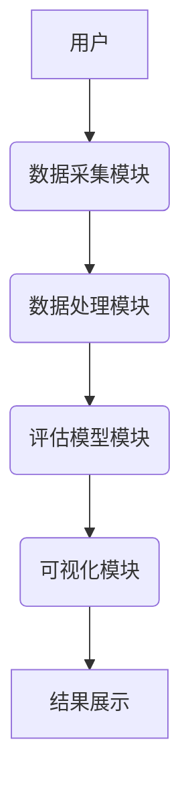

                 


# 费雪的创新公司投资：把握技术变革机遇

> **关键词**：创新公司、技术变革、投资策略、AI、云计算、区块链  
> **摘要**：本文分析了如何通过技术创新和市场需求的匹配，结合数学模型和算法，评估和投资创新公司。文章从创新公司的定义、技术变革的趋势、创新公司的识别标准，到投资的数学模型、系统架构设计和项目实战，详细探讨了如何在技术变革中把握投资机遇。

---

## 第一部分：创新公司的定义与投资背景

### 1.1 创新公司的概念与特征

#### 1.1.1 创新公司的定义

**问题背景**：创新公司是指通过技术创新或商业模式创新，能够在市场中创造新价值的企业。随着技术的快速发展，创新公司成为推动经济进步的重要力量。

**问题描述**：在当前的技术环境下，许多公司通过引入新技术或重新定义商业模式来获取竞争优势。然而，如何识别这些公司并评估其投资价值，是投资者面临的关键问题。

**问题解决**：本文将从技术变革的角度，分析创新公司的定义、特征和投资策略，帮助投资者在技术变革中抓住机遇。

**边界与外延**：创新公司的外延包括但不限于科技初创公司、独角兽企业以及通过技术创新实现业务模式升级的传统企业。

**概念结构与核心要素组成**：

- **技术创新**：公司通过引入新技术或改进现有技术，提升产品或服务的性能。
- **商业模式创新**：通过改变收入来源、成本结构或客户体验，创造新的价值。
- **市场定位**：公司能够在目标市场中占据独特的位置，并快速扩大市场份额。

#### 1.1.2 投资创新公司的背景与意义

**背景分析**：当前，技术变革的速度前所未有，人工智能、区块链、云计算等技术正在重塑 industries。创新公司通过技术应用和商业模式创新，能够在市场中占据领先地位。

**意义阐述**：投资创新公司意味着抓住技术变革带来的市场机遇，实现超额收益。创新公司往往具有高增长潜力，能够在短时间内实现价值倍增。

**投资策略**：投资者需要关注技术创新的行业趋势，选择具有技术壁垒和市场潜力的公司，通过长期持有或组合投资，分散风险并实现收益。

#### 1.1.3 创新公司的分类与生命周期

**分类标准**：

- **按技术领域**：人工智能、区块链、云计算等。
- **按发展阶段**：初创期、成长期、成熟期。

**生命周期分析**：

- **初创期**：公司处于技术研发和市场验证阶段，风险高，回报潜力大。
- **成长期**：公司逐步扩大市场份额，收入增长迅速。
- **成熟期**：公司市场份额稳定，进入利润增长阶段。

**投资机会**：投资者可以在公司生命周期的不同阶段介入，选择性地投资具有持续增长潜力的公司。

---

## 第二部分：技术变革与创新公司的识别

### 2.1 技术变革的趋势分析

#### 2.1.1 当前主要技术趋势

**技术趋势分析**：

- **人工智能**：AI技术在各个行业的应用日益广泛，从自动驾驶到医疗诊断，技术创新不断推动行业发展。
- **云计算**：企业加速上云，云计算成为数字化转型的核心基础设施。
- **区块链**：分布式账本技术在金融、物流等领域的应用逐步扩大。
- **物联网**：智能设备的普及推动了物联网技术的快速发展。

**技术趋势预测**：基于当前的技术发展，未来几年AI和云计算将继续保持增长，区块链和物联网也将迎来更广泛的应用场景。

#### 2.1.2 技术变革对企业的影响

**商业模式改变**：技术变革推动企业重新定义商业模式，例如SaaS（软件即服务）模式的兴起。

**竞争优势重塑**：技术创新成为企业核心竞争力的重要来源，技术壁垒帮助企业抵御竞争对手。

**市场机会扩展**：技术变革创造了新的市场机会，例如智能家居、智慧城市等新兴领域。

#### 2.1.3 技术趋势的预测与分析方法

**预测框架**：

1. **技术成熟度分析**：评估技术的当前发展水平和未来潜力。
2. **市场需求分析**：研究技术在不同行业的应用前景。
3. **竞争环境分析**：评估技术领域的竞争格局。

**分析方法**：

- **技术路线图**：绘制技术发展的时间轴，预测未来的技术趋势。
- **市场调研**：通过行业报告和市场数据，评估技术的市场潜力。
- **专家访谈**：与行业专家交流，获取技术发展的第一手信息。

---

## 第三部分：创新公司投资的数学模型与算法原理

### 3.1 投资决策的数学模型

#### 3.1.1 创新公司评分系统

**模型构建**：

- **技术创新评分**：基于技术成熟度和创新性进行评分。
- **市场需求评分**：评估公司在目标市场的潜力。
- **团队能力评分**：分析创始团队的经验和能力。

**指标权重分配**：

| 指标                | 权重（%） |
|---------------------|-----------|
| 技术创新            | 40        |
| 市场需求            | 30        |
| 团队能力            | 20        |
| 财务状况            | 10        |

**评分公式**：

$$ \text{公司评分} = 0.4 \times T + 0.3 \times M + 0.2 \times S + 0.1 \times F $$

其中，T为技术创新评分，M为市场需求评分，S为团队能力评分，F为财务状况评分。

---

## 第四部分：系统分析与架构设计

### 4.1 项目场景介绍

**项目目标**：构建一个创新公司评估系统，帮助投资者快速识别具有潜力的创新公司。

**核心功能**：

- 数据采集与处理：收集公司信息，包括技术、市场、团队等方面的数据。
- 评估模型计算：基于数学模型，计算公司的评分。
- 可视化展示：以图表形式展示评估结果。

### 4.2 系统架构设计

**系统架构图**：



**功能模块说明**：

- **数据采集模块**：负责从公开数据源获取公司信息。
- **数据处理模块**：清洗和整理数据，确保数据质量。
- **评估模型模块**：基于数学模型计算公司评分。
- **可视化模块**：将评估结果以图表形式展示。

---

## 第五部分：项目实战

### 5.1 环境搭建

**安装Python和相关库**：

```bash
pip install numpy pandas scikit-learn matplotlib
```

### 5.2 核心代码实现

**数据清洗代码**：

```python
import pandas as pd

# 读取数据
data = pd.read_csv('company_data.csv')

# 删除缺失值
data.dropna(inplace=True)

# 处理异常值
data = data[~(data['revenue'].isin(['', 'Unknown']))]
```

**模型训练代码**：

```python
from sklearn.model_selection import train_test_split
from sklearn.linear_model import LinearRegression

# 划分训练集和测试集
X = data[['T', 'M', 'S', 'F']]
y = data['score']

X_train, X_test, y_train, y_test = train_test_split(X, y, test_size=0.2)

# 训练模型
model = LinearRegression()
model.fit(X_train, y_train)

# 预测结果
y_pred = model.predict(X_test)
```

### 5.3 案例分析

**案例介绍**：假设我们有一个AI初创公司，技术创新评分为85，市场需求评分为75，团队能力评分为90，财务状况评分为80。

**计算公司评分**：

$$ \text{公司评分} = 0.4 \times 85 + 0.3 \times 75 + 0.2 \times 90 + 0.1 \times 80 = 34 + 22.5 + 18 + 8 = 82.5 $$

**评估结果**：评分82.5，属于高潜力投资目标。

### 5.4 项目小结

**代码实现总结**：通过Python代码实现创新公司评分系统，能够快速评估公司的投资价值。

**案例分析总结**：通过实际案例分析，验证模型的有效性和实用性。

---

## 第六部分：注意事项与小结

### 6.1 投资注意事项

- **数据可靠性**：确保数据来源可靠，避免因数据错误导致评估失误。
- **模型局限性**：评估模型是基于历史数据和假设构建的，实际结果可能与预测值存在偏差。
- **市场风险**：技术变革具有不确定性，投资需谨慎。

### 6.2 小结

本文通过分析技术变革的趋势，构建了创新公司评分模型，并通过代码实现和案例分析，验证了模型的有效性。投资者可以利用本文的方法，快速识别具有潜力的创新公司，把握技术变革带来的投资机遇。

### 6.3 未来展望

随着技术的不断发展，创新公司评估模型需要不断更新和优化，以适应新的市场环境和技术趋势。未来，可以引入更多维度的评估指标，提升模型的准确性和实用性。

---

## 结语

在技术变革的浪潮中，创新公司投资是一项充满挑战和机遇的任务。通过本文的方法，投资者可以更好地识别具有潜力的创新公司，抓住技术变革带来的市场机遇，实现投资收益的最大化。

---

**作者**：AI天才研究院/AI Genius Institute & 禅与计算机程序设计艺术 /Zen And The Art of Computer Programming

